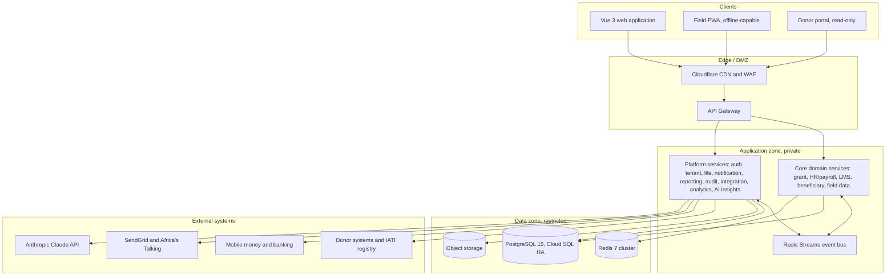

# 01 — Executive Summary

> **Document:** NGO Intelligence Suite — SDD v2.0
> **Chapter:** 01 — Executive Summary
> **Owner:** Principal Architect
> **Status:** Approved
> **Last Reviewed:** 2026-06-20
> **Related ADRs:** [ADR-0001](adr/0001-microservices-over-modular-monolith.md), [ADR-0002](adr/0002-hybrid-multi-tenancy-with-rls.md)

---

## 1. The problem

An NGO running a USD 4 million portfolio of donor-funded programmes in South Sudan today typically operates on: a set of Excel workbooks for grant budgets, a second set for payroll, a paper register for beneficiaries, a WhatsApp group for field reporting, a shared drive of scanned PDFs for compliance evidence, and the institutional memory of two or three long-serving staff.

That arrangement fails in five specific and expensive ways.

**Compliance failures are discovered late.** A donor report is due on the 15th; nobody realises the underlying activity data was never collected until the 12th. Late or unsupported reports put the next tranche at risk, and a suspended tranche means suspended salaries in a context where staff have no financial buffer.

**Budget burn is invisible until it is a problem.** Spend against a multi-year, multi-currency budget line is reconciled monthly at best. Underspend discovered in month 10 of a 12-month grant cannot be corrected; overspend discovered at the same point is a disallowed cost the organisation must absorb.

**Beneficiary data is duplicated, unverifiable and unsafe.** The same household is registered three times across two programmes. There is no way to answer "who did we serve, where, and how do we prove it" without a week of manual work. Simultaneously, lists of displaced people are held in unencrypted spreadsheets on laptops that travel through checkpoints — a protection risk, not merely a compliance one.

**Statutory payroll obligations are calculated by hand.** NRA PAYE bands and NSIF contributions are applied in a spreadsheet whose formulas were written by someone who has since left. Errors are found by the auditor.

**Institutional knowledge does not survive turnover.** Induction is a folder of policy PDFs and a conversation. There is no record that a given staff member was actually trained on the safeguarding policy, which is the first thing an investigation asks for.

None of these are unusual problems, and none are solved by a generic ERP. Generic systems assume reliable connectivity, a single currency, a single regulatory regime, and staff who can be trained in a classroom. Field-based humanitarian operations satisfy none of those assumptions.

## 2. The solution

The NGO Intelligence Suite is a multi-tenant SaaS platform purpose-built for these conditions. It unifies six capability domains behind one identity, one permission model and one audit trail:

| Domain | What it replaces | Primary value |
| --- | --- | --- |
| Grant and Donor Compliance | Budget spreadsheets, report trackers | Real-time burn rate, automatic expiry and reporting alerts, computed compliance score |
| HR and Payroll Compliance | Manual PAYE/NSIF spreadsheets | Statutory-correct multi-country payroll with an auditable approval chain |
| Staff Induction and Compliance LMS | Policy PDF folder | Provable training records tied to employment status |
| Beneficiary Management | Paper registers, duplicated lists | Deduplicated registry with vulnerability-based targeting and enforced data minimisation |
| Field Data Collection | WhatsApp and paper forms | Offline-capable structured capture with GPS and photo evidence, synced when connectivity returns |
| Operational Intelligence | Manual board-pack assembly | Cross-domain KPIs, risk flags and donor-ready reporting |

Three characteristics distinguish it from what is otherwise available.

**It assumes the network is not there.** Field officers work for up to 72 hours fully offline and sync when they reach connectivity. This is an architectural commitment that shapes the client, the API and the conflict-resolution model — not a feature bolted on later. See [13](13-offline-first-architecture.md).

**It treats beneficiary data as dangerous.** In a conflict setting, a list of who is displaced, from where, and where they now sleep can get people killed. The platform applies data minimisation by design, application-layer encryption of personally identifiable fields under per-tenant keys, purpose-logged access to that data, and a do-no-harm review gate on any new field added to the beneficiary record. See [17](17-privacy-and-compliance.md).

**It is built for the regulatory reality of two specific countries first.** South Sudan NRA PAYE and NSIF, and Uganda URA PAYE and NSSF, are implemented as first-class, versioned, table-driven rule sets rather than hardcoded arithmetic — so a mid-year statutory change is a data change with an effective date, not a code release. See [Appendix I](appendices/i-algorithms.md).

## 3. The architecture in one page

Fifteen Node.js services, decomposed along domain boundaries rather than technical layers, behind a single authenticating gateway. Synchronous REST for anything a user is waiting on; asynchronous events over Redis Streams for anything that can complete later. PostgreSQL 15 as the system of record with row-level security enforcing tenant isolation at the storage layer, so an application bug cannot leak one organisation's data to another. Redis for caching and job queues. Everything containerised on Kubernetes with progressive delivery and automated rollback.

The full picture is in [05](05-architecture-diagrams.md); the reasoning behind each major choice is in [04](04-architecture-principles.md) and the [ADRs](adr/).

## 4. What this document commits to

| Dimension | Commitment | Where it is specified |
| --- | --- | --- |
| Availability | 99.5% monthly for the core platform; 99.9% for authentication | [30](30-quality-attributes-nfr.md), [24](24-observability.md) |
| Latency | p95 under 300 ms for read APIs at 500 concurrent users | [25](25-performance-and-capacity.md) |
| Scale | 5,000 concurrent users, 200 tenants, 2 million beneficiary records | [25](25-performance-and-capacity.md) |
| Offline | 72 hours of field operation with no connectivity, with deterministic conflict resolution | [13](13-offline-first-architecture.md) |
| Recovery | RPO 5 minutes, RTO 4 hours for the platform; RPO 1 hour, RTO 24 hours for analytics | [27](27-disaster-recovery-and-bcp.md) |
| Security | OWASP Top 10 controls implemented and tested; no critical CVE in production beyond 7 days | [14](14-security-architecture.md), [16](16-threat-model-stride.md) |
| Privacy | Data minimisation enforced, PII encrypted at application layer, purpose-logged access, 30-day erasure SLA | [17](17-privacy-and-compliance.md) |
| Audit | Immutable audit trail of every mutation, retained 7 years | [14](14-security-architecture.md) |
| Accessibility | WCAG 2.1 Level AA, verified automatically and manually | [19](19-frontend-architecture.md), [23](23-testing-strategy.md) |
| Localisation | English, Arabic (with RTL), Swahili | [19](19-frontend-architecture.md) |

## 5. Delivery and investment

Delivery is phased over 18 months in four releases, each independently valuable. The sequencing puts the highest-pain domain — grant compliance — first, so the platform earns its keep before the harder field-operations work begins.

| Milestone | Month | Release | Delivers |
| --- | --- | --- | --- |
| M1 | 3 | Foundation | Identity, tenancy, grants, donors, budgets, disbursements, burn rate, audit trail |
| M2 | 7 | Staff | HR records, contracts, leave, South Sudan and Uganda payroll, LMS with induction automation |
| M3 | 12 | Field | Beneficiary registry, programmes, form builder, offline PWA, GPS and M&E evidence chain |
| M4 | 18 | Intelligence | Cross-domain KPI dashboard, donor portal, IATI publishing, self-service BI, AI-assisted drafting |

Steady-state infrastructure cost is modelled at approximately USD 2,100 per month at 20 tenants and USD 5,400 per month at 100 tenants, or roughly USD 54 per tenant per month falling to USD 27 at scale — a figure that matters because the customers are budget-constrained organisations and the platform must be affordable at a price they can defend to a donor. The full model, including the LLM token economics, is in [33](33-cost-model-and-finops.md).

Team topology is four stream-aligned squads plus a platform squad; see [31](31-implementation-roadmap.md).

## 6. The five risks that could sink this

Everything in the [risk register](32-risk-register.md) matters, but these five are the ones that would change the shape of the programme rather than delay it.

| # | Risk | Why it is severe | Primary mitigation |
| --- | --- | --- | --- |
| R-01 | **Beneficiary data breach in a conflict setting** | Consequences are physical harm to protected people, not a regulatory fine. It is the risk that would end the product | Application-layer encryption under per-tenant keys, aggressive data minimisation, purpose-logged access, no bulk export without dual authorisation, threat model reviewed quarterly ([16](16-threat-model-stride.md), [17](17-privacy-and-compliance.md)) |
| R-02 | **Offline sync produces silent data loss or corruption** | Field officers would stop trusting the system, and a humanitarian dataset that cannot be trusted is worse than no dataset | Deterministic per-entity conflict policy, client-side durable queue, server-side idempotency keys, a dedicated sync test harness and chaos testing of the sync path ([13](13-offline-first-architecture.md), [23](23-testing-strategy.md)) |
| R-03 | **Payroll miscalculation against statutory rules** | Directly harms staff, creates NRA/NSIF liability, and destroys trust with the one user group that has no alternative | Table-driven, effective-dated statutory rules; golden-case test suite validated against published NRA and NSIF schedules; mandatory maker-checker approval before disbursement ([Appendix I](appendices/i-algorithms.md), [15](15-rbac-and-authorization.md)) |
| R-04 | **Microservice complexity outruns team capacity** | Fifteen services is a lot of operational surface for a small team; the failure mode is a distributed monolith that is slower to change than what it replaced | Shared service template, one deployment pipeline for all services, strict ownership map, and an explicit tripwire in [ADR-0001](adr/0001-microservices-over-modular-monolith.md) for merging services if the cost shows up |
| R-05 | **Tenant isolation failure** | One cross-tenant leak in a multi-tenant humanitarian platform is an existential trust event | Defence in depth — gateway-injected tenant context, service middleware, PostgreSQL row-level security, and an automated cross-tenant isolation test suite that runs on every pull request ([29](29-multi-tenancy-and-tenant-lifecycle.md), [23](23-testing-strategy.md)) |

## 7. What is deliberately not being built

Scope discipline matters more than feature count. The following are explicitly out of scope for v1 through v4 and are recorded here so the decision is not silently revisited:

- **General ledger accounting.** The platform tracks grant budgets and burn; it does not replace the finance system's chart of accounts. It integrates with it.
- **Biometric beneficiary identification.** Excluded on protection grounds, not technical ones. See [17](17-privacy-and-compliance.md) for the reasoning.
- **A native mobile application.** The PWA meets the offline requirement at a fraction of the cost; see [ADR-0013](adr/0013-pwa-over-native-mobile.md) for the conditions under which this would be revisited.
- **Supply chain and warehouse management.** A real need for many NGOs, and a plausible fifth phase, but not in this document's scope.
- **Direct payment execution.** The platform records and reconciles disbursements and payroll; it does not initiate transfers. Moving money requires a control environment the platform does not yet have.
