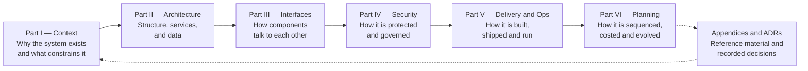

# 02 — Introduction

> **Document:** NGO Intelligence Suite — SDD v2.0
> **Chapter:** 02 — Introduction
> **Owner:** Principal Architect
> **Status:** Approved
> **Last Reviewed:** 2026-06-20
> **Related ADRs:** —

---

## 2.1 Purpose

This Software Design Document defines the complete technical architecture, microservice decomposition, entity-relationship model, database schema, security posture, operational model and phased implementation roadmap for the NGO Intelligence Suite — a purpose-built platform helping non-governmental organisations operating in fragile or emerging-market contexts, particularly East Africa and South Sudan, manage grant compliance, donor intelligence, operational logistics and staff capacity in one integrated system.

The SDD is the single source of truth for engineering decisions. Specifically, it exists to:

1. **Constrain implementation.** Where this document says **MUST**, an implementation that does otherwise does not pass review. The document is not aspirational.
2. **Preserve reasoning.** A design without recorded reasoning decays into cargo cult within two staff turnovers. Chapter [04](04-architecture-principles.md) and the [ADRs](adr/) exist so a future engineer can tell the difference between a decision that was deliberate and one that was accidental.
3. **Make quality measurable.** Every non-functional requirement in [30](30-quality-attributes-nfr.md) has a number, a verification method and an owner. A requirement that cannot be tested is not a requirement.
4. **Serve as audit evidence.** Donors, auditors and regulators ask how controls are implemented. [Appendix H](appendices/h-compliance-traceability.md) maps each control obligation to the section that satisfies it.
5. **Onboard engineers.** A new engineer should be productive from this document plus the codebase, without needing a specific person to explain the system.

## 2.2 Scope

### 2.2.1 Capability domains in scope

| Domain | Description |
| --- | --- |
| Grant and Donor Compliance Tracker | Lifecycle management for donors, grants, multi-year budgets, budget lines, disbursements, donor reporting, burn-rate analysis and compliance scoring |
| NGO Staff Induction and Compliance LMS | Course authoring, enrollment automation, assessments, certification, mandatory-training tracking and escalation |
| Operational Intelligence Dashboard | Cross-domain KPI monitoring, donor mapping, risk scoring, alerting and self-service business intelligence |
| Beneficiary Management Module | Registration, household modelling, deduplication, vulnerability scoring, targeting, programme enrollment and attendance |
| Field Data Collection Engine | Dynamic form building, offline-capable mobile capture, GPS and media attachment, validation, submission pipeline and M&E evidence linkage |
| HR and Payroll Compliance Module | Staff records, contracts, positions, departments, leave, statutory deductions for South Sudan and Uganda, payroll approval workflow and payslip generation |

### 2.2.2 Cross-cutting capabilities in scope

These are not user-visible domains but are engineered deliverables with their own designs: identity and access management, multi-tenancy, audit logging, notification delivery, document and media management, external system integration, reporting and export, AI-assisted drafting, observability, and the operational tooling needed to run all of it.

### 2.2.3 Explicitly out of scope

Recording exclusions is as important as recording inclusions, because an undocumented exclusion is re-litigated every quarter.

| Excluded | Rationale | Revisit condition |
| --- | --- | --- |
| General ledger and financial accounting | The platform is a compliance and intelligence layer over grants, not a bookkeeping system. Duplicating a general ledger creates a reconciliation problem worse than the one it solves | Never as a build; possibly as a deeper integration |
| Payment initiation and money movement | Executing transfers requires a payments control environment, licensing considerations and a fraud posture that are out of proportion to the value added. The platform records and reconciles | If a tenant-funded business case shows the control environment can be met |
| Biometric beneficiary identification | Excluded on protection grounds. Biometric registries of displaced populations are a durable risk to those populations that survives the programme that created them | Only after an independent protection review concludes otherwise |
| Native iOS and Android applications | The PWA meets the 72-hour offline requirement; native adds platform-specific cost without proportionate benefit. See [ADR-0013](adr/0013-pwa-over-native-mobile.md) | If device-level requirements emerge that a PWA cannot meet, e.g. background sync guarantees or hardware peripheral access |
| Supply chain, warehouse and fleet management | A genuine NGO need and a plausible Phase 5, but a distinct bounded context with its own domain complexity | Post-M4, subject to demand |
| Case management for protection and GBV cases | Requires a substantially stricter confidentiality model than the rest of the platform; mixing it with general programme data is a protection risk | Only as a physically isolated module with its own data store |
| Offline-capable payroll processing | Payroll runs from headquarters with connectivity; the complexity of offline financial approval is not justified | Not anticipated |
| Public-facing beneficiary self-service | Beneficiaries in target contexts largely lack the devices and connectivity to use it, and it would create a new attack surface onto the most sensitive data | Context-dependent, per tenant |

### 2.2.4 Scope boundaries with adjacent systems

| Boundary | This platform does | The other system does |
| --- | --- | --- |
| Accounting | Tracks budget, commitment and burn against grant lines | Records journal entries, produces statutory financial statements |
| Banking / mobile money | Records disbursements and reconciles against confirmations | Executes and settles transactions |
| Identity | Issues and validates platform sessions and roles | The tenant's corporate directory, if federated, holds the authoritative user record |
| Donor systems | Publishes and exports in required formats | Ingests, adjudicates and disburses |
| Document storage | Stores programme documents linked to platform records | The tenant's general file storage remains separate |

## 2.3 Intended audience

| Audience | What they need from this document | Suggested entry point |
| --- | --- | --- |
| Software architects | The whole document; particularly principles, ADRs and cross-cutting concerns | [04](04-architecture-principles.md) |
| Backend engineers | Service specifications, data model, API and event contracts | [06](06-microservice-design.md) |
| Frontend and mobile engineers | Client architecture, offline model, API contract, accessibility and localisation | [19](19-frontend-architecture.md) |
| Platform and DevOps engineers | Infrastructure, CI/CD, configuration, observability | [21](21-deployment-and-infrastructure.md) |
| Database administrators | Schema, indexing, migration, partitioning, backup and recovery | [08](08-database-schema.md) |
| Quality engineers | Testing strategy, quality gates, NFR verification | [23](23-testing-strategy.md) |
| Site reliability engineers | Observability, SLOs, incident management, DR, runbooks | [24](24-observability.md) |
| Security engineers | Security architecture, RBAC, threat model | [14](14-security-architecture.md) |
| Data protection officer | Privacy chapter, data classification, DPIA, retention | [17](17-privacy-and-compliance.md) |
| Product stakeholders | Executive summary, roadmap, risk register, cost model | [01](01-executive-summary.md) |
| External auditors | Compliance traceability, security controls, audit logging, DR | [Appendix H](appendices/h-compliance-traceability.md) |

## 2.4 Definitions and acronyms

The terms below are those needed to read this chapter and navigate the document. The complete glossary, including humanitarian sector terminology, is [Appendix A](appendices/a-glossary.md).

| Term | Definition |
| --- | --- |
| ACL | Anti-Corruption Layer — a translation boundary that prevents an external system's model from leaking into ours |
| ADR | Architecture Decision Record |
| BCP | Business Continuity Plan |
| CI/CD | Continuous Integration / Continuous Delivery |
| CRDT | Conflict-free Replicated Data Type |
| DLQ | Dead Letter Queue |
| DPIA | Data Protection Impact Assessment |
| ERD | Entity-Relationship Diagram |
| HFIAS | Household Food Insecurity Access Scale |
| IATI | International Aid Transparency Initiative |
| IDP | Internally Displaced Person |
| JWT | JSON Web Token |
| KPI | Key Performance Indicator |
| LMS | Learning Management System |
| M&E | Monitoring and Evaluation |
| mTLS | Mutual Transport Layer Security |
| NGO | Non-Governmental Organization |
| NRA | National Revenue Authority (South Sudan) |
| NSIF | National Social Insurance Fund (South Sudan) |
| NSSF | National Social Security Fund (Uganda) |
| PAYE | Pay As You Earn (income tax withholding) |
| PII | Personally Identifiable Information |
| PITR | Point-In-Time Recovery |
| PWA | Progressive Web Application |
| RBAC | Role-Based Access Control |
| RLS | Row-Level Security |
| RPO | Recovery Point Objective |
| RTO | Recovery Time Objective |
| SBOM | Software Bill of Materials |
| SDD | Software Design Document |
| SLA / SLI / SLO | Service Level Agreement / Indicator / Objective |
| SSP | South Sudanese Pound |
| STRIDE | Spoofing, Tampering, Repudiation, Information disclosure, Denial of service, Elevation of privilege |
| URA | Uganda Revenue Authority |
| WCAG | Web Content Accessibility Guidelines |

## 2.5 References

### 2.5.1 Standards and frameworks

| Reference | Use in this document |
| --- | --- |
| ISO/IEC 25010:2011 — Systems and software quality models | Structures the quality attributes in [30](30-quality-attributes-nfr.md) |
| ISO/IEC 27001:2022 — Information security management | Control mapping in [Appendix H](appendices/h-compliance-traceability.md) |
| OWASP Top 10 (2021) | Application security controls in [14](14-security-architecture.md) |
| OWASP Application Security Verification Standard 4.0, Level 2 | Verification targets for security testing in [23](23-testing-strategy.md) |
| Microsoft STRIDE | Threat modelling methodology in [16](16-threat-model-stride.md) |
| NIST SP 800-61r2 — Computer Security Incident Handling | Incident response process in [26](26-reliability-and-incident-management.md) |
| SLSA Framework v1.0 | Supply chain integrity targets in [22](22-cicd-release-supply-chain.md) |
| WCAG 2.1 Level AA | Accessibility requirements in [19](19-frontend-architecture.md) |
| RFC 2119 | Requirement keyword semantics |
| RFC 9457 — Problem Details for HTTP APIs | Error response design in [10](10-api-design-standards.md) |
| C4 Model for software architecture | Diagram structure in [05](05-architecture-diagrams.md) |
| Google SRE Workbook | SLO and error budget practice in [24](24-observability.md) |

### 2.5.2 Sector and regulatory

| Reference | Use in this document |
| --- | --- |
| SPHERE Handbook — Humanitarian Charter and Minimum Standards | Programme quality context for beneficiary and M&E modelling |
| Core Humanitarian Standard on Quality and Accountability | Accountability-to-affected-populations requirements |
| ICRC Handbook on Data Protection in Humanitarian Action, 2nd ed. | Beneficiary data protection design in [17](17-privacy-and-compliance.md) |
| IATI Standard v2.03 | Outbound publishing format in [12](12-integration-architecture.md) |
| OECD DAC sector and purpose codes | Grant sector classification in [08](08-database-schema.md) |
| Regulation (EU) 2016/679 (GDPR) | Data subject rights in [17](17-privacy-and-compliance.md) |
| South Sudan Taxation Act (as amended) and NRA PAYE schedules | Payroll rules in [Appendix I](appendices/i-algorithms.md) |
| South Sudan Social Insurance Act and NSIF contribution rates | Payroll rules in [Appendix I](appendices/i-algorithms.md) |
| Uganda Income Tax Act and URA PAYE schedules | Payroll rules in [Appendix I](appendices/i-algorithms.md) |
| Uganda NSSF Act | Payroll rules in [Appendix I](appendices/i-algorithms.md) |
| USAID ADS Chapter 303 — Grants and Cooperative Agreements to Non-Governmental Organizations | Donor compliance obligations |
| 2 CFR 200 — Uniform Administrative Requirements (US federal awards) | Cost allowability and audit retention obligations |

> **Standing obligation.** Statutory rates and bands change. The reference above is to the schedule, not to a snapshot of its values. Implementations **MUST** read rates from the effective-dated `tax_bands` and `statutory_contribution_rates` tables described in [08](08-database-schema.md), and the values in [Appendix I](appendices/i-algorithms.md) are illustrative worked examples, not the source of truth. Verification against currently published schedules is a named task in [31](31-implementation-roadmap.md) and is repeated at each fiscal year boundary.

### 2.5.3 Technology documentation

PostgreSQL 15, PostGIS 3.4, Node.js 20 LTS, TypeScript 5.x, Express 4.x, Vue 3 Composition API, Vite 5, Tailwind CSS 3.x, Redis 7, BullMQ, Kubernetes 1.29, Helm 3, Prometheus, Grafana, Loki, OpenTelemetry, Supabase (Auth, Storage, RLS), Anthropic Claude API, Apache Superset.

## 2.6 How this document is organised

Parts are ordered so that later parts depend on earlier ones. The appendices are reference material extracted from the chapters so that the frequently consulted tables — the RBAC matrix, the event catalog, the data dictionary — are available without navigating prose.

## 2.7 Document conventions

Conventions for requirement language, naming, diagrams, units and cross-referencing are defined once in [00-front-matter.md §7](00-front-matter.md) and apply throughout. Readers unfamiliar with them should read that section before proceeding, because the difference between **MUST** and **SHOULD** in this document has direct consequences in code review.
