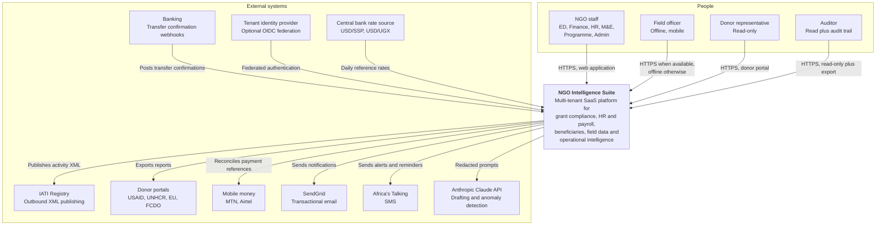

# 03 — System Overview and Context

> **Document:** NGO Intelligence Suite — SDD v2.0
> **Chapter:** 03 — System Overview and Context
> **Owner:** Principal Architect
> **Status:** Approved
> **Last Reviewed:** 2026-06-20
> **Related ADRs:** [ADR-0002](adr/0002-hybrid-multi-tenancy-with-rls.md), [ADR-0004](adr/0004-supabase-auth-as-identity-provider.md), [ADR-0014](adr/0014-gke-and-region-selection.md)

---

## 3.1 Product vision

The NGO Intelligence Suite transforms disconnected spreadsheets, paper-based records and siloed donor databases into a unified intelligence platform. Unlike generic ERP systems, the suite is designed from the ground up for the operational realities of field-based NGOs: intermittent connectivity, multi-currency grants, multilingual workforces, high staff turnover, and simultaneous compliance obligations to international donors and local regulators.

The vision statement the team works to:

> *A programme manager in Bentiu should be able to register a household, record a distribution, and have that evidence appear in the donor report generated in Juba — without either of them thinking about whether the network was up.*

Everything in this architecture serves that sentence. The offline model exists because of "without thinking about the network". The event-driven design exists because of "appear in the donor report" — the field officer must not wait for downstream processing. The tenant isolation model exists because the Bentiu officer works for one organisation and the platform serves many.

### 3.1.1 Operating context that drives design

These are not background colour. Each one produces a hard constraint recorded in [04](04-architecture-principles.md).

| Context factor | Reality | Design consequence |
| --- | --- | --- |
| Connectivity | Field sites have intermittent 2G/3G at best; some have none for days. Satellite links are metered and expensive | Offline-first client, aggressive payload minimisation, no chatty APIs, sync designed for high latency and partial failure |
| Devices | Mid-range Android phones, often shared, often several years old, frequently low on storage | PWA with a strict bundle budget, bounded local storage, graceful degradation |
| Power | Mains power is unreliable; devices charge from solar or generators | Client must survive abrupt termination without data loss; every offline write is durable before the UI acknowledges it |
| Currency | Grants in USD, EUR and GBP; salaries quoted in USD; statutory deductions calculated in SSP or UGX at a mandated rate | Money is always an amount plus a currency plus, where converted, the rate and its source and date |
| Language | Programme staff work in English; some field staff and beneficiaries in Juba Arabic; regional staff in Swahili | Full internationalisation including right-to-left layout, not a translation afterthought |
| Turnover | Annual staff turnover in field roles is high | Induction and compliance training must be automatic and provable; the system must be usable with minimal training |
| Security environment | Staff and data move through checkpoints; devices are lost, stolen or inspected | No unencrypted PII at rest on a device, remote session revocation, minimal data cached locally, short-lived tokens |
| Regulatory | Two national statutory payroll regimes, plus donor-specific rules per grant | Rules are data, effective-dated and versioned, never hardcoded |
| Funding | Customers are cost-constrained; a per-seat price competitive with commercial SaaS is unaffordable | Infrastructure efficiency is a product requirement, not an engineering preference; see [33](33-cost-model-and-finops.md) |

## 3.2 Stakeholders

### 3.2.1 Stakeholder register

| Stakeholder | Role in system | Primary interaction points | Success looks like |
| --- | --- | --- | --- |
| Executive Director | Strategic oversight | Intelligence dashboard, reports, risk alerts | Can answer any board question about portfolio health in under five minutes |
| Finance Manager | Grant and budget management | Grant tracker, disbursements, payroll approval | No surprise underspend; every donor report backed by system data |
| M&E Officer | Data quality and reporting | Field data engine, beneficiary management, analytics | Indicator values traceable to individual submissions |
| HR Manager | Staff compliance and contracts | HR module, LMS, payroll preparation | Can prove any staff member's training and contract status on demand |
| Field Officer | Beneficiary registration, data collection | Mobile PWA | Completes a day of fieldwork without connectivity and loses nothing |
| Programme Manager | Programme delivery and targeting | Beneficiary management, programmes, activities | Knows who was served, where, and what remains |
| Donor / Partner | Progress and compliance review | Donor portal, read-only | Self-serves programme progress without emailing the Finance Manager |
| Internal / External Auditor | Assurance | Read-only access plus audit log | Can reconstruct any financial or data change without administrator help |
| System Administrator | User management, configuration | Admin console | Onboards a new user in minutes with correct least-privilege access |
| Platform Operator (us) | Runs the SaaS | Operational tooling, dashboards | Detects and resolves incidents before tenants report them |
| Beneficiary | Data subject | Indirect; via field officer and feedback channels | Their data is collected minimally, held safely, and used for their benefit |

The beneficiary is listed deliberately. They are the only stakeholder who does not use the system and cannot advocate for themselves within it, and they carry the highest consequence if it is built badly. [17](17-privacy-and-compliance.md) is written on their behalf.

### 3.2.2 RACI for major decisions

**R**esponsible · **A**ccountable · **C**onsulted · **I**nformed

| Decision area | Principal Architect | Security Lead | DPO | Delivery Manager | Exec Director | Domain owner |
| --- | --- | --- | --- | --- | --- | --- |
| Architecture change requiring an ADR | A/R | C | C | I | I | C |
| New data field on beneficiary record | C | C | **A** | I | I | R |
| Change to statutory payroll rules | I | I | I | C | I | **A/R** (Finance) |
| Change to RBAC permission matrix | C | **A** | C | I | I | R |
| Release to production | C | C | I | **A** | I | R |
| Accepting a security risk | C | **A/R** | C | I | C | I |
| Accepting a privacy risk | I | C | **A/R** | I | C | I |
| Scope change affecting a milestone | C | I | I | R | **A** | C |
| Third-party data processor selection | C | C | **A/R** | I | C | I |
| Tenant offboarding and data deletion | I | C | **A** | I | I | R (Support) |

## 3.3 System context (C4 Level 1)

### 3.3.1 External system inventory

Each external dependency is a failure domain. The table records what happens when each one is unavailable, because that is the information needed at three in the morning.

| System | Direction | Protocol | Criticality | Behaviour when unavailable | Owner |
| --- | --- | --- | --- | --- | --- |
| Supabase Auth | Inbound auth | OIDC / JWT | **Critical** | New logins fail; existing sessions continue until token expiry. Degraded read-only mode is not possible without it | Security Lead |
| PostgreSQL (Cloud SQL) | Bidirectional | TCP / SQL | **Critical** | Platform is down. Failover to HA standby is automatic; see [RB-03](runbooks/rb-03-database-failover.md) | SRE Lead |
| Redis (Memorystore) | Bidirectional | RESP | **High** | Caching degrades to direct database reads; queued jobs pause. Service remains available with elevated latency | SRE Lead |
| Object storage | Bidirectional | HTTPS / S3 API | **High** | Document upload and download fail; the rest of the platform functions | Platform Lead |
| SendGrid | Outbound | HTTPS | Medium | Notifications queue and retry for 24 hours, then dead-letter. No user-facing failure | API Lead |
| Africa's Talking | Outbound | HTTPS | Medium | SMS queues and retries; email fallback where an address exists | API Lead |
| Anthropic Claude API | Outbound | HTTPS | Low | AI-assisted features degrade to unavailable with an explicit message. No core workflow depends on it | AI Lead |
| IATI Registry | Outbound | HTTPS | Low | Publishing retries on a schedule; a missed publish window is not an incident | API Lead |
| Donor portals | Outbound | Varies, often manual | Low | Export remains downloadable; submission is a human step | Finance |
| Mobile money APIs | Bidirectional | HTTPS | Medium | Reconciliation is deferred; disbursements can be recorded manually | Finance |
| Bank webhooks | Inbound | HTTPS webhook | Medium | Confirmations arrive late; manual entry remains available. Inbound webhooks **MUST** be idempotent and signature-verified | API Lead |
| FX rate source | Inbound | HTTPS | Medium | Last known rate is used and flagged as stale; payroll runs **MUST NOT** proceed on a rate older than 7 days without explicit override | Finance |
| Tenant OIDC provider | Inbound | OIDC | Low, per tenant | That tenant's federated login fails; local accounts still work for break-glass | Security Lead |

### 3.3.2 Data processor implications

Every external system that receives personal data is a data processor and requires a data processing agreement, a documented lawful basis and inclusion in the record of processing activities. The systems in scope are Supabase, Google Cloud, SendGrid, Africa's Talking and Anthropic. Beneficiary personal data **MUST NOT** be sent to Anthropic under any circumstances; the redaction control that enforces this is specified in [18](18-ai-llm-architecture.md) and threat-modelled in [16](16-threat-model-stride.md).

## 3.4 High-level system characteristics

The platform is a cloud-native, containerised, multi-tenant SaaS application. Its defining characteristics:

| Characteristic | Choice | Reference |
| --- | --- | --- |
| Deployment model | Single production deployment serving all tenants, in one primary region with warm standby | [21](21-deployment-and-infrastructure.md) |
| Tenancy | Shared application tier, shared database with row-level security, per-tenant schema for payroll | [ADR-0002](adr/0002-hybrid-multi-tenancy-with-rls.md), [29](29-multi-tenancy-and-tenant-lifecycle.md) |
| Decomposition | Fifteen domain-aligned services | [ADR-0001](adr/0001-microservices-over-modular-monolith.md), [06](06-microservice-design.md) |
| Communication | Synchronous REST for user-facing operations, asynchronous events for everything else | [ADR-0008](adr/0008-sync-vs-async-boundaries.md) |
| Consistency | Strong within a service and its transaction; eventual across services with a 5-second target | [11](11-event-driven-architecture.md) |
| State | Services are stateless; all state in PostgreSQL, Redis or object storage | [04](04-architecture-principles.md) PRIN-06 |
| Data residency | Primary region `africa-south1` (Johannesburg) for East African tenants | [ADR-0014](adr/0014-gke-and-region-selection.md), [17](17-privacy-and-compliance.md) |
| Client | Vue 3 PWA, one codebase for desktop and field use | [19](19-frontend-architecture.md), [ADR-0013](adr/0013-pwa-over-native-mobile.md) |

## 3.5 Capability-to-service map

The mapping from what the business calls a thing to what the system calls a thing.

| Business capability | Owning service | Supporting services |
| --- | --- | --- |
| Manage donors and grants | `grant-service` | `file-service`, `audit-service`, `notification-service` |
| Track budget and burn rate | `grant-service` | `analytics-service` |
| Record disbursements | `grant-service` | `integration-service`, `audit-service` |
| Produce donor reports | `reporting-service` | `grant-service`, `analytics-service`, `ai-insights-service` |
| Publish to IATI | `integration-service` | `grant-service` |
| Manage staff and contracts | `hr-payroll-service` | `file-service`, `audit-service` |
| Run payroll | `hr-payroll-service` | `integration-service` (FX), `reporting-service` (payslips) |
| Manage leave | `hr-payroll-service` | `notification-service` |
| Deliver and track training | `lms-service` | `hr-payroll-service` (triggers), `reporting-service` (certificates) |
| Register beneficiaries | `beneficiary-service` | `field-data-service`, `file-service` |
| Score vulnerability and target | `beneficiary-service` | — |
| Build and deploy forms | `field-data-service` | — |
| Collect field data offline | `field-data-service` | `file-service`, `beneficiary-service` |
| Link evidence to grant activities | `field-data-service` | `grant-service` |
| Cross-domain KPIs and dashboards | `analytics-service` | all domain services via events |
| AI drafting and anomaly detection | `ai-insights-service` | `analytics-service`, `grant-service` |
| Authentication and authorisation | `auth-service` | `api-gateway` |
| Tenant provisioning and lifecycle | `tenant-service` | `auth-service`, all domain services |
| Notifications | `notification-service` | — |
| Audit trail | `audit-service` | all services via events |
| Document and media handling | `file-service` | — |

## 3.6 Key user journeys

These five journeys are referenced throughout the document as the canonical end-to-end flows; their data flow diagrams are in [05 §5.6](05-architecture-diagrams.md).

| Journey | Actor | Summary | Crosses |
| --- | --- | --- | --- |
| J1 — Record a disbursement | Finance Manager | Donor funds arrive; the manager records the disbursement against the grant, attaches the bank confirmation, and burn rate updates everywhere | `grant-service` → `audit-service`, `notification-service`, `analytics-service` |
| J2 — Onboard a staff member | HR Manager | Employee record created and activated; system account provisioned; mandatory induction courses auto-enrolled with due dates | `hr-payroll-service` → `auth-service`, `lms-service`, `notification-service` |
| J3 — Field registration offline | Field Officer | Registers a household and members with GPS and photo consent record, entirely offline; syncs hours later; duplicates detected and resolved | PWA → `field-data-service` → `beneficiary-service`, `file-service` |
| J4 — Run monthly payroll | Finance + HR Manager | Payroll drafted, statutory deductions computed at the mandated FX rate, reviewed, approved by a second person, payslips issued | `hr-payroll-service` → `integration-service`, `reporting-service`, `notification-service`, `audit-service` |
| J5 — Produce a donor report | M&E Officer | Indicator values assembled from field submissions and beneficiary records, narrative drafted with AI assistance, reviewed by a human, exported and published | `reporting-service` → `analytics-service`, `ai-insights-service`, `integration-service` |

## 3.7 Constraints imposed by the context

Summarised here and expanded with rationale in [04](04-architecture-principles.md).

1. **The client must work offline for 72 hours.** This is the single most expensive constraint and it is non-negotiable.
2. **PII must never leave the region unencrypted, and beneficiary PII must never reach a third-party LLM.**
3. **Statutory rules must be changeable without a code deployment**, because tax authorities do not observe release calendars.
4. **Infrastructure cost per tenant must stay under USD 60 per month at low scale.** A design that is elegant and unaffordable is a failed design here.
5. **The system must be operable by a small team.** Every added component is an added on-call burden; see the operational cost test in [04](04-architecture-principles.md) PRIN-11.
6. **Any data collected about a beneficiary must be justifiable to that beneficiary.** New fields require DPO approval.
