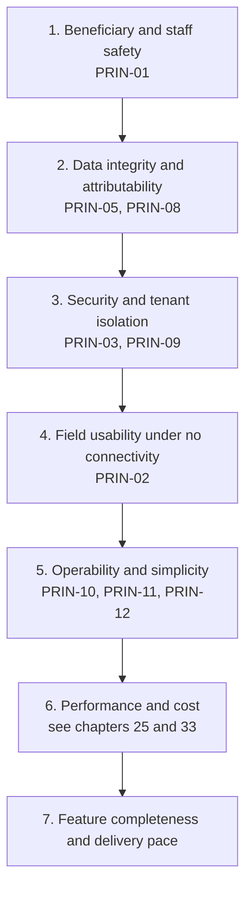

# 04 — Architecture Principles, Assumptions and Constraints

> **Document:** NGO Intelligence Suite — SDD v2.0
> **Chapter:** 04 — Architecture Principles, Assumptions and Constraints
> **Owner:** Principal Architect
> **Status:** Approved
> **Last Reviewed:** 2026-06-20
> **Related ADRs:** All

---

## 4.1 Why this chapter exists

A design document tells you what was decided. It rarely tells you how to decide the thousand cases it did not anticipate. This chapter is the decision function: when an engineer faces a choice this document does not cover, these principles resolve it, and if they conflict, the priority order in [§4.3](#43-when-principles-conflict) resolves that.

Principles are binding. A pull request that violates one either changes to comply or carries a recorded exception approved by the Architecture Guild. Exceptions are logged in [§4.6](#46-exception-log).

## 4.2 The twelve principles

### PRIN-01 — Protection of beneficiaries outranks everything

**Statement.** Where a design choice trades off beneficiary safety against any other quality — performance, cost, convenience, feature richness, even availability — beneficiary safety wins.

**Why.** The platform holds lists of displaced people in an active conflict environment. The realistic worst case is not a fine or a bad headline; it is that someone is found because of data we stored. No other system quality has that failure mode.

**Implications.**
- Collect the minimum field set that satisfies a stated eligibility or protection purpose, and no more. A field with no stated purpose is not added.
- Beneficiary PII is encrypted at the application layer, under a per-tenant key, so that a database compromise alone is insufficient to read it.
- Every read of beneficiary PII is logged with a purpose. Bulk export requires dual authorisation.
- Beneficiary PII **MUST NOT** be transmitted to any third-party processor that is not strictly necessary, and **MUST NOT** reach the LLM provider under any circumstance.
- When in doubt about whether a feature increases risk to beneficiaries, it goes to the DPO before it is built, not after.

**How we check.** Data protection review is a required gate on any schema change touching `beneficiaries`, `households` or `submission_values`. See [17](17-privacy-and-compliance.md).

---

### PRIN-02 — Assume the network is absent

**Statement.** Field-facing functionality is designed for zero connectivity as the normal case and connectivity as the exception, not the reverse.

**Why.** A system that degrades badly offline is a system field officers work around, and workarounds mean data that never reaches the platform.

**Implications.**
- Every field write is durable in local storage before the interface acknowledges it. There is no "saving..." state that can be lost by closing the browser or the battery dying.
- Server APIs consumed by the field client accept idempotency keys and tolerate submissions that arrive hours or days late and out of order.
- Conflict resolution is specified per entity in advance ([13](13-offline-first-architecture.md)); "last write wins" is a decision to be justified, not a default to fall into.
- Payload size is a first-class budget. A sync over a metered 2G link that costs the tenant money is a design defect.

**How we check.** The offline test harness in [23](23-testing-strategy.md) runs the field journeys under simulated network partition, packet loss and abrupt process termination.

---

### PRIN-03 — Tenant isolation is enforced in depth, at the lowest possible layer

**Statement.** Tenant separation is enforced at the database, not only in application code, and every layer above assumes the layer below might have a bug.

**Why.** Cross-tenant leakage in a multi-tenant humanitarian platform is an existential trust failure. Application-layer-only isolation fails to a single missing `WHERE` clause.

**Implications.**
- Row-level security is enabled on every tenant-scoped table, with policies derived from a session variable set from the validated JWT — never from a client-supplied value.
- Services **MUST NOT** connect as a role that bypasses RLS for request-scoped work. Migration and maintenance roles that do bypass it are separate, credentialed differently, and not reachable from request paths.
- `tenant_id` is injected by the gateway after token validation. A `tenant_id` in a request body or query string is ignored, and its presence is logged as a suspicious event.
- Payroll data, being the most sensitive employee data, additionally lives in per-tenant schemas.

**How we check.** An automated cross-tenant isolation suite runs on every pull request, attempting to access seeded fixtures across tenant boundaries through every endpoint. See [23](23-testing-strategy.md) and [29](29-multi-tenancy-and-tenant-lifecycle.md).

---

### PRIN-04 — Rules that change on someone else's schedule are data, not code

**Statement.** Tax bands, contribution rates, vulnerability weights, compliance scoring parameters, validation rules and notification thresholds are stored as effective-dated configuration, versioned and auditable — never embedded in application logic.

**Why.** The NRA does not consult our release calendar. A statutory change that requires a code deployment will be applied late, and a late payroll is a staff welfare problem.

**Implications.**
- Every rule table carries `effective_from` and `effective_to`. Historical calculations reproduce exactly because they resolve the rules that applied on their own date, not today's.
- A payroll run stores the identifier of the rule version it used. Recomputation is provable.
- Changing a rule is a privileged, audited, dual-authorised operation with a preview of its effect before it commits.

**How we check.** Golden-case tests pin historical payroll outputs; if a rule change alters a past calculation, the build fails.

---

### PRIN-05 — Every mutation is attributable and reconstructable

**Statement.** For any change to any record, the system can answer who, what, when, from where, and what the value was before.

**Why.** Donor audits, statutory audits and internal investigations all ask this. So does incident response. A system that cannot answer it forces manual reconstruction under time pressure.

**Implications.**
- Soft deletion universally; no hard deletes outside the explicit erasure workflow, which is itself audited.
- The audit trail is append-only and written by a separate service from the one making the change, so a compromised domain service cannot erase its own tracks.
- Audit records carry before and after state, actor, tenant, correlation ID, IP address and, for PII reads, a purpose.
- Audit retention is seven years.

**How we check.** Audit coverage is asserted in integration tests: a mutation with no corresponding audit event fails the test.

---

### PRIN-06 — Services are stateless and horizontally scalable

**Statement.** No service instance holds state that another instance could not reconstruct. All durable state lives in PostgreSQL, Redis or object storage.

**Why.** Statelessness is what makes rolling deployment, autoscaling, spot capacity and instant failover simple rather than heroic.

**Implications.**
- No in-process session state, no sticky sessions, no local file writes that outlive a request, no in-memory scheduler that only one instance may run.
- Scheduled work runs through the job queue with distributed locking, not through a cron inside a service.
- Any local cache is an optimisation with a bounded TTL, never a source of truth.
- A pod can be killed at any moment; graceful shutdown drains in-flight requests and returns unacknowledged jobs to the queue.

**How we check.** Chaos experiments randomly terminate pods in staging during load; a correctness failure is a release blocker.

---

### PRIN-07 — Contracts are explicit, versioned and backward compatible

**Statement.** Every interface between two independently deployable things — REST API, event, database view consumed across a boundary — is a versioned contract that changes additively.

**Why.** Fifteen services that can only be deployed together are a distributed monolith: all the operational cost of microservices, none of the independence.

**Implications.**
- API changes are additive within a major version. Removing or renaming a field, tightening validation, or changing a default is a breaking change and requires a new version plus a deprecation period ([10](10-api-design-standards.md)).
- Events carry a schema version. Consumers ignore unknown fields and **MUST NOT** break when new optional fields appear ([11](11-event-driven-architecture.md)).
- Consumer-driven contract tests gate deployment: a producer whose change breaks a recorded consumer expectation does not ship ([23](23-testing-strategy.md)).
- A service **MUST NOT** read another service's tables directly. Data crosses boundaries via API or event only.

**How we check.** Pact verification in CI; OpenAPI diff on every pull request flags breaking changes automatically.

---

### PRIN-08 — Fail visibly, degrade gracefully, never fail silently

**Statement.** When a dependency fails, the system reduces function in a way the user can see and understand, and emits a signal an operator can act on. Silent data loss is the worst outcome available.

**Why.** In a low-trust operating environment, a system that quietly loses a submission destroys confidence permanently. A system that says "this is queued, not yet synced" keeps it.

**Implications.**
- Every external call has a timeout, a retry policy with backoff and jitter, and a circuit breaker. Unbounded waits are prohibited.
- Failures that cannot be retried land in a dead letter queue with enough context to be replayed, and DLQ depth is alerted on.
- The user interface distinguishes "saved locally, not yet synced", "synced", and "rejected, action needed" — three different states, never conflated.
- Partial results are labelled as partial. A dashboard missing a data source says so rather than rendering a plausible wrong number.

**How we check.** Fault injection in integration tests; every dependency has a defined and tested unavailability behaviour recorded in [06](06-microservice-design.md).

---

### PRIN-09 — Secure by default, least privilege everywhere

**Statement.** The default state of any new capability is closed. Access is granted explicitly, minimally, and with an expiry where possible.

**Why.** Systems accumulate privilege. Without a default-deny posture, the accumulation is invisible until an incident reveals it.

**Implications.**
- A new endpoint with no permission declared is unreachable, not public. This is enforced by the route registry, not by convention.
- Roles receive the narrowest permission set that lets them do their job; capability is added on evidence of need, not anticipation of it.
- Service accounts are per-service, with database grants limited to that service's tables.
- Network policy is default-deny between namespaces; every allowed flow is declared.
- Secrets are never in source, never in images, never in logs; they are injected at runtime and rotated on a schedule.

**How we check.** The RBAC matrix in [Appendix C](appendices/c-rbac-matrix.md) is the source of truth and is asserted by an authorisation test suite covering every role against every endpoint.

---

### PRIN-10 — Observable by construction

**Statement.** A service is not complete when it works; it is complete when an operator can tell that it works, and can tell why when it does not.

**Why.** You cannot operate what you cannot see, and retrofitting observability after an incident is the most expensive time to add it.

**Implications.**
- Structured JSON logs with a mandatory correlation ID propagated across every hop, synchronous and asynchronous.
- RED metrics (rate, errors, duration) for every endpoint and every queue consumer, by default, from the shared service template.
- Distributed tracing with OpenTelemetry across service boundaries, including into the database and the queue.
- Every alert links to a runbook. An alert with no runbook and no action is deleted, because an ignored alert trains people to ignore alerts.
- SLOs are defined per service and error budgets govern release pace.

**How we check.** A service cannot pass its production readiness review without dashboards, alerts, runbook links and SLO definitions. See [24](24-observability.md).

---

### PRIN-11 — Prefer boring technology; every component must pay its operational rent

**Statement.** Choose the well-understood option. Before adding any new technology, state its ongoing operational cost — patching, upgrades, on-call knowledge, failure modes, licensing — and justify it against that cost, not only against its benefit.

**Why.** The team is small and turns over. Operational surface area is the scarcest resource in this programme, scarcer than engineering hours.

**Implications.**
- PostgreSQL is the default answer to a data question. A separate datastore requires an ADR explaining why PostgreSQL cannot do it. Full-text search, JSON documents, geospatial queries and queues are all things it can do adequately.
- Redis Streams over Kafka, for exactly this reason ([ADR-0003](adr/0003-redis-streams-over-kafka.md)).
- One language and runtime across all services, one service template, one deployment pipeline.
- Managed services are preferred over self-hosted where cost allows, because managed patching is cheaper than our patching.
- Adding a technology requires removing or justifying an existing one where the overlap is real.

**How we check.** The tech radar in [35](35-engineering-standards.md); new technology enters only via ADR.

---

### PRIN-12 — Design for the operator, the auditor and the successor

**Statement.** Optimise for the person who will run this at 3 a.m., the person who will audit it in two years, and the engineer who will change it after everyone who built it has left.

**Why.** The build phase is 18 months; the operate phase is a decade. Most of the total cost is on the far side of launch.

**Implications.**
- Runbooks are written when the capability is built, not after the first incident.
- Configuration is discoverable and validated at boot with clear error messages, not discovered by production failure.
- The reason for a non-obvious decision is recorded in an ADR, not in a commit message that nobody will find.
- Migrations are reversible or explicitly marked irreversible with a documented recovery path.
- The system tells you what is wrong in its error messages. `NGOIS-PAY-0117: payroll run rejected, FX rate is 9 days old, maximum is 7` is the standard; `Error 500` is not.

**How we check.** Production readiness review checklist in [22](22-cicd-release-supply-chain.md) and [26](26-reliability-and-incident-management.md).

---

## 4.3 When principles conflict

They do conflict, routinely. The resolution order is:

Worked examples of the order in action:

| Conflict | Resolution | Principle applied |
| --- | --- | --- |
| Caching beneficiary lists in the field client would make the app much faster offline | Cache only the minimum records the officer needs for their assignment, encrypted, with a short expiry and remote wipe | PRIN-01 over PRIN-02 |
| Writing audit events synchronously adds ~15 ms to every mutation | Accept the latency; the audit write is in the same transaction as the change via the outbox table | PRIN-05 over performance |
| A single shared database connection pool with a superuser role would be simpler to operate | Rejected; per-service least-privilege roles even though it is more configuration | PRIN-09 over PRIN-11 |
| Real-time dashboard updates would need a streaming datastore | Rejected; 60-second materialised aggregates in PostgreSQL are sufficient and add no operational surface | PRIN-11 over feature richness |
| Letting field officers edit any beneficiary record would reduce friction | Rejected; scope to their assigned programme and location | PRIN-09 over PRIN-02 |

## 4.4 Design assumptions

Assumptions are dangerous precisely because they are invisible. Each one below is recorded with what happens if it turns out to be false, and how we would find out.

| ID | Assumption | Confidence | If false | Detection |
| --- | --- | --- | --- | --- |
| ASM-01 | Field sites reach connectivity at least once every 72 hours | Medium | Local storage quota is exceeded; sync backlog grows unbounded; conflict probability rises sharply | Client telemetry on time-since-last-sync, reported on next connection |
| ASM-02 | A tenant has fewer than 500 users and fewer than 100,000 beneficiaries | High for launch cohort | Query plans tuned for this shape degrade; partitioning becomes necessary earlier | Per-tenant row counts monitored; alert at 60% of assumption |
| ASM-03 | Total tenants stay under 200 through M4 | High | Shared-database RLS model reaches its practical limit; sharding needed | Tenant count dashboard; capacity review at 120 |
| ASM-04 | Field devices are Android 10+ with a Chromium browser supporting service workers and IndexedDB | Medium | The PWA strategy fails for affected users; a fallback capture path is needed | Device and browser telemetry from the client |
| ASM-05 | Statutory rates change at most twice a year per country | Medium | Rule administration overhead grows; the change process needs automation | Change frequency tracked in the rule audit log |
| ASM-06 | Tenants accept data residency in `africa-south1` | Medium | A second region is required earlier than planned, changing the cost model materially | Raised during tenant onboarding due diligence |
| ASM-07 | Donors accept IATI v2.03 and PDF exports rather than requiring bespoke portal integrations | Medium | Per-donor integration work appears, which does not scale | Tracked per tenant during onboarding |
| ASM-08 | Redis Streams handles the event volume through M4 | High | Migration to a durable log is needed; the outbox pattern makes this tractable but not free | Stream length, consumer lag and memory pressure alerts |
| ASM-09 | The team can operate 15 services with 4 squads plus a platform squad | Medium | Services must be merged; the tripwire is defined in [ADR-0001](adr/0001-microservices-over-modular-monolith.md) | On-call load, change failure rate, lead time |
| ASM-10 | LLM-assisted drafting produces output a human editor finds worth correcting rather than rewriting | Low | The AI feature is descoped with no impact on core value | Acceptance rate telemetry on AI-drafted content |
| ASM-11 | Beneficiary deduplication can rely on name, date of birth, location and household without biometrics | Medium | Duplicate rate stays high; manual review load increases | Duplicate detection precision and recall measured against a reviewed sample |
| ASM-12 | Tenant administrators can be trusted with their own tenant's data | High, by definition of the model | Insider risk within a tenant is not fully mitigated by design; compensating controls are audit and dual authorisation | Audit log anomaly detection |

## 4.5 Constraints

Constraints differ from principles: a principle is chosen, a constraint is imposed.

### 4.5.1 Technical constraints

| ID | Constraint | Source | Consequence |
| --- | --- | --- | --- |
| CON-01 | Node.js 20 LTS and TypeScript across all services | Team capability | No polyglot services without an ADR; CPU-heavy work needs care ([ADR-0007](adr/0007-typescript-on-node20.md)) |
| CON-02 | PostgreSQL 15 as primary store | Feature fit and team capability | Analytical workloads must be shaped to fit or offloaded to read replicas |
| CON-03 | Client is a browser-based PWA | [ADR-0013](adr/0013-pwa-over-native-mobile.md) | Local storage limited by browser quota; no guaranteed background sync on all platforms |
| CON-04 | Kubernetes on GKE | Portability and managed control plane | Baseline platform cost floor even at low utilisation |
| CON-05 | Supabase Auth as identity provider | [ADR-0004](adr/0004-supabase-auth-as-identity-provider.md) | Token lifetime and claim shape partly outside our control; exit path documented in the ADR |

### 4.5.2 Regulatory and contractual constraints

| ID | Constraint | Source |
| --- | --- | --- |
| CON-06 | Audit records retained for 7 years | USAID and EU donor requirements, 2 CFR 200 |
| CON-07 | Personal data of EU-funded programme participants subject to GDPR including Article 17 | EU funding terms |
| CON-08 | Payroll statutory deductions computed in local currency at the mandated reference rate | NRA and URA requirements |
| CON-09 | Data residency within the agreed region for tenants who require it | Tenant contracts, donor terms |
| CON-10 | Beneficiary data subject to humanitarian data protection standards beyond GDPR | ICRC Handbook; organisational policy |

### 4.5.3 Organisational and delivery constraints

| ID | Constraint | Consequence |
| --- | --- | --- |
| CON-11 | 18-month delivery window across four milestones | Scope is fixed by phase; new scope displaces existing scope rather than extending the phase |
| CON-12 | Small engineering team with a small on-call rotation | Operational simplicity is weighted heavily; PRIN-11 |
| CON-13 | Infrastructure budget target under USD 60 per tenant per month at 20 tenants | Shapes the multi-tenancy and infrastructure choices; [33](33-cost-model-and-finops.md) |
| CON-14 | No dedicated 24/7 operations staff at launch | Alerting must be low-noise and highly actionable; automated recovery preferred over paging |

## 4.6 Exception log

Exceptions to principles are recorded here. An exception without an expiry is a silent change to the principle, so every exception has a review date.

| ID | Principle | Exception granted | Rationale | Expires | Owner |
| --- | --- | --- | --- | --- | --- |
| EXC-01 | PRIN-11 | PostGIS extension added to PostgreSQL | Geospatial queries for beneficiary targeting and geographic reporting cannot be met adequately by native types; it is an extension of an existing component rather than a new one | Permanent, reviewed annually | Data Architect |
| EXC-02 | PRIN-06 | The IATI publishing job holds a distributed lock so only one instance runs it | Publishing is not idempotent at the registry end within a window | M4 review | API Lead |
| EXC-03 | PRIN-07 | `analytics-service` reads from a read replica of the domain databases in Phase 4 rather than only via events | Rebuilding all historical aggregation through events is disproportionate for the initial dashboard | Reviewed when a data warehouse is introduced ([34](34-future-extensibility.md)) | Data Architect |

## 4.7 Trade-off log

The significant trade-offs accepted by this architecture, recorded so they are not rediscovered as surprises.

| Trade-off | We chose | We gave up | Accepted because |
| --- | --- | --- | --- |
| Microservices vs modular monolith | Microservices along domain lines | Simplicity, local transactions across domains, easier debugging | Independent deployability and clear ownership matter for an 18-month multi-squad build; tripwire exists to merge back ([ADR-0001](adr/0001-microservices-over-modular-monolith.md)) |
| Shared database with RLS vs database per tenant | Shared with RLS, per-tenant schema for payroll | Strongest possible isolation; per-tenant restore simplicity | Cost per tenant at target scale; RLS plus testing gives adequate isolation ([ADR-0002](adr/0002-hybrid-multi-tenancy-with-rls.md)) |
| Redis Streams vs Kafka | Redis Streams | Long retention, replay from arbitrary offsets, mature ecosystem | Operational simplicity and cost; outbox pattern preserves the migration path ([ADR-0003](adr/0003-redis-streams-over-kafka.md)) |
| PWA vs native mobile | PWA | Background sync guarantees, full device integration, app-store presence | One codebase, no app-store release friction in the field, adequate offline capability ([ADR-0013](adr/0013-pwa-over-native-mobile.md)) |
| Managed auth vs self-built | Supabase Auth | Full control over token lifetime and claims | Auth is high-risk to build and maintain; time saved goes into domain features ([ADR-0004](adr/0004-supabase-auth-as-identity-provider.md)) |
| Strong consistency vs availability across services | Eventual consistency across service boundaries | Immediate cross-domain read-after-write | Cross-domain reads tolerate seconds of staleness; within a domain, consistency is strong |
| Application-layer PII encryption vs relying on disk encryption | Application-layer, per tenant | Ability to query encrypted fields directly; some query complexity | The threat model includes database compromise and insider access ([16](16-threat-model-stride.md)) |
| Rules as data vs rules as code | Data | Type safety and compile-time checking of rule logic | Statutory agility is worth more than compile-time safety here; golden tests compensate |
