# 05 — Architecture Diagrams

> **Document:** NGO Intelligence Suite — SDD v2.0
> **Chapter:** 05 — Architecture Diagrams
> **Owner:** Principal Architect
> **Status:** Approved
> **Last Reviewed:** 2026-06-20
> **Related ADRs:** [ADR-0001](adr/0001-microservices-over-modular-monolith.md), [ADR-0003](adr/0003-redis-streams-over-kafka.md), [ADR-0008](adr/0008-sync-vs-async-boundaries.md), [ADR-0014](adr/0014-gke-and-region-selection.md)

---

## 5.1 Diagram index and conventions

This chapter is the visual reference for the whole architecture. Every diagram is authored in Mermaid inline in this file so it is reviewable in a diff and cannot drift from a binary asset.

| § | Diagram | C4 level | Answers |
| --- | --- | --- | --- |
| 5.2 | System context | 1 | Who uses the system and what does it talk to |
| 5.3 | Container view | 2 | What are the deployable units and their data stores |
| 5.4 | Service interaction | — | Which service calls which, synchronously and asynchronously |
| 5.5 | Service dependency graph | — | What breaks when a given service fails |
| 5.6 | Component view, grant-service | 3 | How is a service structured internally |
| 5.7 | Network security zones | — | Where are the trust boundaries |
| 5.8 | Kubernetes deployment topology | — | How is it laid out in the cluster |
| 5.9 | Pod and container internals | — | What runs inside a pod |
| 5.10 | Environment and promotion topology | — | How code reaches production |
| 5.11–5.16 | Six data flow diagrams | — | How the key journeys actually work |
| 5.17 | Event flow overview | — | How events propagate across the system |
| 5.18 | Multi-region DR topology | — | What the failover picture looks like |

**Reading conventions.** Solid arrows are synchronous request/response. Dotted arrows are asynchronous messages. A double-headed arrow indicates bidirectional traffic. Cylinders are data stores. Subgraph boxes are deployment or trust boundaries.

---

## 5.2 System context (C4 Level 1)

Reproduced from [03](03-system-overview-and-context.md) for completeness of this chapter.

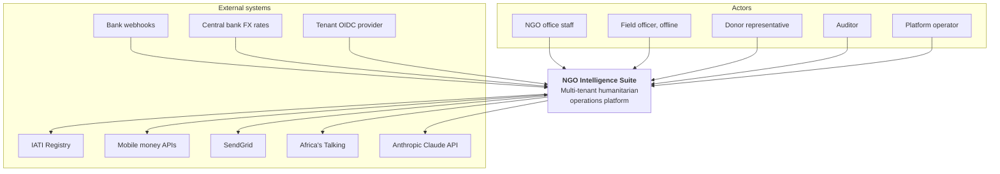

---

## 5.3 Container view (C4 Level 2)

The deployable units and the stores they own. Fifteen services; each owns its tables and no service reads another's tables directly (PRIN-07).

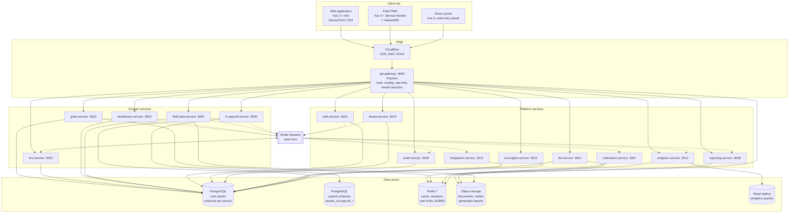

### 5.3.1 Container responsibilities at a glance

| Container | Owns | Never does |
| --- | --- | --- |
| `api-gateway` | Ingress, token validation, tenant and role header injection, rate limiting, circuit breaking, request correlation | Business logic, database access |
| `auth-service` | Users, roles, permissions, sessions, MFA | Domain data |
| `tenant-service` | Tenant records, provisioning, subscription tier, quotas, lifecycle | Per-domain data |
| `grant-service` | Donors, grants, budgets, budget lines, disbursements, grant reports, activities | Payroll, beneficiaries |
| `lms-service` | Courses, modules, lessons, assessments, LMS enrollments, progress, certificates | Employee records |
| `beneficiary-service` | Beneficiaries, households, programmes, programme enrollments, attendance | Form definitions |
| `field-data-service` | Form templates, fields, validation rules, submissions, submission values, sync state | Beneficiary master records |
| `hr-payroll-service` | Employees, contracts, positions, departments, leave, payroll runs and records, statutory rules | System user accounts |
| `notification-service` | Templates, delivery attempts, preferences, throttling | Deciding business meaning of an event |
| `reporting-service` | Report definitions, generated artefacts, PDF rendering | Source-of-truth data |
| `audit-service` | Append-only audit log | Mutating anything else |
| `file-service` | Object metadata, virus scan state, signed URL issuance, retention | Interpreting file contents |
| `integration-service` | External connectors, outbound webhooks, IATI publishing, FX ingestion | Domain rules |
| `analytics-service` | Materialised KPI aggregates, dashboard queries | Writing to domain tables |
| `ai-insights-service` | Prompt orchestration, redaction, LLM calls, review queue | Auto-committing AI output |

---

## 5.4 Service interaction

Two views, because conflating them is how distributed systems get accidentally coupled.

### 5.4.1 Synchronous call graph

Synchronous calls are permitted only where the user is waiting on the result. Every edge here is a latency and availability dependency.

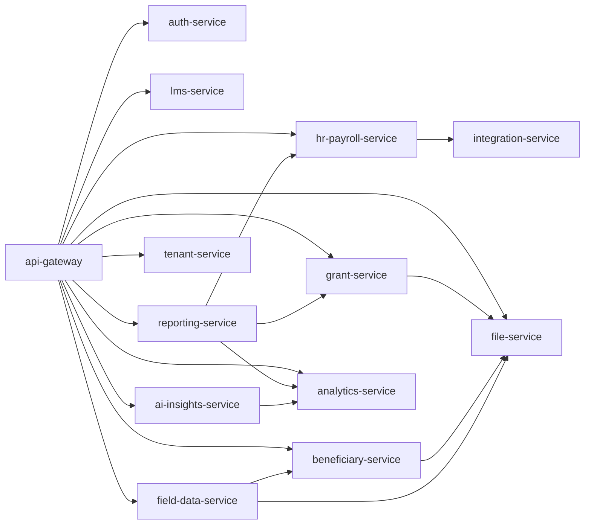

**Rules enforced on this graph.** Maximum call depth from the gateway is two. A synchronous call from one domain service to another requires an ADR; the only ones permitted today are `field-data-service` → `beneficiary-service` for duplicate checking during submission processing, and `hr-payroll-service` → `integration-service` for the FX rate at payroll time. Domain services **MUST NOT** call `audit-service`, `notification-service` or `analytics-service` synchronously — those are event consumers only.

### 5.4.2 Asynchronous event graph

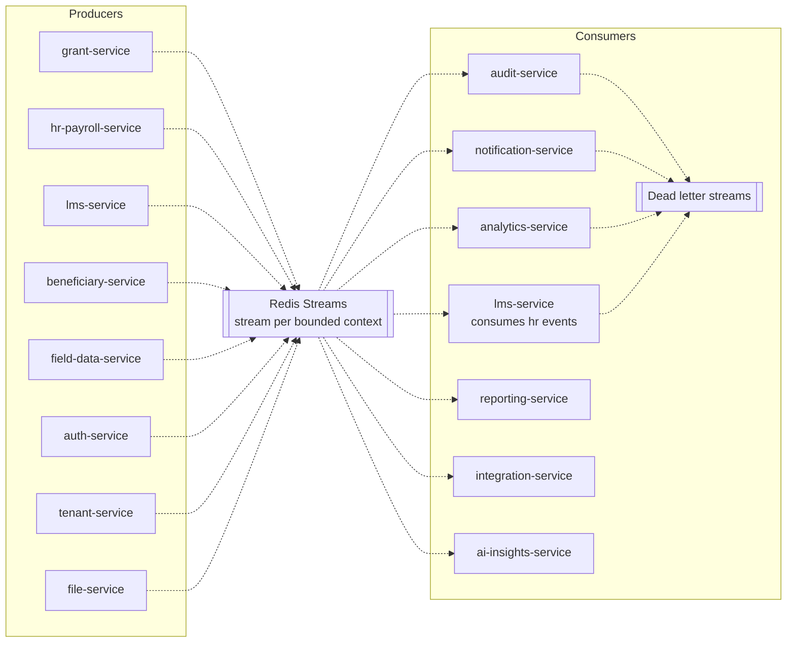

`audit-service` and `analytics-service` subscribe to every stream. Other consumers subscribe selectively; the full publisher/subscriber matrix is in [Appendix D](appendices/d-event-catalog.md).

---

## 5.5 Service dependency graph and criticality tiers

This is the diagram to look at during an incident. Tier 0 failures take the platform down; Tier 2 failures are noticed by nobody for an hour.

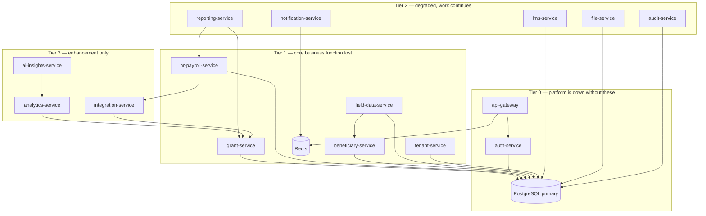

| Tier | Availability target | Paging policy | Recovery priority |
| --- | --- | --- | --- |
| Tier 0 | 99.9% | Page immediately, 24/7 | 1 |
| Tier 1 | 99.5% | Page during extended hours; ticket overnight for single-service failure | 2 |
| Tier 2 | 99.0% | Ticket; page only if sustained beyond 4 hours | 3 |
| Tier 3 | 98.0% | Ticket | 4 |

**Notable properties.** `audit-service` is Tier 2 rather than Tier 0 only because the transactional outbox ([11](11-event-driven-architecture.md)) means audit records are durable in the producing service's database before `audit-service` consumes them — an outage delays the audit trail but cannot lose it. `hr-payroll-service` depends on `integration-service` for the FX rate, which is why the FX rate is cached with a 7-day validity: a Tier 3 outage must not block payroll.

---

## 5.6 Component view — grant-service (C4 Level 3)

All services follow this internal shape, produced from the shared service template. Showing it once establishes the pattern.

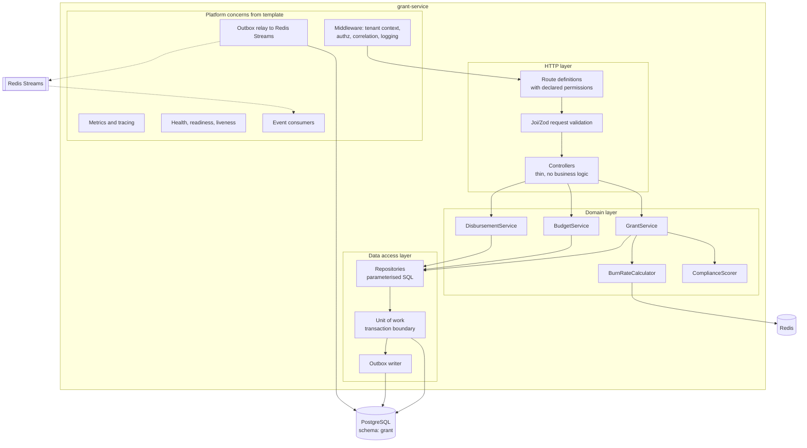

Key structural rules, enforced by lint rules and review:

1. Controllers contain no business logic. They validate, call a domain service, and shape a response.
2. Domain services contain no SQL. Repositories contain no business rules.
3. A domain event is written to the outbox table inside the same transaction as the state change it describes. Nothing publishes directly to Redis from business logic.
4. The platform concerns block is identical across all fifteen services and is upgraded centrally.

---

## 5.7 Network and security zones

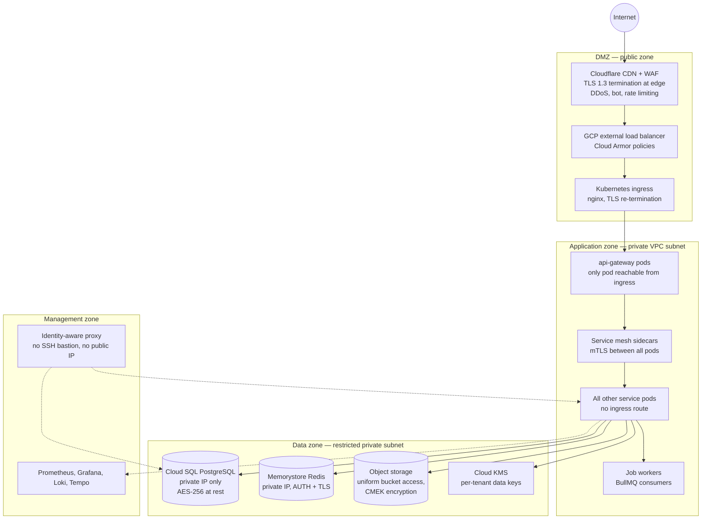

### 5.7.1 Zone rules

| Boundary | Allowed direction | Controls |
| --- | --- | --- |
| Internet → DMZ | Inbound 443 only | WAF rules, Cloud Armor, geo and rate policies, TLS 1.3 minimum |
| DMZ → Application | Inbound to `api-gateway` service port only | Kubernetes NetworkPolicy; no other pod accepts ingress traffic |
| Application → Application | Only declared service-to-service flows | Default-deny NetworkPolicy, mTLS with service identity, authorisation policy per service |
| Application → Data | Outbound to private IPs of managed data services only | VPC Service Controls, private service connect, no public IP on any data resource |
| Application → Internet | Only to an allow-listed egress set through a NAT with logging | Egress NetworkPolicy plus an egress gateway; prevents exfiltration to arbitrary hosts |
| Management → all | Read-only, identity-aware, session-recorded | IAP, no standing access, just-in-time elevation with approval |
| Data → anything | None. Data services never initiate connections | Enforced by firewall rules |

**Explicit prohibitions.** No service exposes a public IP. There is no SSH bastion; administrative access is through the identity-aware proxy with recorded sessions. Database credentials are short-lived and issued through workload identity, not stored as long-lived secrets.

---

## 5.8 Kubernetes deployment topology

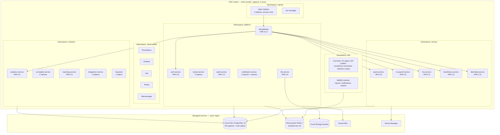

### 5.8.1 Node pools

| Node pool | Machine type | Size | Scheduling | Purpose |
| --- | --- | --- | --- | --- |
| `app-pool` | `n2-standard-4` | 3–8, autoscaled, regional | Default | All stateless services |
| `jobs-pool` | `n2-standard-4` | 1–6, autoscaled, includes spot nodes | Taint `workload=jobs` | Queue workers and cron jobs, interruption-tolerant |
| `monitoring-pool` | `n2-standard-2` | 2, fixed | Taint `workload=monitoring` | Observability stack, isolated so an application incident does not starve the tooling that diagnoses it |

> **Correction to v1.0.** v1.0 specified a `db-pool` running PostgreSQL as a StatefulSet and a `cache-pool` running a self-managed Redis cluster. Both are removed for staging and production: databases and caches are managed services on private IPs, which is what the data-zone isolation in §5.7 actually requires. A local PostgreSQL and Redis in Docker Compose remain the development environment.

### 5.8.2 Workload defaults

Every service Deployment inherits the following from the Helm base chart, overridable per service with justification:

| Setting | Value | Reason |
| --- | --- | --- |
| Replicas, minimum | 2 (3 for Tier 0) | Survive a node loss without downtime |
| Pod anti-affinity | `preferredDuringScheduling`, spread across zones | A zone loss should not take a whole service |
| PodDisruptionBudget | `minAvailable: 1`, or 50% for Tier 0 | Node drains cannot evict the last replica |
| Resource requests | CPU 100m, memory 256Mi | Sized from observed p95, reviewed quarterly |
| Resource limits | CPU 1000m, memory 512Mi | Memory limit is a hard stop; CPU limit prevents noisy neighbours |
| `terminationGracePeriodSeconds` | 45 | Long enough to drain in-flight requests and return unacked jobs |
| `preStop` hook | `sleep 5` then drain | Lets the load balancer deregister before the process stops accepting |
| Probes | Startup, liveness, readiness, all distinct | See [24 §24.7](24-observability.md) |
| Security context | `runAsNonRoot`, read-only root filesystem, all capabilities dropped, seccomp `RuntimeDefault` | Container hardening baseline |
| Image | Distroless, pinned by digest, signed | Supply chain, [22](22-cicd-release-supply-chain.md) |

---

## 5.9 Pod and container internals

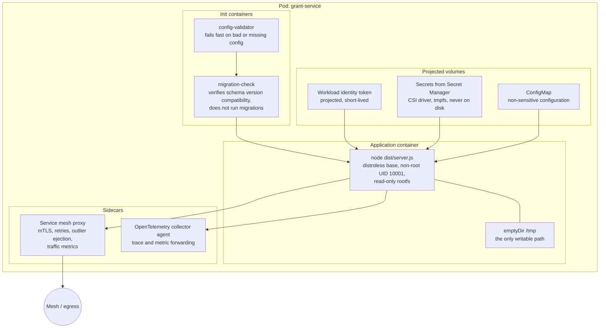

**Why each piece exists.** The config validator init container turns a misconfiguration into a crash loop with a clear message at deploy time rather than a runtime failure hours later (PRIN-12). The migration-check container refuses to start a pod whose code expects a schema version the database does not have, which is what makes the expand-contract migration process in [09](09-data-management-strategy.md) safe. The read-only root filesystem with a single `emptyDir` at `/tmp` means a code-execution vulnerability cannot persist anything. Secrets arrive through the CSI driver into tmpfs so they never touch a disk or an image layer.

---

## 5.10 Environment and promotion topology

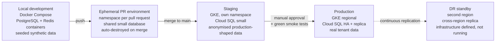

| Environment | Data | Access | Purpose |
| --- | --- | --- | --- |
| Local | Synthetic only. Production data on a laptop is a policy violation | Developer | Fast iteration |
| PR environment | Synthetic seed | Team | Review and manual verification of a change in isolation |
| Staging | Anonymised, production-shaped volumes | Team, read-write | Integration, load, chaos, migration rehearsal |
| Production | Real | Break-glass only, audited | Serving tenants |
| DR | Replica of production | Emergency only | Regional failover, [27](27-disaster-recovery-and-bcp.md) |

---

## 5.11 Data flow — J1: recording a grant disbursement

Expanded from Appendix B of v1.0, with the failure paths that the original omitted.

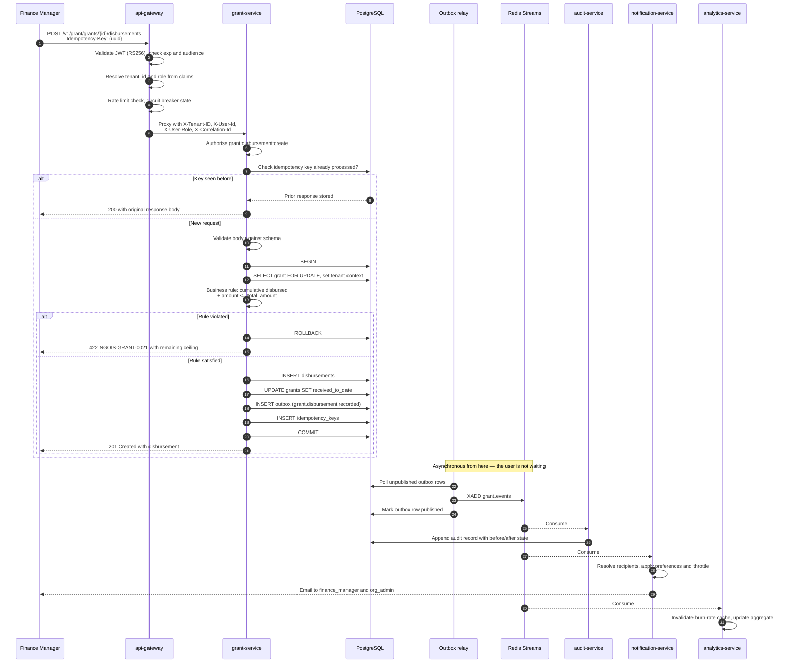

**What the diagram encodes that prose would miss.** The response returns at step 20 — before audit, notification or analytics have run. That is deliberate: the user's write is durable and acknowledged, and the downstream effects are guaranteed by the outbox, not by keeping the user waiting. If `audit-service` is down, the outbox row remains unconsumed and the audit record appears when it recovers; nothing is lost. If the notification email fails, it retries independently without affecting the disbursement.

---

## 5.12 Data flow — J2: staff onboarding triggering LMS induction

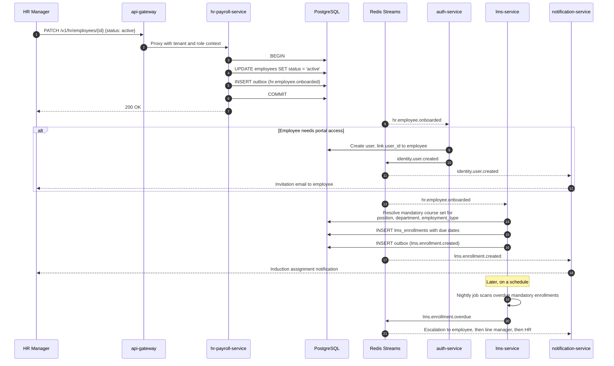

Note the ordering hazard this design avoids: `auth-service` creating the user and `lms-service` creating enrollments are independent consumers of the same event. Neither waits for the other, and `lms-service` does not require a user account to exist — enrollment attaches to the employee record, and portal access is a separate concern. If it had been modelled as a chain, an `auth-service` outage would silently block induction tracking.

---

## 5.13 Data flow — J3: offline field submission and sync

The most involved flow in the system.

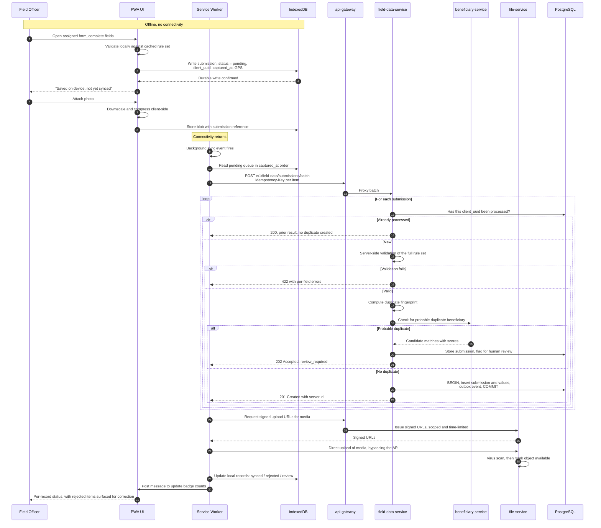

**Design points.** The submission and its media travel separately: structured data is small and goes through the API, media is large and goes directly to object storage through a signed URL so it never occupies an API worker. Duplicate suppression happens twice — by `client_uuid` for exact retry safety, and by fuzzy fingerprint for genuine human duplicates, which are flagged rather than auto-merged because merging beneficiary records incorrectly is a protection risk. The client never deletes a local record until the server confirms it, and rejected records stay on the device with their errors so the officer can fix them in the field.

---

## 5.14 Data flow — J4: monthly payroll run

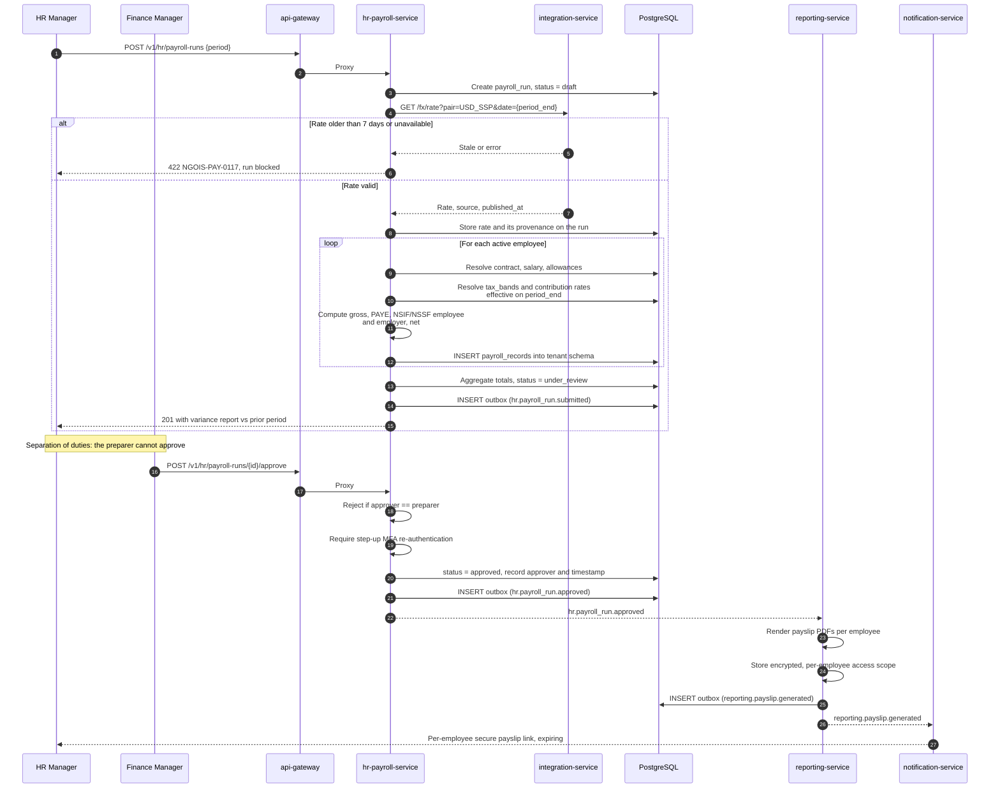

The variance report at step 18 is a deliberate control: comparing each employee's net pay to the prior period and flagging anything outside a threshold catches the class of error — a mistyped salary, a duplicated allowance — that statutory-rule testing cannot.

---

## 5.15 Data flow — J5: donor report generation with AI assistance

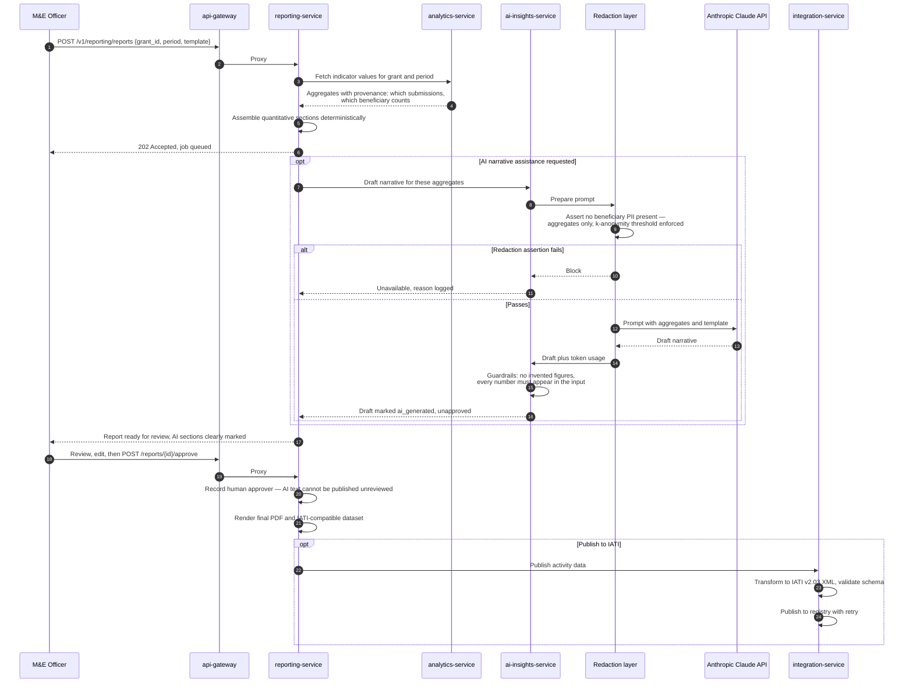

The hard rule visible here: AI output cannot reach a donor without a named human approving it, and the redaction layer is a separate component that blocks rather than sanitises when it is unsure. Both are elaborated in [18](18-ai-llm-architecture.md).

---

## 5.16 Data flow — tenant provisioning

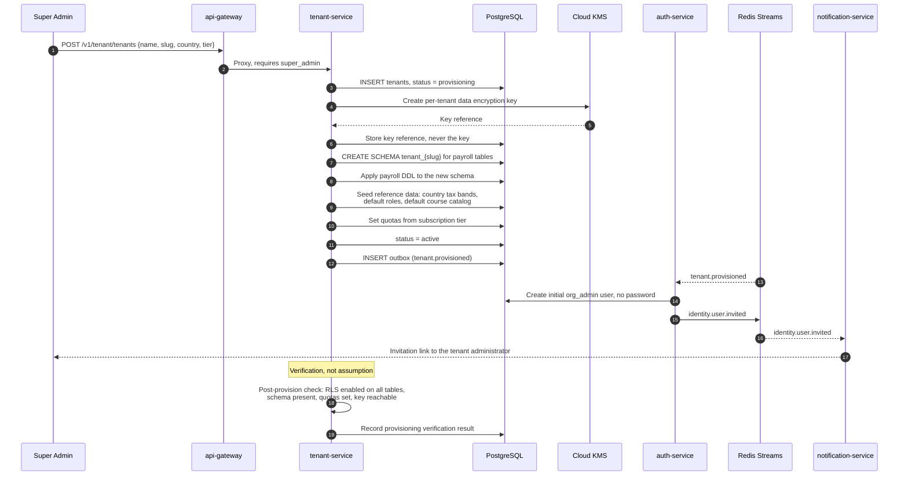

The post-provisioning verification step exists because the most dangerous tenant defect is one that is provisioned *almost* correctly — a table where RLS was not enabled is invisible until it leaks. See [29](29-multi-tenancy-and-tenant-lifecycle.md).

---

## 5.17 Event flow overview

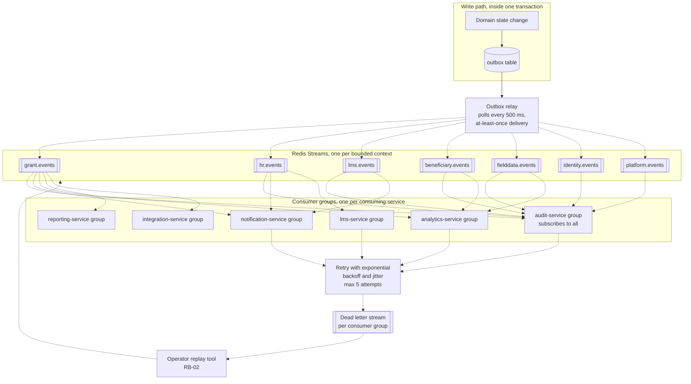

---

## 5.18 Multi-region disaster recovery topology

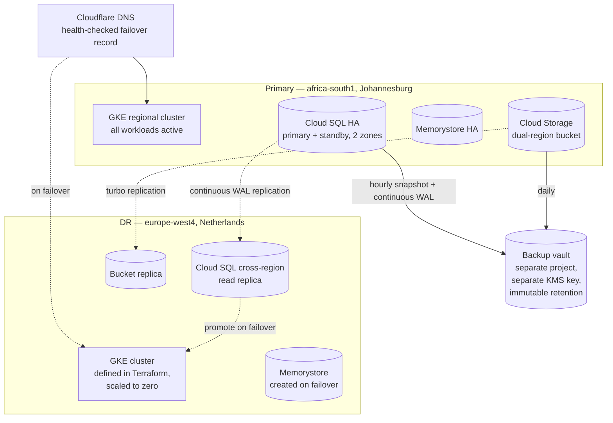

| Scenario | Detection | Response | RPO | RTO |
| --- | --- | --- | --- | --- |
| Single pod failure | Readiness probe | Kubernetes reschedules | 0 | Under 1 minute |
| Node failure | Node not ready | Rescheduled to another node, pool scales | 0 | Under 5 minutes |
| Zone failure | Multi-zone health degradation | Regional cluster and HA database absorb it | 0 | Under 5 minutes |
| Database primary failure | Cloud SQL health check | Automatic failover to standby | 0 | Under 2 minutes |
| Region failure | Synthetic monitoring from outside the region | Declared failover, [RB-12](runbooks/rb-12-region-failover.md) | Under 5 minutes | Under 4 hours |
| Data corruption or ransomware | Anomaly detection, integrity checks | Point-in-time restore from the immutable vault, [RB-11](runbooks/rb-11-backup-restore-drill.md) | Under 5 minutes to the chosen point | Under 8 hours |

Full procedures are in [27](27-disaster-recovery-and-bcp.md).
