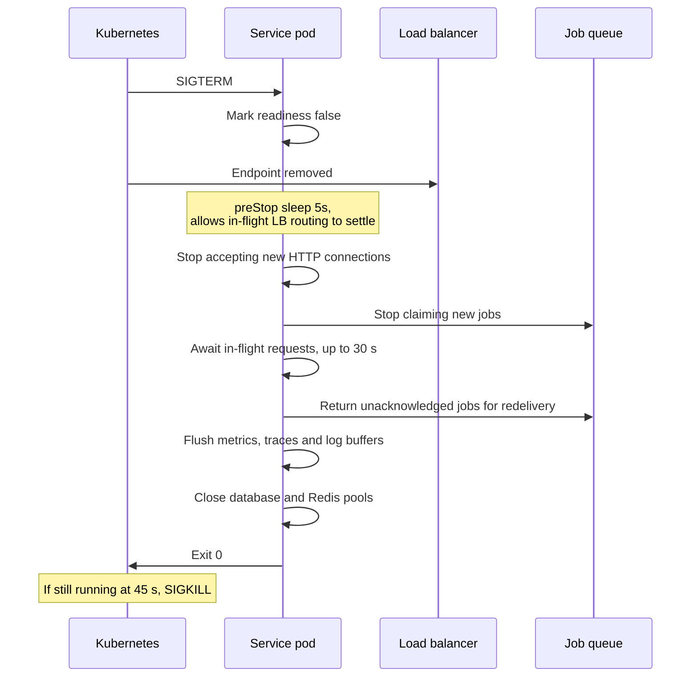

# 06 — Microservice Design

> **Document:** NGO Intelligence Suite — SDD v2.0
> **Chapter:** 06 — Microservice Design
> **Owner:** Principal Architect
> **Status:** Approved
> **Last Reviewed:** 2026-06-20
> **Related ADRs:** [ADR-0001](adr/0001-microservices-over-modular-monolith.md), [ADR-0007](adr/0007-typescript-on-node20.md), [ADR-0008](adr/0008-sync-vs-async-boundaries.md), [ADR-0012](adr/0012-custom-gateway-over-kong.md)

---

## 6.1 Decomposition rationale

Services are drawn around bounded contexts — a boundary where a term means one thing and a team can change the model without asking anyone. They are explicitly *not* drawn around technical layers, database tables, or team convenience.

The test applied to every proposed boundary:

1. **Language test.** Does "enrollment" mean the same thing on both sides? If not, it is two contexts. It was not — hence `lms_enrollments` and `program_enrollments` living in different services.
2. **Change test.** Would a typical change require editing both sides? If yes, the boundary is wrong.
3. **Data ownership test.** Can one service be the sole writer of its tables? If two services must write the same table, they are one service.
4. **Failure test.** Can one side be down while the other stays usable? If not, the split buys nothing and costs operational overhead.
5. **Sensitivity test.** Does one side handle data requiring a materially stronger control regime? If yes, split it even if the other tests are neutral — this is why payroll is separated and why beneficiary data is its own service.

Five services were added in v2.0 relative to v1.0's ten. Each was implicit work that v1.0 left unassigned, which in practice means it would have been implemented five times inconsistently.

| New service | Was previously | Why extracted |
| --- | --- | --- |
| `file-service` | Implicit in every service | Upload, virus scanning, signed URL issuance, retention and access control on documents containing PII are one problem, solved once, or several problems solved badly |
| `integration-service` | Scattered across grant, HR and reporting | External systems fail differently from internal ones. Isolating them contains their failure modes and their credentials, and gives one place for anti-corruption layers |
| `analytics-service` | Part of `reporting-service` | Cross-domain aggregation has a fundamentally different read pattern and scaling profile from document rendering |
| `ai-insights-service` | Part of `reporting-service` | An outbound path to a third-party LLM requires its own redaction boundary, cost controls and kill switch. It must be independently disableable |
| `tenant-service` | Part of `auth-service` | Tenant lifecycle — provisioning, quotas, subscription, export, deletion — is a distinct concern from authenticating a user, with a different privilege level and a different change cadence |

---

## 6.2 Service inventory

| Service | Port | Tier | Owning squad | Scaling profile | Data owned | Statutory / PII exposure |
| --- | --- | --- | --- | --- | --- | --- |
| `api-gateway` | 3000 | 0 | Platform | HPA 3–12, CPU-bound | None | Sees all traffic; logs must be scrubbed |
| `auth-service` | 3001 | 0 | Platform | HPA 3–8, spiky at shift change | Users, roles, permissions, sessions, MFA secrets | Staff PII, credentials |
| `grant-service` | 3002 | 1 | Grants | HPA 2–8, read-heavy | Donors, grants, budgets, budget lines, disbursements, grant reports, activities | Financial, donor-confidential |
| `lms-service` | 3003 | 2 | People | HPA 2–6, bursty at induction | Courses, modules, lessons, assessments, LMS enrollments, progress, certificates | Staff performance data |
| `beneficiary-service` | 3004 | 1 | Field | HPA 2–8, write-heavy during registration campaigns | Beneficiaries, households, programmes, programme enrollments, attendance | **Highest sensitivity** |
| `field-data-service` | 3005 | 1 | Field | HPA 2–10, extreme burst on sync | Form templates, fields, validation rules, submissions, submission values | High; free-text fields may contain PII |
| `hr-payroll-service` | 3006 | 1 | People | HPA 2–6, monthly peak | Employees, contracts, positions, departments, leave, payroll runs and records, statutory rules | **Statutory**; salary and tax data |
| `notification-service` | 3007 | 2 | Platform | 2 replicas + worker pool | Templates, delivery attempts, preferences | Contact details |
| `reporting-service` | 3008 | 2 | Grants | HPA 2–6, CPU and memory heavy | Report definitions, generated artefacts | Derived; may aggregate PII |
| `audit-service` | 3009 | 2 | Platform | HPA 2–6, write-only | Audit log | Contains before/after of PII changes |
| `file-service` | 3010 | 2 | Platform | HPA 2–6, IO-bound | Object metadata, scan state, retention | Documents may contain anything |
| `integration-service` | 3011 | 3 | Platform | 2 replicas | Connector config, outbound webhook log, FX rates | Holds third-party credentials |
| `analytics-service` | 3012 | 3 | Grants | HPA 2–6, read-heavy on replica | Materialised aggregates | Aggregates only, k-anonymity enforced |
| `ai-insights-service` | 3013 | 3 | Grants | 2 replicas, throttled | Prompt log, review queue, token usage | Must contain **no** beneficiary PII |
| `tenant-service` | 3014 | 1 | Platform | 2 replicas | Tenants, quotas, subscriptions, lifecycle state | Organisational, not personal |

### 6.2.1 What every service has, from the shared template

Consistency is what makes fifteen services operable by a small team (PRIN-11). The template provides, and each service inherits without reimplementation:

| Capability | Detail |
| --- | --- |
| Bootstrap | Config schema validation at start; the process exits with a specific message rather than starting misconfigured |
| Tenant context | Middleware that reads `X-Tenant-ID` from the gateway, sets the PostgreSQL session variable used by RLS, and rejects any request lacking it |
| Authorisation | Declarative permission on every route; an undeclared route is unreachable (PRIN-09) |
| Validation | Schema validation of body, query and params before any handler executes |
| Error handling | Central handler mapping domain errors to the response envelope and the error code registry ([Appendix E](appendices/e-error-codes.md)) |
| Correlation | `X-Correlation-Id` accepted or generated, propagated to logs, traces, events and downstream calls |
| Logging | Structured JSON to stdout, with a field allowlist so PII cannot be logged accidentally |
| Metrics | RED metrics per route and per consumer, plus Node runtime and pool metrics, at `/metrics` |
| Tracing | OpenTelemetry auto-instrumentation for HTTP, PostgreSQL and Redis, plus manual spans for domain operations |
| Health | `/health/startup`, `/health/live`, `/health/ready` with distinct semantics |
| Database | Connection pool with sane limits, statement timeout, parameterised queries only |
| Outbox | Transactional outbox write helper and the relay process |
| Idempotency | Middleware storing and replaying responses for keys on unsafe methods |
| Shutdown | SIGTERM handling: stop accepting, drain in-flight, return unacked jobs, close pools |
| Rate limit awareness | Honours gateway headers; applies its own limits on expensive endpoints |

---

## 6.3 Service specifications

Each specification below follows the same structure so it can be read quickly: responsibility, what it owns, its interface surface, its events, its dependencies, and — the part that matters at 3 a.m. — how it fails.

---

### 6.3.1 `api-gateway` (port 3000, Tier 0)

**Responsibility.** The single ingress for all client traffic. It authenticates, establishes tenant and role context, protects downstream services, and correlates requests. It contains no business logic and touches no database.

**Interface surface.** Proxies `/v1/{service}/**` to the corresponding service. Also serves `/v1/health` for external synthetic monitoring and `/v1/version`.

**Core behaviours.**

| Behaviour | Specification |
| --- | --- |
| Token validation | RS256 signature verified against cached JWKS, refreshed every 15 minutes and on unknown `kid`. Validates `exp`, `nbf`, `iss`, `aud`. Rejected tokens never reach a service |
| Context injection | Sets `X-Tenant-ID`, `X-User-Id`, `X-User-Role`, `X-Permissions`, `X-Correlation-Id`, `X-Request-Start`. **Strips** any of these headers present on the inbound request, which is the control that stops a client forging tenant identity |
| Route authorisation | Coarse route-level check against the permission in the route registry. Fine-grained resource checks remain the service's responsibility ([15](15-rbac-and-authorization.md)) |
| Rate limiting | Redis token bucket. 1,000 requests/minute per tenant by default, per-tier overrides, plus tighter per-endpoint limits on expensive operations (report generation 10/min, bulk sync 60/min) and per-IP limits on unauthenticated routes |
| Circuit breaking | Per-downstream-service breaker via `opossum`: opens at 50% error rate over a 20-request rolling window, half-opens after 30 seconds. Returns `503` with `Retry-After` when open |
| Timeouts | 5 s default, 30 s for report generation and bulk sync, 120 s for AI endpoints. No unbounded proxy waits |
| Request size | 1 MB default, 10 MB for batch sync. Media never transits the gateway; it uses signed URLs |
| CORS | Allow-list of tenant-configured origins; credentials permitted only for those origins |
| Security headers | HSTS with preload, `X-Frame-Options: DENY`, `X-Content-Type-Options: nosniff`, `Referrer-Policy: no-referrer`, CSP, `Permissions-Policy` |
| Logging | Access log with correlation ID, tenant, route, status, duration, upstream. Query strings and bodies are never logged |

**Dependencies.** `auth-service` (JWKS and permission cache), Redis (rate limits, breaker state).

**Failure modes.**

| Failure | Effect | Behaviour | Mitigation |
| --- | --- | --- | --- |
| Gateway down | Total outage | — | Minimum 3 replicas across zones, PDB `minAvailable: 50%`, no single point |
| JWKS unreachable | New tokens cannot be validated | Serve from cache up to 24 hours; log loudly | Cache with long stale tolerance; alert on refresh failure |
| Redis down | Rate limiting and breaker state lost | **Fail open** on rate limiting, fail closed on nothing | Deliberate: availability is preferred over enforcement here, with an alert. Recorded in the risk register as R-14 |
| Downstream slow | Queue growth, latency spread | Breaker opens, shedding load | Per-service breakers isolate the blast radius |

> **v1.0 deviation.** v1.0 proposed "Kong or custom Node.js gateway". The decision is a custom Express gateway; see [ADR-0012](adr/0012-custom-gateway-over-kong.md). The deciding factor was that tenant resolution, permission injection and the header-stripping control are bespoke logic that would live in a Kong plugin anyway, and one fewer runtime is worth more than Kong's feature surface at this scale.

---

### 6.3.2 `auth-service` (port 3001, Tier 0)

**Responsibility.** Identity, authentication, session lifecycle and the authoritative permission model. Wraps Supabase Auth with organisational context that Supabase does not model.

**Owns.** `users`, `roles`, `permissions`, `role_permissions`, `user_roles`, `sessions`, `mfa_enrollments`, `login_attempts`, `password_history`.

**Key endpoints.**

| Method | Path | Permission | Notes |
| --- | --- | --- | --- |
| POST | `/v1/auth/login` | Public | Rate-limited per IP and per account; returns access + refresh |
| POST | `/v1/auth/mfa/verify` | Partial session | TOTP verification, replay-protected |
| POST | `/v1/auth/refresh` | Refresh cookie | Rotating refresh tokens with reuse detection |
| POST | `/v1/auth/logout` | Authenticated | Revokes the session and its refresh family |
| GET | `/v1/auth/me` | Authenticated | Identity, roles, effective permissions |
| POST | `/v1/auth/users` | `identity:user:create` | Invitation-based; never sets a password directly |
| PATCH | `/v1/auth/users/:id/roles` | `identity:role:assign` | Revokes all active sessions for the user |
| POST | `/v1/auth/users/:id/suspend` | `identity:user:suspend` | Immediate session revocation |
| GET | `/v1/auth/permissions` | `identity:role:read` | The effective matrix, used by the gateway cache |
| POST | `/v1/auth/break-glass` | `super_admin` + approval | Time-boxed elevation, heavily audited ([15](15-rbac-and-authorization.md)) |

**Token design.**

| Property | Value | Reason |
| --- | --- | --- |
| Access token | JWT, RS256, 60-minute lifetime | Short enough to bound damage from theft; long enough to avoid refresh storms on poor connectivity |
| Refresh token | Opaque, 7 days, rotating, `httpOnly` + `Secure` + `SameSite=Strict` cookie | Rotation with reuse detection turns a stolen refresh token into a detectable event |
| Field client access token | 8-hour lifetime | Explicit exception: a field officer cannot refresh a token without connectivity. Compensated by narrower permissions and remote revocation on next contact |
| Claims | `sub`, `tenant_id`, `role`, `permissions` hash, `session_id`, `mfa`, standard registered claims | The permission *hash* rather than the full list keeps the token small; the gateway resolves the list from cache |
| Revocation | Session ID checked against a Redis deny-list on each gateway pass | Immediate revocation without abandoning stateless validation |

**Events published.** `identity.user.created`, `identity.user.invited`, `identity.user.activated`, `identity.user.suspended`, `identity.user.deleted`, `identity.role.assigned`, `identity.role.revoked`, `identity.login.succeeded`, `identity.login.failed`, `identity.mfa.enrolled`, `identity.session.revoked`, `identity.breakglass.granted`.

**Events consumed.** `tenant.provisioned` (create the initial administrator), `hr.employee.onboarded` (provision portal access where the employee requires it), `hr.employee.terminated` (**immediately** suspend the user and revoke sessions), `tenant.suspended`.

**Dependencies.** Supabase Auth, PostgreSQL, Redis.

**Failure modes.**

| Failure | Effect | Behaviour |
| --- | --- | --- |
| Supabase Auth unavailable | No new logins; existing sessions valid until expiry | Gateway continues validating cached JWKS; a status banner tells users why login fails |
| Database unavailable | Permission resolution fails | Gateway serves the cached permission matrix for up to 5 minutes, then fails closed |
| Redis unavailable | Session revocation deny-list unavailable | **Fail closed** on revocation checks for privileged roles; fail open for read-only roles. Asymmetry is deliberate |

**Security notes.** Failed login attempts are counted per account and per IP with exponential lockout. MFA is mandatory for `super_admin`, `org_admin`, `finance_manager` and `hr_manager`. Password change or role modification revokes every active session for that user. MFA secrets are encrypted with a KMS-managed key, never returned by any endpoint after enrollment.

---

### 6.3.3 `tenant-service` (port 3014, Tier 1)

**Responsibility.** Tenant lifecycle from provisioning to deletion, subscription tier, feature entitlements and quota enforcement.

**Owns.** `tenants`, `tenant_settings`, `tenant_quotas`, `tenant_usage`, `subscriptions`, `tenant_lifecycle_events`.

**Key endpoints.**

| Method | Path | Permission | Notes |
| --- | --- | --- | --- |
| POST | `/v1/tenant/tenants` | `super_admin` | Full provisioning workflow, see [05 §5.16](05-architecture-diagrams.md) |
| GET | `/v1/tenant/tenants/:id` | `tenant:read` | Scoped to own tenant unless `super_admin` |
| PATCH | `/v1/tenant/tenants/:id/settings` | `tenant:settings:update` | Timezone, locale, branding, notification defaults |
| GET | `/v1/tenant/tenants/:id/usage` | `tenant:quota:read` | Against quota, for the tenant and for billing |
| POST | `/v1/tenant/tenants/:id/export` | `tenant:export` + `org_admin` | Full tenant data export, asynchronous, dual-authorised |
| POST | `/v1/tenant/tenants/:id/suspend` | `super_admin` | Read-only mode; used for non-payment or investigation |
| POST | `/v1/tenant/tenants/:id/offboard` | `super_admin` + written authorisation | Starts the retention-clock deletion workflow |

**Quota model.** Enforced at write time, checked by the gateway on entry and re-verified by the owning service.

| Quota | Starter | Professional | Enterprise |
| --- | --- | --- | --- |
| Active users | 15 | 75 | Unlimited |
| Beneficiary records | 10,000 | 100,000 | 1,000,000 |
| Submissions per month | 5,000 | 50,000 | 500,000 |
| Object storage | 20 GB | 200 GB | 2 TB |
| API requests per minute | 300 | 1,000 | 3,000 |
| Report generations per day | 20 | 200 | 1,000 |
| AI tokens per month | 0 | 500,000 | 5,000,000 |
| Data retention beyond the statutory minimum | Standard | Configurable | Configurable |

**Events published.** `tenant.provisioned`, `tenant.settings.updated`, `tenant.quota.exceeded`, `tenant.quota.warning`, `tenant.suspended`, `tenant.reactivated`, `tenant.offboarding.started`, `tenant.data.exported`, `tenant.deleted`.

**Failure modes.** If the service is unavailable, quota enforcement falls back to cached values (5-minute TTL) and provisioning is blocked. Partial provisioning is the significant risk: the workflow is idempotent and resumable, and the post-provision verification step means a half-provisioned tenant is never marked active.

---

### 6.3.4 `grant-service` (port 3002, Tier 1)

**Responsibility.** The financial compliance engine: donors, grants, budgets, disbursements, donor reporting obligations and the derived intelligence over them.

**Owns.** `donors`, `grants`, `grant_budgets`, `budget_lines`, `budget_revisions`, `disbursements`, `grant_reports`, `grant_report_periods`, `grant_activities`, `grant_documents`, `grant_compliance_snapshots`.

**Key endpoints.**

| Method | Path | Permission | Notes |
| --- | --- | --- | --- |
| GET | `/v1/grant/grants` | `grant:read` | Cursor-paginated, filterable by status, donor, currency, date range, sector |
| POST | `/v1/grant/grants` | `grant:create` | Creates grant with donor link, budget structure and disbursement schedule |
| GET | `/v1/grant/grants/:id` | `grant:read` | Includes budget summary and current compliance score |
| PATCH | `/v1/grant/grants/:id` | `grant:update` | Optimistic concurrency via `If-Match` |
| POST | `/v1/grant/grants/:id/budget-revisions` | `grant:budget:update` | Budget changes are versioned, never destructive |
| GET | `/v1/grant/grants/:id/burn-rate` | `grant:read` | Utilisation versus elapsed time; see [Appendix I](appendices/i-algorithms.md) |
| POST | `/v1/grant/grants/:id/disbursements` | `grant:disbursement:create` | Idempotent; enforces the grant ceiling |
| POST | `/v1/grant/grants/:id/disbursements/:did/approve` | `grant:disbursement:approve` | Maker-checker: approver ≠ creator |
| GET | `/v1/grant/grants/:id/compliance-score` | `grant:read` | Composite 0–100 with a factor breakdown |
| POST | `/v1/grant/grants/:id/reports` | `grant:report:create` | Links a donor report to a reporting period |
| GET | `/v1/grant/grants/expiring` | `grant:read` | 30/60/90-day horizons |
| GET | `/v1/grant/grants/:id/activities` | `grant:read` | Activities with linked M&E evidence counts |

**Business rules enforced.**

| Rule | Behaviour on violation |
| --- | --- |
| Cumulative disbursements **MUST NOT** exceed `total_amount` | `422 NGOIS-GRANT-0021` with the remaining ceiling in the payload |
| Budget line totals **MUST** reconcile to the grant total within a 0.01 tolerance | `422 NGOIS-GRANT-0033` identifying the discrepancy |
| `end_date` **MUST** be after `start_date`; a period change **MUST NOT** orphan reporting periods | `422 NGOIS-GRANT-0012` |
| A grant in `closed` status **MUST NOT** accept new disbursements or expenditure | `409 NGOIS-GRANT-0044` |
| `grant_number` is unique per `(tenant_id, donor_id)` | `409 NGOIS-GRANT-0009` |
| Disbursement currency **MUST** match the grant currency, or carry an explicit conversion with rate provenance | `422 NGOIS-GRANT-0027` |
| Approving a disbursement requires a different user from the one who created it | `403 NGOIS-GRANT-0051` |

**Events published.** `grant.created`, `grant.updated`, `grant.status.changed`, `grant.budget.revised`, `grant.disbursement.recorded`, `grant.disbursement.approved`, `grant.report.submitted`, `grant.report.overdue`, `grant.expiring.soon`, `grant.compliance.recalculated`, `grant.ceiling.approached`, `grant.closed`.

**Events consumed.** `fielddata.submission.linked` (activity evidence counts), `hr.payroll_run.approved` (staff cost attribution to budget lines), `platform.day.rolled` (nightly recomputation).

**Scheduled work.** Nightly compliance-score recomputation for active grants; daily expiry scan producing `grant.expiring.soon` at 90, 60, 30 and 7 days; daily overdue-report scan; hourly burn-rate cache warm for grants viewed in the past 7 days.

**Failure modes.**

| Failure | Effect | Behaviour |
| --- | --- | --- |
| Service down | Grant management unavailable; reporting and analytics show stale data | Other domains unaffected; the gateway breaker sheds load quickly |
| Redis cache down | Burn-rate endpoint slows from ~20 ms to ~400 ms | Computed directly from the database; correctness unaffected |
| Outbox relay stalled | Audit, notification and analytics lag | Events are durable in the outbox; alert on relay lag over 60 seconds |
| `file-service` down | Document attachment fails | Grant records can still be created; attachment is retried by the client |

---

### 6.3.5 `hr-payroll-service` (port 3006, Tier 1)

**Responsibility.** Staff records, contracts, organisational structure, leave, and statutory-correct payroll for South Sudan and Uganda. The service with the highest correctness stakes in the platform.

**Owns.** In the shared schema: `departments`, `positions`, `employees`, `contracts`, `leave_types`, `leave_balances`, `leave_requests`, `tax_bands`, `statutory_contribution_rates`, `payroll_calendars`. In the per-tenant schema `tenant_<slug>`: `payroll_runs`, `payroll_records`, `payroll_record_lines`, `payslip_artifacts`.

**Why the schema split.** Salary data has the narrowest legitimate audience of anything in the platform, and the consequences of exposure inside an organisation are severe and immediate. Per-tenant schemas add a second, structural barrier beyond RLS: a query that somehow escapes RLS still cannot reach another tenant's payroll because it is not in the search path and the service role has no grant on it. See [ADR-0006](adr/0006-per-tenant-schema-for-payroll.md).

**Key endpoints.**

| Method | Path | Permission | Notes |
| --- | --- | --- | --- |
| POST | `/v1/hr/employees` | `hr:employee:create` | Generates `employee_number`; PII encrypted at the application layer |
| PATCH | `/v1/hr/employees/:id/status` | `hr:employee:status:update` | Status transitions are a validated state machine |
| POST | `/v1/hr/contracts` | `hr:contract:create` | Overlapping active contracts for one employee are rejected |
| GET | `/v1/hr/employees/:id/leave-balance` | `hr:leave:read` | Accrued, taken, remaining, by leave type |
| POST | `/v1/hr/leave-requests` | `hr:leave:request` | Self-service; approval routes to the line manager |
| POST | `/v1/hr/payroll-runs` | `payroll:run:create` | Drafts a run; requires a valid FX rate |
| GET | `/v1/hr/payroll-runs/:id/variance` | `payroll:run:read` | Per-employee variance against the prior period |
| POST | `/v1/hr/payroll-runs/:id/approve` | `payroll:run:approve` | Second person, step-up MFA, immutable thereafter |
| POST | `/v1/hr/payroll-runs/:id/reverse` | `payroll:run:reverse` | Creates a compensating run; never mutates the original |
| GET | `/v1/hr/payroll-runs/:id/statutory-returns` | `payroll:run:read` | NRA and NSIF return data for filing |
| GET | `/v1/hr/tax-bands` | `payroll:statutory_rules:read` | Effective-dated, per country |
| POST | `/v1/hr/tax-bands` | `payroll:statutory_rules:update` + dual auth | Preview of effect required before commit |

**Payroll calculation guarantees.**

1. A run resolves rules by `effective_from <= period_end`, never by "current". Recomputing a 2024 run in 2027 produces the identical result.
2. The FX rate, its source and its publication date are stored on the run. A rate older than 7 days blocks the run unless a `finance_manager` explicitly overrides with a recorded reason.
3. Every computed figure stores its inputs in `payroll_record_lines`, so any number on a payslip can be explained without re-running anything.
4. An approved run is immutable. Corrections are compensating runs.
5. Rounding is applied once, at the statutory point, using the rule each authority specifies, not a generic rounding at the end.

**Events published.** `hr.employee.created`, `hr.employee.onboarded`, `hr.employee.status.changed`, `hr.employee.terminated`, `hr.contract.created`, `hr.contract.expiring`, `hr.leave.requested`, `hr.leave.approved`, `hr.leave.rejected`, `hr.payroll_run.created`, `hr.payroll_run.submitted`, `hr.payroll_run.approved`, `hr.payroll_run.reversed`, `hr.statutory_rules.updated`.

**Events consumed.** `identity.user.created` (link a portal account to an employee), `lms.enrollment.completed` (compliance status on the employee record), `tenant.provisioned` (seed country statutory rules).

**Failure modes.**

| Failure | Effect | Behaviour |
| --- | --- | --- |
| Service down | HR and payroll unavailable | Highest urgency during the monthly payroll window; the on-call policy escalates faster in the last 5 days of the month |
| `integration-service` down at payroll time | No fresh FX rate | Cached rate within 7 days is used; beyond that the run is blocked with an explicit, actionable error |
| Payroll run interrupted mid-computation | Partial records | The run is transactional per employee with a resumable run state; an interrupted run resumes rather than restarts |
| Statutory rule missing for a period | Cannot compute | Blocked with `NGOIS-PAY-0103` naming the missing rule and period — never a silent zero |

---

### 6.3.6 `beneficiary-service` (port 3004, Tier 1)

**Responsibility.** The registry of people the organisation serves, the households they belong to, the programmes they are enrolled in, and the vulnerability assessment that drives targeting. The most sensitive service in the platform.

**Owns.** `beneficiaries`, `households`, `household_members`, `programmes`, `programme_enrollments`, `programme_activities`, `attendance_records`, `vulnerability_assessments`, `beneficiary_consents`, `beneficiary_merge_log`.

**Key endpoints.**

| Method | Path | Permission | Notes |
| --- | --- | --- | --- |
| POST | `/v1/beneficiary/beneficiaries` | `beneficiary:create` | Generates `BEN-YYYY-NNNNN` scoped per tenant |
| GET | `/v1/beneficiary/beneficiaries` | `beneficiary:read` | **Requires a `purpose` parameter**; the search is logged with it |
| GET | `/v1/beneficiary/beneficiaries/:id` | `beneficiary:read` | PII decrypted only for roles with `beneficiary:record:read_pii` |
| POST | `/v1/beneficiary/beneficiaries/search-duplicates` | `beneficiary:create` | Fuzzy match returning candidates with scores, never auto-merging |
| POST | `/v1/beneficiary/beneficiaries/:id/merge` | `beneficiary:merge` + dual auth | Reversible for 30 days; fully logged |
| POST | `/v1/beneficiary/households` | `beneficiary:create` | Household composition drives vulnerability scoring |
| POST | `/v1/beneficiary/beneficiaries/:id/assessments` | `beneficiary:assess` | Recomputes and versions the vulnerability score |
| POST | `/v1/beneficiary/programmes/:id/enrollments` | `programme:enroll` | Eligibility rules evaluated at enrollment |
| POST | `/v1/beneficiary/activities/:id/attendance` | `programme:attendance:record` | Bulk-capable for distributions |
| POST | `/v1/beneficiary/beneficiaries/:id/erasure` | `beneficiary:erase` + DPO approval | Article 17 workflow, [RB-07](runbooks/rb-07-pii-erasure-request.md) |
| GET | `/v1/beneficiary/beneficiaries/:id/data-export` | `beneficiary:export` + dual auth | Data subject access request fulfilment |

**Protection-specific controls.** These are unique to this service and are requirements, not options.

| Control | Implementation |
| --- | --- |
| Purpose-bound access | Read endpoints require a `purpose` value from a controlled vocabulary; it is stored with the access log entry |
| Application-layer encryption | Names, dates of birth, national identifiers, phone numbers and precise GPS are encrypted with AES-256-GCM under a per-tenant data key from KMS |
| Searchability without decryption | Blind indexes over normalised, salted hashes support exact and phonetic matching without decrypting the corpus |
| Location generalisation | Non-field roles see settlement-level location; precise coordinates require `beneficiary:location:read_precise` |
| Bulk export control | Any export over 100 records requires dual authorisation and generates a high-priority audit event |
| Field-level minimisation | Adding a column to `beneficiaries` requires DPO approval recorded in the migration |
| Consent record | Consent to data collection, its purpose, and whether it may be shared with a donor is a first-class record |
| No hard delete outside erasure | Erasure is a specific, audited, irreversible workflow distinct from soft delete |

**Vulnerability scoring.** Weighted composite over displacement status, household size, food security, female-headed household, chronic illness and children under five. Recomputed on any change to the beneficiary or their household, versioned so historical targeting decisions remain explicable. Full specification with corrections to the v1.0 formulation is in [Appendix I](appendices/i-algorithms.md).

**Events published.** `beneficiary.registered`, `beneficiary.updated`, `beneficiary.merged`, `beneficiary.erased`, `beneficiary.vulnerability.recalculated`, `beneficiary.duplicate.flagged`, `programme.enrollment.created`, `programme.enrollment.exited`, `programme.attendance.recorded`, `beneficiary.pii.accessed` (to `audit-service` only).

**Events consumed.** `fielddata.submission.accepted` (create or update from field registration), `grant.closed` (flag programmes needing an exit plan).

**Failure modes.**

| Failure | Effect | Behaviour |
| --- | --- | --- |
| Service down | Registration and targeting unavailable; field client queues locally and continues | Field officers are unblocked because of PRIN-02 |
| KMS unavailable | PII cannot be decrypted | Non-PII operations continue; PII reads fail explicitly rather than returning blanks. Data keys are cached in memory for 15 minutes to ride out brief interruptions |
| Duplicate search timeout | Registration would stall | Degrades to accepting the record flagged `review_required` rather than blocking the field officer |

---

### 6.3.7 `field-data-service` (port 3005, Tier 1)

**Responsibility.** Form definition, offline submission intake, validation, deduplication and evidence linkage. The service with the most hostile input conditions.

**Owns.** `form_templates`, `form_template_versions`, `form_fields`, `field_validation_rules`, `form_assignments`, `submissions`, `submission_values`, `submission_attachments`, `sync_sessions`, `submission_review_queue`.

**Key endpoints.**

| Method | Path | Permission | Notes |
| --- | --- | --- | --- |
| GET | `/v1/field-data/forms/assigned` | `form:read` | Returns the officer's assigned forms with full definitions for offline caching |
| POST | `/v1/field-data/forms` | `form:create` | Creates a form template |
| POST | `/v1/field-data/forms/:id/publish` | `form:publish` | Publishing freezes a version; live forms are never edited in place |
| POST | `/v1/field-data/submissions` | `submission:create` | Single submission |
| POST | `/v1/field-data/submissions/batch` | `submission:create` | Up to 100 submissions, per-item idempotency and per-item results |
| GET | `/v1/field-data/sync/manifest` | `submission:create` | Delta manifest so the client downloads only what changed |
| POST | `/v1/field-data/submissions/:id/link-activity` | `submission:link` | Creates the M&E evidence chain to a grant activity |
| GET | `/v1/field-data/review-queue` | `submission:review` | Submissions flagged for human resolution |
| POST | `/v1/field-data/submissions/:id/resolve` | `submission:review` | Accept, reject with reason, or merge |

**Form versioning rule.** A published form version is immutable. Every submission stores the exact `form_template_version_id` it was captured against, so a form redesign never silently changes the meaning of historical data. A client holding an outdated version can still submit; the server accepts it against that version and flags the submission for schema migration if the analysis requires the newer shape.

**Deduplication.** Two independent mechanisms, deliberately not conflated:

| Mechanism | Detects | Action |
| --- | --- | --- |
| `client_uuid` idempotency | The same submission sent twice due to a retry or a flaky connection | Silently returns the original result; no duplicate created |
| Content fingerprint | A genuinely duplicated human entry — the same household registered by two officers | Flags for review with candidate matches; never auto-merges |

**Batch semantics.** A batch is **not** a transaction. Each item succeeds or fails independently, and the response carries a per-item status. A single malformed submission from a device that has been offline for three days must not reject the other ninety-nine.

**Events published.** `fielddata.form.published`, `fielddata.submission.received`, `fielddata.submission.accepted`, `fielddata.submission.rejected`, `fielddata.submission.flagged`, `fielddata.submission.linked`, `fielddata.sync.completed`, `fielddata.sync.conflict`.

**Events consumed.** `beneficiary.merged` (repoint submissions to the surviving record), `grant.activity.created` (make activities available as linkage targets).

**Failure modes.**

| Failure | Effect | Behaviour |
| --- | --- | --- |
| Service down | Sync fails; clients hold data locally and retry with backoff | This is the designed-for case, not an exception |
| Sync storm after a regional outage | Hundreds of clients sync simultaneously | HPA to 10 replicas, per-tenant sync rate limits, and a queue-based intake that accepts fast and processes asynchronously |
| Attachment upload fails | Structured data is saved, media is not | Submission is marked `attachment_pending`; the client retries only the media |
| Validation rule references a deleted field | Submission cannot be validated | Blocked at form publish time by a referential check, not discovered at submission time |

---

### 6.3.8 `lms-service` (port 3003, Tier 2)

**Responsibility.** Course authoring, enrollment automation from HR events, assessment, certification and mandatory-compliance tracking.

**Owns.** `courses`, `course_versions`, `modules`, `lessons`, `assessments`, `questions`, `answer_options`, `lms_enrollments`, `lesson_progress`, `assessment_attempts`, `certificates`, `mandatory_training_rules`.

**Key endpoints.**

| Method | Path | Permission | Notes |
| --- | --- | --- | --- |
| POST | `/v1/lms/courses` | `lms:course:create` | Course, modules, lessons, assessments |
| POST | `/v1/lms/courses/:id/publish` | `lms:course:publish` | Version frozen; learners in progress stay on their version |
| POST | `/v1/lms/courses/import-scorm` | `lms:course:create` | SCORM 1.2 package import |
| GET | `/v1/lms/my-enrollments` | Authenticated | The learner's own view |
| POST | `/v1/lms/enrollments/:id/progress` | `lms:progress:record_own` | Idempotent lesson completion |
| POST | `/v1/lms/assessments/:id/attempts` | `lms:assessment:attempt` | Enforces attempt limits and cooldowns |
| GET | `/v1/lms/compliance-status` | `lms:compliance:read` | Organisation-wide mandatory training status |
| POST | `/v1/lms/mandatory-rules` | `lms:mandatory_rule:admin` | Which courses are mandatory for which position, department or employment type |

**Enrollment automation.** On `hr.employee.onboarded`, the service resolves the mandatory rule set for the employee's position, department, employment type and duty station, creates enrollments with due dates derived from the rule, and emits `lms.enrollment.created`. Escalation is staged: reminder at 7 days before due, at due, then escalation to the line manager at 7 days overdue and to HR at 14 days.

**Events published.** `lms.course.published`, `lms.enrollment.created`, `lms.enrollment.started`, `lms.enrollment.completed`, `lms.enrollment.overdue`, `lms.assessment.passed`, `lms.assessment.failed`, `lms.certificate.issued`.

**Events consumed.** `hr.employee.onboarded`, `hr.employee.status.changed`, `hr.employee.terminated` (close open enrollments), `tenant.provisioned` (seed the default safeguarding and security course catalog).

**Failure modes.** Service unavailability is a Tier 2 event — training pauses, nothing else stops. The risk to watch is missed enrollment creation if an event is lost; the outbox plus a nightly reconciliation job that compares active employees against expected mandatory enrollments closes that gap.

---

### 6.3.9 `notification-service` (port 3007, Tier 2)

**Responsibility.** Turning events into messages people actually receive, without becoming a source of spam or a channel for data leakage.

**Owns.** `notification_templates`, `notification_preferences`, `notification_deliveries`, `notification_suppressions`, `channel_credentials` (references only).

**Design rules.**

| Rule | Reason |
| --- | --- |
| Templates never interpolate unredacted PII into SMS | SMS traverses networks with no confidentiality guarantee. A payslip notification says "your payslip is ready", never a figure |
| Every notification links, never attaches | Links are access-controlled and expiring; attachments are forever |
| Per-user, per-category preferences with a digest option | The fastest way to make an alerting system useless is to make it noisy |
| Throttling and deduplication | Identical notifications within a window collapse into one |
| Channel fallback | Email fails or is absent, fall back to SMS for critical categories only |
| Full delivery audit | Every attempt with provider response is retained; "I never got it" is answerable |
| Quiet hours by tenant timezone | Non-urgent notifications respect local working hours |

**Channels.** Email via SendGrid, SMS via Africa's Talking, in-app via a notification table polled by the client, and webhook for tenant integrations.

**Retry policy.** Five attempts with exponential backoff of 1, 5, 25, 125 and 625 seconds plus jitter. Provider 4xx responses that indicate a permanent failure — invalid address, unsubscribed — do not retry and instead record a suppression.

**Failure modes.** Provider outage results in queued messages, alerted when the queue exceeds thresholds. Redis loss loses queued but unsent notifications; this is accepted because BullMQ persistence to Redis AOF plus the durable event in the outbox means the notification can be regenerated by replaying the event. Notifications are explicitly not guaranteed-once; a duplicate email is preferable to a missing one, except for financial notifications which carry a deduplication key.

---

### 6.3.10 `reporting-service` (port 3008, Tier 2)

**Responsibility.** Turning platform data into artefacts humans and donors consume: PDF reports, payslips, certificates, spreadsheet exports and structured donor datasets.

**Owns.** `report_definitions`, `report_runs`, `report_artifacts`, `export_jobs`, `scheduled_reports`.

**Architecture note.** Report rendering is CPU and memory intensive and its latency is measured in seconds to minutes. It therefore never runs in a request thread: every generation is a queued job, the API returns `202 Accepted` with a job reference, and the client polls or receives a notification. This is the only reasonable design and v1.0's implication that reports could be generated synchronously is corrected here.

**Artefact security.** Generated artefacts are stored encrypted with an access scope recorded at generation time — a payslip is readable only by that employee and roles with `payroll:record:read`. Download is through a short-lived signed URL issued after an authorisation check, never a public link. Artefacts have a retention period after which they are deleted; the data to regenerate them remains.

**Events published.** `reporting.report.requested`, `reporting.report.completed`, `reporting.report.failed`, `reporting.payslip.generated`, `reporting.certificate.generated`, `reporting.export.completed`.

**Failure modes.** A rendering failure on one report must not poison the queue; jobs have a hard timeout and failed jobs move to the DLQ with the input payload retained for reproduction. Memory pressure from a large report is bounded by streaming rendering and a per-job memory limit that kills the job rather than the pod.

---

### 6.3.11 `audit-service` (port 3009, Tier 2)

**Responsibility.** The immutable, append-only record of everything that happened.

**Owns.** `audit_events` (monthly partitions), `audit_access_log`, `audit_retention_policy`.

**Guarantees.**

| Guarantee | Implementation |
| --- | --- |
| Append-only | The service role has `INSERT` and `SELECT` only. No `UPDATE` or `DELETE` grant exists on the table for any application role |
| Complete | Written from the transactional outbox, so an audit record cannot be lost by a service crash between the change and the audit write |
| Tamper-evident | Each record carries a hash chained to the previous record for its tenant; a nightly verification job detects any break |
| Attributable | Actor, tenant, role, correlation ID, IP, user agent, timestamp, before state, after state |
| Queryable | Indexed by tenant, resource, actor and time; retained 7 years across partitions, older partitions on cheaper storage |
| Access-controlled | Reading the audit log is itself audited in `audit_access_log` |

**Note on partitioning.** Audit is the highest-volume table in the system. Monthly range partitions with automated creation and detachment keep query plans stable and make the seven-year retention operationally tractable; see [09](09-data-management-strategy.md).

---

### 6.3.12 `file-service` (port 3010, Tier 2)

**Responsibility.** Every byte a user uploads or downloads, and the controls around it.

**Owns.** `file_objects`, `file_scan_results`, `file_access_grants`, `file_retention_rules`.

**Upload flow.** The client requests an upload intent with declared content type, size and purpose. The service validates the request against quota and policy, issues a signed URL scoped to a single object key with a short expiry, and records a pending object. The client uploads directly to object storage. A storage notification triggers virus scanning and content-type verification by magic bytes rather than the declared header. Only after both pass is the object marked available and linked to its owning domain record. A pending object that is never completed is swept after 24 hours.

**Controls.** Maximum size by type (10 MB images, 25 MB documents, 100 MB for bulk imports). Allow-list of content types by purpose; executables and archives are refused. All objects encrypted with customer-managed keys. Downloads are signed URLs valid for 5 minutes, issued only after an authorisation check, and every issuance is audited. EXIF data including GPS is stripped from images unless the purpose explicitly requires geolocation, in which case it is extracted into structured fields and then stripped.

**Failure modes.** Object storage unavailability blocks upload and download but nothing else; the domain record is created and the attachment retried. A virus scanner outage holds objects in `pending_scan` rather than releasing them unscanned — fail closed, because releasing unscanned files into an NGO's document store is worse than a delay.

---

### 6.3.13 `integration-service` (port 3011, Tier 3)

**Responsibility.** Every conversation with a system we do not control, and the anti-corruption layer that stops their models leaking into ours.

**Owns.** `integration_connections`, `integration_credentials` (references to Secret Manager), `outbound_webhooks`, `webhook_deliveries`, `inbound_webhook_log`, `fx_rates`, `iati_publications`.

**Connectors.** IATI registry publishing, donor portal exports, MTN and Airtel mobile money reconciliation, bank transfer confirmation webhooks, central bank FX rate ingestion, and tenant-configured outbound webhooks.

**Resilience per connector.** Every connector declares its timeout, retry policy, circuit breaker thresholds and unavailability behaviour in a single configuration structure, so the behaviour is reviewable in one place rather than discovered in code. Details in [12](12-integration-architecture.md).

**Inbound webhook security.** Signature verification is mandatory and unsigned webhooks are rejected. Every inbound webhook is idempotent by provider event ID, logged raw before processing, and processed asynchronously so a slow handler cannot cause the provider to consider us unavailable and retry-storm.

**Failure modes.** Connector failures are contained: the circuit opens, the affected feature degrades with a visible status, and nothing else is impacted. The FX rate feed is the one with a business consequence, handled by the 7-day cache validity rule in `hr-payroll-service`.

---

### 6.3.14 `analytics-service` (port 3012, Tier 3)

**Responsibility.** Cross-domain aggregation for the intelligence dashboard, indicator computation for M&E, and the query layer beneath self-service BI.

**Owns.** `kpi_definitions`, `kpi_snapshots`, `indicator_definitions`, `indicator_values`, `dashboard_configs`, materialised views for aggregates.

**Read model.** Aggregates are maintained incrementally from events where the volume justifies it, and recomputed on a schedule where it does not. Dashboard queries hit materialised views with a stated freshness — every panel displays its `as of` time, because a dashboard that looks live but is 40 minutes stale causes worse decisions than one honestly labelled.

**Privacy control.** Aggregates involving beneficiary data enforce a k-anonymity threshold: a cell derived from fewer than five individuals is suppressed rather than displayed, which prevents re-identification through cross-tabulation of small programme cohorts.

**Failure modes.** Complete unavailability means dashboards do not load; no transactional workflow is affected. Stale aggregates are the more insidious failure and are guarded by an alert on aggregation lag plus the visible `as of` timestamp.

---

### 6.3.15 `ai-insights-service` (port 3013, Tier 3)

**Responsibility.** All interaction with the LLM provider, behind a boundary that can be audited and switched off.

**Owns.** `ai_prompts`, `ai_generations`, `ai_review_queue`, `ai_token_usage`, `ai_feedback`.

**Non-negotiable controls.**

| Control | Behaviour |
| --- | --- |
| Redaction gate | A separate module asserts that no beneficiary or employee personal data is present in an outbound prompt. It **blocks** rather than sanitises when uncertain |
| Aggregate-only inputs | Prompts are constructed from aggregates and grant metadata, never from row-level records about people |
| Human approval | AI-generated content is stored as `unapproved` and cannot be published, exported or sent to a donor without a named human approver |
| Numerical guardrail | Every figure appearing in generated text must be present in the structured input; unmatched figures fail the guardrail and the generation is rejected |
| Kill switch | A feature flag disables all LLM calls instantly, per tenant or globally, without a deployment |
| Cost control | Per-tenant monthly token budgets, enforced before the call, with alerting at 80% |
| Full logging | Prompt, response, model version, token counts and latency retained for review |
| Prompt injection defence | Field-submitted free text is never placed in a prompt. This closes the injection path a naive design would open |

Elaborated in [18](18-ai-llm-architecture.md).

---

## 6.4 Cross-cutting service contracts

### 6.4.1 Health check semantics

Distinguishing these three is the difference between a self-healing cluster and a flapping one.

| Endpoint | Question it answers | Checks | Failure consequence |
| --- | --- | --- | --- |
| `/health/startup` | Has the process finished initialising? | Config loaded, migrations compatible, pools created | Kubernetes waits; slow start is not a crash |
| `/health/live` | Is the process healthy enough to continue existing? | Event loop responsive, no deadlock, heap within bounds | Kubernetes restarts the pod |
| `/health/ready` | Can it serve traffic right now? | Database reachable, Redis reachable if required, circuit breakers not all open, not shutting down | Removed from the load balancer, not restarted |

The critical rule: **liveness must not depend on external dependencies.** A liveness probe that fails when the database is briefly unreachable causes every pod to restart simultaneously during a database blip, turning a 10-second degradation into a 3-minute outage.

### 6.4.2 Graceful shutdown sequence

### 6.4.3 Inter-service call rules

1. Synchronous service-to-service calls **MUST** propagate the correlation ID, tenant context and a deadline derived from the remaining request budget.
2. Every call has a timeout shorter than the caller's own remaining budget. Cascading timeouts are a design error.
3. Retries on synchronous calls are permitted only for idempotent operations and only with backoff and jitter, maximum two retries.
4. A service **MUST NOT** call more than one other domain service in a single request path.
5. Any new synchronous edge between domain services requires an ADR.

### 6.4.4 Production readiness review

No service reaches production without passing this checklist. It is a gate, not a guideline.

| Category | Requirement |
| --- | --- |
| Contract | OpenAPI published; consumer contract tests passing; events registered in the catalog |
| Data | Migrations reversible or documented as irreversible; RLS enabled and tested on every new table; indexes justified |
| Security | Permissions declared on every route; authorisation tests covering every role; secrets from Secret Manager; dependency scan clean |
| Privacy | Data classification recorded for every new field; DPO sign-off where personal data is involved |
| Reliability | Timeouts, retries and breakers on every dependency; graceful shutdown verified; failure modes documented in this chapter |
| Observability | RED metrics, structured logs, traces, dashboard, alerts with runbook links, SLO defined |
| Operations | Runbook written; on-call briefed; rollback tested; capacity estimate recorded |
| Testing | Unit coverage at target; integration tests against a real database; load-tested to 2× expected peak |

---

## 6.5 Managing the cost of fifteen services

[ADR-0001](adr/0001-microservices-over-modular-monolith.md) records the decision to decompose and its risk (R-04 in [32](32-risk-register.md)). The controls that make it survivable:

| Control | Effect |
| --- | --- |
| One shared service template | A platform improvement is a template version bump, not fifteen edits |
| One deployment pipeline | Adding a service adds a Helm values file, not a new pipeline |
| One runtime, one language | On-call engineers debug every service with the same tools |
| Namespace-level shared infrastructure | Fifteen services do not mean fifteen databases; they mean fifteen schemas in two clusters |
| Enforced ownership map | Every service has a squad; no service is orphaned |
| Explicit merge tripwire | If change failure rate exceeds 15%, or lead time for a typical change exceeds 5 days, or on-call load exceeds 4 pages per week for two consecutive months, the Guild evaluates merging services. The candidate merges, in order: `analytics-service` into `reporting-service`; `tenant-service` into `auth-service`; `file-service` into the gateway's storage path |
