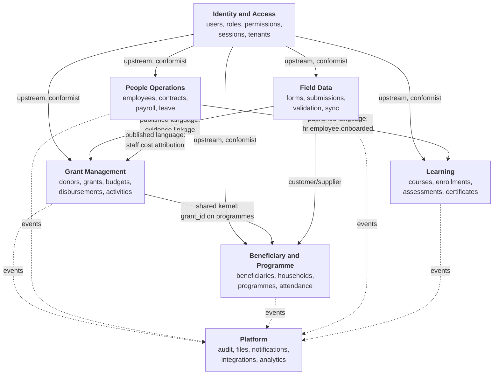
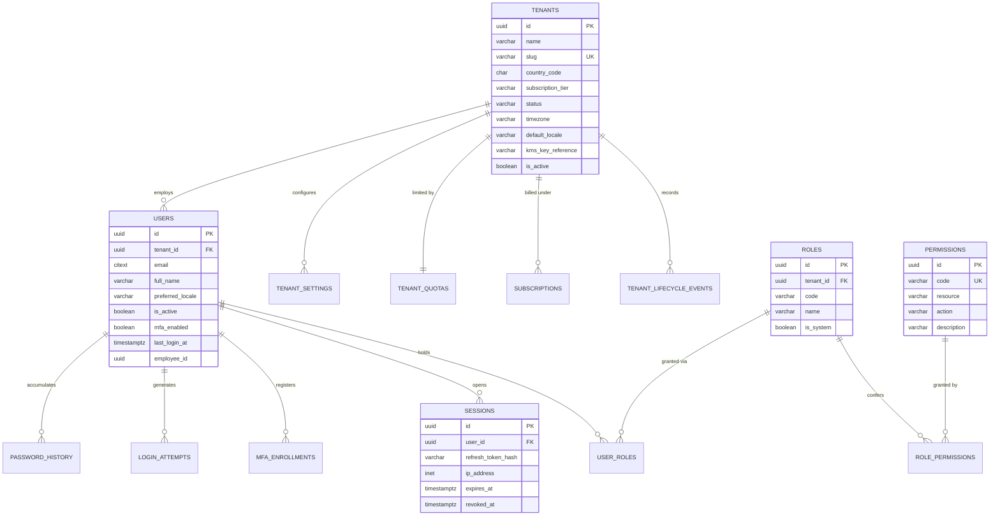
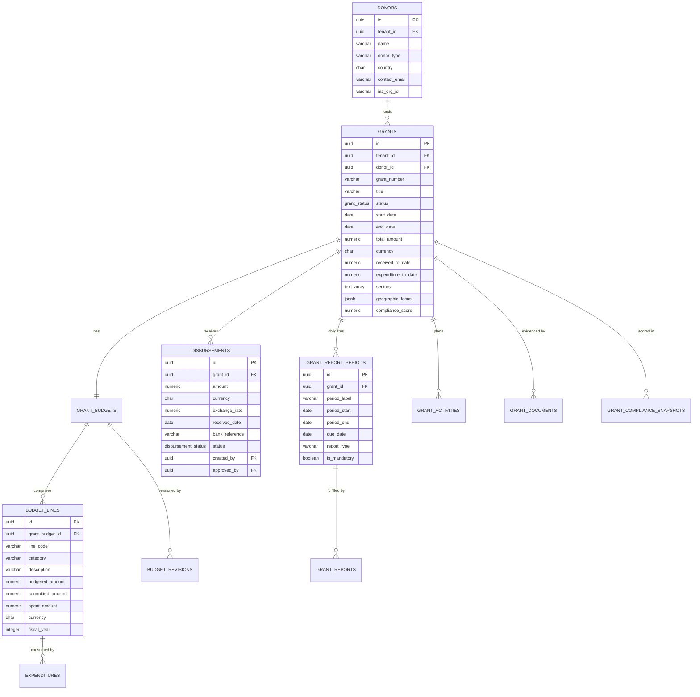
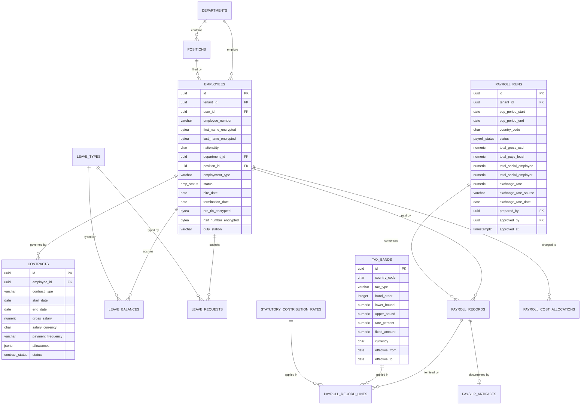
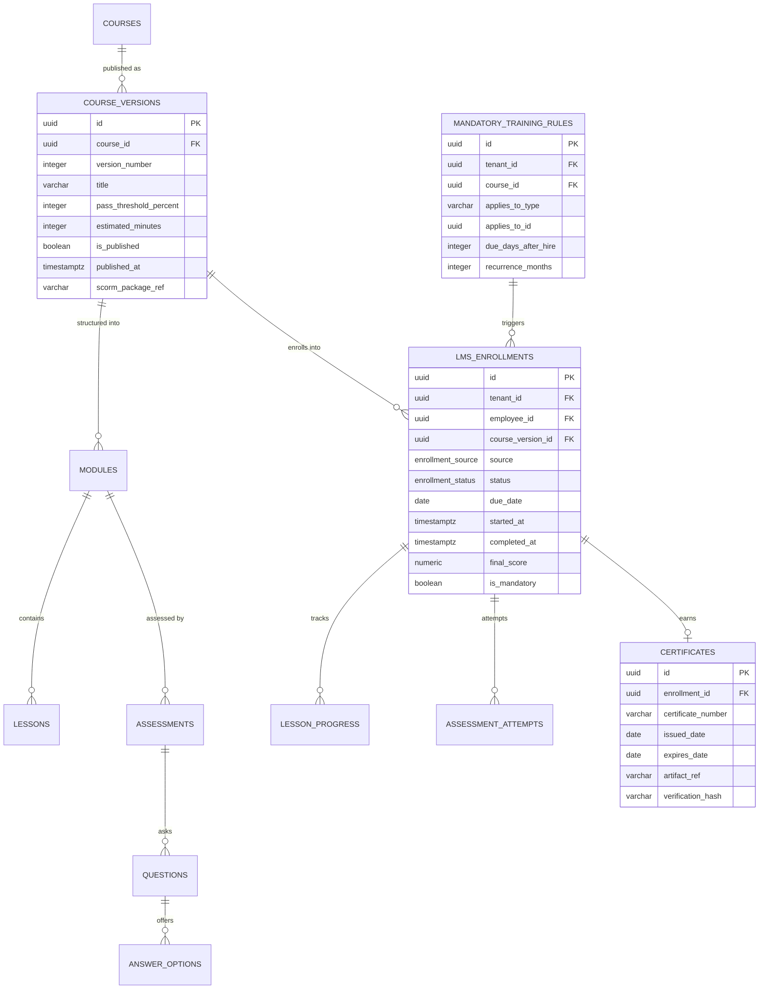
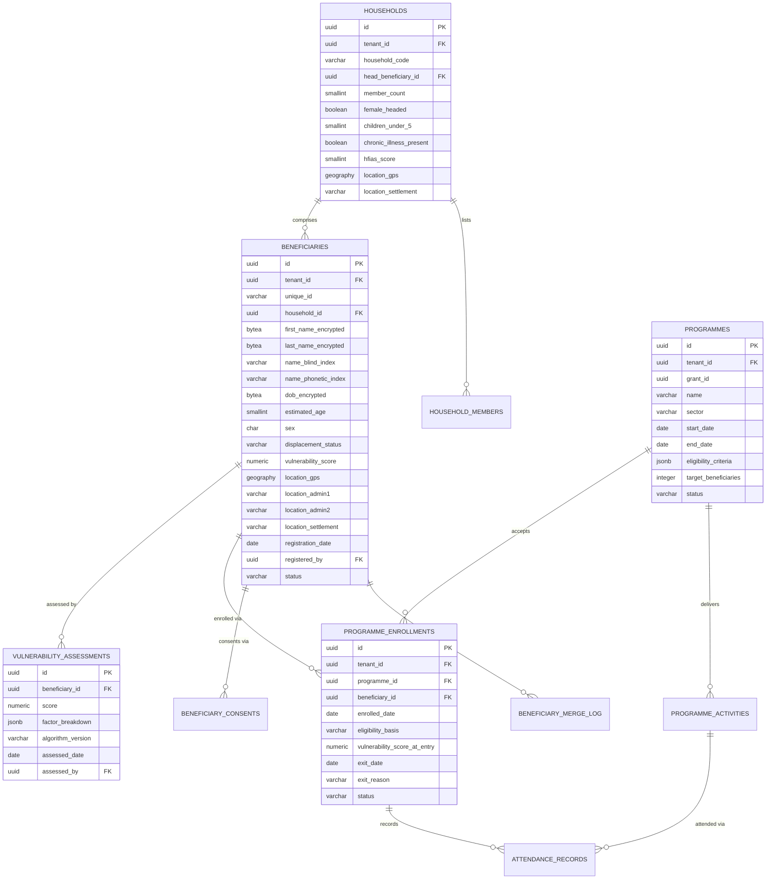
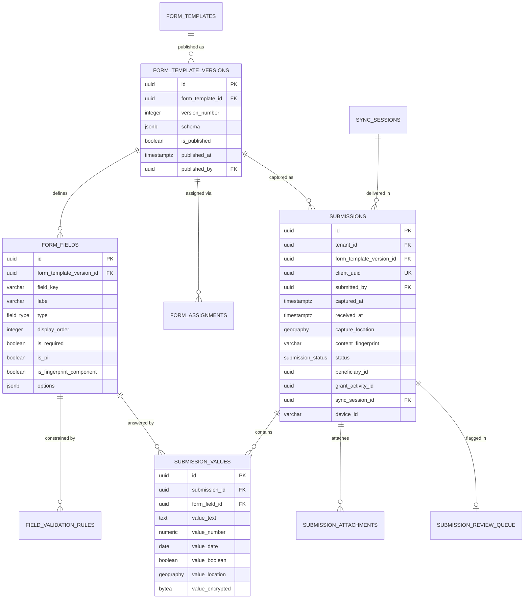
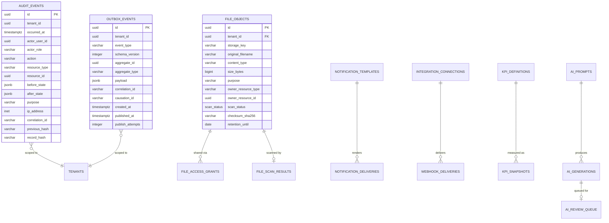
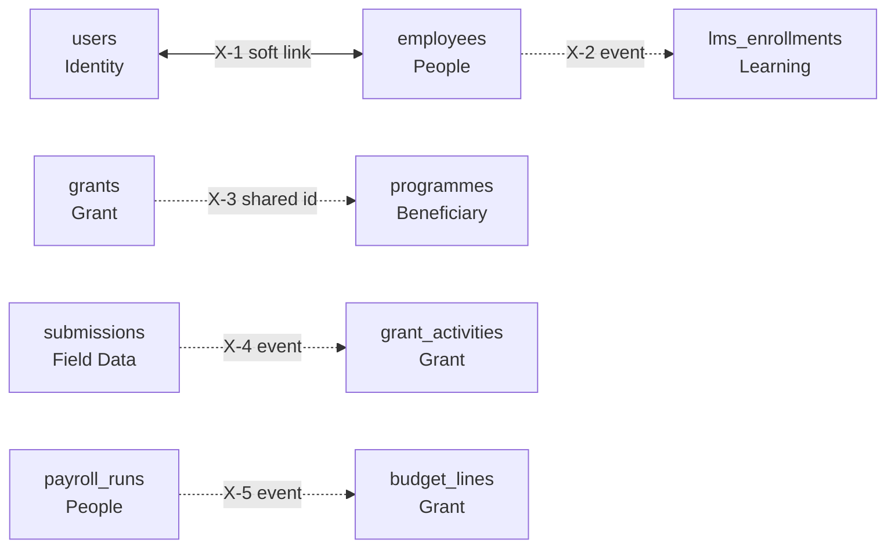

# 07 — Domain Model and Entity-Relationship Design

> **Document:** NGO Intelligence Suite — SDD v2.0
> **Chapter:** 07 — Domain Model and ERD
> **Owner:** Data Architect
> **Status:** Approved
> **Last Reviewed:** 2026-06-20
> **Related ADRs:** [ADR-0002](adr/0002-hybrid-multi-tenancy-with-rls.md), [ADR-0006](adr/0006-per-tenant-schema-for-payroll.md), [ADR-0011](adr/0011-transactional-outbox.md)

---

## 7.1 Bounded context map

Seven bounded contexts. The relationship type between each pair determines how they may integrate, and that determination is binding: a "customer/supplier" relationship means one context's model must accommodate the other's needs, while "anti-corruption layer" means the receiving side translates and never adopts the sender's terms.

| Relationship | Contexts | Meaning and constraint |
| --- | --- | --- |
| Upstream / conformist | Identity → all | Every context accepts Identity's notion of user and tenant without translation. Identity does not accommodate downstream needs; downstream conforms |
| Published language | People → Learning, People → Grant, FieldData → Grant | Integration happens through a stable, versioned event contract. Neither side reads the other's tables. The event schema is the contract and changes additively |
| Shared kernel | Grant ↔ Beneficiary | `grant_id` appears on `programmes` so burn rate can be attributed to served populations. This is the only shared identifier across these contexts and any expansion of it requires an ADR, because shared kernels are the most expensive coupling to unwind |
| Customer / supplier | FieldData → Beneficiary | FieldData is the customer: Beneficiary exposes duplicate-check and upsert operations shaped for FieldData's needs, and prioritises them |
| Event sink | All → Platform | Platform contexts consume events and never call back. This asymmetry is what keeps audit, analytics and notification off the critical path |

### 7.1.1 The `enrollment` collision

The clearest illustration of why contexts matter. Both Learning and Beneficiary have an "enrollment", and they are unrelated concepts:

| | Learning enrollment | Programme enrollment |
| --- | --- | --- |
| Subject | An employee | A beneficiary or household |
| Object | A course version | A humanitarian programme |
| Lifecycle | Assigned → started → completed → certified | Screened → enrolled → active → exited |
| Key attributes | Due date, progress percentage, attempts, pass score | Eligibility basis, entry date, exit reason, assistance received |
| Governed by | HR policy | Targeting criteria and donor rules |
| Table | `lms_enrollments` | `programme_enrollments` |

v1.0 named both `enrollments`, which would have produced either a single confused table or two tables with the same name in different schemas — the kind of ambiguity that produces a subtle reporting error two years later. The v2.0 names are explicit.

## 7.2 Ubiquitous language

Terms mean exactly one thing within a context. Where the same word appears in two contexts with different meanings, both are listed and disambiguated.

### 7.2.1 Grant Management

| Term | Definition | Not to be confused with |
| --- | --- | --- |
| Donor | An organisation providing funding | Partner, which is an implementing relationship |
| Grant | A funding award with a defined period, ceiling and set of obligations | Contract, which in this platform means an employment contract |
| Award amount | The total ceiling the donor has committed | Received to date, which is what has actually arrived |
| Disbursement | An actual receipt of funds against a grant | Expenditure, which is money spent |
| Budget line | A costed category within a grant budget | Activity, which is work performed |
| Burn rate | Expenditure as a proportion of budget, compared with elapsed time as a proportion of the grant period | Utilisation, used loosely elsewhere to mean either |
| Compliance score | A computed 0–100 indicator of obligation fulfilment | Risk score, which is forward-looking |
| Reporting period | A donor-defined window with a report obligation and deadline | Financial period, which is the organisation's own calendar |
| Activity | A planned unit of work in the grant logframe | Programme, which is the Beneficiary context's delivery vehicle |

### 7.2.2 People Operations

| Term | Definition | Not to be confused with |
| --- | --- | --- |
| Employee | A person in an employment relationship with the tenant | User, which is a system account. An employee may have no user account; a user may not be an employee |
| Contract | The employment agreement governing terms and dates | Grant, which is donor funding |
| Position | A defined role in the organisational structure | Role, which in Identity means a permission set |
| Gross | Total earnings before statutory and voluntary deductions | Basic, which excludes allowances |
| PAYE | Income tax withheld at source under the applicable national schedule | Income tax, which may include amounts settled directly by the individual |
| Payroll run | A processing instance covering a period and a population | Pay period, which is the calendar window itself |
| National staff | Locally recruited, subject to local statutory deductions | International staff, subject to a different regime |

### 7.2.3 Beneficiary and Programme

| Term | Definition | Not to be confused with |
| --- | --- | --- |
| Beneficiary | An individual receiving or eligible for assistance | Participant, used by some donors for the same concept; the platform standardises on beneficiary |
| Household | A group sharing resources and a residence, the primary targeting unit | Family, which is a kinship relation and may span households |
| Head of household | The member identified as the household's primary respondent | Registrant, who is whoever provided the information |
| Displacement status | Host community, IDP, refugee or returnee | Nationality |
| Vulnerability score | A computed 0–100 composite driving targeting priority | Need, which is broader and not fully quantifiable |
| Programme | A delivery vehicle enrolling beneficiaries, funded by one or more grants | Project, used interchangeably by donors; the platform standardises on programme |
| Programme activity | A discrete delivery event such as a distribution or session | Grant activity, which is a logframe planning unit. They may be linked but are not the same |
| Attendance | Recorded presence at a programme activity | Enrollment, which is programme membership |

### 7.2.4 Field Data

| Term | Definition |
| --- | --- |
| Form template | A named, versioned data-collection instrument |
| Form version | An immutable published state of a template. Submissions bind to a version, never to a template |
| Submission | One completed instance of a form version, captured at a time and place by a person |
| Submission value | One field's answer within a submission |
| Sync session | A single reconciliation between a client device and the server |
| Fingerprint | A content hash over identifying fields, used to detect human duplicates |
| Client UUID | A client-generated identifier used for exactly-once processing of retries |

## 7.3 Entity-relationship diagrams

The diagrams below show cardinality and the significant attributes. Complete column definitions are in [08](08-database-schema.md) and [Appendix B](appendices/b-data-dictionary.md). Every table also carries the standard columns described in [08 §8.1](08-database-schema.md), omitted here for readability.

### 7.3.1 Identity and Access

**Modelling notes.** `users.email` is `citext` with a composite unique constraint on `(tenant_id, email)`, correcting the v1.0 global unique constraint that would have prevented one person holding accounts at two tenant organisations — a real case for consultants and shared-services staff. Roles are per tenant with a `is_system` flag distinguishing the eight built-in roles from tenant-defined custom roles, which are a Phase 4 capability. The `users.employee_id` link is nullable and soft: a user need not be an employee, and an employee need not have portal access.

### 7.3.2 Grant Management

**Modelling notes.** v1.0 had `grant_reports` linked directly to grants. Splitting out `grant_report_periods` matters because the obligation exists independently of its fulfilment: an overdue report is a period with no report, which is not expressible if only submitted reports are modelled. `received_to_date` and `expenditure_to_date` are maintained denormalised values on `grants`, updated transactionally with their source rows, because the burn-rate query is on the hot path and summing all disbursements on every read does not scale. A nightly reconciliation job verifies them against the source of truth and alerts on divergence.

### 7.3.3 People Operations

**Modelling notes.** `payroll_runs` is generalised from v1.0's South-Sudan-specific column names (`total_paye_ssp`, `total_nsif_employee`) to country-neutral ones with a `country_code`, because a tenant operating in both South Sudan and Uganda runs payroll separately per country and the schema must not privilege one. Employee PII columns are `bytea` holding AES-256-GCM ciphertext; the searchable derivatives are separate blind-index columns. `payroll_cost_allocations` is new in v2.0 and implements the v1.0 cross-domain note that payroll expenditure maps to grant budget lines — without it, that relationship had nowhere to live.

### 7.3.4 Learning

**Modelling notes.** Enrollments bind to a `course_version_id`, never to a `course_id`. A learner who started version 3 finishes version 3 even if version 4 publishes mid-course, and their certificate states which version they completed — which matters when an auditor asks whether a staff member was trained on the current safeguarding policy or the previous one. `recurrence_months` on the mandatory rule supports annual refresher requirements, which most safeguarding and security policies have.

### 7.3.5 Beneficiary and Programme

**Modelling notes.** Vulnerability scores are versioned assessments rather than a single mutable column, because a targeting decision made in March must be explicable using March's score and March's algorithm, not today's. The score is also denormalised onto `beneficiaries` for query performance, and `programme_enrollments.vulnerability_score_at_entry` freezes the value that justified the enrollment. Location is modelled at four granularities — precise coordinates, admin1, admin2 and settlement — so that access control can serve coarse location to roles that should not see precise coordinates without a second query or a decryption step.

### 7.3.6 Field Data

**Modelling notes.** `submission_values` uses typed columns rather than a single text column, so range validation, aggregation and indexing work without casting. The `value_encrypted` column holds any value from a field marked `is_pii`. `captured_at` and `received_at` are both recorded and frequently differ by days — that gap is the offline model made visible in the data, and analysis that ignores it produces wrong timelines.

### 7.3.7 Platform

## 7.4 Cross-domain relationships

Five relationships cross context boundaries. Each is listed with its integration mechanism, because *how* they cross determines the coupling cost.

| # | Relationship | Mechanism | Consistency | Rationale |
| --- | --- | --- | --- | --- |
| X-1 | `users` (Identity) ↔ `employees` (People) | Soft reference in both directions, reconciled by event. `users.employee_id` and `employees.user_id` are nullable and not FK-constrained across services | Eventual, seconds | An employee may have no portal access; a user may be a donor or auditor with no employment relationship. A hard FK would force the two lifecycles to be the same, which they are not |
| X-2 | `employees` (People) → `lms_enrollments` (Learning) | Published language: `hr.employee.onboarded` and `hr.employee.terminated` events | Eventual, seconds | Learning must never block an HR operation. If Learning is down, enrollments are created when it recovers, and the nightly reconciliation job catches anything lost |
| X-3 | `grants` (Grant) → `programmes` (Beneficiary) | Shared kernel: `programmes.grant_id` holds the grant identifier, not FK-constrained across services | Eventual, referential integrity verified nightly | Burn rate must be attributable to served populations. This is the one place a cross-context identifier is accepted, and any extension of it requires an ADR |
| X-4 | `submissions` (Field Data) → `grant_activities` (Grant) | Published language: `fielddata.submission.linked` event carries the linkage | Eventual | The M&E evidence chain — a donor asking "prove this activity happened" traverses this link to reach photos, GPS and timestamps |
| X-5 | `payroll_runs` (People) → `budget_lines` (Grant) | Published language: `hr.payroll_run.approved` carries cost allocations, materialised into `payroll_cost_allocations` and reflected in `budget_lines.spent_amount` | Eventual, reconciled monthly | Staff cost is typically the largest budget line; without this, burn rate is systematically understated |

### 7.4.1 Referential integrity across services

Foreign keys do not span service boundaries. The gap is closed by three mechanisms rather than pretending it does not exist:

1. **Validation at write time.** When `programmes.grant_id` is set, `beneficiary-service` validates the grant exists via the Grant API and caches the result briefly. A non-existent grant is rejected.
2. **Nightly integrity reconciliation.** A job checks every cross-context reference for a resolvable target and reports orphans to an operational dashboard. Orphans are a bug signal, not something to auto-repair.
3. **Tombstone events.** Deleting an aggregate that other contexts reference emits a tombstone event. Consumers mark their references as dangling rather than silently rendering a broken link.

## 7.5 Aggregate boundaries and transactional scope

An aggregate is the unit of transactional consistency. Writes inside one are atomic; writes across two are eventually consistent.

| Aggregate root | Contained entities | Invariants enforced transactionally |
| --- | --- | --- |
| `Grant` | budget, budget lines, report periods, activities | Budget lines sum to the grant total; report periods fall within the grant period; status transitions are legal |
| `Disbursement` | — | Amount is positive; cumulative disbursements do not exceed the ceiling (enforced with a row lock on the grant) |
| `Employee` | contracts, leave balances | Only one active contract at a time; hire date precedes all contract start dates |
| `PayrollRun` | payroll records, record lines | Run totals equal the sum of records; a run is either fully computed or in a resumable partial state, never silently incomplete |
| `Household` | household members | `member_count` matches the actual member rows; exactly one head of household |
| `Beneficiary` | consents, vulnerability assessments | A current assessment exists; consent is present before PII is stored |
| `Submission` | submission values, attachments | Every required field of the bound form version has a value; values conform to their field types |
| `CourseVersion` | modules, lessons, assessments, questions | A published version is immutable; assessments have at least one question; pass threshold is between 1 and 100 |

**The rule that follows.** A single API request modifies exactly one aggregate. An operation that appears to need two — approving a payroll run and updating grant budget lines — is one transactional write plus an event, never a distributed transaction. There are no two-phase commits in this architecture.

## 7.6 Standard patterns applied to every entity

| Pattern | Implementation | Rationale |
| --- | --- | --- |
| Surrogate key | `uuid` generated with `gen_random_uuid()` | Client-generatable, which the offline model requires; no cross-tenant sequence leakage |
| Tenant scoping | `tenant_id uuid NOT NULL` on every tenant-owned table | RLS foundation (PRIN-03) |
| Soft delete | `is_deleted boolean` plus `deleted_at`, `deleted_by` | Audit integrity (PRIN-05); the only exception is the erasure workflow |
| Timestamps | `created_at`, `updated_at`, both `TIMESTAMPTZ`, maintained by trigger | Non-negotiable for debugging and audit |
| Attribution | `created_by`, `updated_by` referencing users | "Who changed this" answerable without joining the audit log |
| Optimistic concurrency | `version integer`, incremented by trigger, surfaced as an ETag | Prevents lost updates without pessimistic locking |
| Money | `NUMERIC(15,2)` plus a `CHAR(3)` currency, always together | Floating-point money is a defect |
| Converted money | Additionally stores rate, rate source and rate date | A converted figure without its rate is unauditable |
| Enumerations | PostgreSQL enum types for closed, stable sets; lookup tables for sets tenants may extend | Type safety where the set is fixed; flexibility where it is not |
| Encrypted PII | `bytea` ciphertext column plus separate blind-index columns for search | Searchable without decrypting the corpus |
| JSONB | Only for genuinely variable structure: form schemas, eligibility criteria, event payloads, before/after audit state | JSONB for data with a known shape is a schema-design failure deferred |
