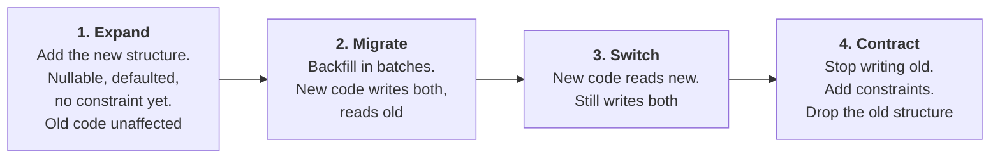
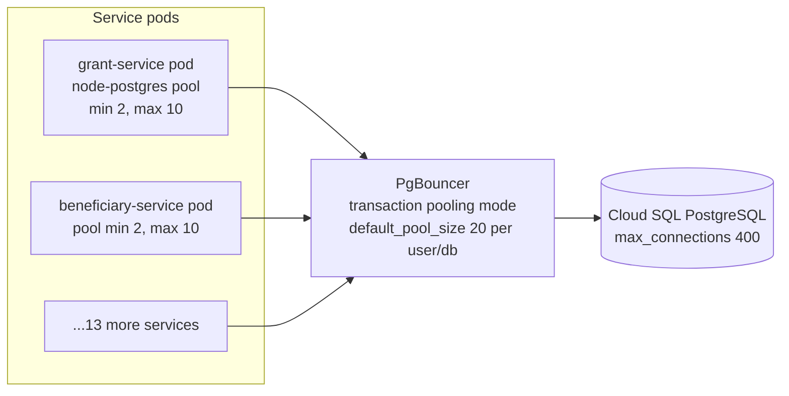

# 09 — Data Management Strategy

> **Document:** NGO Intelligence Suite — SDD v2.0
> **Chapter:** 09 — Data Management Strategy
> **Owner:** Data Architect
> **Status:** Approved
> **Last Reviewed:** 2026-06-20
> **Related ADRs:** [ADR-0002](adr/0002-hybrid-multi-tenancy-with-rls.md), [ADR-0011](adr/0011-transactional-outbox.md)

---

## 9.1 Why this chapter exists

Most production incidents in systems of this shape are not caused by application bugs. They are caused by a missing index discovered at 50,000 rows, a migration that took an exclusive lock at 09:00, a cache that returned another tenant's data, or a table that grew until its query plan flipped. This chapter specifies the decisions that prevent those.

---

## 9.2 Indexing strategy

### 9.2.1 Principles

1. **Every index is justified in writing.** An index costs write throughput, storage and vacuum time. A pull request adding one states the query it serves.
2. **Index the tenant first.** Almost every query filters by `tenant_id`. A composite index leading with `tenant_id` serves both the tenant filter and the secondary predicate; a standalone index on `tenant_id` alone is nearly useless because its selectivity is low.
3. **Partial indexes for the working set.** Most queries touch active, non-deleted rows. `WHERE NOT is_deleted` on an index can reduce its size by an order of magnitude on mature tables.
4. **Every foreign key gets an index.** Without one, deleting or updating the parent takes a sequential scan of the child while holding a lock.
5. **Covering indexes where the read is hot and narrow.** `INCLUDE` columns let an index-only scan avoid the heap.
6. **No index on a column with two distinct values** unless it is a partial index predicate.
7. **Verify, do not assume.** Every index in this chapter has a stated expected plan, and `pg_stat_user_indexes` is reviewed quarterly to remove ones that are never used.

### 9.2.2 Index catalog by access pattern

| # | Query pattern | Frequency | Index | Expected plan |
| --- | --- | --- | --- | --- |
| Q1 | Active grants for a tenant, sorted by end date | Very high | `idx_grants_expiring (tenant_id, end_date) WHERE status='active' AND NOT is_deleted` | Index scan, no sort |
| Q2 | Grant detail by id | Very high | Primary key | Index scan |
| Q3 | Grants by donor | Medium | `idx_grants_donor (donor_id)` | Index scan |
| Q4 | Grants in a sector | Low | `idx_grants_sectors GIN (sectors)` | Bitmap index scan |
| Q5 | Disbursements for a grant, newest first | High | `idx_disbursements_grant (grant_id) WHERE NOT is_deleted` | Index scan with a small sort |
| Q6 | Unreconciled disbursements | Medium, scheduled | `idx_disbursements_unreconciled` partial | Index scan on a tiny index |
| Q7 | Overdue report periods across a tenant | Medium, scheduled | `idx_report_periods_due (tenant_id, due_date)` | Index range scan |
| Q8 | Active employees in a department | High | `idx_employees_department (department_id) WHERE NOT is_deleted` | Index scan |
| Q9 | Employees eligible for a country payroll run | Monthly, heavy | `idx_employees_payroll_country (tenant_id, payroll_country) WHERE status='active'` | Index scan feeding the run |
| Q10 | Employee lookup by exact name | Medium | `idx_employees_blind_index (tenant_id, name_blind_index)` | Index scan without decryption |
| Q11 | Payroll records for a run | Monthly | `idx_payroll_records_run (payroll_run_id)` | Index scan |
| Q12 | An employee's payroll history | Medium | `idx_payroll_records_employee (employee_id, created_at DESC)` | Index scan, no sort |
| Q13 | Beneficiary exact-name duplicate check | Very high during registration | `idx_beneficiaries_blind_index (tenant_id, name_blind_index)` | Index scan |
| Q14 | Beneficiary fuzzy duplicate check | Very high during registration | `idx_beneficiaries_phonetic (tenant_id, name_phonetic_index)` | Index scan then in-memory scoring |
| Q15 | Beneficiaries within a radius | Medium | `idx_beneficiaries_location GIST (location_gps)` | Spatial index scan |
| Q16 | Highest-vulnerability beneficiaries for targeting | High | `idx_beneficiaries_vulnerability (tenant_id, vulnerability_score DESC) WHERE status='active'` | Index scan, no sort, `LIMIT` friendly |
| Q17 | Beneficiaries in a settlement | High | `idx_beneficiaries_settlement (tenant_id, location_settlement) WHERE status='active'` | Index scan |
| Q18 | Submissions by form version over a period | High | `idx_submissions_form_version (form_template_version_id, captured_at DESC)` | Index range scan |
| Q19 | Submission idempotency check on sync | Very high, burst | `submissions_client_uuid_unique (tenant_id, client_uuid)` | Unique index probe |
| Q20 | Duplicate fingerprint match | High, burst | `idx_submissions_fingerprint (tenant_id, content_fingerprint)` | Index scan |
| Q21 | Evidence for a grant activity | Medium | `idx_submissions_grant_activity (grant_activity_id)` partial | Index scan |
| Q22 | Overdue mandatory training | Daily, scheduled | `idx_lms_enrollments_overdue (tenant_id, due_date)` partial | Index scan on a small index |
| Q23 | A learner's enrollments | High | `idx_lms_enrollments_employee (employee_id, status)` | Index scan |
| Q24 | Audit trail for a resource | Medium | `idx_audit_resource (resource_type, resource_id, occurred_at DESC)` + partition pruning | Partition pruning then index scan |
| Q25 | All activity by an actor in a window | Low, investigative | `idx_audit_actor (actor_user_id, occurred_at DESC)` | Partition pruning then index scan |
| Q26 | PII access review | Monthly, compliance | `idx_audit_pii_access (tenant_id, occurred_at DESC) WHERE purpose IS NOT NULL` | Partial index scan |
| Q27 | Trace a request across services | Investigative | `idx_audit_correlation (correlation_id)` | Index scan across partitions |
| Q28 | Outbox relay poll | Every 500 ms | `idx_outbox_unpublished (created_at) WHERE published_at IS NULL` | Index scan over a tiny working set |
| Q29 | Files pending virus scan | Continuous | `idx_files_pending_scan (created_at) WHERE scan_status='pending'` | Index scan on a tiny index |
| Q30 | Files due for retention deletion | Daily | `idx_files_retention (retention_until)` partial | Index range scan |
| Q31 | Active sessions for a user | Per request on revocation check | `idx_sessions_user_active (user_id) WHERE revoked_at IS NULL` | Index scan, usually served from Redis |
| Q32 | Login attempts for lockout | Per login | `idx_login_attempts_email_time (email_attempted, attempted_at DESC)` | Index range scan |

### 9.2.3 Indexes deliberately not created

| Not indexed | Why |
| --- | --- |
| `grants.title` full text | Grant counts per tenant are in the hundreds; a sequential scan over a filtered set is faster than maintaining a text index. Revisit if a tenant exceeds 5,000 grants |
| `submission_values.value_text` | Free-text answers are not searched in the product; adding it would double the write cost of the highest-volume table |
| `beneficiaries.sex`, `displacement_status` alone | Low cardinality. They appear as secondary columns in composite indexes where they matter |
| `audit_events.after_state` GIN | Tempting for investigations, but the index would rival the table in size. Investigations use partition pruning plus a sequential scan of one month, which is acceptable for an infrequent operation |
| Any index on `created_at` alone | Always paired with `tenant_id` in practice |

### 9.2.4 Index maintenance

| Activity | Cadence | Mechanism |
| --- | --- | --- |
| Unused index review | Quarterly | `pg_stat_user_indexes` where `idx_scan = 0` and the index is older than 90 days |
| Bloat check | Monthly | Estimated bloat over 30% triggers `REINDEX CONCURRENTLY` |
| Missing index detection | Continuous | `pg_stat_statements` top queries by total time, reviewed weekly |
| Plan regression detection | On every migration | Staging plan comparison against a recorded baseline for the top 30 queries |
| `ANALYZE` after bulk load | Immediate | Part of the seeding and migration templates |

---

## 9.3 Partitioning

### 9.3.1 What is partitioned and why

Partitioning is applied only where a table is both large and naturally time-bounded in its access pattern. Applying it elsewhere adds planning overhead for nothing.

| Table | Strategy | Key | Interval | Retention | Rationale |
| --- | --- | --- | --- | --- | --- |
| `audit_events` | Range | `occurred_at` | Monthly | 84 partitions (7 years) | Largest table in the system, queries are nearly always time-bounded, and retention is a partition detach rather than a mass delete |
| `submission_values` | Range | `created_at` | Quarterly, from year 2 | Indefinite | Highest row count from field operations. Deferred until volume justifies it, because premature partitioning of an actively evolving table is costly |
| `notification_deliveries` | Range | `queued_at` | Monthly | 12 partitions | High volume, low long-term value, trivially prunable |
| `login_attempts` | Range | `attempted_at` | Monthly | 24 partitions | Security-relevant history with a bounded useful life |
| `outbox_events` | Range | `created_at` | Weekly | 4 weeks after publication | Published rows are dead weight; detaching a week is instant, deleting millions of rows is not |
| `fx_rates` | None | — | — | Indefinite | Small; a few thousand rows per year |

### 9.3.2 Partition management

```sql
-- Partitions are created ahead of need, never on demand at insert time.
-- A missing partition is an outage; creating three months ahead makes
-- the failure mode a monitoring alert instead.
CREATE TABLE audit_events_2026_07 PARTITION OF audit_events
    FOR VALUES FROM ('2026-07-01') TO ('2026-08-01');

CREATE TABLE audit_events_default PARTITION OF audit_events DEFAULT;
```

| Job | Schedule | Action | Alert condition |
| --- | --- | --- | --- |
| `create-future-partitions` | Weekly | Ensures partitions exist for the next 3 months on every partitioned table | Fewer than 2 future partitions exist |
| `detach-expired-partitions` | Monthly | Detaches partitions past retention, exports to cold storage, then drops | Detach failed, or a partition is past retention by more than 7 days |
| `default-partition-check` | Daily | Alerts if the default partition contains any rows | Any row present, which means a partition was missing when data arrived |
| `partition-size-monitor` | Daily | Reports partitions exceeding size expectations | A partition exceeds 2× the trailing median |

The default partition exists as a safety net rather than a destination. Rows landing there indicate the partition creation job failed, and the alert is treated as a Sev-3 immediately because the recovery cost grows with every hour of accumulation.

---

## 9.4 Database migrations

### 9.4.1 Tooling and structure

Migrations use `node-pg-migrate`, run as a Kubernetes Job before the deployment rollout, never from application startup. Application startup checks compatibility but does not migrate — a design point that matters because fifteen replicas racing to migrate is a known failure mode.

```
migrations/
  1719000000000_create-grants.js
  1719000100000_add-grant-compliance-score.js
  ...
```

Each migration file declares an `up`, and a `down` unless it is explicitly marked irreversible with a documented recovery path.

### 9.4.2 The expand–contract pattern

Every schema change that would break a running version of the application is split into phases, each independently deployable. This is what makes zero-downtime deployment possible with fifteen replicas of two versions running simultaneously.



Worked example — renaming `payroll_runs.total_paye_ssp` to `total_paye_local`:

| Phase | Migration | Application version | Duration |
| --- | --- | --- | --- |
| 1 Expand | `ADD COLUMN total_paye_local NUMERIC(15,2)` | v1.4 unchanged | Instant |
| 2 Migrate | Backfill in 1,000-row batches with a pause between them | v1.5 writes both columns, reads the old one | Hours, in the background |
| 3 Switch | None | v1.6 reads the new column, still writes both | One release cycle |
| 4 Contract | `SET NOT NULL` then `DROP COLUMN total_paye_ssp` | v1.7 uses only the new column | Instant |

A rename is never a single `ALTER TABLE ... RENAME COLUMN`, because that would break every replica of the previous version the instant it commits.

### 9.4.3 Lock-safety rules

PostgreSQL takes an `ACCESS EXCLUSIVE` lock for many DDL operations. On a busy table, a lock held for even a few seconds queues every subsequent query behind it, which presents as a total outage.

| Operation | Lock | Safe? | Required approach |
| --- | --- | --- | --- |
| `ADD COLUMN` with no default | `ACCESS EXCLUSIVE`, instant | Yes | Direct |
| `ADD COLUMN` with a volatile default | Full table rewrite | **No** | Add nullable, backfill in batches, then set the default |
| `ADD COLUMN` with a constant default | Metadata only in PG 11+ | Yes | Direct |
| `SET NOT NULL` | Full table scan under lock | **No** | Add a `NOT VALID` check constraint, `VALIDATE` it without a blocking lock, then `SET NOT NULL` which can use the validated constraint |
| `CREATE INDEX` | Blocks writes | **No** | `CREATE INDEX CONCURRENTLY`, outside a transaction |
| `DROP INDEX` | `ACCESS EXCLUSIVE` | Marginal | `DROP INDEX CONCURRENTLY` |
| `ADD FOREIGN KEY` | Locks both tables and scans | **No** | `ADD CONSTRAINT ... NOT VALID`, then `VALIDATE CONSTRAINT` |
| `ALTER COLUMN TYPE` | Full rewrite | **No** | Expand–contract with a new column |
| `ADD CHECK` | Full scan under lock | **No** | `NOT VALID` then `VALIDATE` |
| `ALTER TYPE ... ADD VALUE` | Brief | Yes, but cannot run in a transaction | Separate migration file |
| `DROP COLUMN` | Metadata only | Yes | Direct, but only after the contract phase |

Every migration sets `lock_timeout` so it fails fast rather than queueing traffic behind it:

```sql
SET lock_timeout = '3s';
SET statement_timeout = '300s';
```

A migration that cannot acquire its lock in 3 seconds aborts and is retried in a quieter window. This turns a potential outage into a failed job.

### 9.4.4 Migration gate in CI/CD

| Check | Blocks deploy on failure |
| --- | --- |
| Migration runs successfully against a copy of production-shaped staging data | Yes |
| Migration duration under 60 seconds, or explicitly marked as a long-running background migration | Yes |
| No unsafe operation from the table above without the required approach | Yes |
| `down` migration exists, or the migration is marked irreversible with a recovery note | Yes |
| Post-migration schema verification suite passes ([08 §8.11](08-database-schema.md)) | Yes |
| Query plans for the top 30 queries have not regressed | Yes |
| The application version being deployed is compatible with both the pre- and post-migration schema | Yes |

### 9.4.5 Rollback

Rolling back code is easy; rolling back data is not. The policy:

1. **Forward fix is the default.** A broken migration is corrected by a new migration, not by reversing.
2. **Reversal is only safe within the expand phase.** Once data has been written to a new structure, reversing loses it.
3. **A destructive migration requires a pre-migration snapshot**, verified restorable, taken immediately before, and retained for 7 days.
4. **Application rollback must work against the new schema.** This is why the expand–contract discipline exists: the previous application version must keep working after a migration, or the deployment is not rollback-safe.

---

## 9.5 Reference and seed data

| Category | Examples | Managed how | Tenant-visible |
| --- | --- | --- | --- |
| System reference | ISO country codes, currencies, IATI code lists, OECD DAC purpose codes | Versioned seed migrations, updated with the standard | Read-only |
| Statutory rules | Tax bands, contribution rates | Seed at provisioning per country; updated through the dual-authorised admin workflow | Read-only, effective-dated |
| Default catalog | Safeguarding, security, PSEA and data-protection courses; standard leave types; default notification templates | Copied into the tenant at provisioning so they can then be customised | Editable after provisioning |
| Permissions and system roles | The eight system roles and the full permission list | Seed migration; changes require an ADR and a security review | Read-only |
| Development fixtures | Synthetic tenants, users, grants, beneficiaries | Generated by a seeding script; never derived from production | N/A |

Synthetic data generation matters more than it appears. Realistic-shaped test data — name distributions that stress the deduplication algorithm, household compositions that exercise the vulnerability scoring boundaries, multi-currency grants with partial disbursements — is what makes testing meaningful. Copying production data into a lower environment is prohibited; the anonymised staging dataset is generated from production *statistics*, not production *rows*.

---

## 9.6 Data retention and archival

### 9.6.1 Retention schedule

Retention is the intersection of three obligations: what donors require, what law requires, and what data minimisation demands we not keep. Where they conflict, the longest legal obligation wins for records and the shortest wins for personal data that is not part of a record.

| Data category | Active retention | Archive | Total | Driver |
| --- | --- | --- | --- | --- |
| Audit events | 24 months hot | 60 months cold | 7 years | Donor audit requirements, 2 CFR 200 |
| Financial records: grants, disbursements, expenditures | Life of grant + 24 months | Until 7 years post-closure | 7 years post-closure | Donor and statutory audit |
| Payroll records | 24 months hot | Until 7 years | 7 years | Statutory employment and tax obligation |
| Employee records | Duration of employment | 7 years post-termination | 7 years post-termination | Employment law, pension queries |
| Beneficiary records | Duration of programme + 24 months | Aggregated only after that | Personal data deleted at 3 years post-exit unless a legal hold applies | Data minimisation; ICRC guidance |
| Beneficiary consent records | Same as the beneficiary record | — | Same | Evidence of lawful basis |
| Field submissions | Life of grant + 24 months | Aggregate retained, PII fields purged | PII purged at 3 years | Evidence obligation, then minimisation |
| Submission media | 24 months | Cold storage to grant closure + 12 months | Deleted thereafter | Storage cost and minimisation |
| LMS records and certificates | Duration of employment | 7 years post-termination | 7 years | Compliance evidence |
| Notification delivery log | 12 months | — | 12 months | Operational only |
| Login attempts | 24 months | — | 24 months | Security investigation window |
| Application logs | 30 days hot | 90 days cold | 120 days | Operational; see [24](24-observability.md) |
| AI generation log | 24 months | — | 24 months | Model governance and review |
| Backups | 35 days operational | 12 months monthly, offsite | 12 months | Recovery and ransomware resilience |
| Tenant data after offboarding | 90-day grace | — | Deleted at 90 days unless legal hold | Contract |

### 9.6.2 The retention sweep

A daily job applies the schedule. It is one of the few jobs permitted to delete data, and it is correspondingly constrained:

1. Runs in a dry-run mode first, producing a report of what would be affected.
2. Refuses to proceed if the affected row count exceeds a configured threshold, which catches a misconfigured policy before it destroys data.
3. Honours legal holds. A hold on a tenant, a grant or a beneficiary blocks deletion entirely and is visible in the report.
4. Writes an audit record for every deletion, including the policy that justified it.
5. For beneficiary data, purges identifying fields while retaining the de-identified record so historical aggregate reporting stays correct — a programme's reach in 2024 must not change because personal data was correctly deleted in 2027.

### 9.6.3 Archival

Archived data moves to a separate cold-storage bucket with its own lifecycle policy and its own KMS key. It is queryable through an export-and-load process rather than being online, which is acceptable because archive access is rare and planned. The archive index — what exists, for which tenant, covering what period — remains online so a request can be answered without restoring anything.

---

## 9.7 Connection pooling

### 9.7.1 The problem

PostgreSQL uses a process per connection. Cloud SQL on the target instance size supports roughly 400 connections. Fifteen services, each with 2–12 replicas, each with a pool of 10, would demand well over a thousand. Without pooling, the platform exhausts connections long before it exhausts CPU.

### 9.7.2 Two-layer pooling



| Layer | Setting | Value | Reason |
| --- | --- | --- | --- |
| Application | `max` | 10 per pod | Bounded so a scale-up cannot stampede |
| Application | `min` | 2 | Avoids connection setup latency on the first requests |
| Application | `idleTimeoutMillis` | 30,000 | Returns capacity during quiet periods |
| Application | `connectionTimeoutMillis` | 5,000 | Fail fast rather than queue |
| PgBouncer | `pool_mode` | `transaction` | Highest efficiency; connections are returned between transactions rather than being held per session |
| PgBouncer | `default_pool_size` | 20 per user/database | Fifteen service roles × 20 = 300, within the 400 limit with headroom |
| PgBouncer | `reserve_pool_size` | 5 | Absorbs brief spikes |
| PgBouncer | `server_idle_timeout` | 600 s | Releases backend connections |
| PostgreSQL | `max_connections` | 400 | Instance capability |
| PostgreSQL | `idle_in_transaction_session_timeout` | 30 s | Kills sessions holding locks |

### 9.7.3 Transaction pooling constraints

Transaction-mode pooling is efficient but changes the semantics of anything session-scoped. These constraints are mandatory and are enforced by review and by integration tests:

| Prohibited under transaction pooling | Why | Alternative |
| --- | --- | --- |
| `SET` without `LOCAL` | Session settings leak to the next tenant's transaction on the same backend | Always `SET LOCAL` inside the transaction |
| Server-side prepared statements across transactions | The backend may differ | Disable prepared statement caching, or use protocol-level prepare within one transaction |
| Advisory locks held across transactions | The connection is returned in between | Use a row lock, or a transaction-scoped advisory lock |
| `LISTEN` / `NOTIFY` | The listening connection is not stable | Use the event bus |
| Temporary tables spanning transactions | Dropped when the connection is returned | Use a CTE or a real table |
| Cursors held across transactions | Same | Keyset pagination |

**The critical interaction with RLS.** Because `app.current_tenant` is set with `SET LOCAL`, it is scoped to the transaction and cannot leak. Using `SET` instead of `SET LOCAL` under transaction pooling would be a cross-tenant data leak — the single most dangerous defect available in this architecture. A lint rule rejects `SET app.current_tenant` without `LOCAL`, and an integration test asserts that a connection returned to the pool has no tenant context.

---

## 9.8 Redis caching strategy

### 9.8.1 Instance separation

| Purpose | Instance | Eviction | Persistence | Rationale |
| --- | --- | --- | --- | --- |
| Cache | `redis-cache` | `allkeys-lru` | None | Losing it costs latency, not correctness |
| Queues and streams | `redis-queue` | `noeviction` | AOF, `everysec` | Losing a job or an event costs correctness |
| Rate limits and sessions | `redis-cache` | `volatile-ttl` | None | Ephemeral by nature |

Mixing cache and queue in one instance is a common and painful mistake: memory pressure from cached data evicts queued jobs. They are separate instances, not separate databases within one instance.

### 9.8.2 Key naming

```
<tenant_id>:<namespace>:<identifier>[:<qualifier>]
```

Every key includes the tenant. This is not for readability — it is the control that makes a cross-tenant cache leak structurally impossible, since a key constructed for tenant A cannot be read by a lookup constructed for tenant B. Cache key construction goes through a shared helper that takes the tenant from the request context, never from a parameter.

| Namespace | Example key | TTL | Invalidation |
| --- | --- | --- | --- |
| `burnrate` | `t_9f2a:burnrate:grant_31c8` | 15 min | On `grant.disbursement.recorded`, `grant.budget.revised`, expenditure change |
| `grantsum` | `t_9f2a:grantsum:grant_31c8` | 10 min | On any grant mutation |
| `perms` | `t_9f2a:perms:user_44b1` | 5 min | On `identity.role.assigned`, `identity.role.revoked` |
| `session` | `t_9f2a:session:sess_88c2` | Token lifetime | On logout, password change, role change |
| `revoked` | `global:revoked:sess_88c2` | Remaining token lifetime | Set on revocation, expires naturally |
| `formdef` | `t_9f2a:formdef:fv_77aa` | 24 h | On `fielddata.form.published`; form versions are immutable so this is safe |
| `kpi` | `t_9f2a:kpi:dashboard_main` | 5 min | Time-based only; the panel shows its `as of` time |
| `fx` | `global:fx:USD_SSP:2026-07-27` | 24 h | Never; the rate for a past date is immutable |
| `taxrules` | `global:taxrules:SS:2026-07` | 1 h | On `hr.statutory_rules.updated` |
| `ratelimit` | `t_9f2a:ratelimit:minute:1753600` | 2 min | Natural expiry |
| `quota` | `t_9f2a:quota:beneficiaries` | 5 min | On the relevant create event |
| `lock` | `global:lock:iati-publish` | 5 min | Released on completion |
| `dedupe` | `t_9f2a:dedupe:notif:abc123` | 1 h | Natural expiry |

### 9.8.3 What is never cached

| Never cached | Reason |
| --- | --- |
| Decrypted beneficiary or employee PII | A cache is a second copy in a less controlled store with weaker access logging |
| Payroll figures | Correctness stakes are too high for a stale read; the monthly access pattern makes caching pointless anyway |
| Anything derived from an audit query | Audit reads must be logged, and a cache hit would not be |
| Authorisation *decisions* | The permission *set* is cached for 5 minutes; the decision for a specific resource is always evaluated fresh, because resource-level rules depend on data that changes |

### 9.8.4 Patterns

**Cache-aside** is the default. Read from cache; on a miss, read the database, populate the cache, return. Writes invalidate rather than update, because an update path that computes the new cached value duplicates business logic in two places and eventually diverges.

**Stampede protection.** A cache miss on a hot key under load produces a thundering herd against the database. Two mitigations:

1. A short-lived lock per key: the first requester computes while others wait briefly for the result, with a timeout that falls through to computing.
2. Probabilistic early expiry: a value near the end of its TTL is refreshed by a random subset of readers before it actually expires, so expiry is spread rather than simultaneous.

**Negative caching.** A lookup that legitimately finds nothing caches that fact briefly. Without it, a repeated query for a non-existent record bypasses the cache every time — a trivially exploitable amplification.

**Degradation.** Every cache read is wrapped so that a Redis failure falls through to the database rather than raising. The circuit breaker on Redis opens after repeated failures and stops attempting reads entirely, avoiding adding a 5 ms timeout to every request during an outage. Cache unavailability is a latency event, never a correctness event.

---

## 9.9 Query standards

| Standard | Rationale |
| --- | --- |
| Parameterised queries only, `$1`/`$2` placeholders | SQL injection prevention. String interpolation into SQL fails review unconditionally |
| Explicit column lists, never `SELECT *` | A new column silently changes payload size and can break a consumer |
| Every unbounded query has a `LIMIT` | An unbounded read against a mature table is a latency incident waiting for a tenant to grow |
| Keyset pagination, not `OFFSET` | `OFFSET 10000` scans 10,000 rows to discard them |
| No N+1 patterns | Batch with `= ANY($1)` or a join. Detected by a query-count assertion in integration tests |
| Statement timeout on every role | A runaway query is bounded |
| Transactions as short as possible; no external calls inside one | A held transaction holds locks; an HTTP call inside one can hold them for seconds |
| Explicit lock ordering when locking multiple rows | Prevents deadlock between concurrent operations |
| `FOR UPDATE` only where a real invariant needs it | The grant ceiling check needs it; most reads do not |

Every query on the critical path has its `EXPLAIN (ANALYZE, BUFFERS)` plan recorded in the pull request that introduced it, and the top 30 queries have baseline plans that CI compares against.

---

## 9.10 Data quality

Wrong data that looks right is more dangerous in this domain than missing data, because programme decisions are made from it.

| Mechanism | Where | Catches |
| --- | --- | --- |
| Database constraints | Schema | Structurally impossible values: negative amounts, end before start, overlapping contracts |
| Application validation | Service entry | Business rules requiring context the database lacks |
| Form validation rules | Field data, client and server | Field-level errors at the point of capture, where correction is cheapest |
| Cross-field validation | Field data | Internal inconsistency, e.g. a household size that contradicts the member breakdown |
| Deduplication | Beneficiary, field data | The same person recorded twice |
| Reconciliation jobs | Nightly | Denormalised totals diverging from their source; orphaned cross-context references |
| Variance detection | Payroll, indicators | A figure that is individually valid but implausible relative to history |
| Anomaly flags | Submissions | GPS outside the operating area, capture time inconsistent with the sync pattern, values at the extremes of a distribution |
| k-anonymity suppression | Analytics | Aggregates small enough to re-identify individuals |

The nightly reconciliation suite is worth naming explicitly:

| Check | Compares | On divergence |
| --- | --- | --- |
| Grant received total | `grants.received_to_date` against the sum of approved disbursements | Alert, do not auto-correct — divergence indicates a bug worth understanding |
| Budget line spend | `budget_lines.spent_amount` against the sum of expenditures | Alert |
| Household member count | `households.member_count` against actual member rows | Alert with the specific households listed |
| Programme enrolled count | `programmes.enrolled_count` against active enrollments | Auto-correct, it is a display counter, and log |
| Cross-context references | Every `grant_id` on a programme, every `beneficiary_id` on a submission | Report orphans |
| Mandatory enrollment coverage | Active employees against expected mandatory enrollments | Create missing enrollments and alert, since the cause is a lost event |
| Audit hash chain | Each partition's chain integrity | **Sev-2 immediately.** A broken chain means either a bug or tampering |
