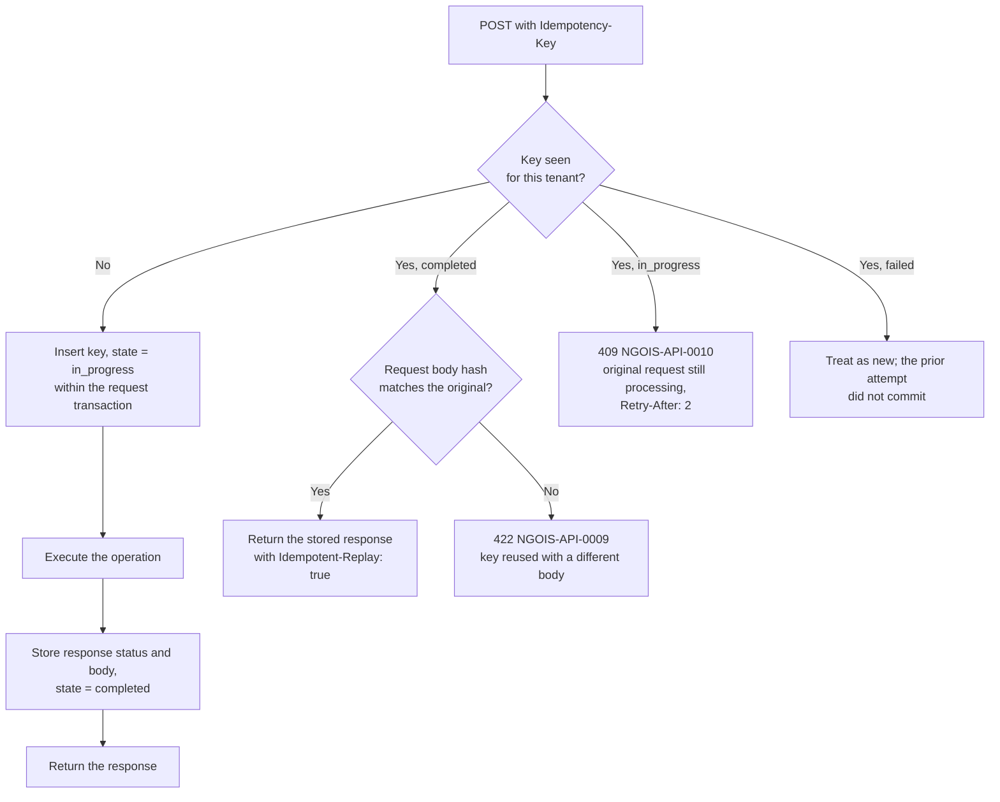
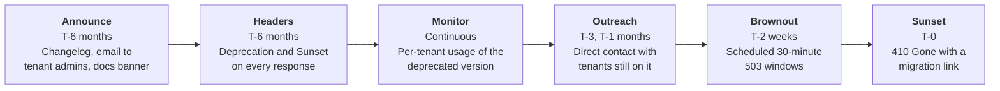

# 10 — API Design Standards

> **Document:** NGO Intelligence Suite — SDD v2.0
> **Chapter:** 10 — API Design Standards
> **Owner:** API Lead
> **Status:** Approved
> **Last Reviewed:** 2026-06-20
> **Related ADRs:** [ADR-0009](adr/0009-uri-path-api-versioning.md), [ADR-0012](adr/0012-custom-gateway-over-kong.md)

---

## 10.1 Scope and authority

This chapter is normative for every HTTP interface the platform exposes: the public API consumed by the web and field clients, the donor portal API, and any tenant-facing integration surface. The generated OpenAPI document is normative for individual request and response shapes; this chapter is normative for the rules those shapes follow. Where they disagree, this chapter wins and the OpenAPI document is wrong.

Internal service-to-service calls follow the same conventions with two exceptions noted in [§10.14](#1014-internal-apis).

---

## 10.2 RESTful conventions

### 10.2.1 URL structure

```
https://api.ngointelligence.io/v1/{service}/{resource}[/{id}[/{sub-resource}]]
```

| Element | Rule |
| --- | --- |
| Scheme | HTTPS only. HTTP receives a `301` to HTTPS and HSTS is set |
| Version | Major version in the path. See [§10.11](#1011-versioning-and-deprecation) |
| Service | The owning service's short name: `grant`, `hr`, `beneficiary`, `field-data`, `lms`, `auth`, `tenant`, `reporting`, `analytics`, `files`, `audit`, `ai` |
| Resource | Plural noun, kebab-case: `grants`, `payroll-runs`, `form-templates` |
| Identifier | UUID. Never a sequential integer, which would leak volume and enable enumeration |
| Nesting | Maximum one level. `/grants/{id}/disbursements` is fine; `/grants/{id}/disbursements/{did}/attachments/{aid}` is not — expose `/disbursement-attachments/{aid}` instead |
| Verbs in paths | Prohibited for CRUD. Permitted for genuine actions that are not resource state: `/payroll-runs/{id}/approve`, `/beneficiaries/{id}/merge` |
| Trailing slash | Not used; a request with one receives a `301` to the canonical form |
| Case | Lower kebab-case throughout |

### 10.2.2 Method semantics

| Method | Semantics | Idempotent | Safe | Request body | Success |
| --- | --- | --- | --- | --- | --- |
| `GET` | Retrieve | Yes | Yes | No | `200` |
| `POST` | Create, or invoke an action | No, unless an `Idempotency-Key` is supplied | No | Yes | `201` for creation, `200` or `202` for actions |
| `PUT` | Full replacement | Yes | No | Yes, complete | `200` |
| `PATCH` | Partial update | No | No | Yes, partial | `200` |
| `DELETE` | Soft delete | Yes | No | No | `204` |
| `HEAD` | Metadata only | Yes | Yes | No | `200` |
| `OPTIONS` | CORS preflight | Yes | Yes | No | `204` |

`PUT` is rarely used in this API. Most resources have server-managed fields, and a full replacement risks a client with a stale representation clearing fields it did not know about. `PATCH` with optimistic concurrency is the standard update path.

### 10.2.3 Action endpoints

Some operations are not a resource mutation. Approving a payroll run changes state, emits events, enforces separation of duties and requires re-authentication — modelling that as `PATCH /payroll-runs/{id} {status: "approved"}` hides all of it. Action endpoints are used where:

- The operation has preconditions beyond field validation
- It has side effects a client would not infer from a field change
- It requires distinct authorisation from a general update
- It is not idempotent in the way a field assignment is

Current action endpoints: `/payroll-runs/{id}/approve`, `/payroll-runs/{id}/reverse`, `/disbursements/{id}/approve`, `/beneficiaries/{id}/merge`, `/beneficiaries/{id}/erasure`, `/grants/{id}/close`, `/form-templates/{id}/publish`, `/courses/{id}/publish`, `/tenants/{id}/export`, `/tenants/{id}/offboard`, `/submissions/{id}/resolve`, `/reports/{id}/approve`.

---

## 10.3 Request standards

### 10.3.1 Required headers

| Header | Requirement | Notes |
| --- | --- | --- |
| `Authorization: Bearer <JWT>` | Required on all protected endpoints | |
| `Content-Type: application/json` | Required on requests with a body | `charset=utf-8` assumed |
| `Accept: application/json` | Recommended | Defaults to JSON |
| `Idempotency-Key: <uuid>` | Required on `POST` to financially significant or field-sync endpoints; optional elsewhere | See [§10.9](#109-idempotency) |
| `If-Match: <etag>` | Required on `PATCH` and `PUT` to versioned resources | See [§10.10](#1010-concurrency-control) |
| `X-Correlation-Id: <id>` | Optional | Generated if absent; always returned |
| `Accept-Language: <bcp47>` | Optional | Localises error messages and enumerated labels |

### 10.3.2 Headers the client cannot set

The gateway strips these from every inbound request before proxying. A client that supplies one is not honoured, and its presence is logged as a security event because it indicates either a misconfigured client or an attempt to forge context.

`X-Tenant-ID`, `X-User-Id`, `X-User-Role`, `X-Permissions`, `X-Internal-Service`, `X-Request-Start`, `X-Impersonated-By`

### 10.3.3 Request body rules

| Rule | Detail |
| --- | --- |
| Field naming | `snake_case`, matching the domain vocabulary and the database where they align |
| Unknown fields | Rejected with `400`, not ignored. Silently discarding a misspelled field is how a client ships a bug that looks like a server bug |
| Null vs absent | In `PATCH`, an absent field means "leave unchanged" and an explicit `null` means "clear". This distinction is honoured, not conflated |
| Empty string | Rejected where the field is a real value; use `null` |
| Dates | ISO-8601. `YYYY-MM-DD` for dates, RFC 3339 with an offset for instants |
| Money | An object: `{"amount": "15000.00", "currency": "USD"}`. Amount is a **string** to avoid IEEE-754 corruption in JavaScript clients, and is validated as a decimal |
| Enums | Lowercase snake_case strings matching the database enum values |
| Maximum body size | 1 MB, except batch sync at 10 MB |
| Maximum array length | 100 items in a single request unless the endpoint documents otherwise |
| Nesting depth | Maximum 5 levels; deeper payloads are rejected to prevent parser abuse |

The money-as-string rule is worth defending: `{"amount": 15000.10}` parsed by JavaScript becomes `15000.099999999999`, and a financial platform that introduces rounding error at the transport layer has failed before it started.

---

## 10.4 Response envelope

Every response, success or failure, uses the same envelope. Consistency here removes an entire category of client-side conditional logic.

```json
{
  "success": true,
  "data": { },
  "meta": {
    "request_id": "01J8XQ2K7M3N4P5R6S7T8V9W0X",
    "timestamp": "2026-07-27T09:14:22.481Z",
    "api_version": "1",
    "duration_ms": 42
  },
  "errors": null
}
```

| Field | Type | Present | Description |
| --- | --- | --- | --- |
| `success` | boolean | Always | `true` on 2xx, `false` otherwise |
| `data` | object, array or null | Always | The payload. `null` on error |
| `meta` | object | Always | Request metadata; pagination cursors and totals for collections |
| `errors` | array or null | Always | `null` on success; populated on failure |

### 10.4.1 Collection responses

```json
{
  "success": true,
  "data": [
    { "id": "9f2a...", "grant_number": "SSD-2026-014", "title": "..." }
  ],
  "meta": {
    "request_id": "01J8XQ...",
    "timestamp": "2026-07-27T09:14:22.481Z",
    "api_version": "1",
    "pagination": {
      "limit": 50,
      "has_more": true,
      "next_cursor": "eyJpZCI6IjlmMmEiLCJjIjoiMjAyNi0wNy0yNyJ9",
      "prev_cursor": null,
      "total_count": null
    }
  },
  "errors": null
}
```

`total_count` is `null` by default. Counting all matching rows on a large filtered table is expensive, and most clients do not need it. A client that genuinely does passes `include_total=true` and accepts the additional latency; the response then carries an exact count for result sets under 10,000 and an estimate flagged as such above that.

### 10.4.2 Error responses

```json
{
  "success": false,
  "data": null,
  "meta": {
    "request_id": "01J8XQ2K7M3N4P5R6S7T8V9W0X",
    "timestamp": "2026-07-27T09:14:22.481Z",
    "api_version": "1"
  },
  "errors": [
    {
      "code": "NGOIS-GRANT-0021",
      "field": "amount",
      "message": "Disbursement exceeds the remaining grant ceiling.",
      "detail": "Requested 250000.00 USD; 180000.00 USD remains against a ceiling of 4000000.00 USD.",
      "documentation_url": "https://docs.ngointelligence.io/errors/NGOIS-GRANT-0021"
    }
  ]
}
```

| Field | Purpose |
| --- | --- |
| `code` | Stable machine-readable identifier from [Appendix E](appendices/e-error-codes.md). Never changes once published |
| `field` | JSON pointer to the offending field where applicable; `null` for non-field errors |
| `message` | Short, human-readable, localised, safe to display to an end user |
| `detail` | Specific values that make the problem actionable. Never contains PII or internal implementation detail |
| `documentation_url` | Link to the error's documentation |

Validation failures return every error at once, not the first one. A form with four problems produces four error objects, because returning them one at a time makes the user submit five times.

### 10.4.3 Message content rules

| Rule | Bad | Good |
| --- | --- | --- |
| Say what is wrong and what to do | "Invalid input" | "End date must be after start date." |
| Include the values that matter | "Rate too old" | "Exchange rate is 9 days old; the maximum is 7. Refresh the rate or record an override reason." |
| Never leak internals | "pg error 23505 on grants_number_per_donor" | "A grant with this number already exists for this donor." |
| Never leak other tenants | "Grant belongs to tenant 4a2b" | "Grant not found." |
| Never leak PII | "Beneficiary Amal Deng already registered" | "A beneficiary with matching details may already exist. Review the suggested matches." |

---

## 10.5 HTTP status codes

| Code | Used when | Notes |
| --- | --- | --- |
| `200 OK` | Successful `GET`, `PATCH`, `PUT`, or an action returning a result | |
| `201 Created` | Resource created | `Location` header carries the new resource URL |
| `202 Accepted` | Work queued, not yet complete | Body carries a job reference and a polling URL. Used for reports, exports, bulk operations |
| `204 No Content` | Successful `DELETE` or an action with no result | No body |
| `206 Partial Content` | A batch where some items succeeded and some failed | Body carries per-item results |
| `301` / `308` | Canonicalisation | Trailing slash, HTTP to HTTPS |
| `304 Not Modified` | Conditional `GET` matched `If-None-Match` | Saves bandwidth, which matters on metered field connections |
| `400 Bad Request` | Malformed syntax, unknown field, schema violation | `errors[]` populated |
| `401 Unauthorized` | Missing, malformed or expired token | `WWW-Authenticate` header included |
| `403 Forbidden` | Valid identity, insufficient permission | Deliberately does not disclose whether the resource exists |
| `404 Not Found` | Resource does not exist **within the caller's tenant** | Cross-tenant access returns `404`, not `403`, so existence is not disclosed |
| `405 Method Not Allowed` | Method not supported on this path | `Allow` header included |
| `409 Conflict` | Uniqueness violation, or a state transition that is not legal from the current state | |
| `410 Gone` | Resource was permanently erased under a data subject right | Distinguished from `404` because "we deleted it as required" and "it never existed" are different answers |
| `412 Precondition Failed` | `If-Match` did not match the current ETag | The client must re-fetch and retry |
| `413 Payload Too Large` | Body exceeds the limit | |
| `415 Unsupported Media Type` | Wrong `Content-Type` | |
| `422 Unprocessable Entity` | Syntactically valid but violates a business rule | The distinction from `400` matters: `400` means the client sent nonsense, `422` means the client sent something sensible that the domain rejects |
| `423 Locked` | Resource is locked by a workflow, e.g. an approved payroll run | |
| `428 Precondition Required` | `If-Match` omitted on an endpoint that requires it | Prevents accidental lost updates |
| `429 Too Many Requests` | Rate limit exceeded | `Retry-After` and rate limit headers included |
| `451 Unavailable For Legal Reasons` | Access blocked by a legal hold or a data residency restriction | |
| `500 Internal Server Error` | Unexpected failure | `request_id` returned; no internal detail |
| `502` / `504` | Upstream service failure or timeout | |
| `503 Service Unavailable` | Circuit breaker open, maintenance, or capacity shedding | `Retry-After` included |

The `403` versus `404` decision is a deliberate security control. Returning `403` for a resource in another tenant confirms it exists. Every cross-tenant access attempt returns `404` and is logged as a security event.

---

## 10.6 Pagination

Cursor-based only. Offset pagination is prohibited because it degrades linearly with depth and produces duplicate or skipped rows when the underlying data changes between pages — which, in a system receiving field syncs continuously, it always does.

```
GET /v1/grant/grants?limit=50&after=eyJpZCI6IjlmMmEi...
```

| Parameter | Default | Maximum | Notes |
| --- | --- | --- | --- |
| `limit` | 25 | 100 | Values above the maximum are clamped, not rejected |
| `after` | — | — | Opaque cursor from a previous response's `next_cursor` |
| `before` | — | — | For backwards traversal |

The cursor is a base64-encoded, signed structure containing the sort key values of the boundary row. It is opaque by contract: a client that decodes and constructs one gets a `400` because the signature fails. Signing prevents a client from crafting a cursor that skips the tenant predicate.

Deep collections that clients genuinely need in full — a payroll run's records, a programme's enrollments for an export — use the asynchronous export path rather than paginating tens of thousands of rows over hundreds of requests.

---

## 10.7 Filtering, sorting and sparse responses

### 10.7.1 Filtering

```
GET /v1/grant/grants?status=active&currency=USD&end_date[lte]=2026-12-31&donor_id=9f2a...
```

| Form | Meaning | Example |
| --- | --- | --- |
| `field=value` | Equality | `status=active` |
| `field=a,b,c` | In a set | `status=active,suspended` |
| `field[gte]`, `[gt]`, `[lte]`, `[lt]` | Range | `end_date[lte]=2026-12-31` |
| `field[ne]` | Not equal | `status[ne]=draft` |
| `field[null]=true` | Is null | `approved_at[null]=true` |
| `q=` | Free-text search over designated fields | `q=education` |

Only fields explicitly declared filterable on an endpoint are accepted; an undeclared filter returns `400` rather than being ignored. This prevents a client from probing for indexed columns and from constructing a filter the query planner handles badly.

### 10.7.2 Sorting

```
GET /v1/grant/grants?sort=end_date&order=asc
GET /v1/grant/grants?sort=-end_date,title
```

Both forms are accepted. Only declared sortable fields are permitted, and every sortable field has a supporting index — a sort on an unindexed column at scale is an outage, so the constraint is structural rather than advisory. Sort is always stabilised by appending `id` so pagination cannot skip or duplicate rows with equal sort values.

### 10.7.3 Field selection and expansion

```
GET /v1/grant/grants?fields=id,grant_number,title,end_date
GET /v1/grant/grants/{id}?expand=donor,budget_summary
```

Field selection materially reduces payload size on metered field connections and is one of the concrete implementations of PRIN-02. Expansion is limited to a declared allow-list per endpoint and to one level, because arbitrary expansion is how an API acquires an unbounded query surface.

---

## 10.8 Rate limiting

### 10.8.1 Limits

| Scope | Limit | Window | Applies to |
| --- | --- | --- | --- |
| Per tenant, starter tier | 300 requests | 1 minute | All endpoints |
| Per tenant, professional | 1,000 requests | 1 minute | All endpoints |
| Per tenant, enterprise | 3,000 requests | 1 minute | All endpoints |
| Per user | 300 requests | 1 minute | Prevents one user exhausting the tenant budget |
| Per IP, unauthenticated | 20 requests | 1 minute | Login, password reset, public verification |
| Login attempts per account | 5 failures | 15 minutes | Then exponential lockout |
| Report generation | 10 requests | 1 minute | Expensive |
| Bulk sync | 60 requests | 1 minute | Per device |
| Export | 5 requests | 1 hour | Per tenant; exports are heavy and rarely urgent |
| AI generation | 20 requests | 1 hour | Per tenant, in addition to the token budget |
| Bulk beneficiary read over 100 records | 5 requests | 1 hour | A protection control as much as a performance one |

### 10.8.2 Response headers

Present on every response, not only on `429`, so a well-behaved client can pace itself before being throttled.

```
RateLimit-Limit: 1000
RateLimit-Remaining: 847
RateLimit-Reset: 43
Retry-After: 43
```

### 10.8.3 Algorithm and behaviour

A sliding-window counter in Redis, which avoids the boundary burst that a fixed window permits. Field sync endpoints use a token bucket with a burst allowance instead, because a device returning from three days offline legitimately needs to send a burst and then goes quiet — penalising exactly the behaviour the system is designed for would be self-defeating.

If Redis is unavailable, rate limiting fails open with an alert. This is a deliberate availability-over-enforcement choice for a platform whose users have no alternative, and it is recorded as an accepted risk.

---

## 10.9 Idempotency

### 10.9.1 Where it is required

| Endpoint class | `Idempotency-Key` | Why |
| --- | --- | --- |
| Disbursement creation | **Required** | A duplicate disbursement corrupts financial records |
| Payroll run creation and approval | **Required** | A duplicate run could double-pay |
| Field submission, single and batch | **Required** | Retries over unreliable connections are the normal case |
| Beneficiary registration | **Required** | A duplicate beneficiary is a targeting and protection problem |
| Attendance recording | **Required** | Duplicate distribution records misstate reach |
| Report and export requests | Optional | Duplicates are wasteful but harmless |
| All other `POST` | Optional but honoured | |

### 10.9.2 Semantics



| Property | Value |
| --- | --- |
| Key format | Client-generated UUID v4 |
| Scope | Per tenant, per endpoint |
| Retention | 24 hours |
| Body hash | SHA-256 of the canonicalised body, so key reuse with different content is caught rather than silently returning the wrong response |
| Storage | The `idempotency_keys` table, written in the same transaction as the operation — which is what makes it actually atomic rather than best-effort |
| Concurrent duplicate | Second request receives `409` with `Retry-After` rather than executing |

The critical implementation detail is that the key insert and the business operation share one transaction. An implementation that writes the key after the operation commits has a window in which a retry duplicates the operation, which is precisely the case this exists to prevent.

---

## 10.10 Concurrency control

Optimistic concurrency using ETags. Two users editing the same grant is common; silently letting the second overwrite the first is a data loss the users never learn about.

```
GET /v1/grant/grants/9f2a...
→ 200 OK
  ETag: "7"

PATCH /v1/grant/grants/9f2a...
  If-Match: "7"
→ 200 OK
  ETag: "8"

PATCH /v1/grant/grants/9f2a...
  If-Match: "7"
→ 412 Precondition Failed
```

| Rule | Detail |
| --- | --- |
| ETag source | The row's `version` column, which a trigger increments on every update |
| `If-Match` required | On `PATCH` and `PUT` for grants, budgets, employees, contracts, beneficiaries, households, programmes, form templates and courses |
| Omitted `If-Match` | `428 Precondition Required` on those resources. Silently allowing an unconditional write defeats the mechanism |
| Mismatch | `412` with the current version in the error detail, so the client can present a meaningful conflict UI |
| `If-None-Match` on `GET` | Returns `304` when unchanged, saving bandwidth |

Where a pessimistic lock is genuinely needed — the grant ceiling check during disbursement — it is a short `SELECT ... FOR UPDATE` inside the transaction, never a lock held across a user interaction.

---

## 10.11 Versioning and deprecation

### 10.11.1 Strategy

Major version in the URI path. See [ADR-0009](adr/0009-uri-path-api-versioning.md) for why this was chosen over header or media-type versioning: the deciding factor was that field clients running old code for months need a version that is visible in logs, in a URL a support engineer can paste, and in a CDN cache key.

| Change | Breaking | Version impact |
| --- | --- | --- |
| Adding an optional request field | No | None |
| Adding a response field | No | None. Clients **MUST** tolerate unknown fields |
| Adding an endpoint | No | None |
| Adding an enum value to a response | **Potentially** | Treated as breaking unless the enum is documented as open. Clients **MUST** handle unknown enum values gracefully |
| Adding an optional query parameter | No | None |
| Removing or renaming a field | Yes | New major version |
| Making an optional field required | Yes | New major version |
| Tightening validation | Yes | New major version |
| Changing a field's type or format | Yes | New major version |
| Changing a default value | Yes | New major version |
| Changing an error code for the same condition | Yes | New major version |
| Changing pagination or sort defaults | Yes | New major version |
| Removing an endpoint | Yes | New major version |
| Fixing a bug where behaviour contradicted the documentation | No | Patched in place, announced |

Adding an enum value being treated as breaking is a stricter position than many APIs take, and it is deliberate: a field client that receives `displacement_status: "stateless"` when it only knows four values must not crash or silently misclassify a person.

### 10.11.2 Deprecation process



```
Deprecation: Sat, 20 Jun 2026 00:00:00 GMT
Sunset: Sat, 20 Dec 2026 00:00:00 GMT
Link: <https://docs.ngointelligence.io/migrations/v1-to-v2>; rel="deprecation"
Warning: 299 - "This API version is deprecated and will be removed on 2026-12-20."
```

| Guarantee | Value |
| --- | --- |
| Minimum support after a new major version ships | 12 months |
| Minimum notice before sunset | 6 months |
| Maximum concurrent major versions | 2 |
| Field client grace period | An additional 3 months, because field devices update slowly and a broken field app means lost data |

The brownout is the most useful step. A tenant that has ignored six months of notices notices a 30-minute failure window, and does so while there is still time to act rather than at sunset.

---

## 10.12 Bulk and asynchronous operations

### 10.12.1 Batch requests

```http
POST /v1/field-data/submissions/batch
{
  "items": [
    { "client_uuid": "...", "idempotency_key": "...", "payload": { } }
  ]
}
```

Response `206 Partial Content` when results are mixed:

```json
{
  "success": true,
  "data": {
    "total": 47,
    "succeeded": 45,
    "failed": 1,
    "flagged": 1,
    "results": [
      { "index": 0, "client_uuid": "...", "status": 201, "id": "9f2a..." },
      { "index": 12, "client_uuid": "...", "status": 422,
        "errors": [{ "code": "NGOIS-FLD-0031", "field": "household_size",
                     "message": "Value must be between 1 and 30." }] },
      { "index": 33, "client_uuid": "...", "status": 202,
        "review_reason": "probable_duplicate" }
    ]
  }
}
```

**A batch is not a transaction.** Each item succeeds or fails independently. This is the correct semantic for the field sync case, where one malformed record from a device that has been offline for three days must not reject the other forty-six. Endpoints where all-or-nothing is genuinely required document it explicitly and are rare.

### 10.12.2 Asynchronous jobs

```http
POST /v1/reporting/reports
→ 202 Accepted
  Location: /v1/reporting/jobs/01J8XQ2K7M
  Retry-After: 5
```

```json
{
  "success": true,
  "data": {
    "job_id": "01J8XQ2K7M",
    "status": "queued",
    "progress_percent": 0,
    "estimated_completion": "2026-07-27T09:16:00Z",
    "poll_url": "/v1/reporting/jobs/01J8XQ2K7M"
  }
}
```

Job states are `queued`, `running`, `completed`, `failed` and `cancelled`. A completed job carries a result reference; a failed job carries the error that caused it. Clients may poll, or subscribe to the completion notification. Jobs and their results are retained for 7 days.

---

## 10.13 Webhooks

Tenants may register outbound webhooks for a subset of events.

| Property | Specification |
| --- | --- |
| Delivery | `POST` with the event envelope from [11](11-event-driven-architecture.md) |
| Signature | `X-NGOIS-Signature: t=<timestamp>,v1=<hmac-sha256>` over `timestamp.body` with the tenant's webhook secret |
| Replay protection | Timestamp outside a 5-minute window must be rejected by the receiver; documented in the integration guide |
| Timeout | 10 seconds |
| Retry | 5 attempts with exponential backoff over roughly 24 hours |
| Success | Any 2xx. A non-2xx or a timeout is a failure |
| Ordering | Not guaranteed. Receivers use the event timestamp and `event_id` |
| Duplicates | Possible. Receivers **MUST** deduplicate on `event_id` |
| Circuit breaking | An endpoint failing for 24 hours is disabled, and the tenant administrator is notified |
| Payload contents | Never contains beneficiary PII. Carries identifiers the receiver can resolve through the API with its own credentials |

The last row is a protection control: a webhook is an outbound push to an endpoint we do not control, and pushing personal data to it would move that data outside our access controls entirely.

---

## 10.14 Internal APIs

Service-to-service calls follow every convention above with two exceptions:

1. **Authentication is mTLS with service identity**, not a user JWT. The calling service's identity is established by its certificate; the user context travels in headers set by the gateway and is propagated unchanged.
2. **No versioning ceremony.** Internal contracts change with consumer-driven contract tests as the gate rather than a deprecation window, because both sides are deployed by us. The contract tests are what make this safe; without them this exception would be reckless.

Internal endpoints are not routed by the gateway and are unreachable from outside the mesh.

---

## 10.15 API governance

| Control | Mechanism |
| --- | --- |
| Design review | Any new endpoint or contract change is reviewed by the API Lead before implementation. A 15-minute review prevents a 12-month deprecation cycle |
| OpenAPI as build output | The specification is generated from route definitions and schemas, so it cannot drift from the implementation |
| Breaking change detection | An OpenAPI diff runs on every pull request and fails the build on a breaking change without a version bump |
| Contract tests | Consumer expectations are recorded with Pact and verified against every producer build ([23](23-testing-strategy.md)) |
| Linting | Spectral rules enforce naming, response envelopes, declared error codes, required security schemes and documented parameters |
| Error code registry | A new error code must be registered in [Appendix E](appendices/e-error-codes.md) or the build fails |
| Usage telemetry | Per-endpoint, per-version, per-tenant usage informs deprecation decisions with evidence rather than assumption |
