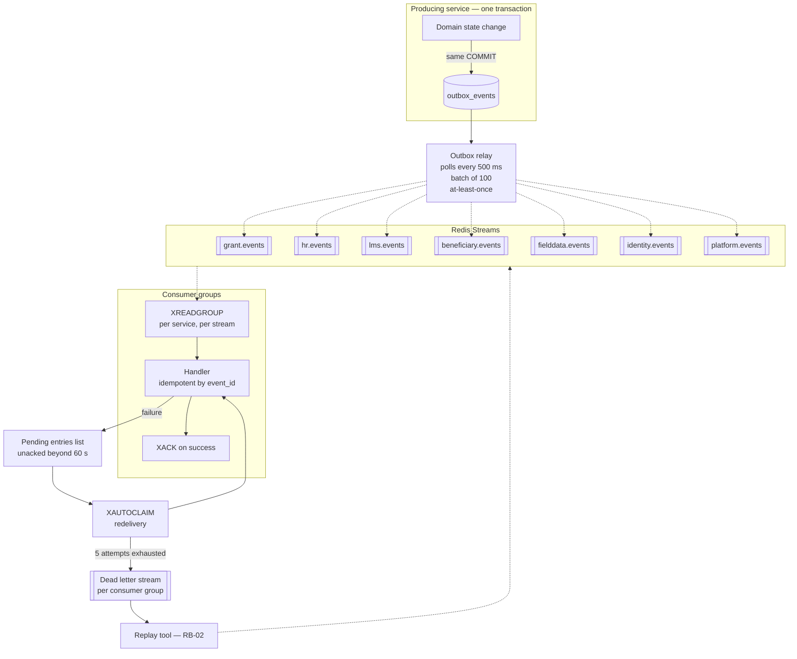
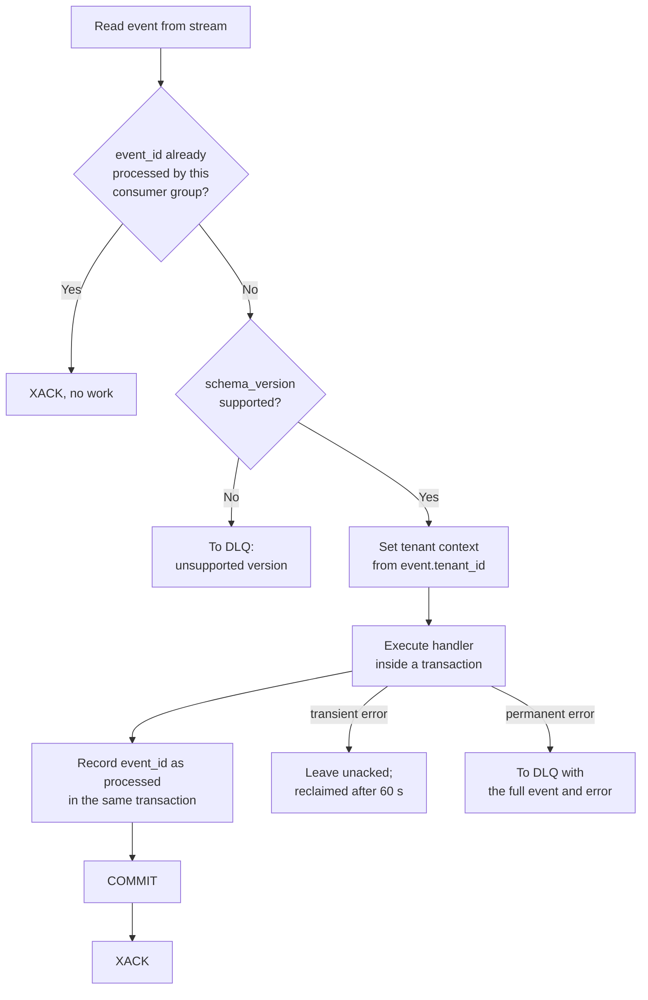
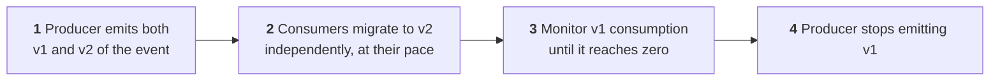
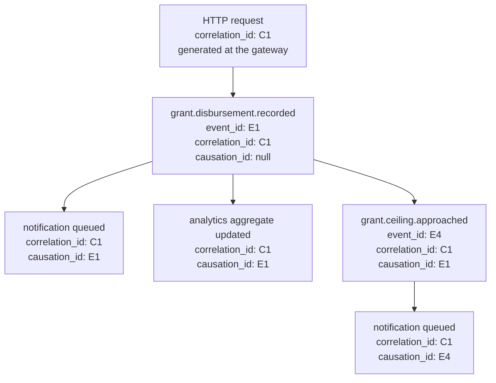

# 11 — Event-Driven Architecture

> **Document:** NGO Intelligence Suite — SDD v2.0
> **Chapter:** 11 — Event-Driven Architecture
> **Owner:** API Lead
> **Status:** Approved
> **Last Reviewed:** 2026-06-20
> **Related ADRs:** [ADR-0003](adr/0003-redis-streams-over-kafka.md), [ADR-0008](adr/0008-sync-vs-async-boundaries.md), [ADR-0011](adr/0011-transactional-outbox.md)

---

## 11.1 Why events

Three problems in this platform are naturally asynchronous, and solving them synchronously produces a fragile system:

1. **Fan-out.** Recording a disbursement must update the audit trail, notify two roles, invalidate a cache and refresh an aggregate. Doing that synchronously makes the user's write depend on four services being healthy, and makes `grant-service` know about all of them.
2. **Cross-domain workflow.** Activating an employee triggers user provisioning and induction enrollment. Those belong to other contexts and must not block or fail the HR operation.
3. **Temporal decoupling.** A consumer that is down should delay an effect, not lose it.

The rule from [ADR-0008](adr/0008-sync-vs-async-boundaries.md): **synchronous if the user is waiting on the result, asynchronous otherwise.** A user is not waiting for their audit record to be written or their colleague's email to be sent.

---

## 11.2 Topology



### 11.2.1 Stream design

One stream per bounded context rather than one per event type. Per-event streams multiply consumer connections and make ordering guarantees within a context impossible; a single global stream forces every consumer to filter everything.

| Stream | Producers | Approximate volume, 20 tenants | Max length |
| --- | --- | --- | --- |
| `grant.events` | `grant-service` | 500/day | 1,000,000 |
| `hr.events` | `hr-payroll-service` | 300/day, spiking monthly | 1,000,000 |
| `lms.events` | `lms-service` | 800/day | 1,000,000 |
| `beneficiary.events` | `beneficiary-service` | 3,000/day, campaign spikes to 50,000 | 5,000,000 |
| `fielddata.events` | `field-data-service` | 5,000/day, sync spikes to 100,000 | 5,000,000 |
| `identity.events` | `auth-service` | 2,000/day | 1,000,000 |
| `platform.events` | `tenant-service`, `file-service`, `reporting-service`, `integration-service` | 1,000/day | 1,000,000 |

Streams are capped with `XADD ... MAXLEN ~ <n>`, which trims approximately rather than exactly and is materially cheaper. Retention is therefore length-bounded, not time-bounded — an important limitation of Redis Streams that the outbox compensates for, since the outbox table is the durable record and the stream is transport.

---

## 11.3 The transactional outbox

### 11.3.1 The problem it solves

Publishing an event and committing a database change are two operations against two systems. Any ordering fails:

| Approach | Failure |
| --- | --- |
| Publish, then commit | The commit fails after publishing. Consumers act on a change that did not happen |
| Commit, then publish | The process dies between the two. The change happened and nobody hears about it |
| Two-phase commit across PostgreSQL and Redis | Not practically available, and would couple availability of both |

### 11.3.2 The solution

The event is written to the `outbox_events` table inside the same transaction as the state change. Either both commit or neither does. A separate relay process reads unpublished rows and publishes them.

```sql
BEGIN;
  INSERT INTO disbursements (...) VALUES (...);
  UPDATE grants SET received_to_date = received_to_date + $1 WHERE id = $2;
  INSERT INTO outbox_events (
      tenant_id, event_type, schema_version, aggregate_type, aggregate_id,
      payload, metadata, correlation_id, causation_id, actor_user_id
  ) VALUES (
      $3, 'grant.disbursement.recorded', 1, 'grant', $2,
      $4::jsonb, $5::jsonb, $6, $7, $8
  );
COMMIT;
```

This yields **at-least-once** delivery. Exactly-once does not exist across a process boundary; the honest engineering position is at-least-once delivery plus idempotent consumers, which is what [§11.7](#117-idempotency) specifies.

### 11.3.3 The relay

| Property | Value |
| --- | --- |
| Deployment | A goroutine-equivalent worker inside each producing service, not a separate deployment |
| Poll interval | 500 ms |
| Batch size | 100 rows, ordered by `created_at` |
| Concurrency control | `SELECT ... FOR UPDATE SKIP LOCKED`, so multiple replicas relay in parallel without duplicating or blocking |
| On publish success | `published_at` set |
| On publish failure | `publish_attempts` incremented, error recorded, exponential backoff before retry |
| Alert | Relay lag over 60 seconds, or any row with `publish_attempts > 10` |
| Cleanup | Published rows older than 7 days are dropped with the weekly partition |

`SKIP LOCKED` is the detail that makes this work with multiple replicas. Without it, replicas contend on the same rows and the relay throughput collapses to single-threaded.

---

## 11.4 Event envelope

Every event, on every stream, has this structure. A consumer can parse any event without knowing its type.

```json
{
  "event_id": "01J8XQ2K7M3N4P5R6S7T8V9W0X",
  "event_type": "grant.disbursement.recorded",
  "schema_version": 1,
  "occurred_at": "2026-07-27T09:14:22.481Z",
  "published_at": "2026-07-27T09:14:22.983Z",
  "tenant_id": "9f2a8b1c-4d5e-6f70-8a9b-0c1d2e3f4a5b",
  "aggregate": {
    "type": "grant",
    "id": "31c8d9e0-1f2a-3b4c-5d6e-7f8091a2b3c4"
  },
  "actor": {
    "type": "user",
    "id": "44b1c2d3-...",
    "role": "finance_manager"
  },
  "correlation_id": "01J8XQ2K7M3N4P5R6S7T8V9W0X",
  "causation_id": null,
  "source_service": "grant-service",
  "payload": { },
  "metadata": {
    "api_version": "1",
    "ip_address": "41.223.x.x",
    "idempotency_key": "..."
  }
}
```

| Field | Required | Purpose |
| --- | --- | --- |
| `event_id` | Yes | ULID. Unique, sortable by creation time, and the deduplication key for consumers |
| `event_type` | Yes | `<context>.<entity>.<past-tense-verb>` |
| `schema_version` | Yes | Integer, incremented only on a breaking payload change |
| `occurred_at` | Yes | When the change happened in the domain, not when it was published |
| `published_at` | Yes | When it reached the bus. The gap reveals relay lag |
| `tenant_id` | Yes | Every consumer sets its tenant context from this before touching the database |
| `aggregate` | Yes | Type and identifier of the thing that changed |
| `actor` | Yes | Who caused it. `type` is `user`, `service` or `system` |
| `correlation_id` | Yes | Constant across an entire causal chain. This is what makes distributed debugging tractable |
| `causation_id` | No | The `event_id` that directly caused this one. Null for the first event in a chain |
| `source_service` | Yes | Producer |
| `payload` | Yes | Type-specific, defined per event |
| `metadata` | No | Non-domain context |

### 11.4.1 Naming convention

```
<bounded-context>.<entity>.<past-tense-verb>
```

Past tense is not stylistic. `grant.disbursement.recorded` states a fact that already happened and cannot be refused. `grant.record_disbursement` would be a command — a request that something happen, which a consumer could reject. Commands and events have different semantics, and this system publishes only events. Every consumer is free to ignore an event; no consumer can veto it.

> **Change from v1.0.** v1.0 used `grant.disbursement_received` and `employee.onboarded`. The v2.0 forms are `grant.disbursement.recorded` and `hr.employee.onboarded`: three segments, mandatory context prefix, dot-separated.

### 11.4.2 Payload rules

| Rule | Reason |
| --- | --- |
| Include the data a consumer needs to act without calling back | A consumer that must call the producer to understand an event has reintroduced synchronous coupling |
| **Never** include beneficiary or employee PII | The bus is a copy of data in a store with different access controls and no purpose logging. Events carry identifiers; a consumer that needs the data fetches it with its own authorisation |
| Include the previous value for fields whose change matters | `audit-service` needs before and after, and reconstructing "before" from a separate query is racy |
| Keep payloads under 64 KB | Larger payloads suggest the event is carrying data that belongs in a store |
| Additive changes only within a schema version | See [§11.9](#119-schema-versioning) |

The PII exclusion has a specific consequence worth stating: `audit-service` records before and after state for beneficiary changes, and those states contain PII. The event therefore carries the *encrypted* field values, and `audit-service` stores them still encrypted. The audit trail proves a change occurred and can be decrypted under the same controls as the source record, without the bus ever holding plaintext.

---

## 11.5 Event catalog summary

The complete catalog with full payload schemas is [Appendix D](appendices/d-event-catalog.md). This is the publisher and subscriber matrix.

| Event | Producer | Consumers |
| --- | --- | --- |
| `identity.user.created` | auth | audit, notification, hr |
| `identity.user.invited` | auth | audit, notification |
| `identity.user.activated` | auth | audit, analytics |
| `identity.user.suspended` | auth | audit, notification |
| `identity.user.deleted` | auth | audit, hr, lms |
| `identity.role.assigned` | auth | audit, notification |
| `identity.role.revoked` | auth | audit, notification |
| `identity.login.succeeded` | auth | audit, analytics |
| `identity.login.failed` | auth | audit |
| `identity.mfa.enrolled` | auth | audit |
| `identity.session.revoked` | auth | audit |
| `identity.breakglass.granted` | auth | audit, notification |
| `tenant.provisioned` | tenant | audit, auth, hr, lms, notification |
| `tenant.settings.updated` | tenant | audit, notification |
| `tenant.quota.warning` | tenant | notification |
| `tenant.quota.exceeded` | tenant | audit, notification |
| `tenant.suspended` | tenant | audit, auth, notification |
| `tenant.reactivated` | tenant | audit, auth, notification |
| `tenant.config.updated` | tenant | audit, all services |
| `tenant.offboarding.started` | tenant | audit, all domain services |
| `tenant.data.exported` | tenant | audit, notification |
| `tenant.personal_data_deleted` | tenant | audit, beneficiary, field-data, file, lms |
| `tenant.deleted` | tenant | audit |
| `grant.created` | grant | audit, analytics, integration |
| `grant.updated` | grant | audit, analytics |
| `grant.status.changed` | grant | audit, analytics, notification, beneficiary |
| `grant.budget.revised` | grant | audit, analytics, notification |
| `grant.disbursement.recorded` | grant | audit, notification, analytics |
| `grant.disbursement.approved` | grant | audit, notification, analytics |
| `grant.ceiling.approached` | grant | notification, analytics |
| `grant.report.submitted` | grant | audit, analytics, notification |
| `grant.report.overdue` | grant | notification, analytics |
| `grant.expiring.soon` | grant | notification, analytics |
| `grant.compliance.recalculated` | grant | analytics |
| `grant.activity.created` | grant | field-data, analytics |
| `grant.closed` | grant | audit, notification, analytics, beneficiary |
| `hr.employee.created` | hr | audit |
| `hr.employee.onboarded` | hr | audit, auth, lms, notification, analytics |
| `hr.employee.status.changed` | hr | audit, lms, analytics |
| `hr.employee.terminated` | hr | audit, **auth (urgent)**, lms, notification |
| `hr.contract.created` | hr | audit, notification |
| `hr.contract.expiring` | hr | notification |
| `hr.leave.requested` | hr | notification |
| `hr.leave.approved` | hr | audit, notification, analytics |
| `hr.leave.rejected` | hr | notification |
| `hr.payroll_run.created` | hr | audit |
| `hr.payroll_run.submitted` | hr | audit, notification |
| `hr.payroll_run.approved` | hr | audit, reporting, grant, analytics, notification |
| `hr.payroll_run.reversed` | hr | audit, reporting, grant, notification |
| `hr.statutory_rules.updated` | hr | audit, notification |
| `lms.course.published` | lms | audit, notification |
| `lms.enrollment.created` | lms | audit, notification |
| `lms.enrollment.started` | lms | analytics |
| `lms.enrollment.completed` | lms | audit, hr, reporting, analytics |
| `lms.enrollment.overdue` | lms | notification, analytics |
| `lms.assessment.passed` | lms | analytics |
| `lms.assessment.failed` | lms | analytics |
| `lms.certificate.issued` | lms | audit, notification, reporting |
| `beneficiary.registered` | beneficiary | audit, analytics |
| `beneficiary.updated` | beneficiary | audit, analytics |
| `beneficiary.merged` | beneficiary | audit, field-data, analytics |
| `beneficiary.erased` | beneficiary | audit, field-data, file, analytics |
| `beneficiary.duplicate.flagged` | beneficiary | notification |
| `beneficiary.vulnerability.recalculated` | beneficiary | analytics |
| `beneficiary.pii.accessed` | beneficiary | audit |
| `programme.enrollment.created` | beneficiary | audit, analytics |
| `programme.enrollment.exited` | beneficiary | audit, analytics |
| `programme.attendance.recorded` | beneficiary | audit, analytics, grant |
| `fielddata.form.published` | field-data | audit, notification |
| `fielddata.submission.received` | field-data | analytics |
| `fielddata.submission.accepted` | field-data | audit, beneficiary, analytics |
| `fielddata.submission.rejected` | field-data | notification, analytics |
| `fielddata.submission.flagged` | field-data | notification |
| `fielddata.submission.linked` | field-data | grant, analytics |
| `fielddata.sync.completed` | field-data | analytics |
| `fielddata.sync.conflict` | field-data | notification |
| `platform.file.uploaded` | file | audit |
| `platform.file.scan.failed` | file | audit, notification |
| `platform.report.completed` | reporting | notification |
| `platform.payslip.generated` | reporting | notification |
| `platform.export.completed` | reporting | audit, notification |
| `platform.integration.failed` | integration | notification |
| `platform.flag.changed` | tenant | audit, all services |
| `platform.day.rolled` | platform scheduler | grant, lms, hr, beneficiary |
| `platform.fx.updated` | platform scheduler | grant, hr, analytics |
| `platform.iati.published` | integration | audit, grant, notification |
| `platform.retention.applied` | platform scheduler | audit |
| `platform.reconciliation.completed` | platform scheduler | audit, notification |
| `platform.audit.verified` | platform scheduler | audit, notification |

`audit-service` and `analytics-service` additionally subscribe to every stream wholesale, so the matrix above lists them only where they take a specific action beyond recording.

---

## 11.6 Consumption

### 11.6.1 Consumer groups

```
XGROUP CREATE grant.events audit-service $ MKSTREAM
XREADGROUP GROUP audit-service consumer-pod-a COUNT 50 BLOCK 2000 STREAMS grant.events >
```

| Property | Value |
| --- | --- |
| Group name | The consuming service name. One group per service per stream |
| Consumer name | The pod name, so scaling adds consumers within the same group |
| Read batch | 50 messages |
| Block | 2,000 ms, then loop |
| Acknowledgement | `XACK` only after the handler has committed its own transaction |
| Pending reclaim | `XAUTOCLAIM` for entries pending beyond 60 seconds, so a crashed pod's work is picked up |
| Parallelism within a group | Per-consumer, with ordering guaranteed only per aggregate (see below) |

### 11.6.2 Handler contract

Every consumer follows this shape, provided by the shared template:



The processed-event record and the handler's work share a transaction. This is the same pattern as the outbox, applied on the consuming side, and it is what turns at-least-once delivery into effectively-once processing.

### 11.6.3 Ordering

Redis Streams guarantees order within a stream for a single consumer. With multiple consumers in a group, messages are distributed and global ordering is lost.

| Requirement | Mechanism |
| --- | --- |
| Ordering per aggregate | Handlers are written to be order-insensitive wherever possible. Where they cannot be, the handler checks the aggregate's current version and discards an event describing an older state |
| Strict ordering where genuinely required | `audit-service` uses a single consumer per stream, accepting lower throughput, because the audit hash chain requires strict order |
| Everything else | Order-insensitive by design. This is a constraint on handler authors, checked in review |

An example of an order-insensitive handler: `analytics-service` receiving `beneficiary.updated` recomputes the aggregate from current state rather than applying a delta, so processing two updates out of order still converges correctly.

---

## 11.7 Idempotency

At-least-once delivery means every handler will, eventually, see the same event twice. Handlers that are not idempotent produce duplicate notifications, double-counted aggregates and corrupted audit trails.

| Strategy | Where used | Mechanism |
| --- | --- | --- |
| Processed-event table | Default, all consumers | `(consumer_group, event_id)` unique. Insert in the handler's transaction; a conflict means already processed |
| Natural idempotency | Preferred where achievable | `UPDATE ... SET status = 'active'` is naturally idempotent; `UPDATE ... SET count = count + 1` is not |
| Upsert | Analytics aggregates | `INSERT ... ON CONFLICT DO UPDATE` with recomputation rather than increment |
| Deduplication key | Notifications | `(tenant_id, dedupe_key)` unique on the delivery table, so a duplicate event produces at most one message |
| Version check | State transitions | Discard an event whose aggregate version is older than current state |

```sql
CREATE TABLE processed_events (
    consumer_group VARCHAR(50) NOT NULL,
    event_id       VARCHAR(40) NOT NULL,
    processed_at   TIMESTAMPTZ NOT NULL DEFAULT NOW(),
    PRIMARY KEY (consumer_group, event_id)
) PARTITION BY RANGE (processed_at);
```

Partitioned by time and retained 30 days — well beyond any plausible redelivery window, and cheap to prune.

---

## 11.8 Retry, backoff and dead letters

### 11.8.1 Error classification

The handler decides which of three categories a failure falls into, and the categories behave differently. Getting this wrong is the most common cause of both stuck queues and lost work.

| Class | Examples | Behaviour |
| --- | --- | --- |
| **Transient** | Database connection lost, deadlock, downstream timeout, Redis blip | Retry with backoff. These succeed on retry |
| **Permanent** | Schema validation failure, unsupported version, referenced aggregate does not exist, business rule permanently violated | Straight to DLQ. Retrying is pure waste and delays every subsequent message |
| **Poison** | Handler throws an unexpected exception repeatedly | Retry the configured number of times, then DLQ. The repetition itself is the signal |

### 11.8.2 Retry schedule

| Attempt | Delay | Cumulative |
| --- | --- | --- |
| 1 | Immediate | 0 |
| 2 | 1 s ± jitter | ~1 s |
| 3 | 5 s ± jitter | ~6 s |
| 4 | 25 s ± jitter | ~31 s |
| 5 | 125 s ± jitter | ~2.6 min |
| 6 | — | To DLQ |

Jitter is ±20%, applied to prevent a downstream recovery from being immediately re-flattened by every retrying consumer arriving simultaneously.

Two consumers override the default because their failure economics differ:

| Consumer | Attempts | Rationale |
| --- | --- | --- |
| `audit-service` | 10, up to ~1 hour | Losing an audit record is a compliance failure. It is worth trying much harder |
| `notification-service` | 5, but permanent provider rejections do not retry | A `550 mailbox does not exist` will never succeed; retrying it 5 times damages sender reputation |

### 11.8.3 Dead letter queues

One DLQ stream per consumer group, named `dlq.<consumer-group>.<source-stream>`.

```json
{
  "original_event": { },
  "consumer_group": "notification-service",
  "source_stream": "grant.events",
  "failure_reason": "permanent",
  "error_code": "NGOIS-NOTIF-0044",
  "error_message": "Template 'grant_disbursement_v2' not found for locale 'ar-SS'",
  "stack_trace": "...",
  "attempts": 1,
  "first_failed_at": "2026-07-27T09:14:23.100Z",
  "last_failed_at": "2026-07-27T09:14:23.100Z",
  "dead_lettered_at": "2026-07-27T09:14:23.150Z"
}
```

| Property | Value |
| --- | --- |
| Retention | 30 days |
| Alerting | Any message in a DLQ raises a Sev-3. More than 10 in an hour, or any message in the `audit-service` DLQ, raises a Sev-2 |
| Ownership | The consuming service's squad owns its DLQ |
| Resolution SLA | Triaged within one business day; empty within five |
| Replay | Operator tooling, [RB-02](runbooks/rb-02-dlq-drain-and-replay.md) |

A non-empty DLQ is never normal. Treating one as an acceptable steady state is how organisations discover, months later, that a class of events has silently not been processed.

### 11.8.4 Replay

```bash
ngois-events replay \
  --dlq dlq.notification-service.grant.events \
  --filter "error_code=NGOIS-NOTIF-0044" \
  --since 2026-07-27T00:00:00Z \
  --dry-run
```

Replay is dry-run by default, requires an operator to confirm the affected count, and preserves the original `event_id` so consumer idempotency prevents double-processing of anything that partially succeeded. Every replay is audited with the operator, the filter and the count.

---

## 11.9 Schema versioning

### 11.9.1 Compatibility rules

| Change | Compatible | Version bump |
| --- | --- | --- |
| Add an optional payload field | Yes | No |
| Add a new event type | Yes | No |
| Remove a field | No | Yes |
| Rename a field | No | Yes |
| Change a field's type | No | Yes |
| Make an optional field required | No | Yes |
| Change the meaning of a field while keeping its name and type | **No — and this is the dangerous one** | Yes. A semantic change with no structural change passes every automated check and breaks every consumer silently. Reviewers are specifically asked to look for it |
| Add an enum value | Conditionally | No, provided consumers are documented as required to tolerate unknown values |

### 11.9.2 Migration process



Dual publication is the cost of independent deployability, and it is cheap: an extra row in the outbox. The alternative — coordinating a simultaneous deployment of a producer and four consumers — is exactly the distributed monolith [ADR-0001](adr/0001-microservices-over-modular-monolith.md) exists to avoid.

Consumers declare which schema versions they support. An event whose version is unsupported goes to the DLQ rather than being silently dropped, so a missed migration is visible.

---

## 11.10 Correlation and causation



| Field | Semantics |
| --- | --- |
| `correlation_id` | Constant for an entire causal chain. Generated at the gateway from the HTTP request, or by the scheduler for a scheduled job. Propagated unchanged through every event, log line, trace span and downstream call |
| `causation_id` | The immediate parent's `event_id`. Reconstructs the exact tree, not just the set |

This is what makes distributed debugging possible. `correlation_id=C1` in Loki returns every log line from every service involved in one user action, in order, across synchronous and asynchronous hops. Without it, diagnosing a failure in a five-service chain means correlating timestamps by hand.

The correlation ID is also returned to the client as `request_id`, so a user reporting a problem can quote a value that resolves the entire trace.

---

## 11.11 Scheduled events

Some work is time-triggered rather than change-triggered. It enters the same event system so it inherits the same retry, DLQ and observability behaviour.

| Job | Schedule | Emits | Purpose |
| --- | --- | --- | --- |
| `day-roll` | 00:05 tenant local time | `platform.day.rolled` | Fans out to daily domain work |
| `grant-expiry-scan` | Daily | `grant.expiring.soon` | 90/60/30/7-day horizons |
| `report-overdue-scan` | Daily | `grant.report.overdue` | Missed reporting periods |
| `compliance-recompute` | Nightly | `grant.compliance.recalculated` | Refresh scores |
| `training-overdue-scan` | Daily | `lms.enrollment.overdue` | Mandatory training escalation |
| `contract-expiry-scan` | Daily | `hr.contract.expiring` | 90/60/30-day notice |
| `fx-rate-ingest` | Daily, 06:00 UTC | `platform.fx.updated` | Central bank rates |
| `iati-publish` | Weekly | `platform.iati.published` | Registry publication |
| `retention-sweep` | Daily | `platform.retention.applied` | Retention policy enforcement |
| `reconciliation-suite` | Nightly | `platform.reconciliation.completed` | Data quality checks ([09 §9.10](09-data-management-strategy.md)) |
| `partition-maintenance` | Weekly | — | Create and detach partitions |
| `audit-chain-verify` | Nightly | `platform.audit.verified` | Hash chain integrity |

Scheduled jobs hold a distributed lock so exactly one instance runs each, and each records its last successful run. A job that has not succeeded within 1.5× its interval alerts — the failure mode of a silent scheduler is worse than a loud one, because nobody notices that nothing happened.

---

## 11.12 Observability of the event system

| Metric | Type | Alert |
| --- | --- | --- |
| `outbox_unpublished_rows` | Gauge, per service | Over 1,000, or oldest row over 60 s |
| `outbox_relay_lag_seconds` | Histogram | p99 over 5 s |
| `event_published_total` | Counter, by type | Sudden drop to zero for a normally active type |
| `event_consumed_total` | Counter, by group and type | — |
| `event_processing_duration_seconds` | Histogram, by group and type | p95 over 1 s |
| `consumer_lag_messages` | Gauge, by group and stream | Over 1,000, or growing for 5 minutes |
| `consumer_pending_entries` | Gauge, by group | Over 100 |
| `event_retry_total` | Counter, by group and reason | Rate increase over baseline |
| `dlq_depth` | Gauge, by DLQ | Over 0 warns; over 10 pages |
| `event_end_to_end_latency_seconds` | Histogram | p95 over 5 s, which is the stated eventual consistency target |
| `scheduled_job_last_success_timestamp` | Gauge, by job | Older than 1.5× the interval |

The dashboard that matters most during an incident shows consumer lag per group over time. A single lagging consumer is a service problem; every consumer lagging simultaneously is a Redis problem, and the distinction determines which runbook to open.

---

## 11.13 Testing events

| Test type | What it verifies |
| --- | --- |
| Unit | Handler logic given a constructed event, including the duplicate-delivery case |
| Contract | Producer output validates against the registered schema; consumer expectations are satisfied by the producer ([23](23-testing-strategy.md)) |
| Integration | End-to-end through a real Redis: state change, outbox write, relay, consumption, effect |
| Idempotency | Every handler is invoked twice with the same event; the second invocation must produce no additional effect. This is a required test, not an optional one |
| Ordering | Handlers are invoked with events out of order; the final state must be correct |
| Failure | Handler throws; the event must reach the DLQ with full context and must not be acknowledged |
| Replay | A DLQ message is replayed; the effect must be correct and not duplicated |
| Load | 100,000 events through the pipeline, measuring lag and confirming no loss |
