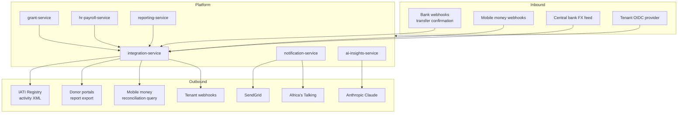
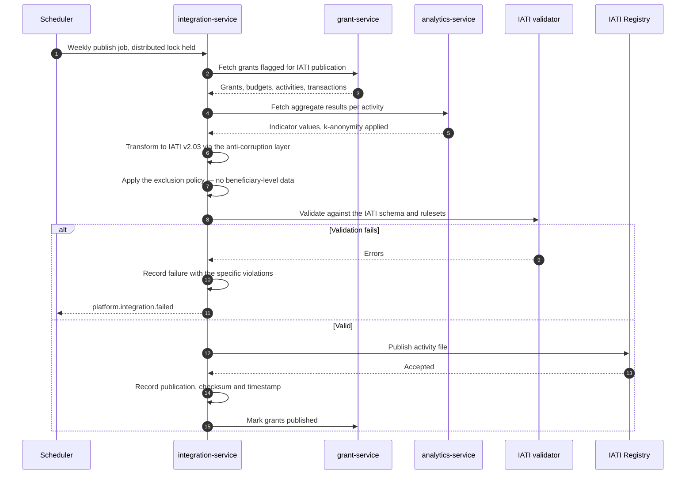
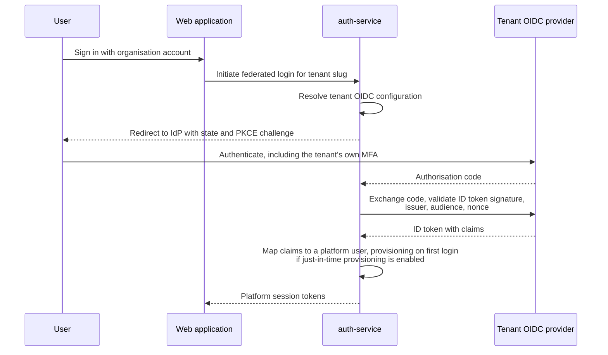

# 12 — Integration Architecture

> **Document:** NGO Intelligence Suite — SDD v2.0
> **Chapter:** 12 — Integration Architecture
> **Owner:** API Lead
> **Status:** Approved
> **Last Reviewed:** 2026-06-20
> **Related ADRs:** [ADR-0008](adr/0008-sync-vs-async-boundaries.md)

---

## 12.1 Principles for external systems

External systems fail in ways internal ones do not: they change their contracts without telling us, they go down for maintenance at inconvenient hours, they rate-limit unpredictably, and they occasionally return data that is syntactically valid and semantically wrong. Five rules follow.

| # | Rule | Consequence |
| --- | --- | --- |
| I-1 | Every external interaction goes through `integration-service` | One place holds third-party credentials, one place implements resilience, one place is audited when a connector misbehaves |
| I-2 | Every external model is translated at the boundary | An anti-corruption layer. IATI's activity model, MTN's transaction model and SendGrid's message model do not enter our domain vocabulary |
| I-3 | No external call is on a user's critical path unless unavoidable | The two unavoidable ones are the FX rate at payroll time and the LLM call for AI drafting; both have explicit degradation behaviour |
| I-4 | Every connector declares its resilience configuration in one structure | Timeouts, retries, breaker thresholds and fallback behaviour are reviewable in a table rather than discovered in code |
| I-5 | Assume the external system will send us something wrong | Validate inbound data as strictly as user input. A trusted partner's malformed payload is still malformed |

---

## 12.2 Integration inventory



| Integration | Direction | Protocol | Criticality | Owner |
| --- | --- | --- | --- | --- |
| IATI Registry | Out | HTTPS, XML | Low | API Lead |
| Donor portals | Out | Varies, often manual upload | Low | Finance |
| MTN Mobile Money | Both | HTTPS, JSON, OAuth2 | Medium | API Lead |
| Airtel Money | Both | HTTPS, JSON, OAuth2 | Medium | API Lead |
| Bank transfer webhooks | In | HTTPS webhook, signed | Medium | API Lead |
| Central bank FX | In | HTTPS, scraped or API | Medium | Finance |
| SendGrid | Out | HTTPS, JSON | Medium | Platform |
| Africa's Talking | Out | HTTPS, JSON | Medium | Platform |
| Anthropic Claude | Out | HTTPS, JSON | Low | AI Lead |
| Tenant OIDC | In | OIDC | Low, per tenant | Security |
| Tenant webhooks | Out | HTTPS, signed | Low | API Lead |

---

## 12.3 Resilience configuration

Every connector declares this structure. It is data, loaded at boot and visible in the admin console, not scattered through code.

```yaml
connector: iati_registry
timeout_ms: 30000
retry:
  max_attempts: 3
  strategy: exponential
  base_delay_ms: 2000
  max_delay_ms: 60000
  jitter: true
  retry_on: [408, 429, 500, 502, 503, 504, ECONNRESET, ETIMEDOUT]
  never_retry_on: [400, 401, 403, 404, 422]
circuit_breaker:
  error_threshold_percent: 50
  volume_threshold: 10
  window_seconds: 60
  open_duration_seconds: 300
  half_open_requests: 3
rate_limit:
  requests_per_minute: 10
bulkhead:
  max_concurrent: 5
fallback: queue_and_retry_later
degradation_message: "IATI publishing is temporarily unavailable. Publication will resume automatically."
alert_on_open: true
alert_severity: sev4
```

### 12.3.1 Connector resilience summary

| Connector | Timeout | Attempts | Breaker opens at | Fallback | User-visible effect when open |
| --- | --- | --- | --- | --- | --- |
| IATI Registry | 30 s | 3 | 50% / 10 req / 60 s | Queue for the next window | Publication status shows "pending, will retry" |
| Mobile money | 15 s | 3 | 50% / 20 req / 60 s | Defer reconciliation | Reconciliation marked pending; manual entry available |
| Bank webhook processing | 10 s | 5 | N/A, inbound | Persist raw, process later | None; confirmations appear late |
| FX rate feed | 20 s | 4 | 40% / 5 req / 300 s | Last known rate within 7 days | Payroll blocked if the cached rate exceeds 7 days, with a specific error |
| SendGrid | 15 s | 5 | 50% / 20 req / 60 s | Queue; SMS fallback for critical | Notification delayed |
| Africa's Talking | 15 s | 5 | 50% / 20 req / 60 s | Queue; email fallback | Notification delayed |
| Anthropic Claude | 120 s | 2 | 30% / 10 req / 120 s | None | "AI assistance unavailable"; manual drafting proceeds |
| Tenant webhooks | 10 s | 5 over 24 h | Disabled after 24 h of failure | Drop after retries | Tenant admin notified that their endpoint is failing |

The Claude connector has the tightest breaker and the fewest retries deliberately: it is the most expensive per call, the least critical, and a retry storm against a metered API costs real money.

---

## 12.4 IATI publishing

### 12.4.1 What it is and why it matters

The International Aid Transparency Initiative standard is how the sector publishes what it is funding and delivering. Many institutional donors require their grantees to publish, and a tenant unable to do so risks its funding relationships. It is a low-criticality integration operationally and a high-importance one commercially.

### 12.4.2 Flow



### 12.4.3 Exclusion policy

This is a protection control, not a technical one. IATI publication is **public and permanent**. The following are never published, regardless of what the standard permits:

| Excluded | Reason |
| --- | --- |
| Any beneficiary-level record | Public disclosure of who received assistance in a conflict setting is a protection risk |
| Precise coordinates of distribution sites | Publishing where displaced people gather makes them targetable |
| Aggregates below the k-anonymity threshold of 5 | Small cohorts are re-identifiable, especially when combined with other published data |
| Staff names and contact details below management level | Personal safety in insecure areas |
| Detailed security or logistics information | Operational security |
| Partner organisation names where the partner has not consented | Publishing a local partner's involvement can expose them |

Location precision is reduced to administrative level 2 for publication. A tenant may not override these exclusions through configuration; changing them requires a DPO review recorded against the tenant.

---

## 12.5 Financial integrations

### 12.5.1 Mobile money reconciliation

The platform does not initiate payments ([02 §2.2.3](02-introduction.md)). It reconciles: a disbursement recorded manually is matched against the provider's transaction record so discrepancies surface.

| Step | Behaviour |
| --- | --- |
| Query | Daily job pulls transactions for the tenant's registered accounts over the last 7 days |
| Match | On reference, amount and date within tolerance |
| Exact match | Disbursement marked `reconciled` |
| Amount mismatch | Flagged for finance review with both figures shown |
| Unmatched platform record | Flagged as "recorded but not confirmed by the provider" |
| Unmatched provider record | Flagged as "funds received but not recorded", which is the more interesting case |
| Credentials | Per-tenant OAuth2 client credentials in Secret Manager, rotated every 90 days |

### 12.5.2 Bank transfer webhooks

Inbound webhooks are the highest-risk integration surface because they are an unauthenticated-by-default entry point that a third party can be induced to call.

| Control | Implementation |
| --- | --- |
| Signature verification | HMAC over the raw body with the provider secret, constant-time comparison. An unsigned or mis-signed webhook is rejected with `401` and logged as a security event |
| Timestamp window | Rejected if outside 5 minutes, preventing replay |
| Idempotency | Provider event ID stored uniquely; a duplicate returns `200` without reprocessing |
| Raw persistence first | The raw body is stored before any parsing, so a parser bug does not lose the notification |
| Asynchronous processing | The endpoint returns `200` immediately after persisting; processing happens on a queue. A slow handler must not cause the provider to consider us down and retry-storm |
| Strict validation | Amounts, currencies and references validated as strictly as user input |
| No auto-application | A confirmation updates a disbursement's status; it never creates a financial record on its own |
| Allow-listing | Only provider source IP ranges are accepted at the edge |

### 12.5.3 FX rate ingestion

The one external dependency with a direct business consequence, because a stale rate blocks payroll.

| Aspect | Specification |
| --- | --- |
| Sources | Bank of South Sudan for USD/SSP, Bank of Uganda for USD/UGX, with a commercial API as a secondary |
| Schedule | Daily at 06:00 UTC, before any plausible payroll run |
| Storage | `fx_rates` with the rate, source, publication date and fetch time. Rates are immutable once stored |
| Validation | A rate deviating more than 15% from the previous day is not stored automatically; it is flagged for finance confirmation. Currency crises produce genuine large moves, so this is a confirmation gate rather than a rejection |
| Staleness | A rate older than 7 days blocks a payroll run with `NGOIS-PAY-0117` |
| Override | A `finance_manager` may proceed with a documented reason, which is recorded on the run and appears on statutory returns |
| Fallback | Secondary source, then manual entry with dual authorisation |

---

## 12.6 Communication providers

### 12.6.1 Email — SendGrid

| Aspect | Specification |
| --- | --- |
| Authentication | API key per environment in Secret Manager, rotated quarterly |
| Sender authentication | SPF, DKIM and DMARC configured on the sending domain. Without these, delivery to institutional donor mailboxes is unreliable |
| Templates | Held in the platform, not in SendGrid, so they are versioned with the code and localisable |
| Bounce handling | Webhook updates the delivery record and creates a suppression on a hard bounce |
| Unsubscribe | Honoured for non-transactional categories only; a payroll notification is not marketing and is not unsubscribable |
| Content | Links, never attachments. A payslip email links to an authenticated, expiring download |
| Rate | 100 per second, well within tier limits |

### 12.6.2 SMS — Africa's Talking

Chosen for coverage in South Sudan, Uganda and Kenya, where global providers deliver poorly or not at all.

| Aspect | Specification |
| --- | --- |
| Use cases | Critical alerts, MFA fallback, field officer notifications, beneficiary appointment reminders where consented |
| Content restriction | **Never contains PII.** SMS traverses networks with no confidentiality guarantee, is stored in plaintext on the handset, and is readable by anyone holding the phone. A reminder says "you have an appointment tomorrow", never a name, a condition or an amount |
| Length | Single segment where possible; cost and reliability both degrade with concatenation |
| Language | Per-recipient locale, with transliteration for Arabic where the handset may not render the script |
| Delivery reports | Webhook updates the delivery record |
| Cost control | Per-tenant monthly SMS budget with alerting at 80% |
| Quiet hours | Non-critical messages respect the tenant's local working hours |

---

## 12.7 Identity federation

Larger tenants may federate authentication with their own identity provider.



| Control | Detail |
| --- | --- |
| Protocol | OIDC authorisation code flow with PKCE. Implicit flow is not supported |
| Configuration | Per tenant: issuer, client ID, secret, claim mapping, group-to-role mapping |
| Just-in-time provisioning | Optional per tenant. When disabled, a user must exist locally before federated login succeeds |
| Role mapping | IdP groups map to platform roles through explicit tenant configuration. An unmapped group grants nothing |
| Break-glass | At least one local `org_admin` account with MFA is retained per federated tenant, because a tenant locked out by their own IdP outage has no other path in |
| Deprovisioning | Federation does not automatically deprovision. The tenant's offboarding process must suspend the platform user, and this is stated explicitly in onboarding because assuming otherwise is a common and dangerous gap |

---

## 12.8 Anti-corruption layers

Each external model is translated at the boundary. The translation is a named module with its own tests, not an inline mapping scattered through business logic.

| External model | Their concept | Our concept | Translation notes |
| --- | --- | --- | --- |
| IATI | Activity | Grant plus its activities | An IATI activity is coarser than a grant activity; one grant maps to one IATI activity with our activities as results |
| IATI | Transaction | Disbursement or expenditure | IATI transaction types must be mapped explicitly; incoming funds and expenditure are different transaction types |
| IATI | Organisation | Donor or tenant | Depends on direction |
| Mobile money | Transaction | Disbursement confirmation | Their status vocabulary differs per provider and is normalised to ours |
| SendGrid | Message | Notification delivery | Their event vocabulary — processed, deferred, delivered, bounced, dropped — maps to our five delivery states |
| Africa's Talking | Message | Notification delivery | Different status vocabulary again, mapped to the same five states |
| OIDC | Claims | User, roles | Claim names vary by provider; mapping is per-tenant configuration |
| Anthropic | Completion | AI generation | Their token accounting maps to our usage records |

The value of doing this consistently shows up when a provider changes: swapping SMS providers touches one translation module and one connector configuration, not every notification code path.

---

## 12.9 Integration observability

| Metric | Labels | Alert |
| --- | --- | --- |
| `integration_request_total` | connector, outcome | Error rate over 10% for 5 minutes |
| `integration_request_duration_seconds` | connector | p95 exceeds the connector's timeout budget |
| `integration_circuit_state` | connector | Any breaker open for over 10 minutes |
| `integration_retry_total` | connector, reason | Rate increase over baseline |
| `webhook_received_total` | provider, verified | Any unverified webhook, which is a potential attack |
| `webhook_processing_lag_seconds` | provider | p95 over 60 s |
| `fx_rate_age_hours` | pair | Over 48 hours warns; over 144 pages, because payroll blocks at 168 |
| `iati_last_publish_timestamp` | tenant | Older than 14 days |
| `external_api_cost_usd` | provider | Over budget projection |

Every connector has a synthetic health check running independently of production traffic, so a broken integration is detected before a user encounters it rather than after.

---

## 12.10 Adding a new integration

The checklist that must be complete before a connector reaches production:

| # | Requirement |
| --- | --- |
| 1 | Data protection review: what personal data crosses the boundary, under what lawful basis, with what agreement in place |
| 2 | Data processing agreement signed and recorded, if personal data is involved |
| 3 | Anti-corruption layer implemented with its own unit tests |
| 4 | Resilience configuration declared, including explicit unavailability behaviour |
| 5 | Credentials in Secret Manager with a rotation schedule |
| 6 | Sandbox or test environment integration proven before production credentials are issued |
| 7 | Contract tests against a recorded provider response set, so a provider change is detected in CI |
| 8 | Metrics, dashboard panel and alert rules |
| 9 | Runbook for the failure case |
| 10 | Cost model, if the provider is metered |
| 11 | Added to the external system inventory in [03 §3.3.1](03-system-overview-and-context.md) and this chapter |
| 12 | Threat model updated in [16](16-threat-model-stride.md) if it introduces a new trust boundary |
