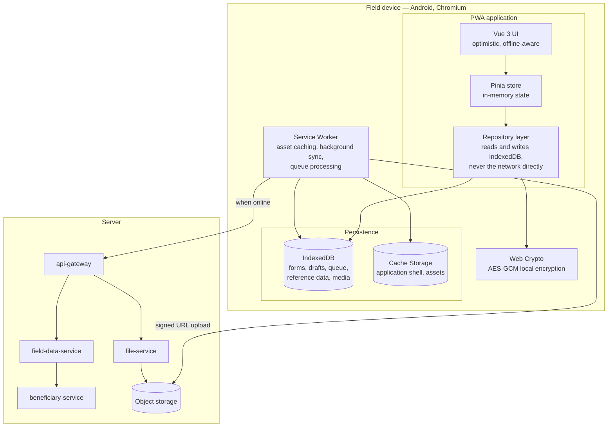
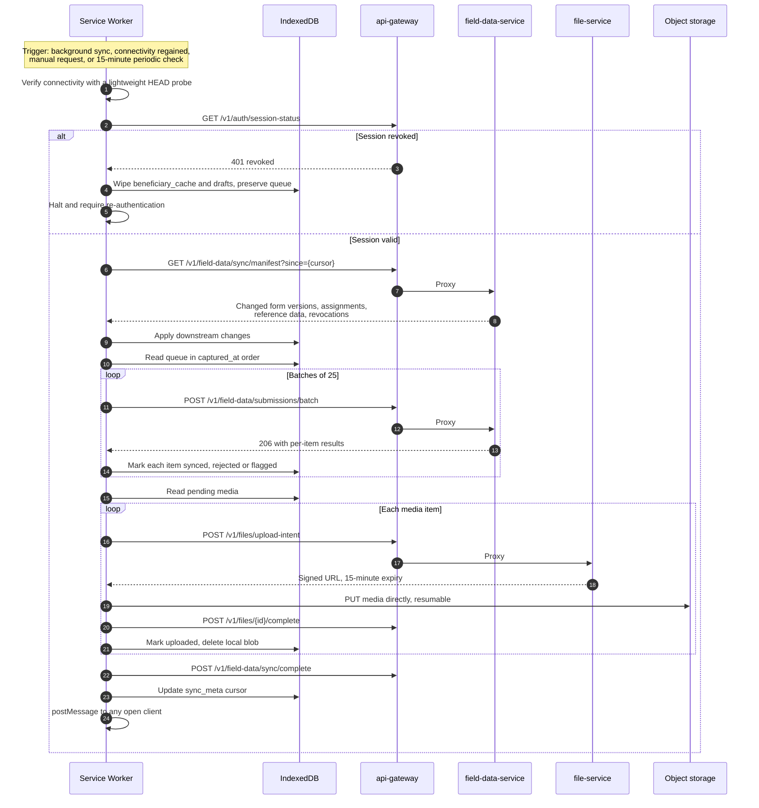
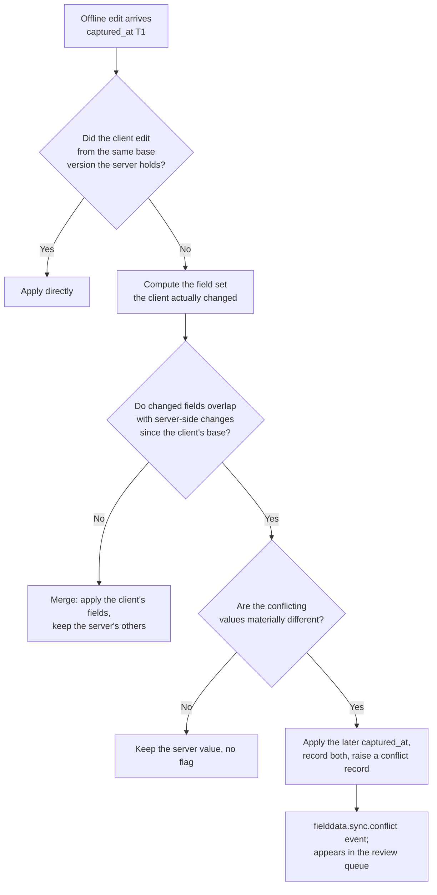

# 13 — Offline-First and Field Operations Architecture

> **Document:** NGO Intelligence Suite — SDD v2.0
> **Chapter:** 13 — Offline-First and Field Operations Architecture
> **Owner:** Mobile / Frontend Lead
> **Status:** Approved
> **Last Reviewed:** 2026-06-20
> **Related ADRs:** [ADR-0005](adr/0005-offline-conflict-resolution-policy.md), [ADR-0013](adr/0013-pwa-over-native-mobile.md)

---

## 13.1 The requirement and why it dominates the design

A field officer in Bentiu leaves the office at 07:00 with a phone, registers forty households across three sites, records a distribution, photographs consent forms, and returns to connectivity two days later — possibly in a different town, possibly having swapped devices, possibly having had the battery die twice.

Nothing about that sentence is negotiable, and everything about it constrains the architecture. This chapter is the most implementation-specific in the document because the offline path is where the platform is most likely to lose data, and losing field data is the failure that would end the product's credibility.

| Requirement | Value |
| --- | --- |
| Continuous offline operation | 72 hours minimum |
| Data durability offline | 100%. No acknowledged write may be lost to a crash, a battery failure or a browser eviction |
| Sync tolerance | Must succeed over 2G with high latency, packet loss and mid-transfer disconnection |
| Conflict resolution | Deterministic and specified per entity in advance |
| Local data at rest | Encrypted; minimum necessary; remotely revocable |
| Device sharing | Multiple officers may use one device; their data must not commingle |
| Storage budget | Under 50 MB typical, hard cap 200 MB |
| Initial load over 2G | Under 60 seconds |
| Typical sync payload | Under 500 KB for a day's work excluding media |

---

## 13.2 Architecture overview

**The central rule: the UI never talks to the network.** Every read and write goes to IndexedDB through the repository layer. The service worker independently reconciles local state with the server. This single decision is what makes offline behaviour identical to online behaviour from the application's point of view, and it eliminates the entire class of bugs where a feature works online and fails offline because someone forgot to handle the offline case.

---

## 13.3 Local storage design

### 13.3.1 Object stores

| Store | Contents | Encrypted | Eviction | Approximate size |
| --- | --- | --- | --- | --- |
| `forms` | Published form version definitions and validation rules | No | On unassignment | 200 KB |
| `assignments` | Which forms this officer may use, where and until when | No | On change | 5 KB |
| `drafts` | In-progress submissions not yet queued | Yes | On completion or 30-day expiry | Variable |
| `queue` | Completed submissions awaiting sync | Yes | On confirmed sync | 1–5 KB each |
| `media` | Photos and signatures awaiting upload | Yes | On confirmed upload | 100–500 KB each |
| `reference` | Settlements, programmes, activities, code lists | No | 7-day TTL | 500 KB |
| `beneficiary_cache` | Minimal records for the officer's assignment only | **Yes** | 72-hour TTL, wiped on logout | Capped at 500 records |
| `sync_meta` | Last sync, cursors, device identity, pending counts | No | Never | 2 KB |
| `outbox_log` | Recent sync outcomes for the officer's own diagnostics | No | 50 entries, ring buffer | 20 KB |

### 13.3.2 The beneficiary cache is the sensitive decision

Caching beneficiary records locally makes the field experience dramatically better: an officer can look up an existing household rather than re-registering it, and duplicate detection can run on-device. It also means a device seized at a checkpoint contains a list of displaced people.

The resolution, applying PRIN-01 over PRIN-02:

| Control | Detail |
| --- | --- |
| Scope | Only beneficiaries in the officer's assigned programmes and locations, capped at 500 records |
| Fields | Identifier, name, age band, sex, household reference and settlement. Not precise coordinates, national identifiers, phone numbers or vulnerability detail |
| Encryption | AES-GCM under a key derived from the session, held in memory only. The key does not survive a browser restart |
| Consequence | After a device restart, the cache is unreadable until the officer re-authenticates. This is intentional friction |
| TTL | 72 hours, matching the offline budget |
| Wipe triggers | Logout, session revocation observed on next contact, three failed unlock attempts, assignment change, TTL expiry |
| Remote wipe | A revocation flag is checked on every connection; the cache is destroyed before any other sync work proceeds |

The tradeoff is explicit and was reviewed by the DPO. An officer whose device restarts offline loses lookup capability until they reach connectivity, and they can still register new records. That is the correct direction to fail.

### 13.3.3 Durability

IndexedDB writes are transactional and durable, but browsers may evict storage under pressure. Mitigations:

1. **Request persistent storage** via `navigator.storage.persist()` on first use, which on Chromium is generally granted for an installed PWA.
2. **Monitor quota** with `navigator.storage.estimate()`; warn the officer at 80% and block new media capture at 95% rather than failing at 100%.
3. **Never acknowledge a write before the transaction completes.** The UI shows "saved" only on the IndexedDB transaction's `complete` event, not optimistically.
4. **Media compressed at capture**, typically 200–400 KB per photo rather than 4 MB, which is the difference between a full day fitting in the quota and not.
5. **Warn on unsynced data before logout**, and require explicit confirmation to discard.

---

## 13.4 The sync protocol

### 13.4.1 Sequence

### 13.4.2 Ordering

Sync happens in a fixed order for reasons that matter:

1. **Session and revocation check first.** A revoked officer must not upload, and a wipe instruction must execute before anything else.
2. **Downstream before upstream.** A form version update might change validation; applying it first means the client can flag a submission that would be rejected server-side.
3. **Structured data before media.** Structured data is small and high-value. If the connection drops after five minutes, the day's records are safe and only photos remain.
4. **Media last, resumable, one at a time.** Large uploads over 2G fail often; resumable uploads and serialisation mean a failure costs one file's partial progress, not the whole batch.

### 13.4.3 Network adaptation

| Condition | Adaptation |
| --- | --- |
| `navigator.connection.effectiveType === '2g'` or `saveData` set | Batch size 10, media deferred until a better connection, no reference data refresh |
| `3g` | Batch size 25, media uploaded at reduced resolution |
| `4g` or better | Batch size 50, full-resolution media |
| Metered connection flagged | Structured data only; media requires explicit officer confirmation |
| Repeated failure | Exponential backoff to a maximum of 30 minutes between attempts |

Respecting `saveData` is not a nicety. Field officers frequently pay for their own data, and a platform that silently consumes their credit is one they will avoid using.

### 13.4.4 Interruption handling

| Interruption | Behaviour |
| --- | --- |
| Connection lost mid-batch | Items already confirmed are marked synced; the rest remain queued. Idempotency keys make the retry safe |
| Connection lost mid-media | Resumable upload continues from the last received byte |
| Browser closed mid-sync | The service worker continues if the platform permits; otherwise sync resumes on next launch. No state is lost because progress is recorded in IndexedDB per item |
| Device powers off | Same. Every state transition is committed before the next begins |
| Server returns 5xx | Backoff and retry; the item stays queued |
| Server returns 4xx | Terminal for that item; it is marked rejected with its errors and shown to the officer for correction |

---

## 13.5 Conflict resolution

### 13.5.1 Why "last write wins" is not a policy

Field data arrives late, out of order, and from multiple officers who could not see each other's work. Two officers registering the same household from two sites is not an error condition — it is Tuesday. A blanket last-write-wins rule would mean the officer who syncs later, possibly because they were further from connectivity, silently overwrites the other.

Conflict policy is therefore specified per entity. See [ADR-0005](adr/0005-offline-conflict-resolution-policy.md).

### 13.5.2 Policy matrix

| Entity | Conflict type | Policy | Rationale |
| --- | --- | --- | --- |
| New submission | Same `client_uuid` submitted twice | **Idempotent** — return the original | Pure retry, not a conflict |
| New submission | Different `client_uuid`, matching fingerprint | **Flag for review** with candidates | Two officers, one household. A human decides. Auto-merging risks excluding a real person; auto-rejecting loses data |
| Beneficiary registration | Probable duplicate detected | **Accept and flag** | Never block the field officer. The record exists; a reviewer resolves it |
| Beneficiary update | Two offline edits to different fields | **Field-level merge** | Non-overlapping changes both apply |
| Beneficiary update | Two offline edits to the same field | **Last captured wins**, both recorded, flagged if the values differ materially | `captured_at`, not `received_at` — the officer who observed it later saw the more current reality |
| Beneficiary status change | Conflicting statuses | **Most restrictive wins**, flagged | If one officer marked a beneficiary deceased and another marked them active, the platform must not quietly assume active |
| Household composition | Concurrent member changes | **Flag for review** | Composition drives vulnerability scoring and therefore targeting. Too consequential to auto-resolve |
| Attendance record | Same beneficiary, same activity, two officers | **Idempotent** — first wins, second discarded | A person attended once. The unique constraint enforces it |
| Attendance record | Different quantities recorded | **Flag for review** | Distribution quantity discrepancies are audit-relevant |
| Vulnerability assessment | Concurrent assessments | **Both retained**, most recent is current | Assessments are versioned by design |
| Form definition | Client holds an old version | **Server accepts against the old version** | Rejecting three days of work because a form was republished is unacceptable. The submission binds to the version it was captured against |
| Reference data | Local copy is stale | **Server wins**, always | Reference data is not authored on the device |
| Draft submission | Not synced | **Local only** | Drafts never leave the device until completed |

### 13.5.3 Field-level merge

The client sends only the fields it changed, not the whole record. A client that sends a full object cannot be distinguished from one that deliberately cleared every field it did not know about — and a stale client sending a full object would silently erase fields added since it last synced.

### 13.5.4 What the officer sees

Conflict handling is invisible to the field officer except where their action is required. On sync completion the interface shows, per record: synced, needs correction with the specific errors, or under review with a plain-language explanation. Nothing disappears silently, and no record is deleted from the device until the server has confirmed it.

---

## 13.6 Deduplication

Two mechanisms, deliberately separate because they answer different questions.

| | Retry deduplication | Human duplicate detection |
| --- | --- | --- |
| Question | "Is this the same submission I already received?" | "Is this the same person we already know?" |
| Key | `client_uuid` | Content fingerprint plus fuzzy matching |
| Certainty | Absolute | Probabilistic |
| Action | Silent, return the original | Flag with candidates and scores |
| Where | Server, unique constraint | Server, scoring, plus client-side pre-check against the local cache |

### 13.6.1 Fingerprint

A SHA-256 over the normalised values of fields marked `is_fingerprint_component`, typically name, date of birth or estimated age, sex, and household head name. Normalisation lowercases, strips diacritics, collapses whitespace and applies a name-order-insensitive sort — without which "Deng Amal" and "Amal Deng" produce different fingerprints for the same person, which in a context where name order convention varies is a guaranteed miss.

### 13.6.2 Fuzzy matching

An exact fingerprint match is rare; near-matches are common. The scoring:

| Signal | Weight | Method |
| --- | --- | --- |
| Name similarity | 40 | Jaro-Winkler over the normalised name, plus double-metaphone phonetic equality |
| Date of birth or age | 20 | Exact date, or age within 2 years |
| Sex | 10 | Exact |
| Location | 15 | Same settlement, or within 2 km |
| Household head name | 15 | Jaro-Winkler |

| Score | Action |
| --- | --- |
| Below 60 | Accept as new |
| 60–84 | Accept and flag for review with candidates |
| 85 and above | Accept and flag as high-probability duplicate, priority review |

The system **never auto-merges**. Merging two beneficiary records incorrectly can remove a real person from an assistance list, which in a food security programme has direct consequences. A human with local context makes the call, and the merge is reversible for 30 days.

Client-side pre-check runs the same scoring against the local cache before the officer completes registration, surfacing "this may already be registered" at the moment it is cheapest to resolve — while the person is standing there.

---

## 13.7 Low-bandwidth optimisation

Bandwidth is a cost the tenant bears and a constraint on whether sync completes at all.

| Technique | Effect |
| --- | --- |
| Delta manifests | The client requests changes since its cursor. A daily sync transfers kilobytes, not the full form catalog |
| Field selection | List endpoints return only rendering fields; detail is fetched on demand |
| Brotli compression | Applied to all API responses; typically 70–80% reduction on JSON |
| Client-side media compression | Photos downscaled to 1280 px and re-encoded before storage. 4 MB becomes roughly 300 KB |
| WebP where supported | A further 25–30% over JPEG |
| Deferred media | Structured data syncs on any connection; media waits for a good one unless the officer forces it |
| No polling | The client does not poll. Sync is event-driven from connectivity and background sync triggers |
| Aggressive asset caching | The application shell is cached indefinitely and revalidated by hash. A returning officer downloads nothing to start working |
| Conditional requests | `If-None-Match` yields `304` on unchanged reference data |
| Request coalescing | Multiple pending operations batch into one request |

Measured targets, verified in the performance suite:

| Scenario | Budget |
| --- | --- |
| First load, cold, 2G | Under 60 s to interactive |
| Subsequent load, cached | Under 3 s |
| Sync of 40 submissions, no media | Under 500 KB, under 45 s on 2G |
| Sync of 40 submissions with 40 photos | Under 15 MB, deferred to 3G or better |
| Daily reference refresh | Under 50 KB |

---

## 13.8 Device and session management

| Concern | Handling |
| --- | --- |
| Device identity | A stable device identifier generated on first use, stored locally, sent with every sync. Enables per-device audit and remote wipe |
| Shared devices | Each officer's data is stored under a per-user namespace with a per-user encryption key. Switching users does not expose the previous user's queue, and a user's data is wiped on their explicit logout |
| Session length | 8-hour access token for field roles, a deliberate exception to the 60-minute default, because refreshing requires connectivity |
| Expired session with queued data | The queue is preserved. The officer re-authenticates and syncs; work is never discarded for an expired token |
| Lost or stolen device | Session revoked server-side. The wipe instruction executes the next time the device contacts the server. If it never does, the local encryption protects the data at rest |
| Remote wipe scope | Beneficiary cache and drafts always; the unsynced queue only on explicit instruction, because destroying unsynced work is a last resort |
| Device inventory | Per tenant, showing last sync, application version, pending item count and storage usage |
| Stale device alert | A device with pending items and no contact for 7 days is surfaced to the tenant administrator — usually it means an officer needs support, sometimes it means a device is gone |

---

## 13.9 Application updates

Updating a PWA that is in offline use is a specific hazard: an update applied mid-workflow can lose in-progress state, and a broken update reaches every device at once.

| Rule | Detail |
| --- | --- |
| Never update mid-session | A new service worker waits; it does not `skipWaiting()` automatically |
| Prompt, do not force | The officer is told an update is available and chooses when to apply it |
| Force only on a breaking change | A sync protocol change forces an update, with clear messaging, and only after the queue has drained |
| Never update with a non-empty queue | Sync first, then update |
| Schema migration | IndexedDB migrations run on activation, are versioned, and are tested against every prior schema version |
| Rollback | The previous service worker version is retained and can be restored by a server-side flag if an update proves faulty |
| Staged rollout | New client versions reach 5% of devices, then 25%, then 100%, gated on client-reported error rates |
| Minimum supported version | Enforced server-side. A client below it receives a clear upgrade instruction rather than confusing failures |

---

## 13.10 Testing the offline path

The offline path cannot be validated by manual testing alone; the failure cases are timing-dependent and hard to reproduce by hand.

| Test | Method | Asserts |
| --- | --- | --- |
| Full offline workflow | Playwright with the network disabled | Registration, capture and queueing work with no network at all |
| 72-hour accumulation | Simulated clock, generated workload | Storage stays within budget; no eviction; sync succeeds |
| Interrupted sync | Kill the connection at every step boundary | No duplicates, no loss, correct resumption |
| Abrupt termination | Terminate the browser context mid-write | No partial records; every acknowledged write survives |
| Storage exhaustion | Fill the quota | Graceful degradation with a clear warning, not a silent failure |
| Conflict matrix | Scripted concurrent edits for every row in [§13.5.2](#1352-policy-matrix) | Each policy behaves as specified |
| Duplicate detection | Labelled dataset of known duplicates and non-duplicates | Precision above 90%, recall above 85% at the 60-point threshold |
| Slow network | Throttled to 2G with 500 ms latency and 5% packet loss | Sync completes within budget |
| Clock skew | Device clock offset by hours in both directions | Ordering by `captured_at` remains correct; the server records both device and server time |
| Version skew | Client several versions behind | Old form versions still submit successfully |
| Multi-device | The same officer on two devices | No cross-contamination; both queues sync correctly |
| Remote wipe | Revoke a session, then sync | Cache destroyed before any other operation |
| Sync storm | 200 simulated devices syncing simultaneously | Server absorbs it; no data loss; latency within bounds |

The clock skew test deserves emphasis. Field devices frequently have wrong clocks, and a conflict policy that orders by `captured_at` is only as good as the clocks producing it. The server records both the device-reported capture time and its own receipt time, flags implausible skew, and the review queue surfaces submissions whose ordering is uncertain.

---

## 13.11 Business continuity for extended outages

The 72-hour design point covers normal field operations. Longer disruptions — a regional network outage, a security incident restricting movement, a platform outage — need an answer too.

| Scenario | Duration | Response |
| --- | --- | --- |
| Local connectivity loss | Up to 72 h | Normal operation, no action needed |
| Extended connectivity loss | 3–14 days | Storage warning at 80%; officers advised to prioritise structured data and reduce photo capture; a supervisor may collect data by physically bringing devices to connectivity |
| Platform outage | Any | Clients queue indefinitely; the queue is capped only by device storage. Sync resumes automatically |
| Device loss with unsynced data | — | Data is lost. This is the residual risk the design cannot eliminate, mitigated by encouraging daily sync where possible and by supervisor-collected sync in remote deployments |
| Total regional disruption | Weeks | Paper fallback forms mirroring the digital instruments, with a defined bulk-entry path once operations resume. Recorded in the BCP, [27](27-disaster-recovery-and-bcp.md) |

The paper fallback is not an admission of failure. It is the recognition that in the operating environments this platform serves, there are conditions in which no digital system functions, and a programme that cannot record what it did during those weeks has a compliance problem regardless of how good its software is.
