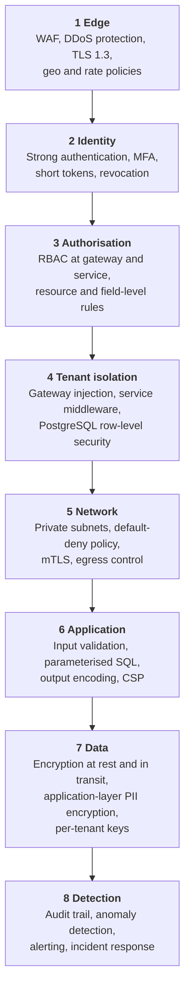
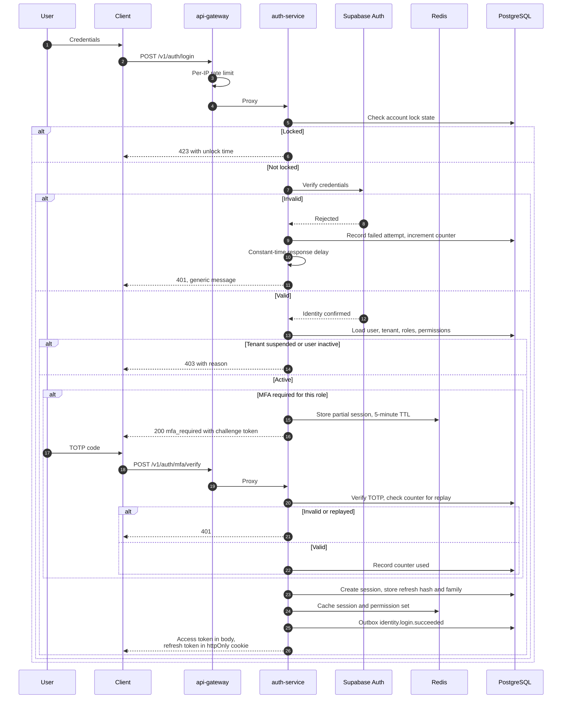
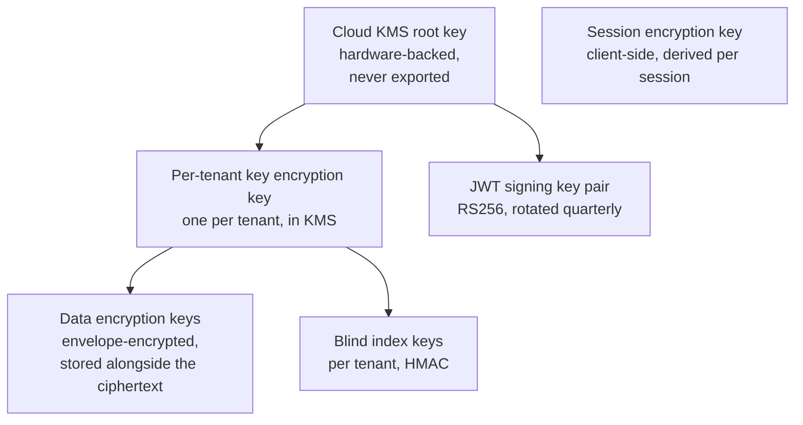

# 14 — Security Architecture

> **Document:** NGO Intelligence Suite — SDD v2.0
> **Chapter:** 14 — Security Architecture
> **Owner:** Security Lead
> **Status:** Approved
> **Last Reviewed:** 2026-06-20
> **Review Cadence:** Quarterly
> **Related ADRs:** [ADR-0004](adr/0004-supabase-auth-as-identity-provider.md), [ADR-0015](adr/0015-application-layer-pii-encryption.md)

---

## 14.1 Security objectives

The platform's security posture is shaped by an unusual threat picture. The most consequential asset is not money or intellectual property but a list of displaced people in a conflict environment, and the most consequential adversary may be a state actor or an armed group with a direct interest in that list.

| Objective | Statement |
| --- | --- |
| SEC-1 | Beneficiary personal data must remain confidential even against an adversary who obtains database access |
| SEC-2 | One tenant must never be able to read, infer or affect another tenant's data |
| SEC-3 | Every action must be attributable to an identity and reconstructable years later |
| SEC-4 | Compromise of one service must not yield the whole platform |
| SEC-5 | Financial and payroll operations must require two people |
| SEC-6 | Loss of a field device must not disclose data |
| SEC-7 | The platform must remain available under load and under attack, degrading rather than failing |

The defence-in-depth layering that follows from them:

Each layer assumes the ones above it may have failed. That assumption is what makes the model useful rather than decorative.

---

## 14.2 Authentication

### 14.2.1 Login flow

### 14.2.2 Credentials and account protection

| Control | Specification |
| --- | --- |
| Password storage | Handled by Supabase Auth using bcrypt with an appropriate work factor. The platform never sees or stores a password |
| Password policy | Minimum 12 characters, checked against a breached-password corpus. **No composition rules and no forced rotation** — both are known to reduce real-world strength by pushing users toward predictable patterns |
| Password reuse | The last 5 password hashes are retained to prevent immediate reuse |
| Account lockout | 5 failures triggers a 15-minute lock, doubling to a maximum of 24 hours. Per account and per IP independently |
| Timing | Login responses are constant-time regardless of whether the account exists, preventing user enumeration |
| Error messages | Always "invalid email or password", never distinguishing which was wrong |
| Password reset | Single-use token, 30-minute expiry, invalidates all sessions on use, notifies the account holder by a second channel where available |
| Initial credentials | Invitation only. An administrator never sets another user's password |
| Service accounts | Certificate-based, no interactive login, no password |

### 14.2.3 Multi-factor authentication

| Role | MFA |
| --- | --- |
| `super_admin` | **Mandatory**, hardware key preferred |
| `org_admin` | **Mandatory** |
| `finance_manager` | **Mandatory** |
| `hr_manager` | **Mandatory** |
| `auditor` | **Mandatory** |
| `m_e_officer` | Recommended, tenant-configurable |
| `field_officer` | Optional — a mandatory second factor for a user working offline in the field is a lockout risk that outweighs its benefit. Compensated by narrower permissions and device-bound sessions |
| `donor_viewer` | Recommended |

TOTP per RFC 6238, 30-second window with ±1 period tolerance. The used counter is recorded so a code cannot be replayed within its validity window. Ten single-use recovery codes are issued at enrollment, stored hashed, and their use raises an alert.

**Step-up authentication** requires MFA re-verification within the last 5 minutes for: payroll approval, disbursement approval, bulk beneficiary export, beneficiary erasure, role assignment, statutory rule change, tenant offboarding and break-glass elevation.

### 14.2.4 Token design

| Token | Format | Lifetime | Storage | Revocation |
| --- | --- | --- | --- | --- |
| Access, standard | JWT RS256 | 60 min | Memory only, never `localStorage` | Session deny-list checked at the gateway |
| Access, field role | JWT RS256 | 8 h | Memory, restored from an encrypted store on resume | Deny-list on next contact |
| Refresh | Opaque, 256-bit random | 7 days, rotating | `httpOnly`, `Secure`, `SameSite=Strict` cookie | Family invalidation on reuse detection |
| Challenge, MFA pending | Opaque | 5 min | Memory | Single use |
| Signed URL | Provider signature | 5–15 min | Not stored | Expiry only |
| Service identity | X.509 via workload identity | 24 h | Projected volume | Certificate revocation |

Access tokens are held in memory rather than `localStorage` specifically because `localStorage` is readable by any script on the origin, which turns a single XSS into a full account takeover. The refresh token in an `httpOnly` cookie is not script-readable at all.

**Refresh token rotation with reuse detection** is the most valuable single control here. Every refresh issues a new refresh token and invalidates the old one. If an old token is presented again, either an attacker has stolen it or the legitimate client has a bug — either way the entire token family is revoked immediately and the user is notified. This turns silent token theft into a detected event.

### 14.2.5 Session management

| Control | Specification |
| --- | --- |
| Concurrent sessions | Permitted; visible to the user with device, location and last-seen, each individually revocable |
| Idle timeout | 8 hours of inactivity for office roles; none for field roles within the token lifetime |
| Absolute timeout | 7 days, then full re-authentication |
| Revocation triggers | Logout, password change, role change, account suspension, MFA change, administrator action, tenant suspension, refresh reuse detection |
| Revocation propagation | Session ID added to a Redis deny-list with a TTL matching the token's remaining lifetime. The gateway checks it on every request |
| Redis unavailable | **Fail closed** for privileged roles, fail open for read-only roles. The asymmetry is deliberate: the cost of blocking a donor viewer briefly is low, the cost of honouring a revoked finance manager token is not |
| Binding | Sessions record a device fingerprint; a material change raises a risk signal rather than an automatic block, because field devices legitimately change networks constantly |

---

## 14.3 Authorisation

Summarised here; the complete model and matrix are in [15](15-rbac-and-authorization.md) and [Appendix C](appendices/c-rbac-matrix.md).

Four enforcement points, each assuming the others may fail:

| Point | Enforces | Failure without it |
| --- | --- | --- |
| Gateway | Route-level permission from the route registry | An unauthenticated caller reaches a service |
| Service middleware | Resource-level rules: does this user's scope include this record | A finance manager reads another department's payroll |
| Domain logic | Business-rule authorisation: separation of duties, state-dependent permission | The preparer approves their own payroll run |
| Database RLS | Tenant boundary | A missing `WHERE` clause becomes a cross-tenant leak |

An endpoint with no declared permission is unreachable. This is enforced by the route registry, which refuses to register a route without one, rather than by convention — because "we forgot to add the auth middleware" is the most common authorisation defect in every codebase.

---

## 14.4 Cryptography

### 14.4.1 Key hierarchy

| Key | Algorithm | Rotation | Scope |
| --- | --- | --- | --- |
| KMS root | AES-256, hardware-backed | Annual, automatic | Platform |
| Tenant key encryption key | AES-256 | Annual, or on demand | One per tenant |
| Data encryption key | AES-256-GCM | Per record, envelope-wrapped | Per encrypted value |
| Blind index key | HMAC-SHA256 | With the tenant key | Per tenant |
| JWT signing | RSA-2048 | Quarterly, with overlap | Platform |
| TLS certificates | ECDSA P-256 | 90 days, automated | Per domain |
| Webhook signing | HMAC-SHA256 | 90 days | Per tenant |
| Session key | AES-256-GCM, derived | Per session | Per device session |

Per-tenant key encryption keys are what make SEC-1 achievable. A database dump alone yields ciphertext; decryption additionally requires KMS access, and KMS access is per tenant, audited, and separable from database access.

### 14.4.2 Encryption at rest

| Layer | Mechanism | Protects against |
| --- | --- | --- |
| Disk | Cloud provider AES-256 with customer-managed keys | Physical media compromise, provider-side disposal failures |
| Database | Transparent encryption of volumes and backups | The same, plus backup theft |
| Object storage | CMEK per bucket | Bucket misconfiguration and media theft |
| **Application layer** | AES-256-GCM per field under a per-tenant key | **Database compromise, insider access, backup exfiltration, accidental logging** |

Only the application layer protects against the threats that actually keep us up at night. Disk encryption protects a disk in a skip; it does nothing against `SELECT * FROM beneficiaries` issued by someone with database credentials.

| Encrypted at the application layer | Table |
| --- | --- |
| First name, last name | `beneficiaries`, `employees` |
| Date of birth | `beneficiaries`, `employees` |
| National identifier | `beneficiaries` |
| Phone number | `beneficiaries`, `employees` |
| Personal email, emergency contact | `employees` |
| Tax and social security identifiers | `employees` |
| Bank details | `employees` |
| MFA secrets | `mfa_enrollments` |
| Field values from PII-marked form fields | `submission_values` |
| Precise coordinates where policy requires | `beneficiaries` |

### 14.4.3 Searching encrypted data

Encryption that makes data unsearchable is encryption that gets removed under delivery pressure. Two mechanisms preserve the required search capability:

| Mechanism | Supports | Construction | Leakage |
| --- | --- | --- | --- |
| Blind index | Exact match | `HMAC-SHA256(tenant_key, normalise(value))` | Equality only: an observer learns which rows share a value, not what it is |
| Phonetic index | Fuzzy match | `HMAC-SHA256(tenant_key, double_metaphone(normalise(value)))` | Equality of phonetic class, a coarser signal |

Both are keyed per tenant, so identical names in different tenants produce different indexes and cross-tenant correlation is impossible. Range queries over encrypted values are not supported, which is why age is stored as a plaintext band alongside the encrypted date of birth — an explicit, reviewed trade-off rather than an oversight.

### 14.4.4 Encryption in transit

| Path | Protocol |
| --- | --- |
| Client to edge | TLS 1.3, TLS 1.2 permitted only with strong ciphers for older Android devices |
| Edge to cluster | TLS 1.3 |
| Service to service | mTLS via the service mesh, automatic certificate rotation |
| Service to database | TLS with certificate verification |
| Service to Redis | TLS with AUTH |
| Service to object storage | HTTPS |
| Outbound to third parties | TLS 1.2 minimum, certificate pinning for financial providers |

HSTS with a two-year max-age and preload. No mixed content. No downgrade path.

### 14.4.5 Key rotation

| Key | Procedure | Impact |
| --- | --- | --- |
| JWT signing | New pair published to JWKS; new tokens signed with the new key while the old remains valid for verification for 24 hours, then removed | None |
| Tenant KEK | KMS rotates; new data uses the new version, existing data is re-wrapped lazily on next write. Old versions retained for decryption | None |
| TLS | cert-manager automatic renewal at 30 days remaining | None |
| Database credentials | Workload identity, short-lived, rotated automatically | None |
| Third-party API keys | Quarterly, dual-key overlap where the provider supports it | Brief, planned |
| Webhook secrets | Quarterly, with an overlap window announced to tenants | None if the tenant follows the documented dual-secret verification |

Procedure detail is in [RB-09](runbooks/rb-09-secret-rotation.md).

---

## 14.5 Network security

Reproduced from [05 §5.7](05-architecture-diagrams.md) with the control detail.

| Control | Implementation |
| --- | --- |
| Public exposure | Exactly one: the load balancer on 443. Every other resource is on a private IP |
| WAF | Cloudflare plus Cloud Armor. OWASP core rule set, per-endpoint rate rules, bot scoring, geo policies where a tenant requests them |
| DDoS | Provider-level absorption plus origin rate limiting |
| Ingress to pods | Only `api-gateway` accepts traffic from the ingress controller. NetworkPolicy denies everything else |
| Pod to pod | Default-deny. Every allowed flow is an explicit NetworkPolicy, generated from the service dependency graph so the policy and the documentation cannot diverge |
| Service identity | mTLS with SPIFFE-style identity; authorisation policies specify which service may call which |
| Egress | Default-deny outbound. An allow-list of third-party endpoints through a NAT with logging. This is the control that turns a compromised container into a contained one rather than an exfiltration channel |
| Data zone | Private Service Connect; no public IP on any database, cache or bucket |
| Administrative access | Identity-aware proxy with recorded sessions. No SSH bastion, no standing access, just-in-time elevation with approval |

---

## 14.6 Application security

Mapped to OWASP Top 10 (2021), with the specific control rather than a generic assertion.

| Risk | Control |
| --- | --- |
| **A01 Broken Access Control** | Four-layer authorisation ([§14.3](#143-authorisation)); default-deny route registry; RLS; automated tests asserting every role against every endpoint; `404` rather than `403` across tenant boundaries |
| **A02 Cryptographic Failures** | TLS 1.3; application-layer PII encryption; KMS-managed keys; no custom cryptography; no secrets in source, images or logs |
| **A03 Injection** | Parameterised queries only, enforced by lint; schema validation on every input; no dynamic SQL construction; output encoding by the framework; no `innerHTML` |
| **A04 Insecure Design** | Threat model ([16](16-threat-model-stride.md)); security review on every design; separation of duties on financial operations; abuse cases in the test suite |
| **A05 Security Misconfiguration** | Infrastructure as code with policy scanning; hardened container baseline; configuration validated at boot; no default credentials; error responses that disclose nothing |
| **A06 Vulnerable Components** | Dependency scanning on every build; SBOM per release; patch SLAs ([§14.9](#149-vulnerability-management)); pinned image digests |
| **A07 Authentication Failures** | Managed identity provider; MFA on privileged roles; rotating refresh tokens with reuse detection; lockout; breached-password checking; constant-time responses |
| **A08 Software and Data Integrity** | Signed container images with admission verification; provenance attestation; protected branches; signed commits on release branches; audit hash chain |
| **A09 Logging and Monitoring Failures** | Structured logs with correlation; immutable audit trail; security event alerting; log integrity protection; tested detection rules |
| **A10 Server-Side Request Forgery** | Egress allow-list; no user-supplied URLs are fetched server-side; webhook targets validated against private address ranges; metadata endpoint blocked |

### 14.6.1 Input validation

| Layer | Responsibility |
| --- | --- |
| Client | Immediate feedback. Never a security control, because a client is not trusted |
| Gateway | Size, content type, structural sanity |
| Service | Full schema validation before any handler executes: types, formats, ranges, enums, required fields, unknown-field rejection |
| Domain | Business rules requiring context |
| Database | Constraints as the last line |

Unknown fields are rejected rather than ignored. Mass assignment is impossible because handlers construct their own objects from validated fields rather than spreading a request body into a model.

### 14.6.2 Output security

| Header | Value |
| --- | --- |
| `Content-Security-Policy` | `default-src 'self'; script-src 'self'; style-src 'self' 'unsafe-inline'; img-src 'self' data: blob: https://storage.googleapis.com; connect-src 'self' https://api.ngointelligence.io; frame-ancestors 'none'; base-uri 'self'; form-action 'self'; object-src 'none'` |
| `Strict-Transport-Security` | `max-age=63072000; includeSubDomains; preload` |
| `X-Frame-Options` | `DENY` |
| `X-Content-Type-Options` | `nosniff` |
| `Referrer-Policy` | `no-referrer` |
| `Permissions-Policy` | `geolocation=(self), camera=(self), microphone=(), payment=()` |
| `Cross-Origin-Opener-Policy` | `same-origin` |
| `Cache-Control` on authenticated responses | `no-store` |

`'unsafe-inline'` for styles is a known compromise required by the CSS framework's runtime; it is recorded as an accepted risk with a review date, and scripts have no such exemption.

### 14.6.3 File upload security

| Control | Detail |
| --- | --- |
| Content type | Verified by magic bytes, not the declared header |
| Allow-list | Per purpose. Executables, archives and scripts are refused everywhere |
| Size | Per type, enforced at the signed-URL grant |
| Virus scanning | Every object before it becomes available. **Fail closed**: an unscannable object stays quarantined |
| Storage | Never on an application filesystem; direct to object storage through a signed URL |
| Naming | Server-generated keys; the original filename is metadata only, never a path component |
| Serving | Signed URLs with short expiry, `Content-Disposition: attachment`, served from a separate origin so a stored payload cannot execute against the application origin |
| Image handling | Re-encoded rather than passed through, which neutralises malformed-image exploits and strips EXIF including GPS |

---

## 14.7 Audit and security logging

### 14.7.1 The audit trail

| Property | Implementation |
| --- | --- |
| Coverage | Every create, update, delete, approval, permission change, authentication event, and every read of beneficiary PII |
| Completeness | Written from the transactional outbox, so a crash between the change and the audit write cannot lose the record |
| Immutability | `INSERT` and `SELECT` grants only; an `UPDATE`/`DELETE` trigger raises unconditionally; no application role holds a mutation grant |
| Tamper evidence | Each record hashes its content plus the previous record's hash, per tenant. A nightly job verifies the chain |
| Content | Timestamp, tenant, actor identity and role, action, resource type and identifier, before and after state, purpose for PII reads, outcome, IP, user agent, correlation ID, source service |
| Retention | 7 years, monthly partitions |
| Access | `auditor` and `super_admin` only; reading the audit log is itself logged |

A broken hash chain is a Sev-2 incident from the moment it is detected, because it means either a bug in the audit path or an attempt to alter history, and both require immediate investigation.

### 14.7.2 Security events

Distinct from the audit trail: audit records what happened, security events record what looked wrong.

| Event | Severity | Response |
| --- | --- | --- |
| Repeated failed logins across accounts from one source | High | Automatic IP block, alert |
| Successful login from a new country for a privileged role | Medium | Alert, notify the user |
| Refresh token reuse detected | **Critical** | Revoke the family, alert, notify the user |
| Cross-tenant access attempt | **Critical** | Alert, investigate immediately. This should be impossible |
| Client supplying a stripped header such as `X-Tenant-ID` | High | Alert; indicates a forgery attempt or a badly broken client |
| Bulk beneficiary read above threshold | High | Alert, require justification |
| Beneficiary export | High | Alert to DPO |
| Break-glass elevation | **Critical** | Alert to Security Lead and Executive Director |
| Statutory rule change | High | Alert to Finance |
| Permission escalation | High | Alert |
| Unsigned or mis-signed inbound webhook | Medium | Alert; possible probing |
| Audit hash chain break | **Critical** | Sev-2 incident |
| RLS policy missing on a table | **Critical** | Block the deployment |
| Anomalous data access volume for a user | Medium | Alert for review |

### 14.7.3 Log protection

Logs themselves contain sensitive material and are protected accordingly: a field allow-list means only declared fields are logged and a new field is invisible until explicitly permitted; automatic redaction catches patterns resembling tokens, keys and identifiers; request and response bodies are never logged; query parameters are logged only for allow-listed endpoints; logs are shipped off-node immediately so a compromised node cannot alter its own history; log access is authenticated and audited.

---

## 14.8 Secrets management

| Rule | Enforcement |
| --- | --- |
| No secret in source control | Pre-commit hook plus CI scanning; a detected secret fails the build and triggers rotation of the exposed value |
| No secret in a container image | Image scanning |
| No secret in an environment variable set from a manifest | Secrets arrive through the CSI driver into tmpfs |
| No secret in a log | Field allow-list plus pattern redaction |
| No secret in an error message | Central error handler strips them |
| Rotation | Scheduled per secret type; rotation is tested, not assumed |
| Access | Per-service, least privilege, audited in the secret manager's own log |
| Development | Separate secrets entirely; a developer never holds a production credential |

A leaked secret is treated as compromised regardless of whether exploitation is evidenced. Rotation is immediate, not scheduled.

---

## 14.9 Vulnerability management

| Source | Cadence |
| --- | --- |
| Dependency scanning | Every build, plus daily on the main branch |
| Container image scanning | Every build and daily on deployed images, since a base image can become vulnerable after deployment |
| Static analysis | Every pull request |
| Dynamic scanning | Weekly against staging |
| Infrastructure policy scanning | Every infrastructure change |
| Penetration test | Annually, plus before any major release |
| Bug bounty or responsible disclosure | A published `security.txt` with a defined response commitment |

| Severity | Remediation SLA | Escalation |
| --- | --- | --- |
| Critical, actively exploited | 24 hours | Immediate incident, emergency change process |
| Critical | 7 days | Security Lead tracks daily |
| High | 30 days | Sprint commitment |
| Medium | 90 days | Backlog with a due date |
| Low | Next dependency refresh | — |

A critical vulnerability older than its SLA blocks the next production release. This is a hard gate, not a discussion — without it, security debt accumulates invisibly behind feature delivery.

---

## 14.10 Security in the development lifecycle

| Stage | Control |
| --- | --- |
| Design | Threat model updated for any new trust boundary; security review for any change to authentication, authorisation, encryption or data classification |
| Implementation | Secure coding standards; security-focused review checklist; no security-relevant change merges with a single approval |
| Build | SAST, dependency scan, secret scan, SBOM generation, image signing |
| Test | Authorisation matrix tests, tenant isolation tests, abuse-case tests, DAST against staging |
| Deploy | Signed image admission control; policy enforcement; post-deployment RLS verification |
| Operate | Runtime monitoring, anomaly detection, audit review, quarterly access recertification |
| Respond | Incident process ([26](26-reliability-and-incident-management.md)), breach notification ([17](17-privacy-and-compliance.md)) |

---

## 14.11 Third-party and supply chain

| Control | Detail |
| --- | --- |
| Vendor assessment | Security and privacy review before any provider handling personal data is engaged |
| Data processing agreements | Required and recorded for every processor |
| Sub-processor register | Maintained and published to tenants, with notice of changes |
| Dependency provenance | Lock files committed; integrity hashes verified; no direct-from-git dependencies |
| Base images | Distroless from a verified publisher, pinned by digest |
| Image signing | Cosign signatures verified by an admission controller. An unsigned image cannot run |
| Build provenance | SLSA attestation recording what was built from what source by which pipeline |
| Typosquatting defence | New dependencies are reviewed by a human; automated updates are limited to patch versions of already-approved packages |

---

## 14.12 Residual risks accepted

Recorded here so they are known rather than discovered.

| Risk | Why accepted | Compensating control | Review |
| --- | --- | --- | --- |
| Rate limiting fails open when Redis is unavailable | Availability is prioritised for users with no alternative | Alerting; WAF rate limits remain in force at the edge | Quarterly |
| Field role MFA is optional | A mandatory second factor for offline users is a lockout risk with a direct programme cost | Narrower permissions, device binding, 8-hour tokens, remote revocation | Quarterly |
| CSP permits `'unsafe-inline'` for styles | Framework runtime requirement | Scripts have no exemption; DOM sanitisation; no `innerHTML` | On framework upgrade |
| Tenant administrators have broad access within their tenant | Inherent to the delegated administration model | Audit logging, dual authorisation on the most sensitive operations, anomaly detection | Annually |
| Unsynced data on a lost field device is unrecoverable | No mechanism exists to recover data that never left the device | Local encryption protects confidentiality; daily sync is encouraged; supervisor-collected sync for remote deployments | Annually |
| The service mesh trusts pod identity within the cluster | Standard for the architecture | Default-deny network policy, per-service authorisation policies, egress control | Annually |
