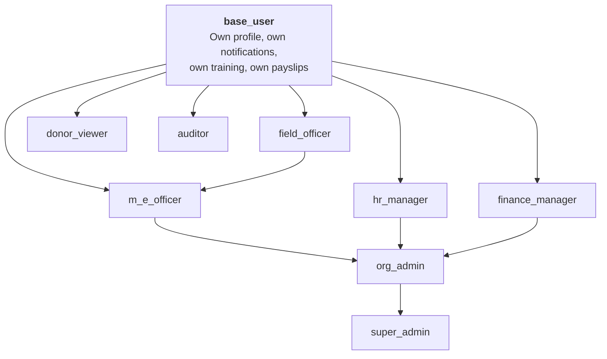
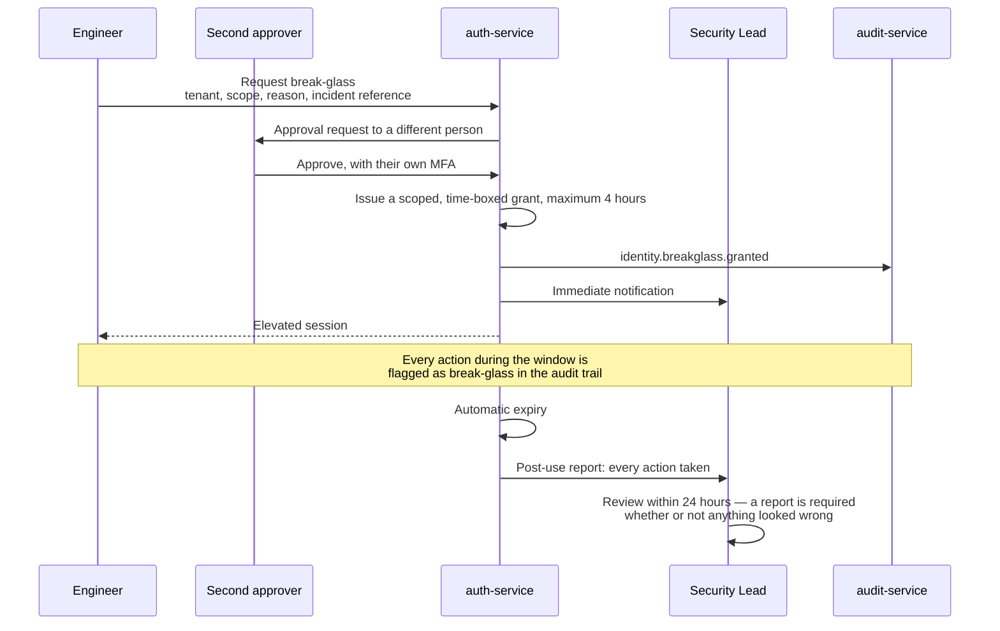
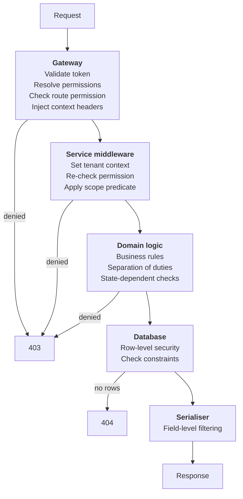

# 15 — RBAC and Authorization Matrix

> **Document:** NGO Intelligence Suite — SDD v2.0
> **Chapter:** 15 — RBAC and Authorization Matrix
> **Owner:** Security Lead
> **Status:** Approved
> **Last Reviewed:** 2026-06-20
> **Review Cadence:** Quarterly
> **Related ADRs:** —

---

## 15.1 The model

Authorisation answers four questions, and conflating them is how systems end up with either an unusable permission model or an ineffective one.

| Question | Answered by | Example |
| --- | --- | --- |
| Can this role do this kind of thing at all? | Permission | `finance_manager` holds `grant:disbursement:create` |
| Can this user do it to *this* record? | Scope rule | A field officer may only touch beneficiaries in their assigned programmes |
| Can this user see *this field* of the record? | Field-level rule | Precise GPS is visible only with `beneficiary:location:read_precise` |
| Is this specific act permitted right now? | Business rule | A user may not approve a payroll run they prepared |

All four are enforced. A permission alone is never sufficient authorisation for a sensitive operation.

### 15.1.1 Permission naming

```
<resource>:<sub-resource>:<action>
```

Two segments where there is no sub-resource: `grant:read`. Three where there is: `grant:disbursement:approve`.

Actions in use: `create`, `read`, `update`, `delete`, `approve`, `reject`, `export`, `assign`, `publish`, `merge`, `erase`, `reverse`, `configure`, `impersonate`.

### 15.1.2 Role definitions

| Role | Purpose | MFA | Typical count per tenant |
| --- | --- | --- | --- |
| `super_admin` | Platform operator, cross-tenant. **Not a tenant role** | Mandatory, hardware key | 3–5 platform-wide |
| `org_admin` | Tenant administrator: users, settings, all domains | Mandatory | 1–3 |
| `finance_manager` | Grants, budgets, disbursements, payroll approval | Mandatory | 1–2 |
| `hr_manager` | Employees, contracts, leave, payroll preparation, training compliance | Mandatory | 1–2 |
| `m_e_officer` | Beneficiaries, programmes, field data, indicators, reporting | Recommended | 2–5 |
| `field_officer` | Registration and data collection within an assignment | Optional | 5–50 |
| `donor_viewer` | Read-only view of specified grants | Recommended | 1–10 |
| `auditor` | Read-only across the tenant, plus the audit log | Mandatory | 1–2 |

> **Change from v1.0.** v1.0 listed seven roles and no permissions. `auditor` is added because assurance requires read access plus audit-log access without any mutation capability, and granting an auditor `org_admin` — the only prior option — would defeat the purpose of the audit.

### 15.1.3 Inheritance



Inheritance is additive and shallow. `m_e_officer` inherits `field_officer` because every M&E capability is a superset of field capability; `hr_manager` and `finance_manager` are siblings because neither is a superset of the other, and a design that made one inherit the other would break separation of duties.

`donor_viewer` and `auditor` inherit only `base_user` — deliberately outside the operational hierarchy, because they are external or assurance roles rather than points on an operational ladder.

---

## 15.2 The permission matrix

Legend: **C** create · **R** read · **U** update · **D** delete (soft) · **A** approve · **X** export · **—** no access · **○** own records only · **◐** scoped subset

### 15.2.1 Identity and tenant administration

| Resource | super_admin | org_admin | finance_manager | hr_manager | m_e_officer | field_officer | donor_viewer | auditor |
| --- | --- | --- | --- | --- | --- | --- | --- | --- |
| Tenants (all) | CRUD | — | — | — | — | — | — | — |
| Own tenant record | R | RU | R | R | R | — | — | R |
| Tenant settings | RU | RU | R | R | — | — | — | R |
| Tenant quotas | RU | R | — | — | — | — | — | R |
| Subscription | RU | R | R | — | — | — | — | R |
| Tenant export | C | C+A | — | — | — | — | — | — |
| Tenant offboarding | C | — | — | — | — | — | — | — |
| Users | CRUD | CRUD | R | R | R | ○R | ○R | R |
| User roles | A | A | — | — | — | — | — | R |
| User suspension | C | C | — | — | — | — | — | — |
| Custom roles | CRUD | CRU | — | — | — | — | — | R |
| Permissions catalog | R | R | R | R | R | — | — | R |
| Sessions (others) | RD | RD | — | — | — | — | — | R |
| Own sessions | RD | RD | RD | RD | RD | RD | RD | RD |
| MFA enrollment (own) | CRUD | CRUD | CRUD | CRUD | CRUD | CRUD | CRUD | CRUD |
| MFA reset (others) | C | C | — | — | — | — | — | — |
| Break-glass elevation | C | — | — | — | — | — | — | — |
| Impersonation | C | — | — | — | — | — | — | — |

### 15.2.2 Grant management

| Resource | super_admin | org_admin | finance_manager | hr_manager | m_e_officer | field_officer | donor_viewer | auditor |
| --- | --- | --- | --- | --- | --- | --- | --- | --- |
| Donors | R | CRUD | CRUD | — | R | — | — | R |
| Donor contacts | R | CRUD | CRUD | — | R | — | — | R |
| Grants | R | CRUD | CRUD | R | R | ◐R | ◐R | R |
| Grant status change | — | U | U | — | — | — | — | R |
| Grant closure | — | A | A | — | — | — | — | R |
| Grant budgets | R | CRU | CRU | R | R | — | ◐R | R |
| Budget lines | R | CRUD | CRUD | R | R | — | ◐R | R |
| Budget revisions | R | C+A | C | — | R | — | ◐R | R |
| Disbursements | R | CRU | CRU | — | — | — | ◐R | R |
| Disbursement approval | — | A | A | — | — | — | — | R |
| Expenditures | R | CRU | CRU | R | R | — | — | R |
| Burn rate | R | R | R | R | R | — | ◐R | R |
| Compliance score | R | R | R | — | R | — | ◐R | R |
| Grant reports | R | CRU | CRU | — | CRU | — | ◐R | R |
| Report submission | — | A | A | — | C | — | — | R |
| Report periods | R | CRUD | CRUD | — | R | — | ◐R | R |
| Grant activities | R | CRUD | CRU | — | CRU | R | ◐R | R |
| Grant documents | R | CRUD | CRUD | — | CRU | — | ◐R | R |
| Grant export | X | X | X | — | X | — | ◐X | X |
| IATI publication | — | A | A | — | — | — | — | R |

### 15.2.3 HR and payroll

| Resource | super_admin | org_admin | finance_manager | hr_manager | m_e_officer | field_officer | donor_viewer | auditor |
| --- | --- | --- | --- | --- | --- | --- | --- | --- |
| Departments | R | CRUD | R | CRUD | R | — | — | R |
| Positions | R | CRUD | R | CRUD | R | — | — | R |
| Employees (list, non-sensitive) | R | R | R | CRUD | R | R | — | R |
| Employee PII | — | R | — | R | — | — | — | R |
| Own employee record | R | R | R | R | R | R | — | R |
| Contracts | — | R | R | CRUD | — | ○R | — | R |
| Contract salary | — | R | R | CRU | — | ○R | — | R |
| Leave types | — | CRUD | — | CRUD | — | — | — | R |
| Leave balances | — | R | — | RU | — | ○R | — | R |
| Leave requests | — | R | — | RUA | ○CR | ○CR | — | R |
| Leave approval | — | A | — | A | — | — | — | R |
| Payroll runs | — | R | RA | CRU | — | — | — | R |
| Payroll preparation | — | — | C | C | — | — | — | — |
| **Payroll approval** | — | — | **A** | — | — | — | — | R |
| Payroll reversal | — | A | A | — | — | — | — | R |
| Payroll records (all) | — | R | R | R | — | — | — | R |
| Own payslip | R | R | R | R | R | R | — | R |
| Other payslips | — | R | R | R | — | — | — | R |
| Statutory rules | R | R | R | R | — | — | — | R |
| Statutory rule change | — | — | C+A | C | — | — | — | R |
| Statutory returns | — | R | RX | RX | — | — | — | RX |
| Payroll export | — | X | X | X | — | — | — | X |
| Cost allocations | — | RU | CRU | R | — | — | — | R |

Two rows carry the most weight. `hr_manager` prepares payroll and **cannot approve it**; `finance_manager` approves and **cannot prepare it**. This is not a convenience arrangement — it is the control that means a single compromised or dishonest account cannot move money.

### 15.2.4 Beneficiary and programme

| Resource | super_admin | org_admin | finance_manager | hr_manager | m_e_officer | field_officer | donor_viewer | auditor |
| --- | --- | --- | --- | --- | --- | --- | --- | --- |
| Beneficiaries (count, aggregate) | R | R | R | — | R | ◐R | R | R |
| Beneficiary records | — | R | — | — | CRU | ◐CRU | — | R |
| **Beneficiary PII** | — | R | — | — | R | ◐R | — | R |
| Precise GPS | — | R | — | — | R | ◐R | — | R |
| Coarse location | — | R | R | — | R | ◐R | R | R |
| National identifier | — | — | — | — | R | ◐C | — | R |
| Households | — | R | — | — | CRU | ◐CRU | — | R |
| Duplicate review | — | R | — | — | RU | ◐R | — | R |
| Beneficiary merge | — | A | — | — | C | — | — | R |
| **Beneficiary erasure** | — | — | — | — | C | — | — | R |
| Erasure approval | — | A | — | — | — | — | — | R |
| Consent records | — | R | — | — | CRU | ◐CR | — | R |
| Vulnerability assessment | — | R | — | — | CRU | ◐CR | — | R |
| Scoring configuration | — | CU | — | — | R | — | — | R |
| Programmes | R | CRUD | R | — | CRUD | ◐R | ◐R | R |
| Programme enrollments | — | R | — | — | CRUD | ◐CR | — | R |
| Programme activities | — | R | R | — | CRUD | ◐RU | ◐R | R |
| Attendance | — | R | — | — | CRU | ◐CR | — | R |
| **Bulk export over 100** | — | X+A | — | — | X+A | — | — | X+A |
| Aggregate export | X | X | X | — | X | — | ◐X | X |

Beneficiary PII is the most restricted data in the platform. `finance_manager` and `hr_manager` — both senior roles — have no access to it, because nothing in their work requires it. `donor_viewer` sees aggregates only, at coarse location, with k-anonymity suppression applied.

### 15.2.5 Field data

| Resource | super_admin | org_admin | finance_manager | hr_manager | m_e_officer | field_officer | donor_viewer | auditor |
| --- | --- | --- | --- | --- | --- | --- | --- | --- |
| Form templates | R | CRUD | — | — | CRUD | ◐R | — | R |
| Form publication | — | A | — | — | A | — | — | R |
| Validation rules | R | CRUD | — | — | CRUD | — | — | R |
| Form assignments | — | CRUD | — | — | CRUD | ○R | — | R |
| Submissions | — | R | — | — | CRUD | ◐CR | — | R |
| Submission PII values | — | R | — | — | R | ◐R | — | R |
| Review queue | — | R | — | — | RU | ◐R | — | R |
| Submission resolution | — | U | — | — | U | — | — | R |
| Activity linkage | — | RU | R | — | CRU | — | ◐R | R |
| Sync sessions | R | R | — | — | R | ○R | — | R |
| Device inventory | R | R | — | — | R | ○R | — | R |
| Remote wipe | C | C | — | — | — | — | — | R |
| Submission export | — | X | — | — | X | — | — | X |

### 15.2.6 Learning

| Resource | super_admin | org_admin | finance_manager | hr_manager | m_e_officer | field_officer | donor_viewer | auditor |
| --- | --- | --- | --- | --- | --- | --- | --- | --- |
| Courses | R | CRUD | — | CRUD | ○R | ○R | — | R |
| Course publication | — | A | — | A | — | — | — | R |
| Modules, lessons | R | CRUD | — | CRUD | ○R | ○R | — | R |
| Assessments, questions | — | CRUD | — | CRUD | — | — | — | R |
| Assessment answers | — | R | — | R | — | — | — | R |
| Mandatory rules | — | CRUD | — | CRUD | — | — | — | R |
| Enrollments (all) | — | R | — | CRUD | R | — | — | R |
| Own enrollments | R | R | R | R | R | R | — | R |
| Progress (all) | — | R | — | R | R | — | — | R |
| Own progress | RU | RU | RU | RU | RU | RU | — | R |
| Assessment attempts (own) | C | C | C | C | C | C | — | — |
| Certificates (all) | — | R | — | R | R | — | — | R |
| Own certificates | R | R | R | R | R | R | — | R |
| Compliance status | R | R | R | R | R | — | — | R |
| Compliance export | — | X | — | X | X | — | — | X |

### 15.2.7 Platform services

| Resource | super_admin | org_admin | finance_manager | hr_manager | m_e_officer | field_officer | donor_viewer | auditor |
| --- | --- | --- | --- | --- | --- | --- | --- | --- |
| Files (own uploads) | CRUD | CRUD | CRUD | CRUD | CRUD | CRUD | — | R |
| Files (all in tenant) | R | R | ◐R | ◐R | ◐R | ◐R | ◐R | R |
| File deletion | D | D | ○D | ○D | ○D | ○D | — | — |
| Notification templates | R | CRUD | — | — | — | — | — | R |
| Own preferences | RU | RU | RU | RU | RU | RU | RU | RU |
| Delivery log | R | R | — | — | — | — | — | R |
| Reports | R | CRUD | CRUD | CRU | CRUD | — | ◐R | R |
| Report approval | — | A | A | — | A | — | — | R |
| Scheduled reports | — | CRUD | CRUD | CRU | CRUD | — | — | R |
| **Audit log** | R | R | — | — | — | — | — | **RX** |
| Audit export | R | — | — | — | — | — | — | X |
| Dashboards | R | RU | R | R | R | — | ◐R | R |
| Dashboard config | — | CRUD | CRU | — | CRU | — | — | R |
| KPI definitions | R | CRUD | R | R | CRU | — | — | R |
| Superset BI | — | R | R | R | R | — | — | R |
| Integrations | R | CRUD | R | — | — | — | — | R |
| Integration credentials | — | CU | — | — | — | — | — | — |
| Webhooks | R | CRUD | — | — | — | — | — | R |
| AI generation | — | C | C | — | C | — | — | R |
| AI approval | — | A | A | — | A | — | — | R |
| AI configuration | R | RU | — | — | — | — | — | R |
| AI usage and cost | R | R | R | — | — | — | — | R |

`auditor` is the only tenant role with export rights on the audit log. `org_admin` can read it — necessary for investigating an incident in their own organisation — but not export it in bulk, which preserves a separation between operational administration and assurance.

---

## 15.3 Scope rules

A permission says what kind of thing a role may do. A scope rule says which records.

| Role | Scope | Enforcement |
| --- | --- | --- |
| `super_admin` | All tenants. Every cross-tenant access is audited and alerted | Explicit tenant selection, never implicit |
| `org_admin` | Own tenant, all records | RLS |
| `finance_manager` | Own tenant. Optionally restricted to specified grants or cost centres | RLS plus a grant scope list |
| `hr_manager` | Own tenant. Optionally restricted to specified departments | RLS plus a department scope list |
| `m_e_officer` | Own tenant. Optionally restricted to specified programmes and locations | RLS plus a programme scope list |
| `field_officer` | **Assigned programmes and locations only** | RLS plus an assignment join; enforced in the query, not by filtering results after the fact |
| `donor_viewer` | **Explicitly listed grants only**, and only the fields configured for donor visibility | RLS plus an explicit grant allow-list |
| `auditor` | Own tenant, read-only, all records | RLS |

The `field_officer` scope is the one most likely to be implemented wrongly. The assignment predicate must be part of the SQL, not a post-query filter — a filter applied after fetching still transfers the data into the process, still appears in a heap dump, and fails open if the filter has a bug.

### 15.3.1 Donor scoping

A donor's view is deliberately narrow, because a donor representative is an external party:

| Visible | Not visible |
| --- | --- |
| Grants they fund | Any other grant |
| Budget at the category level | Line-item detail unless configured |
| Disbursements they made | Other funding sources |
| Aggregate indicator progress | Individual submissions |
| Reach figures with k-anonymity applied | Any beneficiary record |
| Submitted reports | Draft reports |
| Coarse geography | Precise coordinates |
| — | Staff records, payroll, other donors' data, the audit log |

---

## 15.4 Field-level rules

| Field | Requires | Otherwise |
| --- | --- | --- |
| `beneficiaries.first_name`, `last_name` | `beneficiary:record:read_pii` | Rendered as the `unique_id` only |
| `beneficiaries.dob` | `beneficiary:record:read_pii` | Age band shown |
| `beneficiaries.national_id` | `beneficiary:record:read_pii` plus a purpose | Absent |
| `beneficiaries.phone` | `beneficiary:record:read_pii` | Absent |
| `beneficiaries.location_gps` | `beneficiary:location:read_precise` | Settlement name only |
| `employees.*_encrypted` | `hr:employee:pii:read` | `display_name` only |
| `employees` bank details | `hr:employee:read_pii` | Absent |
| `contracts.gross_salary` | `hr:contract:salary:read` | Absent |
| `payroll_records` financial fields | `payroll:run:read`, or own record | Absent |
| `submission_values` where the field is PII | `field:submission:read_pii` | Redacted marker |
| `audit_events.before_state`, `after_state` | `audit:log:read_pii_values` | Metadata only |
| `ai_generations.prompt_stored` | `ai:prompt:read` | Absent |

Field-level filtering happens in the service serialisation layer, driven by the same permission set the gateway resolved. It is applied uniformly by the response serialiser rather than per endpoint, because a per-endpoint approach guarantees that one endpoint eventually forgets.

---

## 15.5 Separation of duties

Six enforced separations. Each is checked in the domain layer and, where expressible, at the database level as well.

| # | Operation | Rule | Database enforcement |
| --- | --- | --- | --- |
| SoD-1 | Payroll | Preparer ≠ approver, and they must hold different roles | `payroll_approver_differs` check constraint |
| SoD-2 | Disbursement | Creator ≠ approver | `disbursements_approver_differs` check constraint |
| SoD-3 | Beneficiary merge | Performer ≠ approver | `merge_dual_auth` check constraint |
| SoD-4 | Statutory rules | Creator ≠ approver | `tax_bands_dual_authorised` check constraint |
| SoD-5 | Bulk beneficiary export | Requester ≠ approver, and the DPO is notified | Application layer plus audit |
| SoD-6 | Beneficiary erasure | Requester ≠ approver, DPO approval required | Application layer plus audit |

Encoding these as database constraints rather than only in application logic is deliberate. An application bug, a direct database operation during an incident, or a future refactor cannot bypass a check constraint.

### 15.5.1 Small-tenant reality

A tenant with three staff cannot always satisfy dual authorisation. The platform does not silently relax the rule:

| Situation | Behaviour |
| --- | --- |
| No second eligible approver exists | The operation is blocked with a specific error naming the missing role |
| Tenant requests an exception | `org_admin` may grant a documented, time-boxed exception for a specific operation type, which is audited and reported monthly |
| Emergency | Break-glass elevation, heavily audited, notifying the Executive Director |

Making the constraint visible rather than optional is the point. A tenant that cannot separate duties should know that, and should be able to explain the compensating control to their auditor.

---

## 15.6 Break-glass access

Platform engineers have no standing access to tenant data. Emergency access exists and is deliberately uncomfortable to use.



| Property | Value |
| --- | --- |
| Approval | A second person, always |
| Maximum duration | 4 hours, non-extendable. A longer need requires a fresh request |
| Scope | Named tenant and named resource types |
| Notification | Security Lead immediately; the tenant's `org_admin` within 24 hours unless a security investigation requires otherwise |
| Audit | Every action flagged; the record is retained 7 years |
| Review | Mandatory within 24 hours, documented |
| Frequency | Tracked. More than two uses per quarter triggers a review of why routine work requires emergency access |

The tenant notification is important. A platform that can silently access tenant data is a platform tenants cannot fully trust; one that always tells them is one they can.

---

## 15.7 Implementation

### 15.7.1 Enforcement points



Re-checking the permission in the service rather than trusting the gateway is not redundancy for its own sake. It means a service reachable through any path other than the gateway — a misconfigured network policy, a future internal caller — is still protected.

### 15.7.2 Route declaration

```typescript
router.post(
  '/grants/:id/disbursements',
  requirePermission('grant:disbursement:create'),
  requireScope('grant', 'id'),
  requireIdempotencyKey(),
  validate(createDisbursementSchema),
  disbursementController.create
);

router.post(
  '/payroll-runs/:id/approve',
  requirePermission('payroll:run:approve'),
  requireStepUpAuth({ maxAgeSeconds: 300 }),
  requireSeparationOfDuties('preparer'),
  payrollController.approve
);
```

The route registry refuses to register a route without a `requirePermission` declaration, and startup fails with the offending route named. There is no way to accidentally ship an unprotected endpoint.

### 15.7.3 Caching

The permission *set* for a user is cached for 5 minutes and invalidated on any role change. Authorisation *decisions* for specific resources are never cached, because they depend on data that changes — a field officer's assignment can be revoked mid-session, and a cached decision would honour the revoked scope until it expired.

---

## 15.8 Governance

| Control | Cadence | Owner |
| --- | --- | --- |
| Access recertification | Quarterly. Each `org_admin` confirms their users and roles; unconfirmed accounts are suspended | Security Lead |
| Privileged access review | Monthly. Every `super_admin` and `org_admin` account is reviewed for continued need | Security Lead |
| Permission matrix review | Quarterly, or on any change | Security Lead |
| Dormant account sweep | Monthly. 90 days inactive is suspended, 180 days is disabled | Automated |
| Break-glass review | Per use, within 24 hours; aggregate quarterly | Security Lead |
| Separation-of-duties exception review | Monthly | Security Lead and Finance |
| Role change audit | Continuous alerting | Automated |

### 15.8.1 Testing the matrix

The matrix in this chapter is the source of truth for an automated test suite. For every role and every endpoint, the suite asserts the expected outcome. A change to the matrix that is not reflected in the implementation fails the build, and a change to the implementation that is not reflected in the matrix fails it too.

| Test | Assertion |
| --- | --- |
| Positive | Each role can perform every operation the matrix grants |
| Negative | Each role is denied every operation the matrix withholds. This is the larger and more important half |
| Scope | A field officer cannot reach a beneficiary outside their assignment, through any endpoint |
| Field-level | A response never contains a field the caller's permissions exclude |
| Cross-tenant | Every endpoint returns `404` for a resource in another tenant |
| Separation of duties | Each of SoD-1 through SoD-6 is attempted and rejected |
| Escalation | A user cannot grant themselves a permission they do not hold |
| Token tampering | A token with modified claims is rejected |
| Header forgery | A client-supplied `X-Tenant-ID` is ignored and logged |
| Unprotected route | No route exists without a declared permission |

The negative tests matter more than the positive ones. A feature that does not work is reported within a day by a user; an authorisation gap that lets someone see data they should not is reported by nobody, possibly ever.
