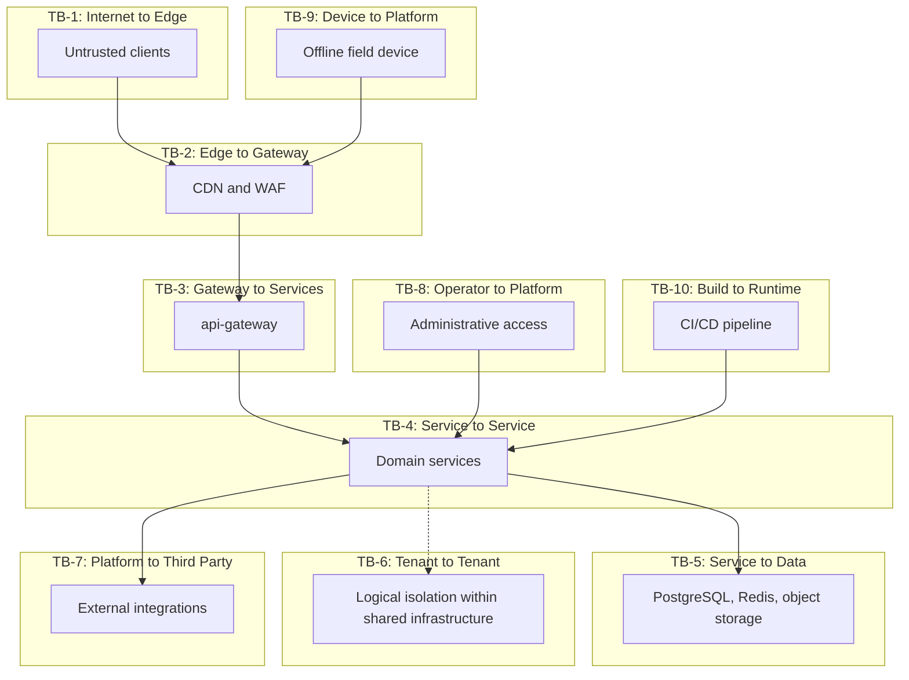

# 16 — Threat Model (STRIDE)

> **Document:** NGO Intelligence Suite — SDD v2.0
> **Chapter:** 16 — Threat Model
> **Owner:** Security Lead
> **Status:** Approved
> **Last Reviewed:** 2026-06-20
> **Review Cadence:** Quarterly, and on any new trust boundary
> **Related ADRs:** [ADR-0015](adr/0015-application-layer-pii-encryption.md)

---

## 16.1 Method and scope

STRIDE applied per trust boundary: Spoofing, Tampering, Repudiation, Information disclosure, Denial of service, Elevation of privilege. Threats are scored on likelihood × impact, mitigations are mapped to specific controls in other chapters, and residual risk is recorded.

**In scope:** the platform, its data stores, its clients, its integrations, and the operational access paths into it.

**Out of scope, handled elsewhere:** cloud provider infrastructure compromise (transferred to the provider, with compensating controls), physical security of tenant offices, and tenant staff vetting. These appear in the risk register rather than here.

### 16.1.1 Scoring

| Likelihood | Meaning |
| --- | --- |
| 5 Almost certain | Will occur without a specific control |
| 4 Likely | Expected within a year |
| 3 Possible | Plausible within three years |
| 2 Unlikely | Requires unusual circumstances |
| 1 Rare | Requires a sophisticated, targeted effort |

| Impact | Meaning |
| --- | --- |
| 5 Catastrophic | Physical harm to beneficiaries or staff; platform-ending loss of trust |
| 4 Severe | Cross-tenant breach; material financial loss; regulatory action |
| 3 Moderate | Single-tenant data exposure; extended outage; audit finding |
| 2 Minor | Limited exposure of non-sensitive data; brief degradation |
| 1 Negligible | No material consequence |

| Score | Band | Requirement |
| --- | --- | --- |
| 20–25 | **Critical** | Must be mitigated before the affected feature ships. No exceptions |
| 12–19 | **High** | Must be mitigated before the release containing it |
| 6–11 | **Medium** | Mitigated within the phase, or formally accepted with a compensating control |
| 1–5 | **Low** | Accepted and monitored |

---

## 16.2 Asset register

| Asset | Classification | Why it matters | Worst case |
| --- | --- | --- | --- |
| A-1 Beneficiary identity data | **Restricted** | Names, ages, locations and displacement status of people in a conflict environment | Individuals located and harmed |
| A-2 Beneficiary location data | **Restricted** | Precise coordinates of where displaced people live and gather | Targeting of a population or a distribution site |
| A-3 Employee personal and salary data | Confidential | Identity, tax numbers, bank details, salaries | Identity theft, internal conflict, staff safety |
| A-4 Financial records | Confidential | Grants, budgets, disbursements | Fraud, donor relationship loss, funding suspension |
| A-5 Payroll data | Confidential | Statutory calculations and payments | Regulatory penalty, staff welfare harm |
| A-6 Authentication credentials | **Restricted** | Password hashes, MFA secrets, tokens | Full account compromise |
| A-7 Encryption keys | **Restricted** | Tenant KEKs, signing keys | Total confidentiality failure |
| A-8 Audit trail | Confidential | The record of everything | Undetectable tampering; loss of assurance |
| A-9 Platform availability | Operational | Field operations depend on it | Programme delivery interruption |
| A-10 Tenant isolation | **Restricted** | The boundary between organisations | Existential trust failure |
| A-11 Source code and pipeline | Confidential | Build and deployment path | Supply chain compromise |
| A-12 Third-party credentials | **Restricted** | Provider API keys | Lateral movement, financial exposure |
| A-13 Consent records | Confidential | Evidence of lawful basis | Inability to demonstrate compliance |
| A-14 Statutory rule data | Confidential | Tax bands and rates | Systematic payroll error |

---

## 16.3 Threat actors

| Actor | Capability | Motivation | Targets | Realistic? |
| --- | --- | --- | --- | --- |
| TA-1 Opportunistic criminal | Low. Automated scanning, credential stuffing, commodity phishing | Financial | A-3, A-4, A-6 | **Yes, continuously** |
| TA-2 Organised crime | Medium. Targeted phishing, purchased access, ransomware | Financial | A-4, A-5, A-9 | Yes |
| TA-3 State or armed-group actor | High. Targeted intrusion, insider recruitment, device seizure, legal or physical compulsion | Locate individuals or populations | **A-1, A-2** | **Yes — this is the defining threat** |
| TA-4 Malicious insider, platform | High. Legitimate access, knowledge of controls | Financial, ideological, coercion | All | Low likelihood, very high impact |
| TA-5 Malicious insider, tenant | Medium. Legitimate tenant access | Financial, personal, coercion | A-1, A-3, A-4 | Yes |
| TA-6 Negligent insider | Low. No intent | — | All | **Almost certain over time** |
| TA-7 Compromised third party | Varies | Depends on who compromised them | A-1, A-12 | Yes |
| TA-8 Hostile tenant | Medium. Legitimate platform access, seeking to reach another tenant | Competitive, ideological | A-10 | Low but must be assumed |
| TA-9 Researcher | Medium. Disclosure-oriented | Reputation | Any | Yes, and welcome |

TA-3 is what makes this threat model different from a typical SaaS platform's. An adversary who wants to know where a specific displaced family is living is not deterred by the economics that deter TA-1, and may have capabilities including legal compulsion of a hosting provider, physical seizure of a device at a checkpoint, or coercion of a staff member. Controls that assume a rational cost-benefit attacker are insufficient against them.

---

## 16.4 Trust boundaries

---

## 16.5 STRIDE enumeration

### TB-1 — Internet to Edge

| ID | S/T/R/I/D/E | Threat | L | I | Score | Band | Mitigation | Residual |
| --- | --- | --- | --- | --- | --- | --- | --- | --- |
| T-1.1 | S | Credential stuffing using breached passwords | 5 | 4 | **20** | Critical | Breached-password checking at set time; lockout; per-IP rate limiting; MFA on privileged roles; anomalous-login alerting ([14 §14.2](14-security-architecture.md)) | Low |
| T-1.2 | S | Phishing a finance or HR manager | 4 | 5 | **20** | Critical | Mandatory MFA on those roles; step-up authentication for approvals; separation of duties means one compromised account cannot complete a payment; login notifications; staff training via the LMS | Medium — phishing resistance is only as good as the second factor; hardware keys are recommended and mandatory for `super_admin` |
| T-1.3 | D | Volumetric DDoS | 3 | 3 | 9 | Medium | Cloudflare absorption, Cloud Armor, origin rate limiting, autoscaling | Low |
| T-1.4 | D | Application-layer DoS via expensive endpoints | 4 | 3 | 12 | High | Per-endpoint rate limits, query timeouts, pagination caps, asynchronous processing for heavy operations, circuit breakers | Low |
| T-1.5 | I | TLS downgrade or interception | 2 | 5 | 10 | Medium | TLS 1.3, HSTS preload, no downgrade path, certificate transparency monitoring | Low |
| T-1.6 | T | Parameter tampering to access another tenant | 4 | 5 | **20** | Critical | `tenant_id` never accepted from the client; gateway strips context headers; RLS; `404` not `403`; automated cross-tenant test suite | Low |
| T-1.7 | E | Exploiting an unauthenticated endpoint | 3 | 4 | 12 | High | Default-deny route registry; startup fails on an undeclared route; DAST coverage | Low |
| T-1.8 | I | User enumeration via login or reset responses | 4 | 2 | 8 | Medium | Constant-time responses, identical messages, rate limiting | Low |
| T-1.9 | S | Session hijacking via stolen token | 3 | 4 | 12 | High | Short access tokens; memory-only storage; `httpOnly` refresh cookies; rotation with reuse detection; revocation deny-list | Low |
| T-1.10 | T | CSRF against a state-changing endpoint | 3 | 3 | 9 | Medium | `SameSite=Strict`; bearer token in a header, not a cookie; CORS allow-list; no cookie-authenticated mutations | Low |

### TB-2 — Edge to Gateway

| ID | Type | Threat | L | I | Score | Band | Mitigation | Residual |
| --- | --- | --- | --- | --- | --- | --- | --- | --- |
| T-2.1 | S | Origin reached directly, bypassing the WAF | 3 | 4 | 12 | High | Origin accepts only CDN source ranges with an authenticated origin pull header; origin IP not published | Low |
| T-2.2 | T | Header injection to forge tenant or user context | 4 | 5 | **20** | Critical | Gateway strips all `X-Tenant-ID`, `X-User-*`, `X-Internal-*` headers unconditionally before proxying; presence is logged as a security event | Low |
| T-2.3 | I | Cache poisoning serving one tenant's response to another | 2 | 5 | 10 | Medium | Authenticated responses are `no-store`; the CDN caches only static assets; cache keys never include authenticated content | Low |
| T-2.4 | D | WAF rule causing false-positive blocking of legitimate traffic | 3 | 3 | 9 | Medium | Rules tested in staging in detection mode first; per-rule metrics; documented rapid-disable procedure | Medium — a false positive that blocks a field sync is invisible until the officer reports it |

### TB-3 — Gateway to Services

| ID | Type | Threat | L | I | Score | Band | Mitigation | Residual |
| --- | --- | --- | --- | --- | --- | --- | --- | --- |
| T-3.1 | S | A compromised pod impersonating the gateway | 2 | 5 | 10 | Medium | mTLS with service identity; NetworkPolicy permits only the gateway to reach service ports; authorisation policy per service | Low |
| T-3.2 | T | Modifying the injected context in transit | 1 | 5 | 5 | Low | mTLS with integrity protection | Low |
| T-3.3 | E | Bypassing the gateway by reaching a service directly | 3 | 5 | **15** | High | Services are not exposed by any ingress route; default-deny NetworkPolicy; services independently re-validate permissions rather than trusting the gateway | Low |
| T-3.4 | R | An action taken with no attributable actor | 3 | 4 | 12 | High | Correlation ID mandatory; requests without valid context are rejected; audit written from the outbox in the same transaction | Low |

### TB-4 — Service to Service

| ID | Type | Threat | L | I | Score | Band | Mitigation | Residual |
| --- | --- | --- | --- | --- | --- | --- | --- | --- |
| T-4.1 | S | One service impersonating another | 2 | 4 | 8 | Medium | mTLS with per-service identity; authorisation policies enumerate permitted callers | Low |
| T-4.2 | T | Injecting a forged event onto the bus | 2 | 5 | 10 | Medium | Redis is not reachable outside the mesh; AUTH plus TLS; events carry `source_service` and consumers validate the producer is legitimate for that event type | Low |
| T-4.3 | I | Event payloads carrying PII into a less-controlled store | 4 | 4 | **16** | High | Events carry identifiers and, where necessary, still-encrypted values; a schema validation rule rejects plaintext PII field names in payloads; review checklist item | Medium — enforcement is partly by convention, so it is a named review gate |
| T-4.4 | D | A poison event stalling a consumer group | 4 | 3 | 12 | High | Retry limits, DLQ, per-consumer isolation so one group's stall does not affect others, DLQ depth alerting | Low |
| T-4.5 | E | A compromised low-privilege service reaching high-privilege data | 3 | 5 | **15** | High | Per-service database roles with grants only on owned tables; no service can query another's tables; NOBYPASSRLS on all service roles | Low |

### TB-5 — Service to Data

| ID | Type | Threat | L | I | Score | Band | Mitigation | Residual |
| --- | --- | --- | --- | --- | --- | --- | --- | --- |
| T-5.1 | I | **Database compromise disclosing beneficiary PII** | 2 | **5** | 10 | Medium band, **but treated as Critical** because A-1 impact is catastrophic | Application-layer AES-256-GCM encryption under per-tenant KMS keys. A database dump alone yields ciphertext ([ADR-0015](adr/0015-application-layer-pii-encryption.md)) | Low — decryption additionally requires KMS access, which is separately controlled and audited |
| T-5.2 | I | Backup exfiltration | 2 | 5 | 10 | Medium, treated as High | Backups encrypted with a separate key in a separate project; immutable retention; access audited; application-layer encryption persists into backups | Low |
| T-5.3 | T | SQL injection | 2 | 5 | 10 | Medium | Parameterised queries only, enforced by lint; no dynamic SQL; ORM-free repositories with reviewed SQL; SAST; DAST | Low |
| T-5.4 | E | RLS bypass through a misconfigured role | 2 | 5 | 10 | Medium, treated as Critical | `NOBYPASSRLS` on every service role; post-migration verification that RLS is enabled and forced on every tenant table; deployment blocked otherwise | Low |
| T-5.5 | I | **Tenant context leaking between pooled connections** | 3 | **5** | **15** | High | `SET LOCAL` only, enforced by lint; transaction-scoped context; integration test asserting a returned connection has no context ([09 §9.7.3](09-data-management-strategy.md)) | Low — this is the subtlest and most dangerous defect available in the architecture |
| T-5.6 | I | Cross-tenant cache read | 3 | 5 | **15** | High | Every Redis key is tenant-prefixed by a shared helper that takes the tenant from request context; no key construction accepts a tenant parameter | Low |
| T-5.7 | D | Resource exhaustion from an unbounded query | 4 | 3 | 12 | High | Statement timeouts per role; mandatory `LIMIT`; connection pool caps; slow query alerting | Low |
| T-5.8 | T | Direct database modification during an incident | 2 | 4 | 8 | Medium | No standing access; break-glass with dual approval; all sessions recorded; audit hash chain would reveal inconsistency | Medium — a sufficiently privileged operator could act before review |

### TB-6 — Tenant to Tenant

| ID | Type | Threat | L | I | Score | Band | Mitigation | Residual |
| --- | --- | --- | --- | --- | --- | --- | --- | --- |
| T-6.1 | I | **Application bug omitting a tenant filter** | 4 | 5 | **20** | Critical | RLS makes the filter unnecessary for correctness — the database enforces it even when the application forgets. Automated cross-tenant suite on every pull request | Low. This is precisely why isolation is enforced at the lowest layer (PRIN-03) |
| T-6.2 | I | Enumerating another tenant's resources by identifier | 3 | 4 | 12 | High | UUIDs, not sequential identifiers; `404` for out-of-tenant resources; every attempt logged and alerted | Low |
| T-6.3 | I | Inferring another tenant's existence through a constraint violation | 3 | 3 | 9 | Medium | Every uniqueness constraint on tenant data is composite with `tenant_id`; error messages never echo constraint names | Low |
| T-6.4 | D | Noisy neighbour degrading others | 4 | 3 | 12 | High | Per-tenant rate limits and quotas; connection pool caps; query timeouts; per-tenant resource metrics | Medium — a single expensive tenant query can still affect shared database performance briefly |
| T-6.5 | I | Timing side channel revealing another tenant's data volume | 2 | 2 | 4 | Low | Accepted and monitored | Low |
| T-6.6 | I | Cross-tenant inference via aggregate reporting | 2 | 4 | 8 | Medium | Aggregates are computed per tenant with tenant context set; no cross-tenant aggregate exists outside `super_admin` platform reporting | Low |

### TB-7 — Platform to Third Party

| ID | Type | Threat | L | I | Score | Band | Mitigation | Residual |
| --- | --- | --- | --- | --- | --- | --- | --- | --- |
| T-7.1 | I | **Beneficiary PII reaching the LLM provider** | 3 | **5** | **15** | High | Redaction gate as a separate component that blocks rather than sanitises; prompts constructed from aggregates only; free-text field data never enters a prompt; every generation logged and reviewable ([18](18-ai-llm-architecture.md)) | Low |
| T-7.2 | T | **Prompt injection via a field submission** | 3 | 4 | 12 | High | Field-submitted free text is never placed in a prompt — the structural control, not a filtering one. Output guardrails additionally verify that every figure in generated text exists in the structured input | Low |
| T-7.3 | S | Forged inbound webhook creating a false payment confirmation | 3 | 4 | 12 | High | HMAC signature verification with constant-time comparison; timestamp window; provider IP allow-list; confirmations never create financial records, only update status | Low |
| T-7.4 | I | A compromised provider exposing data we sent them | 2 | 4 | 8 | Medium | Data minimisation per integration; no PII to SMS; no PII to the LLM; data processing agreements; sub-processor register | Medium — dependent on the provider's own controls |
| T-7.5 | I | Credential theft enabling provider-side action | 2 | 4 | 8 | Medium | Secret Manager, per-environment credentials, quarterly rotation, least-privilege provider scopes | Low |
| T-7.6 | I | Over-publication to IATI | 3 | 5 | **15** | High | Explicit exclusion policy enforced in code, not configuration; k-anonymity; location generalised to admin2; tenants cannot override ([12 §12.4.3](12-integration-architecture.md)) | Low |
| T-7.7 | E | SSRF via a tenant-configured webhook URL | 3 | 4 | 12 | High | Webhook targets validated against private, link-local and metadata address ranges; egress allow-list; no server-side fetch of user-supplied URLs | Low |

T-7.1 and T-7.2 are the LLM entries at this boundary, and they are the two that matter most here. The AI surface has a further nine threats — cost abuse, model drift, approval fatigue, cache leakage and others — which do not sit cleanly in any single boundary and are enumerated separately as `AIT-1` to `AIT-11` in [18 §18.12](18-ai-llm-architecture.md). Those identifiers are independent of this chapter's boundary numbering.

### TB-8 — Operator to Platform

| ID | Type | Threat | L | I | Score | Band | Mitigation | Residual |
| --- | --- | --- | --- | --- | --- | --- | --- | --- |
| T-8.1 | E | **Malicious platform insider accessing beneficiary data** | 2 | **5** | 10 | Medium band, **treated as Critical** | No standing access; break-glass requires a second approver; 4-hour maximum; every action flagged and reviewed within 24 hours; tenant notified; per-tenant encryption keys mean database access alone is insufficient | Medium — a determined insider with both database and KMS access remains a real risk, addressed by monitoring and separation rather than prevention |
| T-8.2 | R | An operator denying an action they took | 2 | 4 | 8 | Medium | Recorded sessions; immutable audit; hash chain; per-person credentials with no shared accounts | Low |
| T-8.3 | S | Compromise of an operator's workstation | 3 | 5 | **15** | High | MFA with hardware keys for `super_admin`; identity-aware proxy; no long-lived credentials on endpoints; managed devices; session recording | Medium |
| T-8.4 | T | Unauthorised production change | 3 | 4 | 12 | High | Infrastructure as code; protected branches; required review; signed images; admission control; drift detection | Low |
| T-8.5 | E | Coercion of an operator by a state actor | 1 | 5 | 5 | Low band, **treated seriously given TA-3** | Dual approval for privileged access; per-tenant key separation; tenant notification of access; a documented legal-request handling procedure requiring legal review and tenant notification where lawful | Medium — a legally compelled disclosure cannot be technically prevented, only made visible and minimised |

### TB-9 — Device to Platform

| ID | Type | Threat | L | I | Score | Band | Mitigation | Residual |
| --- | --- | --- | --- | --- | --- | --- | --- | --- |
| T-9.1 | I | **Device seized or lost containing beneficiary data** | 4 | 5 | **20** | Critical | Local cache encrypted under a session-derived key that does not survive a browser restart; minimum necessary records, capped at 500; 72-hour TTL; remote wipe on next contact; no precise coordinates cached ([13 §13.3.2](13-offline-first-architecture.md)) | Medium — a device seized while unlocked and in session remains exposed. Officers are trained to lock devices and the session key is memory-only |
| T-9.2 | S | Stolen device used to authenticate | 3 | 4 | 12 | High | Session revocation; device binding; 8-hour token; revocation applied before any other sync operation | Low |
| T-9.3 | T | A modified client submitting falsified data | 2 | 3 | 6 | Medium | Server-side validation of everything; GPS plausibility checks; capture-time consistency checks; anomaly flagging for review | Medium — a determined officer can falsify field data regardless of client controls; this is a programme assurance matter, and the platform's contribution is detection |
| T-9.4 | D | Sync storm after a regional outage | 4 | 2 | 8 | Medium | HPA to 10 replicas; per-tenant sync rate limits; queue-based intake; batch processing | Low |
| T-9.5 | I | Data leaking to another user of a shared device | 3 | 4 | 12 | High | Per-user storage namespace with a per-user key; wipe on logout; explicit warning when unsynced data exists | Low |
| T-9.6 | T | Malicious service worker from a compromised origin | 1 | 5 | 5 | Low | Service workers are origin-scoped; strict CSP; subresource integrity; signed releases | Low |

### TB-10 — Build to Runtime

| ID | Type | Threat | L | I | Score | Band | Mitigation | Residual |
| --- | --- | --- | --- | --- | --- | --- | --- | --- |
| T-10.1 | T | Malicious dependency introduced through the supply chain | 3 | 5 | **15** | High | Lock files with integrity hashes; dependency scanning; SBOM; human review of new dependencies; automated updates limited to patch versions of approved packages | Medium — a sophisticated supply chain attack on a widely used package remains difficult to detect |
| T-10.2 | T | Compromised CI credentials deploying a malicious image | 2 | 5 | 10 | Medium | Workload identity federation, no long-lived CI credentials; protected branches; required review; signed images; admission control rejects unsigned images | Low |
| T-10.3 | I | Secret leaked in source or build logs | 4 | 4 | **16** | High | Pre-commit and CI secret scanning; build log redaction; immediate rotation on any detection | Low |
| T-10.4 | T | Base image vulnerability | 4 | 3 | 12 | High | Distroless images, pinned by digest; daily scanning of deployed images, not just at build; patch SLAs | Low |
| T-10.5 | E | A developer deploying directly to production | 2 | 4 | 8 | Medium | No direct production access; deployment only through the pipeline; approval gate; audit | Low |

---

## 16.6 Abuse cases

Threats framed as adversary narratives, each with a corresponding test in the security suite.

| # | Abuse case | Test |
| --- | --- | --- |
| AC-1 | An armed group member obtains a field officer's phone at a checkpoint and attempts to read the beneficiary list | Device seizure simulation: locked device, restarted device, device in active session |
| AC-2 | A hostile tenant administrator crafts requests attempting to reach another tenant's data through every endpoint | Automated cross-tenant suite, run on every pull request |
| AC-3 | A dishonest finance manager creates a supplier disbursement and approves it themselves | SoD-2 test; database constraint verification |
| AC-4 | An HR manager inflates their own salary and processes the payroll run | SoD-1 test; variance detection test |
| AC-5 | A field officer registers fictitious beneficiaries to divert assistance | Anomaly detection on registration rate, GPS clustering and duplicate patterns; audit review |
| AC-6 | An attacker submits field data containing prompt-injection text hoping it reaches the LLM | Injection corpus test asserting field text never enters a prompt |
| AC-7 | A departing employee bulk-exports the beneficiary registry | Export threshold, dual authorisation, DPO alerting, volume anomaly detection |
| AC-8 | An attacker with a stolen refresh token maintains persistent access | Reuse detection test: the family is revoked and the user notified |
| AC-9 | A donor representative attempts to view a grant they do not fund | Scope test across every donor-accessible endpoint |
| AC-10 | An attacker floods the sync endpoint to exhaust capacity | Rate limit and load shedding test |
| AC-11 | An insider alters an audit record to hide an action | Hash chain verification test; append-only grant verification |
| AC-12 | A compromised `notification-service` attempts to read the beneficiary table | Database grant test: the role has no grant on that table |
| AC-13 | An attacker registers a webhook pointing at the cloud metadata endpoint | SSRF validation test against private and metadata ranges |
| AC-14 | A tenant attempts to disable the IATI exclusion policy through configuration | Configuration test: the exclusion is code, not configuration |

---

## 16.7 Threat coverage summary

| Band | Count | Status |
| --- | --- | --- |
| Critical (20–25) | 6 | All mitigated to Low or Medium residual, with mitigation verified by an automated test |
| High (12–19) | 22 | All mitigated; 5 carry Medium residual risk, each documented in [§16.8](#168-residual-risk-register) |
| Medium (6–11) | 19 | Mitigated or formally accepted |
| Low (1–5) | 4 | Accepted and monitored |

The six Critical threats, and why each is the one it is:

| ID | Threat | The control that actually stops it |
| --- | --- | --- |
| T-1.1 | Credential stuffing | MFA on every privileged role. Without it, everything else is decoration |
| T-1.2 | Phishing a finance or HR manager | Separation of duties. Even a fully compromised account cannot complete a payment alone |
| T-1.6 | Parameter tampering for cross-tenant access | The client's `tenant_id` is never trusted; the gateway derives it from a validated token |
| T-2.2 | Header injection to forge context | Unconditional header stripping at the gateway |
| T-6.1 | Application bug omitting a tenant filter | Row-level security. The database enforces what the application might forget |
| T-9.1 | Field device seizure | Memory-only session key, minimal cached data, remote wipe |

---

## 16.8 Residual risk register

| ID | Residual risk | Level | Why it cannot be fully eliminated | Compensating control | Owner | Review |
| --- | --- | --- | --- | --- | --- | --- |
| RR-1 | A device seized while unlocked and in an active session exposes cached data | Medium | No technical control survives physical possession of an unlocked, authenticated device | Minimal cache scope, short TTL, officer training, remote wipe, no precise coordinates cached | Security Lead | Quarterly |
| RR-2 | A platform insider with both database and KMS access could decrypt tenant data | Medium | Someone must be able to operate the platform | Dual approval, 4-hour windows, mandatory review, tenant notification, per-tenant key separation | Security Lead | Quarterly |
| RR-3 | Legal compulsion of the platform or the hosting provider | Medium | Cannot be prevented technically | Documented legal-request procedure requiring legal review; tenant notification where lawful; data minimisation limits what exists to compel; data residency selection | Executive Director | Annually |
| RR-4 | A sophisticated supply chain attack on a widely used dependency | Medium | Detection of a well-executed attack is genuinely hard | SBOM, scanning, human review of new dependencies, admission control, runtime monitoring | Platform Lead | Quarterly |
| RR-5 | A field officer deliberately falsifying data | Medium | The platform cannot verify reality | Server-side plausibility checks, GPS and timing anomaly detection, supervisor review workflows, audit trail | M&E Lead | Quarterly |
| RR-6 | PII reaching event payloads through a review gap | Medium | Enforcement relies partly on review | Schema validation of payload field names; mandatory review checklist item; periodic payload sampling audit | API Lead | Quarterly |
| RR-7 | Noisy-neighbour impact on shared database performance | Medium | Shared infrastructure is the cost model's foundation | Per-tenant quotas and rate limits, query timeouts, per-tenant metrics, documented escalation to dedicated resources | SRE Lead | Quarterly |
| RR-8 | A WAF false positive silently blocking a field sync | Medium | Any filtering produces false positives | Detection-mode testing, per-rule metrics, client-side sync failure telemetry, rapid disable procedure | Platform Lead | Quarterly |

---

## 16.9 Maintaining the model

| Trigger | Action |
| --- | --- |
| New trust boundary — a new integration, a new client type, a new access path | Full STRIDE enumeration for that boundary before the feature ships |
| New data classification, or an existing asset reclassified | Re-score every threat touching that asset |
| Security incident | Add the realised threat if absent; re-score if the likelihood estimate was wrong |
| Published vulnerability in a core component | Assess against the model; add threats if a new class is introduced |
| Quarterly review | Re-score all High and Critical threats; verify mitigations are still implemented and their tests still pass |
| Annual penetration test | Findings mapped to threats; unmapped findings indicate a gap in the model itself |

The last point is the most useful check on this document. A penetration test finding that does not correspond to any threat listed here means the model missed something, and the gap in the model matters more than the individual finding.
