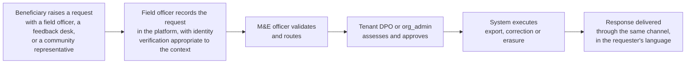
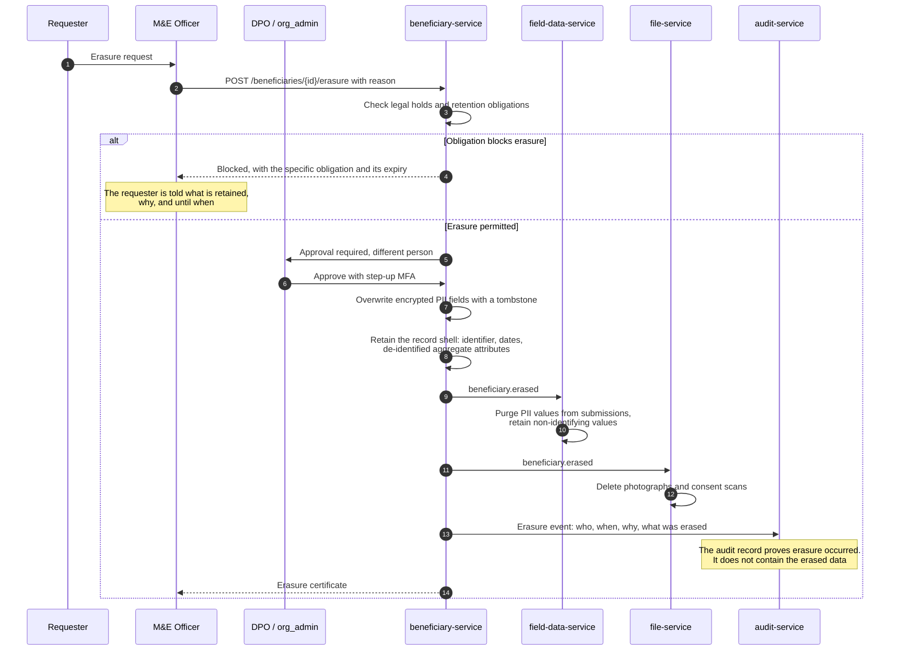

# 17 — Privacy, Data Protection and Humanitarian Compliance

> **Document:** NGO Intelligence Suite — SDD v2.0
> **Chapter:** 17 — Privacy, Data Protection and Humanitarian Compliance
> **Owner:** Data Protection Officer
> **Status:** Approved
> **Last Reviewed:** 2026-06-20
> **Review Cadence:** Quarterly
> **Related ADRs:** [ADR-0015](adr/0015-application-layer-pii-encryption.md)

---

## 17.1 The starting position

Most privacy chapters begin with GDPR. This one begins somewhere else, because GDPR is not the binding constraint here.

A beneficiary of a humanitarian programme in South Sudan typically cannot exercise a data subject right in any practical sense. They may not know the platform exists. They cannot email a data protection officer. They have no realistic route to a supervisory authority, and no meaningful alternative if they decline to provide their data — refusing means not receiving assistance, which is not a free choice.

The obligation therefore cannot rest on the individual asserting their rights. It rests on the organisation not creating the risk in the first place. This chapter is written from that position: the primary control is **not collecting data**, the secondary control is **not keeping it**, and everything else is compensating for the data that genuinely must exist.

The framing throughout is the ICRC's do-no-harm principle. The test applied to every data decision is not "is this lawful" but "if this dataset were obtained by the worst plausible adversary in this context, what happens to the people in it".

---

## 17.2 Data classification

| Level | Definition | Examples | Controls |
| --- | --- | --- | --- |
| **Restricted** | Disclosure could cause physical harm to an identifiable person | Beneficiary identity and location, displacement status, protection-relevant detail, precise GPS, employee identity in insecure locations | Application-layer encryption; purpose-logged access; role-restricted; bulk access dual-authorised; never leaves the region; never sent to any third-party processor beyond hosting |
| **Confidential** | Disclosure would cause material harm to the organisation or an individual | Salaries, tax identifiers, bank details, financial records, donor terms, audit trail, security configuration | Encrypted at rest; role-restricted; access audited; export controlled |
| **Internal** | Not for public disclosure but low harm | Programme plans, aggregate figures, staff directory, form definitions | Authentication required; standard access control |
| **Public** | Intended for disclosure | Published IATI data, public certificate verification, marketing content | Integrity controls only |

### 17.2.1 Classification rules

1. Every column in every table carries a classification, recorded in [Appendix B](appendices/b-data-dictionary.md). A migration adding a column without one fails the build.
2. A derived value inherits the highest classification of its inputs, unless a documented aggregation or suppression reduces it. A count over Restricted records is Internal only if it passes the k-anonymity threshold.
3. Classification cannot be lowered without DPO approval recorded in the migration.
4. When classification is disputed, the higher applies until resolved.

---

## 17.3 Personal data inventory

### 17.3.1 Beneficiary data

The most consequential inventory in the document. Each field's justification is recorded because a field with no justification should not exist.

| Field | Classification | Why it is collected | Retention | Could we manage without it? |
| --- | --- | --- | --- | --- |
| Unique identifier | Internal | Deduplication, assistance tracking | 3 years post-exit | No |
| First and last name | **Restricted** | Identity verification at distribution; deduplication | 3 years post-exit | No, though some programmes could operate on identifier alone. Offered as a per-tenant configuration |
| Date of birth or estimated age | **Restricted** | Eligibility, child protection, deduplication | 3 years post-exit | Age band alone would suffice for many programmes; exact date improves deduplication accuracy |
| Sex | Confidential | Disaggregated reporting required by every donor; programme design | 3 years post-exit | No |
| Displacement status | **Restricted** | Eligibility; a core protection variable | 3 years post-exit | No |
| Displacement origin | **Restricted** | Return planning, protection analysis | 3 years post-exit | Optional; collected only where a programme requires it |
| National identifier | **Restricted** | Deduplication where documents exist; some donor verification requirements | 3 years post-exit | **Yes.** Optional per tenant, default off. Many beneficiaries have no documents and requiring one excludes them |
| Phone number | **Restricted** | Distribution notification, follow-up | 3 years post-exit | Optional, consent-based |
| Precise coordinates | **Restricted** | Distribution planning, coverage analysis | **12 months**, then generalised to settlement | Yes for most purposes. Retained briefly, then reduced |
| Settlement, admin1, admin2 | Confidential | Programme targeting and reporting | 3 years post-exit | No |
| Household composition | Confidential | Vulnerability scoring, ration sizing | 3 years post-exit | No |
| Disability status | **Restricted** | Inclusion targeting, accessibility of assistance | 3 years post-exit | Optional per programme |
| Food security score | Confidential | Eligibility for food programmes | 3 years post-exit | Programme-specific |
| Vulnerability score | Confidential | Targeting priority | 3 years post-exit | Derived; no separate collection |
| Photograph | **Restricted** | Identity verification at distribution in some programmes | 12 months | **Yes.** Default off. Requires explicit DPO approval per tenant and per programme |
| Consent record | Confidential | Evidence of lawful basis | Same as the record | No |

Fields deliberately **not** collected anywhere in the platform:

| Not collected | Reason |
| --- | --- |
| Biometrics of any kind | A biometric registry of a displaced population is a permanent risk that outlives the programme that created it. Excluded on protection grounds |
| Ethnicity, tribe or clan | In the operating contexts, this is among the most dangerous possible data. Where a donor requests ethnic disaggregation, the response is a documented refusal with an explanation |
| Religion | Same reasoning |
| Political affiliation | Same reasoning |
| Detailed health conditions | Requires a stricter confidentiality regime than this platform provides. Only a "chronic illness present" boolean for household vulnerability |
| Protection or GBV case detail | Out of scope entirely; requires an isolated system ([02 §2.2.3](02-introduction.md)) |
| Sexual orientation | No programme purpose; extreme risk in the operating contexts |

### 17.3.2 Employee data

| Field | Classification | Purpose | Retention |
| --- | --- | --- | --- |
| Name, date of birth, nationality | Confidential | Employment administration | 7 years post-termination |
| Contact details, emergency contact | Confidential | Employment, duty of care | 7 years post-termination |
| Tax and social security identifiers | **Restricted** | Statutory obligation | 7 years post-termination |
| Bank details | **Restricted** | Salary payment | 7 years post-termination |
| Salary and payroll records | Confidential | Statutory and contractual | 7 years post-termination |
| Position, department, duty station | Internal | Organisational | 7 years post-termination |
| Leave records | Confidential | Entitlement | 7 years post-termination |
| Training records | Confidential | Compliance evidence | 7 years post-termination |
| Performance data | Not collected | — | — |

Duty station is Internal generally, but is treated as Restricted for staff in insecure locations, because a list of who is where is operationally sensitive.

### 17.3.3 System user data

Email, name, role, login history, IP addresses and session records. Confidential; retained for the account's life plus 24 months for the security investigation window.

---

## 17.4 Lawful basis

| Data | Basis under GDPR where it applies | Notes |
| --- | --- | --- |
| Beneficiary data | **Vital interests** (Art. 6(1)(d)) for emergency assistance; **legitimate interests** (Art. 6(1)(f)) for programme administration | Consent is deliberately **not** relied upon as the primary basis, because consent conditioned on receiving assistance is not freely given and therefore not valid. Consent is still obtained and recorded as an ethical and accountability practice, not as the legal basis |
| Special category data — disability, health indicator | Art. 9(2)(c) vital interests, or Art. 9(2)(g) substantial public interest | Minimised; collected only where a programme requires it |
| Employee data | **Contract** (Art. 6(1)(b)) and **legal obligation** (Art. 6(1)(c)) | Statutory payroll obligations |
| System user data | **Contract** and **legitimate interests** | Security and service delivery |
| Donor contact data | **Legitimate interests** | Relationship management |

The consent point is important and frequently got wrong in the sector. Recording consent while relying on it as the legal basis creates an obligation to honour withdrawal by ceasing processing — which would mean removing someone from an assistance programme because they withdrew consent to data processing. Relying on vital interests and legitimate interests, while still obtaining and recording informed consent as good practice, avoids that trap and is the more honest position.

---

## 17.5 Data protection impact assessment

A DPIA is required because the processing involves large-scale processing of special category data about vulnerable individuals in a context where a breach carries physical risk. This is a summary; the full DPIA is the legal record and is maintained at `docs/dpia/`.

### 17.5.1 Necessity and proportionality

| Question | Assessment |
| --- | --- |
| Is the processing necessary? | Yes. Assistance cannot be targeted, deduplicated or accounted for without identifying who received what |
| Is there a less intrusive alternative? | Partially. Some programmes could operate on tokenised identifiers alone; this is offered as a configuration and encouraged. Cash programmes generally require verifiable identity |
| Is the data proportionate? | Yes, after minimisation. Ethnicity, biometrics and religion were considered and excluded. Photographs and national identifiers are default-off |
| Is retention proportionate? | Personal data is deleted at 3 years post-exit while de-identified aggregates persist for donor accountability. Precise coordinates reduce to settlement level at 12 months |

### 17.5.2 Risks to individuals

| # | Risk | Likelihood | Severity | Mitigation | Residual |
| --- | --- | --- | --- | --- | --- |
| P-1 | A beneficiary list reaching a hostile actor, enabling targeting | Low | **Catastrophic** | Application-layer encryption under per-tenant keys; minimisation; no ethnicity or biometrics; restricted access with purpose logging; bulk export dual-authorised; device caching minimised and encrypted | **Medium** — the residual is not lower because the severity is irreducible |
| P-2 | Re-identification from published or shared aggregates | Medium | High | k-anonymity threshold of 5 enforced in views and in the analytics service; location generalised for publication; IATI exclusion policy | Low |
| P-3 | Function creep — data collected for assistance used for another purpose | Medium | High | Purpose recorded at collection and required at access; new purposes require DPO approval; access logged with purpose | Low |
| P-4 | Inaccurate data causing wrongful exclusion from assistance | Medium | High | Validation at capture; duplicate review by a human rather than auto-merge; 30-day merge reversibility; correction workflow; vulnerability score versioning | Low |
| P-5 | A beneficiary unable to know or influence what is held about them | High | Medium | Information provided at registration in the appropriate language; a request channel through the tenant; the DSAR workflow works through the field team rather than assuming digital access | **Medium** — practical exercise of rights remains genuinely limited |
| P-6 | Data retained longer than necessary | Medium | Medium | Automated retention sweep; purge of identifying fields at 3 years while retaining de-identified aggregates | Low |
| P-7 | Staff data exposure causing internal harm | Low | High | Per-tenant payroll schemas; encryption; narrow role access; separation of duties | Low |
| P-8 | Data transferred outside the region without safeguards | Low | High | Regional residency by default; sub-processor register; no PII to the LLM provider; contractual safeguards | Low |
| P-9 | Beneficiary data exposed on a lost field device | Medium | High | Session-derived key not surviving restart; minimal cache; 72-hour TTL; remote wipe | Medium |
| P-10 | Legal compulsion to disclose | Low | High | Data minimisation limits what exists; documented legal request procedure with legal review and tenant notification where lawful | Medium |

### 17.5.3 DPIA conclusion

Processing may proceed with the controls specified in this document. The residual risks P-1, P-5, P-9 and P-10 are accepted by the Executive Director on the basis that the alternative — no system, and therefore paper registers on unencrypted laptops — carries materially higher risk to the same individuals. The DPIA is reviewed annually and on any material change, and specifically on any proposal to collect a new category of beneficiary data.

---

## 17.6 Privacy by design in practice

| Principle | Implementation |
| --- | --- |
| **Data minimisation** | A new beneficiary field requires DPO approval recorded in the migration. The default answer is no. Photographs and national identifiers are default-off and require per-tenant justification |
| **Purpose limitation** | Purpose is recorded at collection and required as a parameter on beneficiary read endpoints. A purpose outside the controlled vocabulary is rejected |
| **Storage limitation** | Automated retention with a documented schedule; identifying fields purged while de-identified records persist |
| **Accuracy** | Validation at capture; human-reviewed duplicate resolution; reversible merges; correction workflow with audit |
| **Integrity and confidentiality** | Encryption at rest, in transit and at the application layer; per-tenant keys; access control; audit |
| **Accountability** | Purpose-logged access; immutable audit; consent records; this document; the compliance traceability matrix |
| **Privacy as the default** | Optional sensitive fields are off until deliberately enabled; precise location is hidden unless specifically permitted; exports are restricted by default |
| **End-to-end lifecycle** | Retention, erasure, export and offboarding are designed features, not afterthoughts |

### 17.6.1 The new-field gate

Adding a field to `beneficiaries`, `households` or a PII-marked form field requires answers to six questions, recorded in the pull request and approved by the DPO:

1. What decision does this field enable that cannot be made without it?
2. What is the lawful basis for collecting it?
3. What harm could result if this field were disclosed to a hostile actor in this context?
4. Can a less identifying form serve the same purpose — a band instead of a value, a boolean instead of a detail?
5. How long must it be kept, and what triggers its deletion?
6. Who needs to read it, and does an existing role already have that access or does a new restriction apply?

An unanswered question is a blocked merge. This is the single most effective privacy control in the platform, because it operates before the data exists rather than after.

---

## 17.7 Data subject rights

Rights are supported technically even where their practical exercise is limited, because the technical capability is what makes the practical channel possible.

| Right | Implementation | SLA |
| --- | --- | --- |
| **Access** (Art. 15) | Export of all data held about the individual, in a readable format, delivered through the requesting channel | 30 days |
| **Rectification** (Art. 16) | Correction workflow with audit; downstream aggregates recomputed | 14 days |
| **Erasure** (Art. 17) | Erasure workflow ([§17.8](#178-the-erasure-workflow)) | 30 days |
| **Restriction** (Art. 18) | Record flagged; processing limited to storage; excluded from targeting and reporting | 14 days |
| **Portability** (Art. 20) | Structured JSON or CSV export | 30 days |
| **Objection** (Art. 21) | Assessed against the legitimate interests basis; the outcome and reasoning are recorded | 30 days |
| **Withdraw consent** | Where consent is the basis — photographs, follow-up contact, donor data sharing — withdrawal takes effect immediately and does **not** affect assistance eligibility | Immediate |

### 17.7.1 The practical channel

A beneficiary cannot email us. The request path is:

Identity verification is deliberately proportionate rather than documentary. Demanding an identity document from someone who fled without one, to prove they are the person whose record we hold, would deny the right to precisely the people most in need of it. Verification uses knowledge of registration details, community verification, or the field officer's own recognition, and the method used is recorded.

---

## 17.8 The erasure workflow

Erasure is the only operation in the platform that permanently destroys data. It is correspondingly constrained.

| Rule | Detail |
| --- | --- |
| Approval | Requester ≠ approver; DPO or `org_admin` approval with step-up MFA |
| Legal holds | Financial records tied to a donor audit obligation cannot be erased until the obligation expires. The requester is told precisely what is retained and until when, rather than receiving a blanket refusal |
| What is destroyed | Encrypted identifying fields, photographs, consent scans, PII field values in submissions |
| What survives | A de-identified shell: the identifier, registration and exit dates, age band, sex, settlement. This is what keeps historical programme reporting accurate — a 2024 reach figure must not change because a 2027 erasure was correctly executed |
| Audit | The erasure is recorded permanently. The audit record proves it happened without containing what was erased |
| Backups | Backups are not rewritten. Erased data persists in backups until they age out, at 12 months maximum. A restore triggers replay of the erasure log against the restored data — a documented step in [RB-11](runbooks/rb-11-backup-restore-drill.md) |
| Reversibility | None. This is stated to the requester before approval |
| Certificate | A record is issued confirming what was erased and when |

The backup point is one that many privacy statements quietly omit. Erasure cannot reach immutable backups without destroying their integrity, so the honest position is a documented maximum persistence window plus a replay procedure on restore.

---

## 17.9 Humanitarian data protection

Standards specific to this domain, beyond general data protection law.

### 17.9.1 Do no harm

| Practice | Implementation |
| --- | --- |
| Contextual risk assessment | Before any new data category is collected, the question asked is what happens if this reaches the worst plausible adversary in this specific context. The answer is recorded |
| No data that identifies group membership | Ethnicity, clan, religion and political affiliation are structurally absent from the schema, not merely discouraged |
| Location precision minimised | Precise coordinates are collected where operationally required, visible only to roles that need them, and reduced to settlement level after 12 months |
| Aggregation before sharing | Anything leaving the tenant is aggregated with k-anonymity applied |
| No public disclosure of individuals | IATI publication and donor portals carry aggregates only |
| Distribution site protection | Precise activity locations are never published |

### 17.9.2 Accountability to affected populations

| Commitment | Implementation |
| --- | --- |
| People know what is collected and why | An information script in the local language, delivered at registration, covering what is collected, why, who sees it, how long it is kept, and how to raise a concern |
| People can raise a concern | The feedback channel is recorded in the platform and routed |
| Data is used for their benefit | Purpose limitation, enforced technically |
| Programmes are accountable for reach | Attendance and distribution records support verification |

### 17.9.3 Data sharing

| Recipient | Permitted | Conditions |
| --- | --- | --- |
| Donor | Aggregates only | k-anonymity applied; no individual records; per-grant configuration |
| Implementing partner | Case-by-case | Data sharing agreement, DPO approval, minimum necessary fields, time-boxed |
| Coordination body such as a cluster | Aggregates only | Standard humanitarian reporting formats |
| Government authority | **Presumption against** | Legal review required. Sharing beneficiary data with a government that may be a party to the conflict is a protection risk assessed case by case, and the presumption is refusal |
| Another tenant | Never | Structurally impossible |
| LLM provider | Never for beneficiary data | Enforced by the redaction gate ([18](18-ai-llm-architecture.md)) |
| Researcher | De-identified only | Ethics review, data sharing agreement, no re-identification undertaking |

---

## 17.10 Data residency and transfers

| Aspect | Position |
| --- | --- |
| Primary region | `africa-south1`, Johannesburg. Selected for regional proximity, latency and residency expectations of East African tenants |
| DR region | `europe-west4`, Netherlands. Adequacy under GDPR; data remains encrypted with the same keys |
| Where personal data lives | Primary region and its DR replica. Nowhere else |
| Sub-processors | Google Cloud (hosting), Supabase (auth), SendGrid (email), Africa's Talking (SMS), Anthropic (LLM, aggregates only) |
| Data reaching each sub-processor | Google: everything, encrypted. Supabase: authentication identifiers only. SendGrid: email addresses and non-PII message content. Africa's Talking: phone numbers and non-PII message content. **Anthropic: aggregates only, never personal data** |
| Transfer mechanism | Standard contractual clauses where required; adequacy where available |
| Tenant residency requirements | Recorded per tenant; a tenant with a stricter requirement than the platform can meet is told during onboarding rather than after |

The sub-processor register is published to tenants and updated with notice before any change, because a tenant may have donor commitments that constrain which processors may be involved.

---

## 17.11 Breach response

### 17.11.1 Definition and severity

A personal data breach is any accidental or unlawful destruction, loss, alteration, unauthorised disclosure of, or access to personal data.

| Severity | Definition | Examples |
| --- | --- | --- |
| **P1 Critical** | Restricted data exposed, or any exposure creating physical risk | Beneficiary data disclosed; cross-tenant leak; encryption key compromise |
| **P2 High** | Confidential data exposed to an unauthorised party | Payroll data visible to the wrong role; an export sent to a wrong recipient |
| **P3 Medium** | Limited exposure with low harm potential | A staff directory shared inappropriately |
| **P4 Low** | Near miss or contained internal exposure | A misconfiguration found and fixed before exploitation |

### 17.11.2 Response timeline

```mermaid
flowchart LR
    D["<b>Detect</b><br/>T+0<br/>Alert, report or discovery"]
    C["<b>Contain</b><br/>T+1h<br/>Revoke access, isolate,<br/>preserve evidence"]
    A["<b>Assess</b><br/>T+4h<br/>What data, whose,<br/>how many, what risk"]
    N1["<b>Internal notify</b><br/>T+6h<br/>DPO, Security Lead,<br/>Executive Director"]
    N2["<b>Tenant notify</b><br/>T+24h<br/>Affected tenants, with<br/>facts and actions"]
    N3["<b>Regulator</b><br/>T+72h<br/>Where GDPR or another<br/>regime applies"]
    N4["<b>Individuals</b><br/>Without undue delay<br/>Where high risk to<br/>rights and freedoms"]
    R["<b>Remediate</b><br/>Ongoing"]
    PM["<b>Postmortem</b><br/>T+5d<br/>Blameless, published<br/>internally"]

    D --> C --> A --> N1 --> N2 --> N3 --> N4 --> R --> PM
```

### 17.11.3 Notifying beneficiaries

The hardest case. Notifying a displaced person that their data may have been exposed requires a channel that mostly does not exist, and may itself create risk by drawing attention to them.

The approach: notification is made through the tenant's field team using the same channel as programme communication; the message is factual and specific about what may have been exposed; where notification would itself increase risk, the decision not to notify individually is documented with the reasoning and the DPO's approval, and community-level information is provided instead. Protection advice is sought from the tenant's protection focal point before any beneficiary notification in a P1 breach.

---

## 17.12 Compliance mapping

Full traceability is in [Appendix H](appendices/h-compliance-traceability.md). Summary of the obligations the platform is designed to meet:

| Framework | Applicability | Where addressed |
| --- | --- | --- |
| GDPR | EU-funded programmes; EU-based staff and donors | This chapter; [14](14-security-architecture.md); [09 §9.6](09-data-management-strategy.md) |
| ICRC Handbook on Data Protection in Humanitarian Action | Organisational commitment | This chapter throughout |
| Core Humanitarian Standard | Organisational commitment | [§17.9.2](#1792-accountability-to-affected-populations) |
| SPHERE Handbook | Programme quality | Domain model, [07](07-domain-model-and-erd.md) |
| 2 CFR 200 | US federal awards | Retention, audit trail, [09 §9.6](09-data-management-strategy.md), [14 §14.7](14-security-architecture.md) |
| USAID ADS 303 | USAID awards | Grant compliance model, [08](08-database-schema.md) |
| ISO/IEC 27001:2022 | Target certification, not yet held | [Appendix H](appendices/h-compliance-traceability.md) |
| SOC 2 Type II | Target, donor-driven | [Appendix H](appendices/h-compliance-traceability.md) |
| South Sudan and Uganda employment and tax law | Payroll | [Appendix I](appendices/i-algorithms.md) |
| IATI Standard v2.03 | Transparency commitment | [12 §12.4](12-integration-architecture.md) |

Certification status is stated honestly: neither ISO 27001 nor SOC 2 is currently held. The platform is designed to be certifiable, the control mapping exists, and pursuing certification is a Phase 4 activity driven by donor requirement. Claiming otherwise in a donor pack would be a misrepresentation.

---

## 17.13 Governance

| Activity | Cadence | Owner |
| --- | --- | --- |
| DPIA review | Annually and on material change | DPO |
| Record of processing activities update | On any change | DPO |
| Sub-processor register review | Quarterly | DPO |
| Data classification audit | Quarterly. Sample columns against the dictionary | DPO |
| PII access review | Monthly. Examine purpose-logged access for patterns | DPO |
| Retention execution verification | Monthly. Confirm the sweep ran and did what it reported | Data Architect |
| Erasure request audit | Quarterly | DPO |
| New-field approvals review | Quarterly. Look for drift toward collecting more | DPO |
| Breach drill | Annually | DPO and Security Lead |
| Privacy training | Annually for all staff, via the LMS | DPO |
| Do-no-harm review | Annually, and on any change in the operating context | DPO and Protection focal point |

The monthly PII access review is the control most likely to catch a real problem. Encryption and access control prevent unauthorised access; only reviewing the logs catches authorised access being used for an unauthorised purpose.
