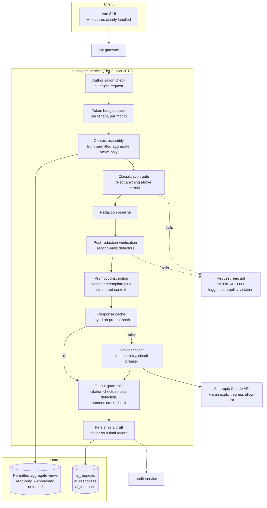
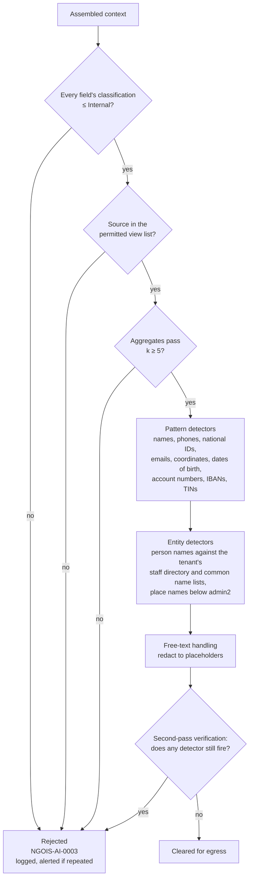

# 18 — AI and LLM Architecture and Governance

> **Document:** NGO Intelligence Suite — SDD v2.0
> **Chapter:** 18 — AI and LLM Architecture and Governance
> **Owner:** Chief Architect, with the DPO as joint approver
> **Status:** Approved
> **Last Reviewed:** 2026-06-20
> **Review Cadence:** Quarterly, and on any model or use-case change
> **Related ADRs:** [ADR-0010](adr/0010-llm-provider-and-boundaries.md), [ADR-0015](adr/0015-application-layer-pii-encryption.md)

---

## 18.1 Position

Version 1.0 listed "AI-Assisted Insights" as a Phase 4 module with the Anthropic Claude API named as the provider, and said very little else. That is the most common shape of AI in an enterprise design document: a named provider, an aspiration, and no governance. It is also the shape most likely to produce a serious incident, because an LLM integration is an outbound data flow to a third party wired into the middle of a system holding data about vulnerable people.

This chapter establishes the governing position first and the architecture second, because the architecture is a consequence of the position.

### 18.1.1 The five rules

| # | Rule | Enforcement |
| --- | --- | --- |
| **AI-1** | **No beneficiary personal data leaves the platform to any model provider, ever.** Not pseudonymised, not partially redacted, not "just the names removed". Beneficiary data reaches the LLM only as aggregates that have passed the k-anonymity threshold | Redaction gate ([§18.5](#185-the-redaction-gate)), enforced in code, with a deny-by-default classifier and an integration test suite |
| **AI-2** | **No model output reaches a donor, a beneficiary, a regulator, or a financial record without a named human approving it.** The LLM drafts; a person decides | Human-in-the-loop gates ([§18.6](#186-human-in-the-loop-gates)) |
| **AI-3** | **No model output makes a decision about a person.** Eligibility, targeting priority, disciplinary action, hiring, and assistance allocation are never model-determined | Absent by design: no AI use case writes to eligibility or targeting fields |
| **AI-4** | **Every factual claim in a model output is traceable to a platform record.** A number in a generated narrative carries a citation to the query that produced it | Citation requirement ([§18.7](#187-guardrails-against-fabrication)) |
| **AI-5** | **The platform functions completely without the AI module.** It is an accelerant, never a dependency | `ai-insights-service` is Tier 3; its unavailability degrades no core workflow ([06 §6.3.15](06-microservice-design.md)) |

Rule AI-1 is the one that constrains the architecture most. It rules out the use case people usually ask for first — "summarise this beneficiary's history for me" — and the design accepts that cost deliberately. A model provider's retention policy, subpoena exposure, and future business decisions are outside our control, and a beneficiary in a conflict setting cannot be asked to accept that risk.

---

## 18.2 Use cases

### 18.2.1 Approved

| ID | Use case | Input | Output | Data sent to the model | Gate |
| --- | --- | --- | --- | --- | --- |
| **AI-UC-01** | Grant narrative drafting | Grant metadata, indicator results, aggregate reach figures, prior approved narratives | A draft donor report narrative | Aggregates and grant metadata. No individual records | Mandatory human edit and approval before export |
| **AI-UC-02** | Financial anomaly explanation | An anomaly already detected by deterministic rules, with surrounding aggregate context | A plain-language explanation and suggested lines of enquiry | Aggregate financial figures, no employee or beneficiary identity | Advisory only; a human investigates |
| **AI-UC-03** | Compliance risk summarisation | Grant compliance requirement text, deadlines, submission status | A prioritised risk summary for the Executive Director | Grant terms and status metadata | Advisory; the underlying compliance score remains deterministic |
| **AI-UC-04** | Free-text field-note theme extraction | Field submission free-text values that have passed redaction | Recurring themes and their frequency | Redacted free text. Any submission whose text fails redaction is excluded entirely rather than partially sent | Advisory; results labelled as machine-generated |
| **AI-UC-05** | Training content drafting | A course outline and learning objectives supplied by a human | Draft module text and quiz questions | No personal data at all | Human review before publication |
| **AI-UC-06** | Query assistance for reporting | A natural-language question about aggregate data, plus the schema of permitted aggregate views | A proposed read-only query against permitted views | Schema metadata only, never data | The query is shown to the user, executed under their own permissions, and RLS applies regardless |
| **AI-UC-07** | Log and error triage assistance | Redacted log excerpts during an incident | A hypothesis and next diagnostic step | Redacted logs, no PII, no secrets | Advisory to the on-call engineer |

### 18.2.2 Explicitly prohibited

| Prohibited | Reason |
| --- | --- |
| Beneficiary eligibility or targeting decisions | AI-3. A model must not decide who receives assistance |
| Vulnerability scoring | The scoring algorithm is deterministic, published and auditable ([Appendix I](appendices/i-algorithms.md)). A model score could not be explained to the person it affected |
| Duplicate resolution | Merging two beneficiary records is consequential and human-reviewed ([13 §13.6](13-offline-first-architecture.md)) |
| Any payroll computation, review or approval | Statutory correctness is a deterministic obligation, and the audit trail must be reproducible ([06 §6.3.5](06-microservice-design.md)) |
| Hiring, performance or disciplinary input | AI-3 |
| Beneficiary-facing chat or advice | An assistance-seeking person receiving a hallucinated answer about their entitlement is a direct harm |
| Generating financial figures | Numbers come from the database. The model may only present figures it was given |
| Auto-submitting anything to a donor | AI-2 |
| Processing any beneficiary personal data | AI-1 |
| Fine-tuning or training on tenant data | Requires data leaving the boundary and creates a model that memorises it. Prohibited without exception |

The prohibition list is part of the design, not a policy appendix, because the enforcement is architectural: `ai-insights-service` has no read grant on `beneficiaries` PII columns, no grant at all on the per-tenant payroll schemas, and no write grant on any domain table. It cannot perform a prohibited use case even if instructed to.

---

## 18.3 Architecture

### 18.3.1 Why a dedicated service

The LLM integration is isolated in its own service for four reasons: it is the only outbound flow to a general-purpose third-party model, so a single egress choke point is enforceable; its database grants can be narrowed to exactly the aggregate views it needs, making rule AI-1 structural; its failure and latency profile is unlike any other service and must not contaminate a Tier 1 request path; and its cost profile is per-request and per-token, requiring accounting that no other service needs.

### 18.3.2 Data access

`ai-insights-service` connects as the role `svc_ai_insights`, which has:

- `SELECT` on a specific set of aggregate views only, listed in [08 §8.9](08-database-schema.md), each of which applies the k-anonymity threshold internally.
- `SELECT` on grant metadata, indicator definitions, and compliance requirement text.
- `SELECT`, `INSERT` on its own tables `ai_requests`, `ai_responses`, `ai_feedback`, `ai_token_ledger`.
- No grant on `beneficiaries`, `employees`, `submission_values`, `users`, or any table in any `tenant_<slug>` schema.
- `NOBYPASSRLS`, a 15-second statement timeout, and no `CREATE` privilege.

A prompt injection that convinces the model to request beneficiary names cannot be fulfilled, because the service that would have to fetch them has no permission to and no code path that would.

---

## 18.4 Context assembly

Context is assembled from structured queries, never from raw text pasted by a user, and never by giving the model a database connection or a tool that reaches one.

| Rule | Detail |
| --- | --- |
| Structured only | Context is a JSON object built by service code from typed query results. There is no free-form context channel |
| Permitted sources only | A closed list of aggregate views. Adding a source requires DPO approval and a redaction test case |
| Tenant-scoped | Every query runs with `app.current_tenant` set. Cross-tenant context is impossible |
| Bounded | Context is capped at 40,000 tokens. Beyond that, it is summarised deterministically — top-N indicators, period aggregates — rather than truncated arbitrarily, so the model is never given a silently incomplete picture |
| Provenance-tagged | Every value in the context carries the view and query that produced it, which is what makes the citation requirement enforceable |
| No tool use | The model has no function calling, no retrieval tool, and no network access from within the interaction. It sees the context it was given and nothing more |

The no-tool-use decision is deliberate and costs capability. Agentic retrieval would produce better narratives. It would also mean the model deciding what data to fetch, which is exactly the control we are unwilling to give up.

---

## 18.5 The redaction gate

The single most important control in this chapter. It is deny-by-default: content passes only if it is affirmatively classified as safe, rather than being sent unless something is detected.

### 18.5.1 Detector catalogue

| Detector | Method | Action |
| --- | --- | --- |
| Person name | Match against the tenant staff directory, plus regional given-name and surname lists, plus capitalisation heuristics | Replace with `[PERSON]` in free text; reject if found in a structured field |
| Phone number | Pattern, including local formats for South Sudan, Uganda, Kenya | Replace with `[PHONE]`; reject in structured context |
| National identifier | Pattern per country | **Reject the request.** Never merely replaced, because its presence means the classification gate has already failed |
| Email address | Pattern | Replace with `[EMAIL]` |
| Coordinates | Decimal-degree and DMS patterns | Replace with the admin2 name |
| Date of birth | Date patterns in a field or phrase suggesting birth | Replace with an age band |
| Bank account, IBAN, mobile money number | Pattern and checksum | **Reject the request** |
| Tax or social security identifier | Pattern per country | **Reject the request** |
| Small-cohort aggregate | Numeric check for any count below 5 | Suppress the cell, or reject if suppression would make the context misleading |
| Secret-shaped string | High-entropy string, known key prefixes | **Reject the request**, and raise a security alert — a secret in an AI context means a defect elsewhere |

### 18.5.2 Free text

Free text from field submissions is the hardest input, because a field officer writing an observation may name a person mid-sentence. The handling:

1. Only submission values from fields **not** marked as PII are eligible at all. A PII-marked field is never a candidate, redacted or otherwise.
2. Eligible text passes through all detectors.
3. If more than 15 per cent of tokens are redacted, the whole text is discarded rather than sent — heavily redacted text is both useless to the model and evidence that the text was more identifying than expected.
4. Text is never sent individually. It is batched into a corpus of at least 20 submissions for theme extraction, so no single person's account is the subject of a request.

### 18.5.3 Verification and testing

Redaction is verified twice: once by the pipeline itself running the detectors a second time on its own output, and once in CI by a corpus of 400 adversarial fixtures — real-shaped but synthetic — covering each detector, each locale, and known evasions such as spaced digits, homoglyphs, and identifiers embedded in prose. A single fixture leaking fails the build. The corpus is extended whenever a near-miss is found in production, which is treated as a test gap rather than a one-off fix.

Redaction failures are counted as a security metric with a target of zero, and any occurrence is a P2 incident regardless of whether data actually egressed, because the gate held only by accident.

---

## 18.6 Human-in-the-loop gates

| Output | Gate | Who | Evidence retained |
| --- | --- | --- | --- |
| Grant narrative for a donor report | **Mandatory edit and approval.** The draft cannot be exported as-is; the approver must have modified it or explicitly attested that they reviewed and accept it verbatim | `programme_coordinator` or `finance_manager` | The draft, the final text, the diff, the approver, the timestamp |
| Compliance risk summary | Review before it informs any action | `org_admin` | Displayed with a machine-generated label |
| Anomaly explanation | Advisory only; the investigation record is written by the human | `finance_manager` | Explanation stored alongside the human's finding |
| Theme extraction | Advisory; labelled machine-generated wherever displayed or exported | `m_e_officer` | Themes and the source corpus size |
| Training content | Review and approval before publication | `hr_manager` | Draft and published versions |
| Proposed report query | Shown in full, run under the requesting user's own permissions | Any authorised user | Query text, executor, result row count |

### 18.6.1 What the interface must make unmissable

An approval gate that a hurried user clicks through is not a control. The UI requirements are therefore specified here rather than left to implementation:

- AI-generated content is visually distinct — a persistent border and label — until it is approved.
- The approve action is disabled until the user has either edited the text or ticked an explicit attestation with a separate confirmation.
- Every figure in the draft is rendered as a citation chip; hovering shows the source and value, and clicking opens the underlying report.
- An uncited numeric claim is highlighted as a warning the approver must resolve.
- The approval dialogue names the approver and states plainly that they are accountable for the content being sent to the donor.
- Exported documents carry no visible AI marking, because the approved output is the organisation's own statement — but the audit record permanently retains that it originated as a draft, with the diff.

That last pair of decisions is a considered trade-off. Marking donor-facing documents as AI-assisted would be more transparent to the donor; it would also disincentivise use of the feature to the point of abandonment, and the organisation genuinely is accountable for the final text it approved. The compromise is full internal traceability with no external marking, and it is recorded as such in [ADR-0010](adr/0010-llm-provider-and-boundaries.md).

---

## 18.7 Guardrails against fabrication

An LLM will produce a plausible number. In a donor report, a plausible number that is wrong is fraud, however unintentional.

| Guardrail | Mechanism |
| --- | --- |
| **Citation requirement** | The prompt instructs that every factual claim cite a provided context key. Output is parsed for citation markers, and any numeric token without one is flagged in the UI |
| **Numeric cross-check** | Every number in the output is extracted and compared against the numbers in the context. A number not present in the context, and not derivable by a permitted arithmetic operation over context values, is flagged as unverified |
| **Arithmetic verification** | Where the model states a percentage or total, the service recomputes it from the context values and flags a mismatch beyond a rounding tolerance |
| **No invention instruction** | The system prompt states that missing data must be reported as missing, and that the model must not estimate, infer or fill gaps |
| **Refusal handling** | A model refusal or hedge is surfaced to the user as-is rather than retried with a softer prompt |
| **Grounding scope** | The prompt states that only the provided context is authoritative and that the model's own knowledge of the sector must not supply facts |
| **Uncertainty surfacing** | Where the model qualifies a statement, the qualification is preserved in the draft rather than smoothed away |
| **Length discipline** | Output token limits are set per use case, because longer generations drift further from the context |

Numeric cross-check is the guardrail that does the real work. It is deterministic, cheap, and catches the specific failure that matters most.

---

## 18.8 Prompt management

| Aspect | Approach |
| --- | --- |
| Storage | Prompt templates are versioned files in the repository, reviewed like code, owned by the AI feature owner with DPO review on any template that touches programme data |
| Identity | Every template has an ID and a semantic version, for example `grant-narrative@2.3.0` |
| Structure | A system prompt establishing role, constraints and citation rules; a context block as structured JSON; a task instruction; an output format specification |
| Injection defence | Context is delimited and explicitly labelled as untrusted data to be analysed rather than instructions to be followed. Field-submission text is additionally wrapped and escaped |
| Change control | A template change requires the evaluation suite to pass at or above the current baseline before merge |
| Recording | Every request records the template ID and version, the model and model version, the token counts, and a hash of the assembled context — enough to explain an output months later without storing the context itself |
| No user-authored prompts | Users select a use case and provide parameters. There is no free-text prompt field anywhere in the product |

The absence of a free-text prompt field removes an entire class of risk and is the reason the injection surface is limited to field-submission content rather than being wide open.

---

## 18.9 Model management

| Aspect | Position |
| --- | --- |
| Provider | Anthropic Claude API. Selected for the enterprise data-handling terms, the absence of training on API inputs, and the model family's instruction adherence on constrained tasks ([ADR-0010](adr/0010-llm-provider-and-boundaries.md)) |
| Version pinning | An explicit model version string in configuration. Never a floating alias, because a silent model change would silently change donor-facing output quality |
| Upgrade process | A new version runs against the full evaluation suite in staging. Promotion requires no regression on accuracy or grounding metrics, and is a normal reviewed configuration change |
| Rollback | Reverting the configured version. Prior versions remain pinned and available for the deprecation window |
| Provider abstraction | A narrow internal interface — assemble, call, parse — so a provider substitution is a single adapter. Deliberately thin; a heavy abstraction over one provider is waste |
| Provider failure | Circuit breaker opens; the feature returns a clear "drafting unavailable" state; every workflow proceeds manually. No fallback provider, because a second provider would need its own data-handling review, redaction validation and evaluation baseline |
| Self-hosted option | Assessed and deferred. Recorded in [34](34-future-extensibility.md) as an option if a tenant's donor prohibits third-party model processing entirely |

---

## 18.10 Cost control

Token spend is the one operational cost in the platform that scales with user enthusiasm rather than with data volume, so it is budgeted rather than merely monitored.

| Control | Detail |
| --- | --- |
| Per-tenant monthly token budget | Default 2,000,000 output-equivalent tokens. Configurable per tenant |
| Per-user daily cap | 50 requests, to bound both cost and a compromised account's exfiltration attempts |
| Per-request token ceiling | Context capped at 40,000 tokens, output capped per use case between 500 and 4,000 |
| Response caching | Keyed on a hash of template version, model version and assembled context. A grant narrative regenerated with unchanged data is served from cache. Typical hit rate 30 to 40 per cent |
| Context trimming | Deterministic summarisation before the call rather than sending everything available |
| Model tiering | Cheaper models for theme extraction and triage; the stronger model reserved for donor-facing narrative |
| Budget behaviour | At 80 per cent, the tenant admin is notified. At 100 per cent, AI features return `NGOIS-AI-0005` and every workflow continues manually. Requests are never silently dropped or degraded |
| Accounting | `ai_token_ledger` records tokens and computed cost per request, per tenant, per use case. Reported in the FinOps view ([33](33-cost-model-and-finops.md)) |
| Alerting | Anomalous spend — more than three times the tenant's trailing weekly mean — pages the platform team, because the likely causes are a loop, an abuse pattern, or a compromised account |

Estimated steady-state cost at 25 tenants is 180 to 400 USD per month, modelled in [33](33-cost-model-and-finops.md). The variance is wide because adoption is the dominant variable and it is unknown until the feature ships.

---

## 18.11 Evaluation

An AI feature without an evaluation harness cannot be safely changed, because there is no way to know whether a prompt or model change made it worse.

| Dimension | Method | Threshold |
| --- | --- | --- |
| **Grounding** | Every factual claim in the output checked against the context by an automated checker, with human adjudication on a sample | ≥ 98 per cent of claims grounded; **zero** fabricated numbers tolerated |
| **Numeric accuracy** | Automated extraction and comparison | 100 per cent. Any failure blocks release |
| **Redaction efficacy** | The adversarial fixture corpus | 100 per cent. Any leak blocks release |
| **Injection resistance** | A corpus of 60 injection attempts embedded in simulated field-submission text | 100 per cent non-compliance with injected instructions |
| **Usefulness** | Human rating of drafts on a 1 to 5 scale by programme staff, on a fixed scenario set | Mean ≥ 3.5, and a downward move of more than 0.3 blocks a prompt change |
| **Edit distance** | How much approvers change the draft, measured in production | Tracked as the honest signal of value. A rising trend triggers a prompt review |
| **Refusal rate** | Proportion of requests the model declines | < 5 per cent; a spike indicates a prompt or context defect |
| **Latency** | p95 end to end | < 15 seconds |
| **Tone and appropriateness** | Human review against a humanitarian communications checklist — no sensationalism, no dignity-compromising framing of beneficiaries | Reviewed each release; any failure blocks |

The evaluation set comprises 60 fixed scenarios with synthetic but realistic data, held in the repository. It runs nightly and as a required gate on any change to a prompt template, the model version, or the redaction pipeline. Results are recorded so a regression is attributable to a specific change.

The tone dimension is not decorative. A generated narrative that describes beneficiaries in a way that compromises their dignity, in a document published under the organisation's name, is a reputational and ethical failure even when every number is correct.

---

## 18.12 AI-specific threats

Extending the STRIDE model of [16](16-threat-model-stride.md) across the LLM provider boundary. These threats carry an `AIT-` prefix and are numbered independently of chapter 16's boundary groups, because the AI surface cuts across several of them — prompt injection arrives over TB-9 from a device, egress crosses TB-7 to a third party, and cache leakage is a TB-6 tenant-to-tenant concern. Forcing them into one boundary group would misrepresent where each one lives.

| ID | Threat | L | I | Score | Mitigation | Residual |
| --- | --- | --- | --- | --- | --- | --- |
| AIT-1 | **Prompt injection through a field submission**, instructing the model to exfiltrate data or alter its output | 4 | 3 | 12 | Context labelled as untrusted data; delimited and escaped; no tool use; no data access beyond aggregate views; injection test corpus in CI; output guardrails | Low — the service could not fulfil an exfiltration instruction even if the model complied |
| AIT-2 | **PII egress through a redaction gap** | 3 | **5** | **15** | Deny-by-default classification gate; layered detectors; second-pass verification; 400-fixture CI corpus; structured-only context; PII-marked fields never eligible | Low, actively monitored. A single failure is a P2 incident |
| AIT-3 | **Fabricated figures reaching a donor report** | 4 | 4 | 16 | Numeric cross-check; citation requirement; arithmetic verification; mandatory human approval; uncited numbers flagged in the UI | Low |
| AIT-4 | Approval fatigue — humans rubber-stamping drafts | 4 | 3 | 12 | Edit-or-attest requirement; uncited-figure warnings that must be resolved; edit-distance monitoring; named accountability in the approval dialogue | **Medium** — this is a human-factors risk that no technical control fully closes |
| AIT-5 | Provider data retention or breach exposing sent content | 2 | 3 | 6 | Enterprise terms with no training on inputs; aggregates only, so a provider breach exposes no personal data; zero-retention requested where offered | Low |
| AIT-6 | Cost abuse or a runaway loop | 3 | 2 | 6 | Per-tenant budgets, per-user caps, per-request ceilings, spend anomaly alerting | Low |
| AIT-7 | Model degradation after a provider-side change | 3 | 3 | 9 | Pinned versions; nightly evaluation; no floating aliases | Low |
| AIT-8 | Over-reliance eroding staff capability to write reports unaided | 3 | 3 | 9 | Positioned and trained as drafting assistance; the manual path remains fully supported; edit-distance monitoring | Medium |
| AIT-9 | Output used to make a decision about a person, contrary to AI-3 | 2 | 4 | 8 | No AI output writes to any eligibility, scoring or targeting field; machine-generated labelling; policy and training | Low |
| AIT-10 | Cross-tenant context leakage through a caching defect | 2 | 5 | 10 | Cache keys include `tenant_id`; the shared key helper takes the tenant from request context; isolation test in the tenancy suite | Low |
| AIT-11 | Sensitive content in AI request logs | 3 | 3 | 9 | Only a context hash is stored, never the context; outputs stored are already cleared for egress; standard log redaction applies | Low |

AIT-4 deserves the honest label it has. Every human-in-the-loop control in the industry degrades over time as users become habituated. Edit-distance monitoring is the detection mechanism, and if it shows drafts being approved unchanged at a high rate, the correct response is to weaken or remove the feature rather than to add another dialogue.

---

## 18.13 Transparency and consent

| Commitment | Implementation |
| --- | --- |
| Tenants know the feature exists and what it does | Documented at onboarding; the AI module is off by default and enabled deliberately |
| **Per-tenant opt-out** | A tenant may disable the AI module entirely. Every workflow functions without it. No feature is AI-only |
| **Per-use-case opt-out** | A tenant may enable narrative drafting while disabling theme extraction, or any combination |
| Users know when they are seeing model output | Persistent visual labelling until approval |
| Donors are not misled | Approved narratives are the organisation's own statement, with full internal traceability of origin |
| Beneficiaries are not the subject of model processing | Guaranteed by AI-1, not by a promise |
| Staff are not evaluated by a model | Guaranteed by AI-3 and by the absence of any performance data in the platform |

Default-off is the right default for a feature of this kind. A tenant enabling it is making an informed choice; a tenant discovering it was on is a trust failure.

---

## 18.14 Governance

| Activity | Cadence | Owner |
| --- | --- | --- |
| Evaluation suite review | Each release | AI feature owner |
| Redaction corpus extension | On any near-miss, and quarterly | Security Lead |
| Use-case register review — has anything crept in? | Quarterly | Chief Architect and DPO |
| Token spend and budget review | Monthly | Platform Lead |
| Edit-distance and approval-quality review | Quarterly | Programme lead and AI feature owner |
| Tone and appropriateness review of sampled outputs | Quarterly | Communications and DPO |
| Provider terms and sub-processor review | Annually, and on any provider notice | DPO |
| Model version currency review | Quarterly | AI feature owner |
| AI threat model review | Quarterly, with [16](16-threat-model-stride.md) | Security Lead |

A new AI use case is a design decision requiring an ADR, DPO approval, a redaction test case, and an evaluation scenario before any code is written. This is deliberately heavier than the process for a normal feature, because the failure modes are subtler and the blast radius reaches outside the organisation.
