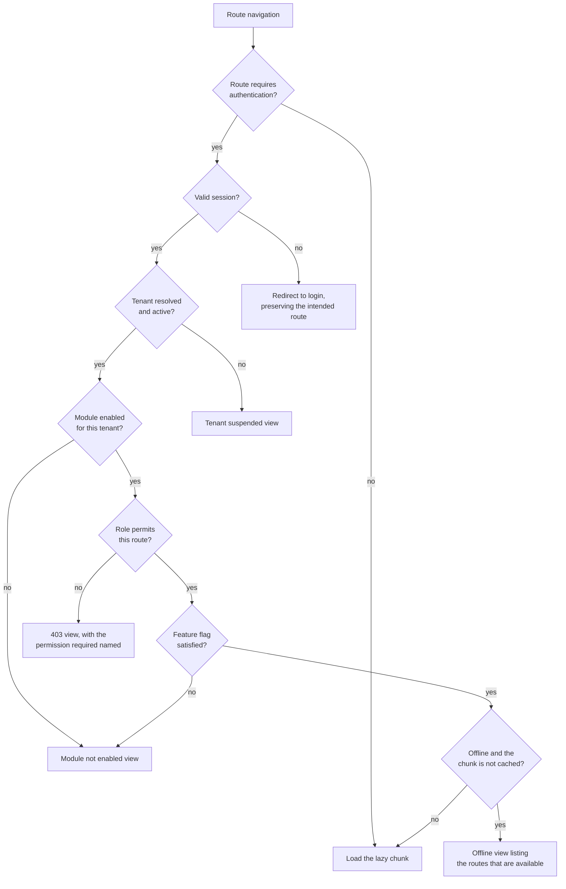

# 19 — Frontend Architecture

> **Document:** NGO Intelligence Suite — SDD v2.0
> **Chapter:** 19 — Frontend Architecture
> **Owner:** Frontend Lead
> **Status:** Approved
> **Last Reviewed:** 2026-06-20
> **Review Cadence:** Per release
> **Related ADRs:** [ADR-0020](adr/0020-vue-3-frontend-stack.md)

---

## 19.1 Constraints that shape the frontend

The frontend is not designed for a fast laptop on office broadband. It is designed for the worst realistic case, and the design decisions follow from that.

| Constraint | Consequence |
| --- | --- |
| A field officer's device may be a 3-year-old Android phone with 2 GB RAM | Bundle size and runtime memory are hard budgets, not aspirations. No heavy charting library on mobile routes |
| Connectivity may be 2G, intermittent, or absent for three days | Offline-first shell, aggressive caching, optimistic UI, resumable sync ([13](13-offline-first-architecture.md)) |
| Data may be metered and personally paid for | Payload size is a user-cost issue. Images are compressed client-side before upload; the app does not poll |
| Users include staff whose first language is Arabic or Swahili | Internationalisation and right-to-left layout are structural, not retrofitted |
| Some users have low digital literacy | Plain language, few concepts per screen, forgiving validation, no dependence on hover or right-click |
| Some users have disabilities, and donors require accessibility | WCAG 2.1 AA as a release gate, verified in CI and manually |
| The platform holds data that can endanger people | The client is a hostile environment. It caches the minimum, encrypts what it caches, and never trusts itself as an authorisation boundary |

The last point restates a principle worth repeating in a frontend chapter: **UI permission checks are usability, not security.** Hiding a button prevents confusion. It prevents nothing else. Every authorisation decision is made server-side ([15 §15.7.1](15-rbac-and-authorization.md)).

---

## 19.2 Technology

| Concern | Choice | Rationale |
| --- | --- | --- |
| Framework | Vue 3, Composition API, `<script setup>` | Small runtime, gentle learning curve for a small team, excellent TypeScript support, mature i18n and RTL story ([ADR-0020](adr/0020-vue-3-frontend-stack.md)) |
| Language | TypeScript 5.x, strict | Same language and discipline as the backend |
| Build | Vite 5 | Fast builds, native ESM, straightforward manual chunking |
| Routing | Vue Router 4, lazy-loaded routes | Route-level code splitting is the primary bundle control |
| State | Pinia | Composition-API-native, typed, no boilerplate |
| Server state | TanStack Query for Vue | Caching, deduplication, background refetch and stale-while-revalidate belong in a library, not in hand-written store code |
| Styling | Tailwind CSS 3 with a design-token layer | Utility classes keep CSS from growing without bound; tokens keep it consistent |
| Forms | VeeValidate with Zod schemas shared with the API contract | One schema, validated on both sides |
| Charts | Chart.js, lazy-loaded, desktop routes only | Small, sufficient, and excluded from mobile bundles |
| Tables | Custom virtualised component | Off-the-shelf grids are heavy and hard to make accessible |
| Dates | `date-fns` with per-locale imports | Tree-shakeable; avoids the whole-library cost |
| i18n | `vue-i18n` 9 with lazy locale loading | Only the active locale is downloaded |
| PWA | `vite-plugin-pwa` with a custom Workbox service worker | Generated boilerplate plus hand-written sync logic |
| Local storage | IndexedDB via `idb` | Schema and usage in [13 §13.3](13-offline-first-architecture.md) |
| Testing | Vitest, Vue Test Utils, Playwright, axe-core | Per [23](23-testing-strategy.md) |

---

## 19.3 Application structure

```
src/
  main.ts                      app bootstrap, plugin registration
  App.vue                      root shell
  router/
    index.ts                   route table
    guards.ts                  auth, role and tenant guards
    routes/                    per-module route modules
  stores/
    auth.ts                    session, tokens, permissions
    tenant.ts                  tenant config, branding, enabled modules
    ui.ts                      layout, theme, locale, direction
    sync.ts                    offline queue state and progress
    notifications.ts           in-app notification centre
  api/
    client.ts                  fetch wrapper: auth, retry, correlation ID, error mapping
    interceptors.ts            token refresh, 401 handling, offline detection
    endpoints/                 one typed module per backend service
    types/                     generated from OpenAPI, never hand-edited
  composables/
    useAuth.ts  usePermissions.ts  useTenant.ts
    useOffline.ts  useSync.ts  useIdleTimeout.ts
    usePagination.ts  useTable.ts  useFileUpload.ts
    useToast.ts  useConfirm.ts  useFeatureFlag.ts
    useCurrency.ts  useDateFormat.ts  useDirection.ts
  components/
    base/                      design system primitives
    layout/                    shell, nav, header, breadcrumbs
    forms/                     field wrappers, dynamic form renderer
    data/                      table, chart, empty state, skeleton
    feedback/                  toast, dialog, banner, offline indicator
    ai/                        AI draft panel, citation chip, approval dialogue
  modules/
    grants/  hr/  payroll/  lms/  beneficiaries/  field/
    reports/  admin/  donor-portal/
      components/  composables/  views/  types.ts  routes.ts
  offline/
    db.ts                      IndexedDB schema and migrations
    queue.ts                   outbound operation queue
    sync-engine.ts             sync orchestration
    conflict.ts                conflict presentation and resolution UI
    crypto.ts                  Web Crypto wrappers for local encryption
  locales/
    en.json  ar.json  sw.json
  styles/
    tokens.css  base.css  rtl.css
  utils/
```

### 19.3.1 Module boundaries

Each directory under `modules/` corresponds to a bounded context from [07](07-domain-model-and-erd.md) and is the unit of code splitting, ownership and lazy loading. The rules, enforced by an ESLint import boundary rule:

1. A module may import from `components/base`, `composables`, `api`, `stores` and `utils`.
2. A module may **not** import from another module. Shared behaviour moves up into a shared location, or is exposed through a store.
3. A module owns its route definitions and registers them; the router does not know module internals.
4. A module's views are lazily imported, always.

The prohibition on cross-module imports is what keeps the bundle graph predictable. It is violated frequently in codebases without a lint rule, which is why there is a lint rule.

---

## 19.4 State management

Four distinct kinds of state, deliberately not conflated:

| Kind | Where it lives | Examples |
| --- | --- | --- |
| **Server state** | TanStack Query cache | Lists, detail records, reports. Cached, deduplicated, revalidated. Never copied into Pinia |
| **Global client state** | Pinia | Session, permissions, tenant config, locale and direction, sync status, feature flags |
| **Local component state** | `ref` / `reactive` | Form drafts, open/closed, selection |
| **Durable offline state** | IndexedDB | The outbound queue, cached reference data, draft submissions ([13](13-offline-first-architecture.md)) |

Copying server data into Pinia is the most common state-management mistake in this kind of application: it creates two sources of truth and a cache-invalidation problem the team then has to solve by hand. TanStack Query already solved it.

### 19.4.1 Query key convention

```
['grants', tenantId]                                 list
['grants', tenantId, { status, sector, cursor }]     filtered list
['grant', tenantId, grantId]                         detail
['grant', tenantId, grantId, 'disbursements']        child collection
['reports', tenantId, 'burn-rate', { grantId }]      report
```

`tenantId` is in every key. A user with access to more than one tenant switching between them must not see the previous tenant's cached data, and putting the tenant in the key makes that structural rather than a matter of remembering to clear the cache.

### 19.4.2 Cache policy

| Data | Stale time | Cache time | Refetch on focus |
| --- | --- | --- | --- |
| Reference data — sectors, districts, leave types | 24 h | 7 d | No |
| Tenant config and feature flags | 5 min | 1 h | Yes |
| Entity lists | 30 s | 5 min | Yes |
| Entity detail | 60 s | 10 min | Yes |
| Dashboards and reports | 5 min | 30 min | No, manual refresh with a visible "as at" timestamp |
| Payroll data | 0 — always fresh | 0 | Yes |
| Notification count | 60 s, plus event-driven invalidation | 5 min | Yes |

Payroll is never served stale. Showing a finance manager a cached figure during an approval decision is not an acceptable trade for a saved request.

### 19.4.3 Optimistic updates

Applied only where the operation is near-certain to succeed and reversal is cheap: toggling a preference, marking a notification read, reordering, adding an item to an offline queue. Never applied to a financial or approval action, where showing success before the server confirms would be actively misleading.

---

## 19.5 Design system

### 19.5.1 Tokens

Semantic, not literal, so a tenant theme changes one layer.

| Category | Tokens |
| --- | --- |
| Colour — brand | `--color-primary`, `--color-primary-hover`, `--color-primary-subtle`, `--color-on-primary` |
| Colour — semantic | `--color-success`, `--color-warning`, `--color-danger`, `--color-info`, each with `-subtle` and `-on-` variants |
| Colour — surface | `--color-surface`, `--color-surface-raised`, `--color-surface-sunken`, `--color-border`, `--color-border-strong` |
| Colour — text | `--color-text`, `--color-text-muted`, `--color-text-inverse` |
| Spacing | `--space-1` through `--space-16`, a 4 px base scale |
| Radius | `--radius-sm`, `-md`, `-lg`, `-full` |
| Typography | `--font-sans`, `--font-mono`, size scale `--text-xs` to `--text-3xl`, weights, line heights |
| Elevation | `--shadow-sm`, `-md`, `-lg` |
| Motion | `--duration-fast` 150 ms, `--duration-base` 250 ms, easing curves |
| Layout | `--sidebar-width`, `--header-height`, `--content-max-width` |

Every token has a light and dark value. Dark mode is not cosmetic here: field officers work at night and in vehicles, and a bright screen is both uncomfortable and, in some contexts, conspicuous.

### 19.5.2 Component inventory

| Group | Components |
| --- | --- |
| Primitives | `BaseButton`, `BaseInput`, `BaseSelect`, `BaseTextarea`, `BaseCheckbox`, `BaseRadio`, `BaseSwitch`, `BaseDatePicker`, `BaseFileInput`, `BaseBadge`, `BaseAvatar`, `BaseIcon`, `BaseSpinner`, `BaseTooltip`, `BaseProgress` |
| Layout | `AppShell`, `AppSidebar`, `AppHeader`, `AppBreadcrumbs`, `PageHeader`, `SectionCard`, `TabGroup`, `Accordion`, `SplitPane` |
| Forms | `FormField` (label, hint, error, required marker), `FormSection`, `FormActions`, `DynamicForm`, `CurrencyInput`, `PercentInput`, `PhoneInput`, `AddressInput` |
| Data | `DataTable` (virtualised, sortable, selectable, responsive), `DataTableToolbar`, `Pagination`, `EmptyState`, `SkeletonLoader`, `StatCard`, `ChartPanel`, `Timeline`, `KeyValueList` |
| Feedback | `ToastContainer`, `ConfirmDialog`, `Modal`, `Drawer`, `AlertBanner`, `OfflineIndicator`, `SyncStatusPanel`, `ErrorBoundary` |
| Domain | `GrantStatusBadge`, `ComplianceScoreGauge`, `BurnRateChart`, `PayrollRunSummary`, `PayslipView`, `BeneficiaryCard`, `VulnerabilityBadge`, `AttendanceSheet`, `CertificateView`, `AuditTrailList` |
| AI | `AiDraftPanel`, `CitationChip`, `AiApprovalDialog`, `MachineGeneratedLabel` |

### 19.5.3 Component rules

1. A `base/` component contains no domain knowledge and makes no API call.
2. Every interactive component is keyboard-operable and has a documented accessible name.
3. Every component that can be empty, loading or errored renders all three states explicitly. An undefined loading state is a defect.
4. No component sets a colour, spacing or font value directly; tokens only, enforced by a Tailwind config that offers no arbitrary values in review.
5. Props are typed; no `any`, no untyped `Object`.
6. A component with more than ten props is a design smell and is split.

---

## 19.6 Internationalisation

| Aspect | Approach |
| --- | --- |
| Locales at launch | `en` (default), `ar`, `sw`. Arabic and Swahili prioritised by user population, not by convenience |
| Loading | Lazy per locale; only the active locale is fetched. Adding a locale adds nothing to the base bundle |
| Key structure | Nested by module and view, `grants.detail.disbursementCeilingExceeded` |
| Interpolation | Named parameters only, never positional, because word order changes between languages |
| Pluralisation | ICU plural rules; Arabic's six plural categories are handled by the library, not by hand |
| Dates | Locale-aware formatting; Gregorian calendar with the option to display Hijri alongside for Arabic locales |
| Numbers | Locale-aware grouping and decimal separators |
| **Currency** | Always displayed with an explicit ISO-4217 code — `USD 12,500.00`, not `$12,500.00`. Symbol-only display is ambiguous across the currencies in play, and the ambiguity is a financial risk |
| Untranslated keys | Fall back to English and log a warning; a missing key never renders as a raw key path in production |
| Translation source | Extracted to JSON, translated by native speakers with humanitarian sector familiarity, reviewed in context |
| Server messages | Error codes, not sentences. The client owns presentation ([10 §10.5](10-api-design-standards.md)) |

### 19.6.1 Right-to-left

RTL is a first-class layout mode, not a stylesheet flip.

| Technique | Detail |
| --- | --- |
| Logical properties | `margin-inline-start` rather than `margin-left`, `padding-inline-end`, `inset-inline-start`, throughout. Tailwind's logical utilities are used and physical-direction utilities are lint-blocked |
| `dir` attribute | Set on `<html>` from the locale; a Pinia-derived `direction` value is available to components that need it |
| Icon mirroring | Directional icons — back, forward, next, indent, progress arrows — mirror. Non-directional icons never mirror. A mirrored clock or a mirrored logo is a common and obvious bug |
| Charts | Axis orientation and legend placement mirror; numeric axes retain LTR digits |
| Mixed content | Latin identifiers, currency codes and numbers inside Arabic text are wrapped with bidirectional isolation so they render correctly rather than reordering |
| Input | Text inputs inherit direction; numeric and identifier fields are forced LTR |
| Tables | Column order mirrors; numeric columns stay right-aligned in the reading sense |
| Testing | Every E2E suite runs in both directions. A visual regression suite covers the primary views in Arabic |

Running the full E2E suite in RTL doubles that stage's runtime and is worth it, because RTL breakage is the kind of defect that is invisible to a team that does not read Arabic and immediately obvious to the users who do.

---

## 19.7 Accessibility

Target: **WCAG 2.1 Level AA**, verified in CI and by manual audit. AA is a donor requirement in several funding streams and an ethical baseline regardless.

| Requirement | Implementation |
| --- | --- |
| Semantic HTML | Native elements first. A `div` with a click handler in place of a button fails review |
| Keyboard operation | Every function reachable and operable by keyboard; visible focus indicators at 3:1 contrast; logical tab order; no keyboard traps |
| Focus management | Focus moves into a dialogue on open and returns to the trigger on close; route changes move focus to the main heading and announce the new page |
| Screen readers | Tested with NVDA on Windows, VoiceOver on iOS. ARIA used only where a native element cannot express the semantics |
| Contrast | 4.5:1 for text, 3:1 for large text and UI components. Token pairs are contrast-checked in CI; a failing pair breaks the build |
| Colour independence | Status is never conveyed by colour alone; every status badge carries text or an icon |
| Text scaling | Layout remains usable at 200 per cent zoom and with a 320 px viewport, with no loss of function |
| Forms | Programmatically associated labels, inline errors linked with `aria-describedby`, an error summary at the top of long forms, required fields marked in text |
| Tables | Proper `th` with `scope`, captions, and an accessible sort-state announcement |
| Live regions | Toasts, sync progress and async results announced politely; errors announced assertively |
| Motion | All non-essential animation disabled under `prefers-reduced-motion` |
| Images | Meaningful alternative text; decorative images marked as such; charts accompanied by an accessible data table |
| Timeouts | Session expiry warns two minutes ahead with an extend option; no unwarned data loss |
| Language | `lang` set on `<html>` and on inline foreign-language passages |

### 19.7.1 Verification

| Method | Scope | Cadence |
| --- | --- | --- |
| `axe-core` in component tests | Every `base/` component | Every commit |
| `axe` in Playwright E2E | Every primary user journey | Every commit |
| Contrast token check | Every token pair | Every commit |
| Keyboard-only walkthrough | The ten primary journeys | Every release |
| Screen reader walkthrough | The five highest-traffic journeys | Every release |
| External accessibility audit | Whole application | Annually |

Automated tooling catches perhaps 40 per cent of real accessibility defects. The manual walkthroughs are where the rest are found, which is why they are release gates rather than a periodic nice-to-have.

---

## 19.8 Performance budgets

Enforced in CI. Exceeding a budget fails the build; raising a budget requires the Frontend Lead's approval and a recorded reason.

| Metric | Budget | Measured |
| --- | --- | --- |
| Initial JS, gzipped | **180 KB** | Bundle analysis on every build |
| Initial CSS, gzipped | 30 KB | Same |
| Largest route chunk | 120 KB | Same |
| Total initial transfer | 300 KB | Same |
| First Contentful Paint, mid-range Android, 3G | 2.0 s | Lighthouse CI |
| Largest Contentful Paint, same | **3.0 s** | Lighthouse CI |
| Time to Interactive, same | 4.0 s | Lighthouse CI |
| Cumulative Layout Shift | 0.1 | Lighthouse CI |
| Interaction to Next Paint | 200 ms | Lighthouse CI and field data |
| Lighthouse Performance | ≥ 85 | CI, mobile profile |
| Lighthouse Accessibility | **100** | CI, and no exceptions |
| Table render, 1,000 rows | 500 ms | Component benchmark |
| Runtime memory, mobile field route | 100 MB | Manual profiling per release |

### 19.8.1 How the budgets are met

| Technique | Detail |
| --- | --- |
| Route-level splitting | Every route is a dynamic import. A finance user never downloads the LMS module |
| Vendor chunking | Framework, data layer and charting split so a dependency bump does not invalidate everything |
| Charts excluded from mobile | Chart.js loads only on desktop-oriented routes; mobile shows accessible summary tables |
| Locale splitting | One locale downloaded, not three |
| Icon strategy | Individually imported SVG components, tree-shaken. No icon font, no sprite of 900 unused glyphs |
| Image handling | WebP with fallbacks, explicit dimensions to avoid layout shift, lazy loading below the fold, client-side compression before upload |
| Font strategy | Two weights, `font-display: swap`, subset to the required character ranges including Arabic |
| Virtualisation | Any list that can exceed 100 rows is virtualised |
| Prefetch on intent | The likely next route prefetches on link hover or focus, **only** when the connection is not metered and not `2g` per the Network Information API |
| No polling | Notification and sync state are event- or user-driven. Polling on a metered connection spends someone's money |
| Compression | Brotli at the CDN |

The prefetch condition matters more than it appears. Aggressive prefetching is a standard performance technique that becomes a harm when the user is paying per megabyte on a prepaid bundle.

---

## 19.9 Routing and guards



The 403 view names the permission that was required. A user who cannot see something should be able to tell their administrator what to grant, rather than filing a ticket that says "it doesn't work".

---

## 19.10 API interaction

| Concern | Handling |
| --- | --- |
| Base client | A single `fetch` wrapper. No component calls `fetch` directly; lint-enforced |
| Types | Generated from the OpenAPI specification into `api/types/`, regenerated in CI. A backend contract change that breaks the frontend fails the frontend build, which is the point |
| Correlation | A generated `X-Correlation-Id` on every request, surfaced in the UI on error so a user can quote it to support |
| Auth | Access token in memory only; refresh token in an httpOnly cookie. A single-flight refresh on 401, with queued requests replayed once ([14 §14.2.5](14-security-architecture.md)) |
| Errors | Server error codes mapped to localised messages through a single catalogue. An unmapped code shows a generic message plus the code, never a raw server string |
| Retry | Idempotent GETs retry twice with jittered backoff. Mutations do not auto-retry; they surface a retry action, and carry an `Idempotency-Key` so the retry is safe |
| Offline | A failed mutation while offline is enqueued rather than errored, with the UI reflecting pending state ([13](13-offline-first-architecture.md)) |
| Cancellation | `AbortController` on route change and on superseded search input |
| Uploads | Resumable chunked upload with visible progress and a resume-on-reconnect path |
| Concurrency | `If-Match` from the ETag on every update; a 412 renders a comparison view rather than a raw conflict error ([10 §10.10](10-api-design-standards.md)) |

---

## 19.11 Security in the client

| Control | Implementation |
| --- | --- |
| Token storage | Access token in a module-scoped variable, never in `localStorage`. Refresh token in an httpOnly, `Secure`, `SameSite=Strict` cookie |
| XSS | No `v-html` on user-supplied content, lint-enforced. Vue's default escaping elsewhere. A strict CSP with nonces and no `unsafe-inline` |
| CSRF | Bearer tokens for API calls plus `SameSite=Strict` on the refresh cookie; the double-submit pattern on the refresh endpoint |
| Clickjacking | `frame-ancestors 'none'` |
| Local data | The offline cache is encrypted with a session-derived key held in memory; it does not survive a browser restart, so a stolen device at rest yields nothing ([13 §13.3](13-offline-first-architecture.md)) |
| Idle timeout | 30 minutes of inactivity ends the session, with a two-minute warning. 15 minutes on payroll routes |
| Sensitive display | Payroll and PII views are excluded from print styles, and screenshot-obvious content carries a viewer watermark on export |
| Logout | Clears in-memory state, deletes the IndexedDB cache, revokes the refresh token, and unregisters nothing else — the service worker cache holds no personal data |
| Dependencies | `npm audit` and Snyk in CI; a High or Critical finding blocks release ([22 §22.8](22-cicd-release-supply-chain.md)) |
| Source maps | Generated and uploaded to error tracking, not served publicly |
| Error reporting | Client errors reported with the correlation ID and a redacted context. No form values, no URL query content, no PII |

---

## 19.12 Progressive web app

| Aspect | Detail |
| --- | --- |
| Installability | Full manifest, maskable icons, standalone display. Installed to the home screen it behaves as an app, which matters for field usability |
| Service worker | Custom Workbox configuration. Precached app shell; stale-while-revalidate for reference data; network-first for authenticated data with an explicit offline fallback view |
| **Never cached** | Any authenticated API response containing personal data. The service worker cache is not encrypted; personal data lives in the encrypted IndexedDB store or nowhere |
| Update strategy | New versions are detected and offered rather than applied silently. Activation is deferred until the outbound queue is empty, so an update can never discard unsynced field data ([13 §13.9](13-offline-first-architecture.md)) |
| Background sync | Used where supported to resume the queue when connectivity returns, with a foreground fallback |
| Push | Not used at launch. Web push on Android is viable; the added complexity is deferred to a later phase |

---

## 19.13 Error handling in the UI

| Level | Behaviour |
| --- | --- |
| Field validation | Inline, on blur, with a specific message. Never a form-wide "invalid input" |
| Form submission | An error summary at the top with links to the offending fields, plus inline messages |
| Route-level failure | An error boundary per route renders a recoverable state with a retry action and the correlation ID; the rest of the shell keeps working |
| Application crash | A global handler renders a recovery page offering reload, and reports to error tracking. Unsynced offline data is preserved because it lives in IndexedDB, not in memory |
| Network failure | Distinguished from server failure in the message, because the user's response differs — wait for connectivity, versus contact support |
| Offline | A persistent, unobtrusive indicator plus per-action feedback that the action is queued |
| Sync conflict | A comparison view showing both versions with a clear choice, never a silent overwrite ([13 §13.5](13-offline-first-architecture.md)) |
| Permission denied | Names the required permission |
| Rate limited | States the wait time from `Retry-After` in plain language |

---

## 19.14 Frontend testing

Detail in [23](23-testing-strategy.md); the frontend-specific shape:

| Layer | Tool | Scope | Target |
| --- | --- | --- | --- |
| Unit | Vitest | Composables, utilities, stores, formatters | ≥ 80 per cent of non-trivial logic |
| Component | Vitest and Vue Test Utils, with axe | Every `base/` component, every state | 100 per cent of `base/` |
| Integration | Vitest with MSW | Module views against a mocked API | The primary flow of each module |
| Contract | Generated types plus Pact consumer tests | API shape | Every consumed endpoint |
| E2E | Playwright | 22 journeys, in `en` and `ar` | All primary journeys |
| Offline | Playwright with network manipulation | Capture offline, reconnect, sync, conflict | The full offline path |
| Accessibility | axe plus manual | Every journey | Zero automated violations |
| Visual regression | Playwright screenshots | Primary views, both directions, both themes | No unreviewed change |
| Performance | Lighthouse CI | Primary routes | Budgets in [§19.8](#198-performance-budgets) |
| Low-end device | Manual, per release | The field capture journey on a 2 GB Android device | Usable, no crash |

The last row is a manual test that no CI configuration replaces. The device sits in the office and someone uses it before every release, because emulated throttling does not reproduce what a real cheap phone with a full storage volume actually does.
