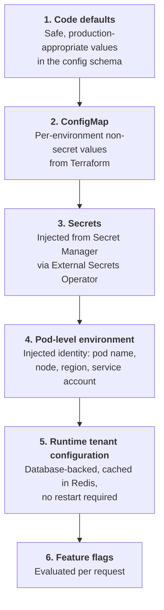
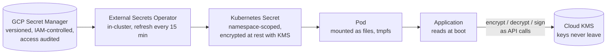
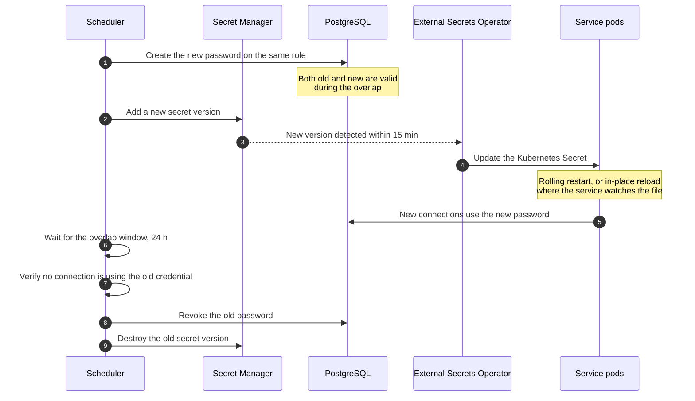
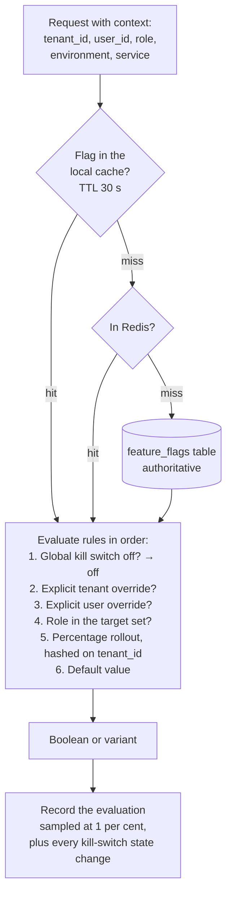

# 20 — Configuration, Secrets and Feature Flags

> **Document:** NGO Intelligence Suite — SDD v2.0
> **Chapter:** 20 — Configuration, Secrets and Feature Flags
> **Owner:** Platform Lead
> **Status:** Approved
> **Last Reviewed:** 2026-06-20
> **Review Cadence:** Semi-annually
> **Related ADRs:** —

---

## 20.1 Principles

| # | Principle | Consequence |
| --- | --- | --- |
| CFG-1 | **One artefact, many environments.** The same container image runs in every environment | No environment name compiled into a build; no `NODE_ENV`-conditional business logic |
| CFG-2 | **Configuration is validated at boot, not at first use** | A service with invalid configuration fails to start loudly, rather than failing at 02:00 when a code path is first reached |
| CFG-3 | **Secrets are never configuration** | Different storage, different rotation, different audit, different blast radius |
| CFG-4 | **Every setting has a documented owner, default and range** | An undocumented environment variable is a defect |
| CFG-5 | **Behaviour changes are flags; capability changes are releases** | A flag turns something off. It does not substitute for a deployment |
| CFG-6 | **A flag is temporary unless declared permanent** | Flag debt is tracked and paid down |
| CFG-7 | **Per-tenant configuration is data, not deployment** | A tenant setting change never requires a restart |

---

## 20.2 Configuration hierarchy

Later sources override earlier ones.



Levels 1 to 4 are process configuration, fixed for the pod's lifetime. Levels 5 and 6 are runtime state and change without a deployment. Confusing the two is how teams end up needing a restart to change a tenant's currency.

### 20.2.1 The boot-time contract

Every service declares its configuration as a schema and parses the environment through it before anything else — before opening a database connection, before binding a port.

```typescript
// config/schema.ts — illustrative
const ConfigSchema = z.object({
  SERVICE_NAME: z.string().min(1),
  PORT: z.coerce.number().int().min(1024).max(65535),
  LOG_LEVEL: z.enum(['debug', 'info', 'warn', 'error']).default('info'),
  REGION: z.string().min(1),

  DATABASE_URL: z.string().url(),
  DATABASE_POOL_MIN: z.coerce.number().int().min(0).default(2),
  DATABASE_POOL_MAX: z.coerce.number().int().min(1).max(50).default(10),
  DATABASE_STATEMENT_TIMEOUT_MS: z.coerce.number().int().default(15_000),

  REDIS_URL: z.string().url(),
  REDIS_TLS: z.coerce.boolean().default(true),

  JWT_PUBLIC_KEY: z.string().startsWith('-----BEGIN PUBLIC KEY-----'),
  JWT_ISSUER: z.string().url(),
  JWT_AUDIENCE: z.string().min(1),

  OTEL_EXPORTER_OTLP_ENDPOINT: z.string().url(),
  OTEL_TRACE_SAMPLE_RATE: z.coerce.number().min(0).max(1).default(0.1),

  SHUTDOWN_GRACE_MS: z.coerce.number().int().min(1_000).default(25_000),
})
  // A configuration schema is the right place for cross-field invariants.
  .refine(c => c.DATABASE_POOL_MAX >= c.DATABASE_POOL_MIN, {
    message: 'DATABASE_POOL_MAX must be >= DATABASE_POOL_MIN',
  });

export const config = (() => {
  const parsed = ConfigSchema.safeParse(process.env);
  if (!parsed.success) {
    // Field names only. Values may be secrets.
    console.error(JSON.stringify({
      level: 'fatal',
      message: 'Configuration validation failed',
      issues: parsed.error.issues.map(i => ({ path: i.path.join('.'), message: i.message })),
    }));
    process.exit(78); // EX_CONFIG
  }
  return Object.freeze(parsed.data);
})();
```

Three details are deliberate. Exit code 78 is the conventional configuration-error code, distinguishable in Kubernetes events from a crash. Only field names appear in the error output, never values, because a malformed connection string contains a password. And the object is frozen, so nothing mutates configuration at runtime.

### 20.2.2 Configuration registry

Every variable is registered with owner, default, range and rationale. The registry is generated from the schemas and checked in CI: a variable read from `process.env` outside the schema fails the build, which prevents the slow accumulation of undocumented settings that no one dares remove.

| Variable | Owner | Default | Range | Notes |
| --- | --- | --- | --- | --- |
| `PORT` | Platform | Per service | 1024–65535 | Fixed per service, [06 §6.2](06-microservice-design.md) |
| `LOG_LEVEL` | Platform | `info` | enum | `debug` in production only temporarily and with a recorded reason |
| `DATABASE_POOL_MAX` | Data | 10 | 1–50 | Total across replicas must stay under the PgBouncer ceiling ([09 §9.7](09-data-management-strategy.md)) |
| `DATABASE_STATEMENT_TIMEOUT_MS` | Data | 15000 | 1000–60000 | Reporting service uses 120000 |
| `OTEL_TRACE_SAMPLE_RATE` | Platform | 0.1 | 0–1 | 1.0 in staging; errors are always sampled regardless |
| `SHUTDOWN_GRACE_MS` | Platform | 25000 | 1000–60000 | Must be less than the pod `terminationGracePeriodSeconds` |
| `RATE_LIMIT_*` | Platform | Per tier | — | [10 §10.8](10-api-design-standards.md) |
| `AI_MODEL_VERSION` | Architecture | Pinned string | — | Never a floating alias ([18 §18.9](18-ai-llm-architecture.md)) |
| `AI_TENANT_MONTHLY_TOKEN_BUDGET` | Platform | 2000000 | — | Overridable per tenant at level 5 |
| `FEATURE_FLAG_REFRESH_MS` | Platform | 30000 | 5000–300000 | Flag cache TTL |

---

## 20.3 Secrets

### 20.3.1 Inventory

| Secret | Store | Rotation | Rotation type | Blast radius if leaked |
| --- | --- | --- | --- | --- |
| Database service-role passwords | GCP Secret Manager | 90 d | Automated, dual-credential | Tenant data, mitigated by application-layer encryption |
| JWT signing private key | Cloud KMS, never exported | 90 d | Automated, overlapping keys by `kid` | Full impersonation until rotated |
| Per-tenant PII data encryption keys | Cloud KMS, envelope encryption | 365 d | Automated, versioned | That tenant's PII |
| Redis AUTH credential | Secret Manager | 90 d | Automated | Cache and event bus |
| Object storage service account | Workload Identity, no static key | n/a | Identity-based | Files |
| Anthropic API key | Secret Manager | 180 d | Manual, provider-issued | Cost, and provider-side request history |
| SendGrid API key | Secret Manager | 180 d | Manual | Ability to send as the organisation — a phishing risk |
| Africa's Talking credential | Secret Manager | 180 d | Manual | SMS cost and impersonation |
| Mobile money credentials | Secret Manager | 90 d | Manual, provider process | **Financial.** Highest-consequence secret in the inventory |
| Bank webhook signing secret | Secret Manager | 180 d | Manual, coordinated | Forged payment confirmations |
| Supabase service key | Secret Manager | 180 d | Manual | Authentication subsystem |
| Container registry credentials | Workload Identity | n/a | Identity-based | Image push |
| Terraform state encryption key | Cloud KMS | 365 d | Automated | Infrastructure state |
| CI deploy credentials | GitHub OIDC to GCP, no static key | n/a | Short-lived tokens | Deployment |
| Grafana and alerting webhooks | Secret Manager | 365 d | Manual | Alert noise or suppression |

The pattern to notice: wherever workload identity federation is available it is used, because a secret that does not exist cannot leak. Static keys remain only where a third-party provider offers nothing better.

### 20.3.2 Delivery to workloads



| Rule | Reason |
| --- | --- |
| Secrets are mounted as files, not environment variables | Environment variables appear in crash dumps, `/proc`, child processes and debugging output. A file on tmpfs does not |
| Key material never leaves KMS | Encryption, decryption and signing are KMS API calls. A memory dump of a service yields no key |
| No secret in Git, ever | `gitleaks` pre-commit and in CI; a match blocks the merge |
| No secret in a container image | Image scanning checks for embedded credentials |
| No secret in a log | Structured logging redacts by key name and by value shape; the pattern list is shared with the AI redaction detectors ([18 §18.5.1](18-ai-llm-architecture.md)) |
| No secret in an error message or a trace attribute | Enforced by the sanitising error serialiser |
| Access to Secret Manager is audited | Every access logged; anomalous access alerts |
| Developers have no production secret access | Local development uses generated values against local containers |

### 20.3.3 Rotation

Automated rotation with a dual-credential window, because rotating a database password in a single step is a self-inflicted outage.



Manual rotations follow [RB-09](runbooks/rb-09-secret-rotation.md). The JWT signing key rotates with overlapping validity keyed by `kid`, so tokens issued under the previous key remain verifiable for the remainder of their 15-minute lifetime ([14 §14.4.4](14-security-architecture.md)).

### 20.3.4 Compromise response

| Step | Action | Target |
| --- | --- | --- |
| 1 | Revoke the credential immediately. Availability is secondary to containment | 15 min |
| 2 | Issue a replacement and roll the workloads | 30 min |
| 3 | Review access logs for use of the compromised credential | 2 h |
| 4 | If the JWT signing key: rotate and invalidate every session platform-wide. Every user re-authenticates. This is disruptive and correct | 30 min |
| 5 | If a tenant data key: assess whether ciphertext was also accessible, and treat as a breach if so ([17 §17.11](17-privacy-and-compliance.md)) | 4 h |
| 6 | Postmortem covering how it leaked and what would have prevented it | 5 d |

---

## 20.4 Per-tenant configuration

Runtime, database-backed, cached in Redis with event-driven invalidation. No restart, no deployment.

| Category | Settings |
| --- | --- |
| Identity | Name, slug, logo, primary colour, custom domain |
| Locale | Default locale, enabled locales, timezone, date format, week start |
| Finance | Base currency, additional currencies, fiscal year start, FX rate source, rate override policy |
| Payroll | Enabled countries, pay calendar, approval threshold requiring a second approver, payslip template |
| Modules | Which of the nine modules are enabled |
| Data protection | Optional beneficiary fields enabled — national identifier, photograph, precise coordinates — each requiring a recorded justification |
| Retention | Retention periods where a tenant's donor obligation exceeds the platform default. Never shorter than the statutory floor |
| Offline | Beneficiary cache size limit, offline TTL, device registration policy |
| Notification | Channel preferences, quiet hours, digest cadence, escalation targets |
| AI | Module on or off, per-use-case toggles, monthly token budget |
| Integration | IATI publisher identifier and publication toggle, mobile money provider and account, SMS sender identifier |
| Security | MFA requirement level, session timeout, IP allow-list, password policy above the platform minimum |
| Quotas | Storage, API rate tier, user seat count ([29 §29.5](29-multi-tenancy-and-tenant-lifecycle.md)) |

### 20.4.1 Constraints

1. A tenant cannot configure below a platform security or statutory floor. A tenant may raise the MFA requirement, never lower it.
2. A setting that enables collection of an additional personal data field requires a recorded justification and, where the field is Restricted, DPO approval ([17 §17.6.1](17-privacy-and-compliance.md)).
3. Every change is audited with before and after values, actor and timestamp.
4. Changes take effect within the cache TTL of 60 seconds, or immediately via a `tenant.config.updated` event.
5. Settings are schema-validated on write; an invalid value is rejected at the API rather than discovered at read.
6. A defaults template applies to new tenants, so a tenant is never in an unconfigured state.

---

## 20.5 Feature flags

### 20.5.1 Taxonomy

| Type | Purpose | Lifetime | Owner | Removal |
| --- | --- | --- | --- | --- |
| **Release** | Decouple deploy from launch; hide incomplete work behind a flag on trunk | Days to weeks | The implementing engineer | Mandatory once fully rolled out |
| **Experiment** | Compare variants | Weeks | Product | Mandatory at conclusion |
| **Operational (kill switch)** | Disable an expensive or failing subsystem under load | **Permanent** | Platform Lead | Never removed |
| **Permission** | Gate a capability by plan or agreement | Permanent | Product | Never removed |
| **Tenant** | Per-tenant capability enablement | Permanent | Product | Never removed; overlaps with §20.4 and is implemented through it |

The distinction between release flags and the permanent kinds is what keeps flag debt bounded. Release flags have a mandatory expiry; permanent flags are declared as such and exempt.

### 20.5.2 Kill switches

The operational flags that exist specifically to be turned off during an incident. Each is wired to a documented degradation behaviour rather than an error.

| Flag | Turns off | Effect when off | Runbook |
| --- | --- | --- | --- |
| `ai_insights_enabled` | The whole AI module | Drafting unavailable; every workflow manual | [18 §18.10](18-ai-llm-architecture.md) |
| `iati_publishing_enabled` | IATI publication | Queued, not published | [12 §12.4](12-integration-architecture.md) |
| `mobile_money_reconciliation_enabled` | Mobile money polling | Manual reconciliation | [12 §12.5](12-integration-architecture.md) |
| `email_notifications_enabled` | Outbound email | Queued up to 24 h, then dropped with a log | [12 §12.6](12-integration-architecture.md) |
| `sms_notifications_enabled` | Outbound SMS | Queued; critical alerts fall back to email | [12 §12.6](12-integration-architecture.md) |
| `scheduled_reports_enabled` | Report generation schedules | On-demand only | [RB-08](runbooks/rb-08-scale-event.md) |
| `analytics_recompute_enabled` | Aggregate recomputation | Dashboards serve last-known values with a visible staleness marker | [RB-08](runbooks/rb-08-scale-event.md) |
| `bulk_export_enabled` | Bulk exports | Individual records only. Also a containment control during a suspected exfiltration | [16](16-threat-model-stride.md) |
| `new_tenant_provisioning_enabled` | Tenant creation | Onboarding paused | [RB-05](runbooks/rb-05-tenant-onboarding.md) |
| `file_upload_enabled` | Uploads | Read-only file access; field submissions queue attachments locally | [13](13-offline-first-architecture.md) |
| `offline_sync_enabled` | Server-side sync acceptance | **Last resort.** Devices retain data and retry; used only to protect the database during a severe incident | [RB-02](runbooks/rb-02-dlq-drain-and-replay.md) |

`offline_sync_enabled` carries a deliberate warning in the flag description: turning it off means field data stops arriving, and if it stays off past the 72-hour device budget, data loss becomes possible. It exists because protecting the database from a sync storm may occasionally be the lesser harm, and the decision needs to be made knowingly.

### 20.5.3 Evaluation



| Rule | Detail |
| --- | --- |
| Fail-safe default | If the flag service is unreachable, the last known value is used; if none is known, the compiled default applies. A flag lookup failure never fails a request |
| Percentage rollout hashing | Hashed on `tenant_id`, not on request, so a tenant sees consistent behaviour. A user seeing a feature appear and disappear between page loads is worse than not having it |
| Latency | In-process cache means evaluation is sub-millisecond. No network call in the request path in the normal case |
| Kill-switch propagation | A kill-switch change publishes `platform.flag.changed` and invalidates caches immediately rather than waiting for the TTL, because 30 seconds is too long during an incident |
| Audit | Every flag change records who, when, from what, to what, and why. The reason field is mandatory |
| Frontend | Flags are resolved server-side and delivered in the session bootstrap payload; the client never evaluates rules itself |

### 20.5.4 Lifecycle and debt

| Stage | Requirement |
| --- | --- |
| Creation | Type, owner, description, default, removal date (or a permanent declaration), and the degradation behaviour if operational |
| Rollout | Internal, then one pilot tenant, then 10 per cent, 50 per cent, 100 per cent, with a documented soak at each step |
| Cleanup | A release flag past its removal date appears on a weekly report to the Frontend and Platform Leads |
| Enforcement | **A release flag more than 90 days past its removal date fails CI.** The build breaks until the flag and the dead branch are removed |
| Audit | Quarterly review of every flag: is it still needed, is its behaviour still what the description says |

The CI-breaking rule is blunt and is the only mechanism the industry has found that reliably works. Flags accumulate silently, each one doubling the notional state space, until nobody knows what configuration production is actually in.

### 20.5.5 Testing with flags

| Rule | Reason |
| --- | --- |
| Both states of every release flag are tested | An untested off-path is an untested rollback |
| The primary CI run uses production defaults | Tests must reflect what users actually get |
| A second run enables all release flags | Catches interaction defects before rollout |
| Kill switches have an explicit degradation test | The point of a kill switch is the behaviour when it is off, and that behaviour is the thing least likely to have been exercised |
| Flag combinations are not exhaustively tested | Combinatorially infeasible. Risk is managed by keeping the number of concurrent release flags low, with a soft cap of eight |
