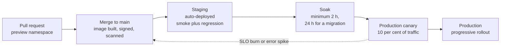
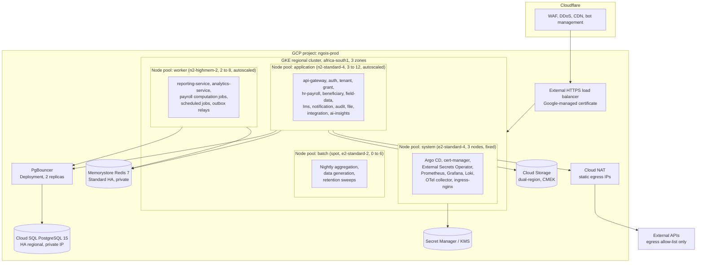

# 21 — Deployment and Infrastructure

> **Document:** NGO Intelligence Suite — SDD v2.0
> **Chapter:** 21 — Deployment and Infrastructure
> **Owner:** Platform Lead
> **Status:** Approved
> **Last Reviewed:** 2026-06-20
> **Review Cadence:** Semi-annually
> **Related ADRs:** [ADR-0014](adr/0014-gke-and-region-selection.md), [ADR-0016](adr/0016-single-region-with-warm-dr.md)

---

## 21.1 Platform choices

| Concern | Choice | Rationale |
| --- | --- | --- |
| Cloud provider | Google Cloud Platform | `africa-south1` availability, Cloud SQL for PostgreSQL maturity, GKE Autopilot as an operational fallback, credible non-profit pricing ([ADR-0014](adr/0014-gke-and-region-selection.md)) |
| Orchestration | GKE Standard, regional, with node auto-provisioning | Regional control plane for availability; Standard rather than Autopilot because per-pod resource tuning and DaemonSets are needed |
| Primary region | `africa-south1` (Johannesburg) | Data residency expectations of East African tenants; lowest regional latency available |
| DR region | `europe-west4` (Netherlands) | Warm standby with cross-region replicas ([27](27-disaster-recovery-and-bcp.md)) |
| Database | Cloud SQL for PostgreSQL 15, HA regional, with a cross-region read replica | Managed backups, PITR, automatic failover, and a read replica that doubles as the DR seed |
| Cache and event bus | Memorystore for Redis 7, Standard tier with replication | Managed HA; Redis Streams as the event substrate ([ADR-0003](adr/0003-redis-streams-over-kafka.md)) |
| Object storage | Cloud Storage, dual-region buckets, CMEK | Encrypted with customer-managed keys; lifecycle rules for archival |
| Secrets | Secret Manager plus Cloud KMS | [20 §20.3](20-configuration-secrets-feature-flags.md) |
| Ingress and WAF | Cloudflare in front of a GCP external HTTPS load balancer | WAF, DDoS absorption, CDN and bot management before traffic reaches the cluster |
| Registry | Artifact Registry with vulnerability scanning | Scanning gates promotion ([22 §22.8](22-cicd-release-supply-chain.md)) |
| IaC | Terraform 1.7, remote state in GCS with state locking | Everything except in-cluster application manifests |
| Application deployment | Helm 3 charts per service, applied by Argo CD | GitOps: the cluster reconciles to the repository, not to whatever a pipeline last pushed |
| Service mesh | **None at launch.** mTLS via cert-manager and application configuration | A mesh's operational cost exceeds its benefit at fifteen services and a five-person platform capability. Revisit at thirty services ([04 §4.5](04-architecture-principles.md)) |

The no-mesh decision is a considered one, recorded because reviewers reliably ask. Istio or Linkerd would give mTLS, retries and traffic shifting for free at the cost of a control plane the team must then operate, debug and upgrade. At this scale the same guarantees are achievable with cert-manager, a resilience library and Argo Rollouts, with far less to go wrong.

---

## 21.2 Environments

| Environment | Purpose | Cluster | Database | Data | Access |
| --- | --- | --- | --- | --- | --- |
| **Local** | Development | Docker Compose | Postgres container | Synthetic | Developer |
| **CI** | Automated testing | Ephemeral, Testcontainers | Ephemeral | Synthetic fixtures | Pipeline only |
| **Preview** | Per-pull-request review | Shared cluster, namespace per PR | Shared instance, database per PR | Synthetic | Team, torn down on merge |
| **Staging** | Pre-production verification, DR drills, load tests | Dedicated, production-shaped at reduced scale | Cloud SQL HA, smaller tier | **Synthetic only.** Never a production copy | Team |
| **Production** | Live | Dedicated, regional, 3 zones | Cloud SQL HA regional plus a cross-region replica | Real | Break-glass only ([15 §15.6](15-rbac-and-authorization.md)) |

### 21.2.1 Why staging holds no production data

The most common shortcut in this area is restoring a production backup into staging so that testing is realistic. It is rejected here without exception. It would put beneficiary and payroll data into an environment with looser access control, more debugging enabled, and a wider audience — undoing every control in [17](17-privacy-and-compliance.md) in a single operation.

Instead, staging is seeded by a generator that produces volume-realistic, distribution-realistic, entirely fabricated data: 25 tenants, 60,000 beneficiaries, 1,200 employees, three years of grant and payroll history, and deliberately messy edge cases such as duplicate-looking households, mid-period contract changes, and submissions captured against superseded form versions. The generator is maintained as product code, because a bad staging dataset produces false confidence, which is worse than no confidence.

### 21.2.2 Promotion



The same image digest moves through every stage. Nothing is rebuilt for production; a rebuild would mean the artefact that was tested is not the artefact that runs.

---

## 21.3 Cluster topology



### 21.3.1 Node pool rationale

| Pool | Machine type | Scaling | Why separated |
| --- | --- | --- | --- |
| `system` | e2-standard-4 | Fixed 3, one per zone | Observability and platform components must not be evicted by application autoscaling, and must not compete with a report generation spike. Tainted; only tolerating workloads land here |
| `application` | n2-standard-4 | 3–12, cluster autoscaler | Request-serving services. CPU-bound, latency-sensitive, scaled on request rate and CPU |
| `worker` | n2-highmem-2 | 2–8 | Reporting and analytics are memory-bound; a large report assembly on a standard node causes eviction pressure that would harm co-located request-serving pods |
| `batch` | e2-standard-2, **spot** | 0–6 | Interruption-tolerant work at roughly 70 per cent lower cost. Every workload here is idempotent and restartable by design, so a preemption is a retry rather than an incident |

Putting interruptible batch work on spot instances is the largest single infrastructure saving available and costs nothing in reliability, because the workloads were already required to be idempotent for event-processing reasons ([11 §11.6](11-event-driven-architecture.md)).

### 21.3.2 Namespaces

| Namespace | Contents | Network posture |
| --- | --- | --- |
| `ngois-edge` | ingress-nginx, api-gateway | The only namespace accepting external traffic |
| `ngois-core` | Domain services: grant, hr-payroll, beneficiary, field-data, lms | Ingress from `ngois-edge` only |
| `ngois-platform` | auth, tenant, notification, reporting, audit, file, integration, analytics, ai-insights | Ingress from `ngois-edge` and `ngois-core` |
| `ngois-data` | PgBouncer | Ingress from `ngois-core` and `ngois-platform` only |
| `ngois-observability` | Prometheus, Grafana, Loki, Tempo, OTel collector | Scrapes all; accepts ingress from nothing but the authenticated Grafana route |
| `ngois-system` | Argo CD, cert-manager, External Secrets Operator | Restricted |

Each namespace has a `ResourceQuota` and a `LimitRange`, so a single misconfigured deployment cannot consume the cluster.

---

## 21.4 Workload specifications

### 21.4.1 Resource requests and limits

Requests are set from observed p95 usage plus 30 per cent headroom; CPU limits are set at roughly three times the request to absorb bursts, and memory limits equal to twice the request.

| Service | CPU request | CPU limit | Memory request | Memory limit | Replicas min–max |
| --- | --- | --- | --- | --- | --- |
| `api-gateway` | 200m | 1000m | 256Mi | 512Mi | 3–12 |
| `auth-service` | 150m | 600m | 256Mi | 512Mi | 3–8 |
| `tenant-service` | 100m | 400m | 192Mi | 384Mi | 2–4 |
| `grant-service` | 200m | 800m | 384Mi | 768Mi | 2–8 |
| `hr-payroll-service` | 250m | 1500m | 512Mi | 1Gi | 2–6 |
| `beneficiary-service` | 200m | 800m | 384Mi | 768Mi | 2–8 |
| `field-data-service` | 250m | 1000m | 512Mi | 1Gi | 2–10 |
| `lms-service` | 150m | 600m | 256Mi | 512Mi | 2–4 |
| `notification-service` | 150m | 600m | 256Mi | 512Mi | 2–6 |
| `reporting-service` | 300m | 2000m | 1Gi | 2Gi | 2–6 |
| `analytics-service` | 250m | 1500m | 768Mi | 1.5Gi | 2–4 |
| `audit-service` | 100m | 400m | 256Mi | 512Mi | 2–4 |
| `file-service` | 150m | 800m | 384Mi | 768Mi | 2–6 |
| `integration-service` | 150m | 600m | 256Mi | 512Mi | 2–4 |
| `ai-insights-service` | 100m | 500m | 256Mi | 512Mi | 1–3 |
| `pgbouncer` | 100m | 500m | 128Mi | 256Mi | 2 (fixed) |

**Memory limits are set equal to twice the request rather than left unbounded**, because a Node.js process with no memory limit that leaks will consume the node and take unrelated pods with it. Bounding it converts a cluster-wide problem into a single-pod restart, which is visible, alertable and survivable.

**CPU limits are set generously rather than tightly**, because CPU throttling in Node.js manifests as unpredictable latency that is genuinely hard to diagnose. A limit exists to stop runaway consumption, not to enforce fairness — that is the request's job.

### 21.4.2 Standard pod specification

```yaml
# Illustrative; the real values come from the Helm chart per service.
spec:
  serviceAccountName: grant-service          # Workload Identity bound
  automountServiceAccountToken: false
  securityContext:
    runAsNonRoot: true
    runAsUser: 10001
    fsGroup: 10001
    seccompProfile: { type: RuntimeDefault }
  terminationGracePeriodSeconds: 40          # > SHUTDOWN_GRACE_MS of 25 s
  topologySpreadConstraints:
    - maxSkew: 1
      topologyKey: topology.kubernetes.io/zone
      whenUnsatisfiable: ScheduleAnyway
      labelSelector: { matchLabels: { app: grant-service } }
  initContainers:
    - name: await-migrations                 # Blocks until schema_migrations
      image: ngois/migration-check:1.4.0     # reports the expected version
  containers:
    - name: grant-service
      image: africa-south1-docker.pkg.dev/ngois-prod/svc/grant-service@sha256:...
      imagePullPolicy: IfNotPresent          # Digest-pinned, so caching is safe
      securityContext:
        allowPrivilegeEscalation: false
        readOnlyRootFilesystem: true
        capabilities: { drop: ["ALL"] }
      ports:
        - { name: http, containerPort: 3004 }
        - { name: metrics, containerPort: 9464 }
      startupProbe:                          # Generous: migrations may be slow
        httpGet: { path: /health/startup, port: http }
        periodSeconds: 5
        failureThreshold: 30
      readinessProbe:                        # Dependency-aware
        httpGet: { path: /health/ready, port: http }
        periodSeconds: 10
        failureThreshold: 3
      livenessProbe:                         # Deliberately shallow
        httpGet: { path: /health/live, port: http }
        periodSeconds: 15
        failureThreshold: 4
      lifecycle:
        preStop:
          exec:
            # Let endpoint removal propagate before the process starts draining.
            command: ["/bin/sh", "-c", "sleep 5"]
      volumeMounts:
        - { name: secrets, mountPath: /etc/secrets, readOnly: true }
        - { name: tmp, mountPath: /tmp }
  volumes:
    - name: secrets
      csi:
        driver: secrets-store.csi.k8s.io     # tmpfs-backed
        readOnly: true
    - name: tmp
      emptyDir: { medium: Memory, sizeLimit: 64Mi }
```

Two subtleties are worth calling out. The `preStop` sleep exists because Kubernetes removes a pod from Service endpoints and sends `SIGTERM` concurrently, not in order; without the pause, in-flight requests are routed to a process that has already begun shutting down. And the liveness probe is intentionally shallow — it checks only that the event loop responds. A liveness probe that checks the database will restart every pod in the cluster when the database has a brief problem, converting a recoverable dependency blip into a full outage. Dependency health belongs in readiness ([06 §6.4.1](06-microservice-design.md)).

### 21.4.3 Autoscaling

```yaml
# HorizontalPodAutoscaler, illustrative — api-gateway
spec:
  minReplicas: 3
  maxReplicas: 12
  metrics:
    - type: Resource
      resource: { name: cpu, target: { type: Utilization, averageUtilization: 65 } }
    - type: Pods
      pods:
        metric: { name: http_requests_per_second }
        target: { type: AverageValue, averageValue: "120" }
  behavior:
    scaleUp:
      stabilizationWindowSeconds: 30         # React quickly
      policies: [{ type: Percent, value: 100, periodSeconds: 30 }]
    scaleDown:
      stabilizationWindowSeconds: 300        # Retreat slowly
      policies: [{ type: Percent, value: 25, periodSeconds: 60 }]
```

Scaling up fast and down slowly is asymmetric on purpose: the cost of being briefly over-provisioned is a few cents, and the cost of flapping under a variable load is user-visible latency.

Queue-driven services scale on Redis Stream lag rather than CPU, because a consumer waiting on I/O shows low CPU while falling badly behind:

| Service | Scaling signal | Threshold |
| --- | --- | --- |
| `field-data-service` | `fielddata.events` consumer lag | 500 pending entries per replica |
| `notification-service` | Notification queue depth | 200 per replica |
| `reporting-service` | Report job queue depth | 3 per replica |
| `analytics-service` | Aggregate recomputation backlog | 10 per replica |

### 21.4.4 Disruption budgets

| Service group | PDB |
| --- | --- |
| Tier 1 (gateway, auth, grant, hr-payroll, beneficiary, field-data) | `minAvailable: 2` |
| Tier 2 (lms, notification, reporting, audit, file, integration, analytics) | `maxUnavailable: 1` |
| Tier 3 (ai-insights) | `maxUnavailable: 1` |
| PgBouncer | `minAvailable: 1` |

A PDB with `minAvailable: 2` on a Tier 1 service means a node drain during a cluster upgrade cannot take the service below two replicas, which is the difference between a rolling upgrade and an outage.

---

## 21.5 Network policy

Default deny for both ingress and egress in every namespace. Every permitted flow is explicit.

```yaml
# Default deny, applied per namespace.
apiVersion: networking.k8s.io/v1
kind: NetworkPolicy
metadata: { name: default-deny-all, namespace: ngois-core }
spec:
  podSelector: {}
  policyTypes: [Ingress, Egress]
---
# grant-service: exactly what it needs, and nothing else.
apiVersion: networking.k8s.io/v1
kind: NetworkPolicy
metadata: { name: grant-service, namespace: ngois-core }
spec:
  podSelector: { matchLabels: { app: grant-service } }
  policyTypes: [Ingress, Egress]
  ingress:
    - from:
        - namespaceSelector: { matchLabels: { name: ngois-edge } }
          podSelector: { matchLabels: { app: api-gateway } }
      ports: [{ protocol: TCP, port: 3004 }]
    - from:
        - namespaceSelector: { matchLabels: { name: ngois-observability } }
      ports: [{ protocol: TCP, port: 9464 }]
  egress:
    - to:
        - namespaceSelector: { matchLabels: { name: ngois-data } }
          podSelector: { matchLabels: { app: pgbouncer } }
      ports: [{ protocol: TCP, port: 6432 }]
    - to: [{ ipBlock: { cidr: 10.20.0.0/24 } }]          # Memorystore
      ports: [{ protocol: TCP, port: 6379 }]
    - to:
        - namespaceSelector: { matchLabels: { name: kube-system } }
          podSelector: { matchLabels: { k8s-app: kube-dns } }
      ports: [{ protocol: UDP, port: 53 }, { protocol: TCP, port: 53 }]
```

### 21.5.1 Egress control

Only `integration-service` and `ai-insights-service` may reach the public internet, and only to an allow-list of destinations resolved through Cloud NAT with static IPs so that partners can allow-list us in return.

| Service | Permitted destinations |
| --- | --- |
| `integration-service` | IATI registry, MTN and Airtel API hosts, the tenant bank's API host, SendGrid, Africa's Talking, the central bank rate endpoint |
| `ai-insights-service` | `api.anthropic.com` only |
| Every other service | No internet egress at all |

This is the control that turns a compromised domain service from a data-exfiltration event into a contained one: the process may be running attacker code, but it has nowhere to send anything.

---

## 21.6 Data tier

### 21.6.1 Cloud SQL

| Setting | Value | Reason |
| --- | --- | --- |
| Version | PostgreSQL 15 | Partitioning improvements, `MERGE`, logical replication maturity |
| Tier | db-custom-8-32768 at launch (8 vCPU, 32 GB) | Sized from the load model in [25 §25.4](25-performance-and-capacity.md) |
| Availability | Regional HA with automatic failover | Synchronous replication to a standby in a second zone |
| Storage | 500 GB SSD, auto-grow enabled | Auto-grow prevents a disk-full outage; growth is alerted rather than silent |
| Backups | Automated daily, 30-day retention, plus PITR with 7 days of write-ahead logs | RPO of 5 minutes ([27 §27.3](27-disaster-recovery-and-bcp.md)) |
| Read replica | One in-region for reporting, one cross-region in `europe-west4` for DR | Reporting load kept off the primary |
| Connectivity | Private IP only, no public IP, no authorised networks | The database is not reachable from the internet under any configuration |
| Encryption | CMEK | Key rotation and revocation under our control |
| Flags | `log_min_duration_statement=1000`, `log_checkpoints=on`, `log_lock_waits=on`, `log_temp_files=0`, `track_io_timing=on`, `pg_stat_statements` enabled | Diagnosis of a slow query at 02:00 depends on these having been on beforehand |
| Maintenance window | Sunday 02:00–04:00 SAST | Lowest observed activity |

### 21.6.2 PgBouncer

Two replicas in `ngois-data`, transaction pooling, 25 client connections per service instance to a maximum of 80 server connections against Cloud SQL's ceiling of 200 — leaving deliberate headroom for migrations, break-glass sessions and the replica.

Transaction pooling is what makes RLS dangerous if misused, and the mitigation is stated in [09 §9.7.3](09-data-management-strategy.md): tenant context is set with `SET LOCAL` inside a transaction only, never with `SET`, and a lint rule plus an integration test enforce it. This is the single highest-consequence configuration interaction in the infrastructure.

### 21.6.3 Redis

| Setting | Value |
| --- | --- |
| Tier | Standard with replication, automatic failover |
| Size | 5 GB at launch |
| Version | Redis 7 |
| Persistence | RDB snapshots hourly |
| Eviction | `noeviction` on the database holding streams; `allkeys-lru` on the cache database |
| Connectivity | Private service access, AUTH plus in-transit encryption |

The eviction policy split matters. `allkeys-lru` on a database holding Redis Streams would silently discard undelivered domain events under memory pressure — losing data while reporting success. Streams and cache therefore occupy separate logical databases with different policies.

### 21.6.4 Object storage

| Bucket | Contents | Class | Lifecycle | Versioning |
| --- | --- | --- | --- | --- |
| `ngois-prod-documents` | Grant documents, contracts, certificates | Standard | To Nearline at 90 d, Coldline at 365 d | On, 90-day retention of noncurrent versions |
| `ngois-prod-payslips` | Payslip PDFs | Standard | To Nearline at 90 d | On |
| `ngois-prod-field-media` | Field photographs | Standard | To Nearline at 30 d, deleted at 12 months per the retention policy | On, 30 d |
| `ngois-prod-reports` | Generated reports | Standard | Deleted at 90 d | Off |
| `ngois-prod-exports` | Tenant data exports | Standard | **Deleted at 7 d** | Off |
| `ngois-prod-backups` | Logical database dumps, configuration snapshots | Nearline | Retained 365 d, **object retention lock** | On |

All buckets: uniform bucket-level access, public access prevention enforced, CMEK, access logging on. Files are served only through signed URLs with a 15-minute expiry issued by `file-service` after an authorisation check ([06 §6.3.12](06-microservice-design.md)); no bucket is ever fronted by a public URL.

The retention lock on the backup bucket is a ransomware control: an attacker with full project IAM still cannot delete or overwrite a locked object before its retention expires.

---

## 21.7 Infrastructure as code

```
infra/
  modules/
    network/          VPC, subnets, Cloud NAT, private service access
    gke/              cluster, node pools, Workload Identity
    cloudsql/         instance, HA, replicas, flags, backups
    memorystore/      Redis instances
    storage/          buckets, lifecycle, retention locks
    secrets/          Secret Manager secrets, KMS keyrings and keys
    iam/              service accounts, role bindings, Workload Identity
    monitoring/       uptime checks, log sinks, notification channels
    cloudflare/       zone, WAF rules, DNS
  envs/
    staging/          module composition and variables
    production/
```

| Rule | Detail |
| --- | --- |
| No manual console change | Drift is detected daily by `terraform plan` in CI and reported. A non-empty plan against `main` is an alert |
| Plan on every PR, apply on merge | Applies are gated on approval from the Platform Lead for production |
| State | GCS backend, versioned, encrypted with a CMEK, with state locking |
| Module versioning | Environments pin module versions, so staging can move ahead of production |
| Secret values | Never in Terraform. Terraform creates the secret container; the value is written out of band ([20 §20.3](20-configuration-secrets-feature-flags.md)) |
| Destroy protection | `deletion_protection` on Cloud SQL, retention lock on backup buckets, `prevent_destroy` lifecycle on stateful resources |
| Policy as code | `tfsec` and `checkov` in CI; a High finding blocks the merge |
| Cost visibility | `infracost` posts the cost delta on every infrastructure PR, which is how a well-intentioned tier bump gets noticed before it lands |

### 21.7.1 In-cluster GitOps

Application manifests are not Terraform's concern. Argo CD watches a manifest repository and reconciles the cluster to it.

| Aspect | Approach |
| --- | --- |
| Structure | One Argo `Application` per service per environment, generated by an ApplicationSet |
| Sync | Automated with prune and self-heal in staging; automated with manual promotion of the image digest in production |
| Image updates | CI opens a pull request that changes the digest. The merge is the deployment, and the Git history is the deployment history |
| Drift | Self-heal reverts a manual `kubectl` change, so the cluster cannot quietly diverge from the repository |
| Rollback | Revert the commit. Argo reconciles |
| Progressive delivery | Argo Rollouts for canary, with automated analysis against Prometheus ([22 §22.5](22-cicd-release-supply-chain.md)) |

---

## 21.8 Certificates and DNS

| Certificate | Issuer | Rotation |
| --- | --- | --- |
| Public edge, `*.ngointelligence.org` | Cloudflare-managed | Automatic |
| Load balancer to cluster | Google-managed | Automatic |
| Internal service-to-service mTLS | cert-manager with a private CA | 90-day lifetime, renewed at 60 days, automatic |
| Tenant custom domains | cert-manager with ACME | Automatic, per domain |
| Private CA root | Cloud CA Service | 10-year lifetime, rotation procedure in [RB-04](runbooks/rb-04-certificate-rotation.md) |

Certificate expiry is alerted at 21 days remaining, which is deliberately early. An expired internal certificate is a total outage with a confusing signature, and it is one of the most common causes of self-inflicted downtime in the industry.

---

## 21.9 Cluster maintenance

| Activity | Cadence | Method |
| --- | --- | --- |
| GKE control plane upgrade | Automatic within a release channel, regular channel | Google-managed, in the maintenance window |
| Node pool upgrade | Monthly, surge upgrade | One node at a time with PDBs respected; drained gracefully |
| Node image | Container-Optimized OS with containerd, auto-repair and auto-upgrade on | Immutable node images; nodes are replaced, never patched in place |
| Base image rebuild | Weekly, plus immediately on a Critical CVE | Every service image rebuilt and redeployed ([22 §22.8](22-cicd-release-supply-chain.md)) |
| PostgreSQL minor version | Automatic in the maintenance window | Managed |
| PostgreSQL major version | Planned, staging-rehearsed, announced | With a documented rollback path |
| Redis version | Managed, in the window | — |
| Cluster rebuild drill | Annually | Rebuild the staging cluster from Terraform and Argo alone, timed ([27 §27.7](27-disaster-recovery-and-bcp.md)) |

The annual rebuild drill is the only way to know whether the infrastructure repository actually describes the running system. Every organisation believes it does; roughly none are correct on the first attempt.
