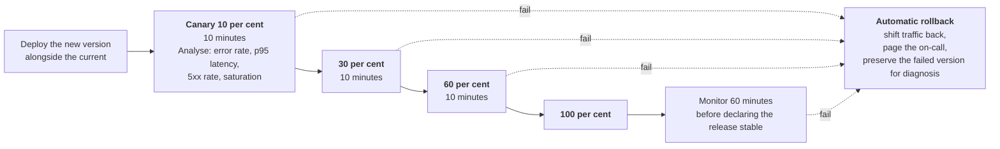
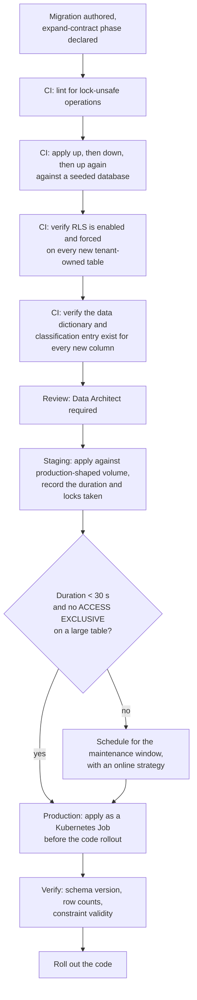
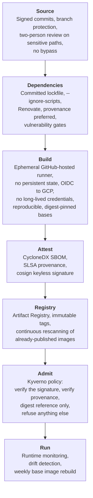

# 22 — CI/CD, Release Management and Supply Chain Security

> **Document:** NGO Intelligence Suite — SDD v2.0
> **Chapter:** 22 — CI/CD, Release Management and Supply Chain Security
> **Owner:** Platform Lead
> **Status:** Approved
> **Last Reviewed:** 2026-06-20
> **Review Cadence:** Semi-annually
> **Related ADRs:** [ADR-0018](adr/0018-trunk-based-development.md)

---

## 22.1 Objectives

| Objective | Target |
| --- | --- |
| Time from merge to production | < 60 minutes for a standard change |
| Deployment frequency | Daily, and on demand |
| Change failure rate | < 10 per cent |
| Mean time to restore | < 30 minutes, achieved by rollback rather than by fixing forward |
| Pipeline duration, pull request | < 12 minutes to a merge decision |
| Pipeline reliability | < 2 per cent flake rate. A flaky pipeline is treated as a production defect, because a team that reruns failures stops reading them |
| Provenance | Every running artefact traceable to a commit, a build and a signature |

---

## 22.2 Branching and versioning

Trunk-based development ([ADR-0018](adr/0018-trunk-based-development.md)): short-lived branches from `main`, merged within two days, incomplete work hidden behind release flags ([20 §20.5](20-configuration-secrets-feature-flags.md)).

| Rule | Detail |
| --- | --- |
| `main` is always releasable | Every commit on `main` is a deployment candidate |
| Branch lifetime | Two days. A longer-lived branch is a signal the change should have been flagged and split |
| Merge method | Squash, with a conventional-commit message |
| Protection | Two approvals for changes touching payroll, authorisation, cryptography, RLS policies or migrations; one otherwise. Required checks must pass. No force push, no bypass, including for administrators |
| Code ownership | `CODEOWNERS` routes review by area; the security-sensitive paths listed above require a Security Lead or Data Architect review |
| Release branches | Only for a hotfix against a production version that `main` has already moved past |
| Versioning | Semantic versioning per service. API versions are independent and change far more slowly ([10 §10.11](10-api-design-standards.md)) |
| Tagging | `service-name/v1.4.2`; images are tagged with the version, the commit SHA, and pinned by digest for deployment |
| Changelog | Generated from conventional commits, curated for the release notes tenants actually read |

---

## 22.3 Pipeline

```mermaid
flowchart TB
    PR["Pull request opened"]

    subgraph fast ["Fast feedback — under 5 minutes, parallel"]
        L["Lint: ESLint, Prettier,<br/>SQL lint, import boundaries"]
        T["Types: tsc --noEmit"]
        U["Unit tests with coverage"]
        S["Secret scan: gitleaks"]
        CFG["Config registry check"]
        FF["Flag expiry check"]
        DOC["SDD consistency checks<br/>links, refs, IDs, diagrams"]
    end

    subgraph deep ["Deeper checks — under 12 minutes"]
        I["Integration tests<br/>Testcontainers: Postgres, Redis"]
        C["Contract tests: Pact<br/>verify against the broker"]
        M["Migration checks:<br/>up, down, idempotency, lock safety"]
        TEN["Tenant isolation suite"]
        SAST["SAST: CodeQL, Semgrep"]
        DEP["Dependency audit: npm audit, Snyk"]
        LIC["Licence compliance"]
        A11Y["Component accessibility: axe"]
        BUD["Bundle budget check"]
    end

    Build["Build image<br/>multi-stage, distroless,<br/>reproducible, digest recorded"]
    Scan["Image scan: Trivy, Grype"]
    SBOM["Generate SBOM: CycloneDX"]
    Sign["Sign: cosign keyless,<br/>attach SBOM and provenance"]
    Prev["Deploy the preview namespace"]
    E2EP["E2E smoke against the preview"]
    Rev["Human review"]

    Merge["Merge to main"]
    Stg["Deploy to staging via Argo"]
    Reg["Full regression: E2E in en and ar,<br/>offline sync, load smoke, DAST"]
    Soak["Soak: 2 h, or 24 h with a migration"]
    Prod["Production: canary then progressive"]
    Ver["Post-deployment verification"]

    PR --> fast --> deep --> Build --> Scan --> SBOM --> Sign --> Prev --> E2EP --> Rev
    Rev --> Merge --> Stg --> Reg --> Soak --> Prod --> Ver
    Ver -.->|"SLO burn, error spike,<br/>or a failed check"| RB["Automatic rollback"]
```



### 22.3.1 Quality gates

Every gate is blocking. There is no override path short of an explicit, recorded, dual-approved emergency process ([§22.7](#227-emergency-changes)).

| Gate | Threshold |
| --- | --- |
| Lint and format | Zero errors |
| Type check | Zero errors, `strict` on |
| SDD consistency | Zero broken links, section references, undefined identifiers or unparseable diagrams; runs only when `docs/sdd/` changes ([35 §35.7.1](35-engineering-standards.md)) |
| Unit coverage | ≥ 80 per cent overall; ≥ 95 per cent on payroll calculation, vulnerability scoring, authorisation, encryption and the redaction pipeline |
| Coverage direction | Coverage may not decrease on a pull request |
| Integration tests | 100 per cent pass |
| Contract tests | 100 per cent pass; a consumer contract cannot be broken silently |
| Migration checks | Up and down both succeed; a lock-unsafe operation on a large table blocks ([09 §9.4](09-data-management-strategy.md)) |
| Tenant isolation suite | 100 per cent pass. **Non-negotiable** |
| Secret scan | Zero findings |
| SAST | Zero High or Critical |
| Dependency audit | Zero Critical; a High requires a recorded, time-boxed exception |
| Licence check | No copyleft licence incompatible with the distribution model |
| Image scan | Zero Critical; a High requires an exception with an owner and a date |
| Accessibility | Zero automated axe violations |
| Bundle budgets | Within the limits in [19 §19.8](19-frontend-architecture.md) |
| E2E on preview | 100 per cent of the smoke set |
| Signature and provenance | Present and verifiable, or the deployment is refused by the admission controller |

---

## 22.4 Build

### 22.4.1 Container images

```dockerfile
# Illustrative — every service follows this shape.
FROM node:20.14.0-bookworm-slim@sha256:... AS deps
WORKDIR /app
COPY package.json package-lock.json ./
RUN npm ci --ignore-scripts            # No lifecycle scripts from dependencies

FROM deps AS build
COPY . .
RUN npm run build && npm prune --omit=dev

FROM gcr.io/distroless/nodejs20-debian12@sha256:... AS runtime
WORKDIR /app
COPY --from=build --chown=nonroot:nonroot /app/dist ./dist
COPY --from=build --chown=nonroot:nonroot /app/node_modules ./node_modules
USER nonroot
EXPOSE 3004
ENV NODE_OPTIONS="--max-old-space-size=640"
CMD ["dist/main.js"]
```

| Practice | Reason |
| --- | --- |
| Digest-pinned base images | A tag is mutable. `node:20-slim` today is not `node:20-slim` next week, and an unreproducible build cannot be audited |
| Distroless runtime | No shell, no package manager, no `curl`. An attacker with code execution has almost no tooling to escalate with |
| `--ignore-scripts` | Postinstall scripts are the most direct supply-chain execution path in the npm ecosystem |
| Non-root, read-only root filesystem | Standard hardening ([21 §21.4.2](21-deployment-and-infrastructure.md)) |
| Explicit heap ceiling | Node's default heap is unaware of the container limit and will be OOM-killed rather than garbage-collecting. Set to roughly 85 per cent of the memory limit |
| Multi-stage | Build tooling never reaches the runtime image |
| Reproducibility | Same source plus same lockfile yields the same digest; verified weekly by a rebuild-and-compare job |
| Size targets | 120–180 MB per service image |

### 22.4.2 Dependency policy

| Rule | Detail |
| --- | --- |
| Lockfile committed | `npm ci` only. `npm install` in CI is a build failure |
| New dependency review | A pull request adding a dependency states why, notes the alternatives, and records the maintenance signal: last release, maintainer count, weekly downloads, open critical issues |
| Provenance preferred | Packages with npm provenance attestation are preferred where a choice exists |
| No unmaintained packages | No release in 24 months requires an exception with a migration plan |
| Transitive depth | A dependency pulling more than 50 transitive packages needs justification. The `left-pad` lesson is about surface area, not about that specific package |
| Vendoring | A tiny utility is copied into the repository with attribution rather than added as a dependency |
| Renovate | Automated update pull requests: patch grouped weekly and auto-merged on green, minor grouped weekly with review, major individually with a migration note |
| Update SLA | Critical within 24 h, High within 7 d, Medium within 30 d, Low at the next scheduled window |

---

## 22.5 Progressive delivery



### 22.5.1 Automated analysis

Argo Rollouts queries Prometheus at each step. Any breach aborts and rolls back without human involvement, because the median time for a human to notice, diagnose and decide exceeds the time the canary is exposed.

| Metric | Abort condition |
| --- | --- |
| HTTP 5xx rate | > 1 per cent, or more than 3× the baseline |
| p95 latency | > 1.5× the baseline for the same endpoint mix |
| Error log rate | > 5× the baseline |
| Pod restarts | Any `CrashLoopBackOff` in the canary |
| Readiness | Any canary pod not ready within 2 minutes |
| SLO burn rate | Fast-burn alert firing ([24 §24.8](24-observability.md)) |
| Event consumer lag | Growing for more than 5 minutes |
| Business signal | Successful payroll computations, submission acceptances or disbursement creations dropping below baseline |

That last row is the one most often omitted. A release can be healthy by every infrastructure metric while quietly rejecting every field submission, and only a domain-level signal catches it.

### 22.5.2 Deployment strategy per service

| Service | Strategy | Reason |
| --- | --- | --- |
| `api-gateway` | Canary, 4 steps | Highest blast radius |
| Tier 1 domain services | Canary, 3 steps | User-facing correctness |
| `hr-payroll-service` | Canary, plus a **hold if a payroll run is in progress** | Never change the computation engine mid-run. The deployment waits |
| Tier 2 services | Rolling update, `maxSurge: 1`, `maxUnavailable: 0` | Lower risk, simpler |
| `ai-insights-service` | Rolling | Tier 3 |
| Consumers and workers | Rolling, with drain before termination | In-flight events must be acknowledged or returned to the pending list ([11 §11.5](11-event-driven-architecture.md)) |
| Frontend | Atomic CDN swap with the old bundle retained | Retention prevents a chunk 404 for a user mid-session on the previous version |
| Migrations | Separate, ahead of the code, expand–contract | [§22.6](#226-database-migrations-in-the-pipeline) |

### 22.5.3 Rollback

| Trigger | Action | Target |
| --- | --- | --- |
| Automated analysis failure | Automatic traffic shift back | < 2 min |
| On-call decision | `kubectl argo rollouts undo`, or revert the Argo commit | < 5 min |
| Frontend | Repoint the CDN to the previous manifest | < 2 min |
| A migration is involved | Roll back code only. **The migration is not reversed** | < 5 min |

The migration rule is the reason expand–contract is mandatory rather than recommended. Because every migration is backward-compatible with the previous code version, a code rollback is always safe and a schema rollback is never needed. Reversing a migration under incident pressure, against data written by the new version, is how recoverable incidents become data-loss incidents.

---

## 22.6 Database migrations in the pipeline



| Rule | Detail |
| --- | --- |
| Migrations run before the code | The init container `await-migrations` blocks pod startup until the expected schema version is present ([21 §21.4.2](21-deployment-and-infrastructure.md)) |
| One logical change per migration | A failure is then unambiguous |
| Always backward-compatible | The previous code version must run against the new schema. Verified by running the previous version's integration suite against the migrated schema |
| Lock safety | `CREATE INDEX CONCURRENTLY`, `NOT VALID` then `VALIDATE`, no `ALTER COLUMN TYPE` on a large table, `lock_timeout` of 3 s with retry ([09 §9.4.3](09-data-management-strategy.md)) |
| Backfills are not migrations | A large backfill is a separate, batched, resumable, rate-limited job |
| Timing recorded | Staging duration against production-shaped volume is the estimate production is judged against |
| Advisory lock | A migration takes an advisory lock, so two concurrent runners cannot both apply |
| RLS verification | A new tenant-owned table without RLS enabled and forced fails the build. This gate exists because forgetting it once is a cross-tenant data leak |

---

## 22.7 Emergency changes

The path exists because an incident will eventually require it, and an undocumented emergency path is worse than a documented one.

| Requirement | Detail |
| --- | --- |
| Authorisation | Incident Commander plus one of the Platform Lead, Chief Architect or Security Lead |
| What may be skipped | The soak period, the full regression suite, and the staged canary. Traffic still shifts progressively but with compressed steps |
| What may **never** be skipped | Secret scanning, image signing, the tenant isolation suite, migration lock-safety checks, and code review by one other engineer |
| Recording | A ticket created before the change, stating what is skipped and why |
| Follow-up | Within 24 hours: the full pipeline runs against the change, and any gate it would have failed is addressed |
| Review | Every emergency change is reviewed in the postmortem ([26 §26.6](26-reliability-and-incident-management.md)) |
| Frequency as a signal | More than two emergency changes in a month triggers a review of why normal delivery is too slow |

The list of non-skippable gates is chosen carefully. Each protects against a failure that is both irreversible and worse than the incident being fixed: a leaked secret, an unsigned artefact, a cross-tenant leak, or a locked table.

---

## 22.8 Supply chain security

Aligned to SLSA Build Level 3.



### 22.8.1 Controls

| Control | Implementation |
| --- | --- |
| Commit signing | Required on `main`; unsigned commits are rejected |
| Build isolation | Ephemeral runners; no shared cache that a prior job could poison; no secrets in the build environment beyond the OIDC token |
| CI credentials | GitHub OIDC federated to GCP. **No long-lived cloud credential exists in CI** |
| Third-party actions | Pinned to a commit SHA, never a tag, because a tag can be repointed. Reviewed before adoption |
| SBOM | CycloneDX generated at build, attached to the image, retained for the artefact's life. This is what makes "are we affected by this CVE" a two-minute query rather than a two-day investigation |
| Provenance | SLSA provenance attestation recording the source commit, builder identity and build parameters |
| Signing | `cosign` keyless via OIDC. No signing key to steal |
| Admission control | Kyverno verifies signature and provenance and rejects tag-based references. An unsigned image cannot run, which closes the "someone pushed an image manually" path |
| Registry hygiene | Immutable tags; images rescanned continuously so a CVE published after the build is still detected |
| Base image currency | Weekly rebuild of every service image; immediate rebuild on a Critical base-image CVE |
| Runtime drift | A running container whose filesystem diverges from its image raises an alert |
| Internal packages | Shared libraries published to a private registry, versioned, signed, with the same review standard as service code |

### 22.8.2 Vulnerability response

| Severity | Triage | Remediate | Escalate |
| --- | --- | --- | --- |
| Critical, exploitable in our usage | 1 h | 24 h | Incident process |
| Critical, not exploitable in our usage | 4 h | 7 d, documented exception meanwhile | Security Lead |
| High, exploitable | 4 h | 7 d | Security Lead |
| High, not exploitable | 24 h | 30 d | — |
| Medium | 7 d | 90 d | — |
| Low | 30 d | Next scheduled window | — |

Exploitability assessment matters because most reported vulnerabilities in a dependency tree are in code paths the application never reaches. Blocking every release on every High finding, most of which are unreachable, trains the team to bypass the gate — which is how the one that matters gets waved through. The exception process is therefore explicit, owned and time-boxed rather than informal.

---

## 22.9 Release management

### 22.9.1 Cadence

| Type | Frequency | Approval | Notice to tenants |
| --- | --- | --- | --- |
| Patch, no user-visible change | On demand, daily | Automated gates | None |
| Minor, new capability | Weekly, Tuesday | Product plus Platform Lead | Release notes at deployment |
| Feature launch behind a flag | Deploy any time, launch on decision | Product | Advance notice for a significant change |
| Migration-bearing release | Tuesday or Thursday, never Friday | Platform Lead plus Data Architect | Notice if any degradation is expected |
| Breaking API change | Never within a major version ([10 §10.11](10-api-design-standards.md)) | Chief Architect | 6 months minimum |
| Emergency fix | As required | [§22.7](#227-emergency-changes) | Post-hoc |

No production deployment on a Friday, on the day before a public holiday, during a month-end payroll window, or during a donor reporting deadline week for any tenant with an active deadline. The last condition is checked automatically against grant reporting schedules, because "we deployed during their submission window" is a foreseeable and preventable way to damage a tenant relationship.

### 22.9.2 Release readiness checklist

| Item | Evidence |
| --- | --- |
| All quality gates green | Pipeline record |
| Staging soak completed | Duration and observations recorded |
| Migration rehearsed on production-shaped volume | Timing recorded |
| Feature flags configured for the intended launch state | Flag state snapshot |
| Rollback verified as viable | Prior image present, migration confirmed backward-compatible |
| Dashboards and alerts updated for any new signal | Grafana and alert-rule diff |
| Runbook updated if operational behaviour changed | Runbook diff |
| Documentation and release notes drafted | Draft attached |
| On-call briefed on what changed and what to watch | Handover note |
| Support briefed on user-visible change | Support note |
| Tenants notified where required | Notification record |
| DPO sign-off if personal data handling changed | Recorded approval |
| Security Lead sign-off if authorisation, cryptography or RLS changed | Recorded approval |

### 22.9.3 Post-deployment verification

Automated, immediately after full rollout: synthetic journeys against production for login, grant read, submission accept and report generate; error rate and latency compared to the pre-deployment baseline; event consumer lag confirmed stable; a canary tenant's dashboard rendering with correct figures; and confirmation that no new alert has fired. A failure here triggers the same automatic rollback as a canary failure.

---

## 22.10 Pipeline metrics

Tracked and reviewed monthly, because a delivery pipeline degrades gradually and invisibly unless it is measured.

| Metric | Target | Why it matters |
| --- | --- | --- |
| Lead time, commit to production | < 60 min | The dominant input to how fast a defect can be fixed |
| Deployment frequency | ≥ 5 per week | Small batches are the primary risk control |
| Change failure rate | < 10 per cent | Quality of the gates |
| MTTR | < 30 min | Rollback effectiveness |
| Pipeline duration, PR | < 12 min | Developer feedback loop; above 15 minutes people context-switch and lose the thread |
| Flake rate | < 2 per cent | A flaky suite is an ignored suite |
| Rollback rate | < 5 per cent of deployments | Canary analysis effectiveness |
| Time to patch a Critical CVE | < 24 h | Supply-chain posture |
| Emergency change count | ≤ 2 per month | A higher number means normal delivery is too slow to be trusted |
| Release flags past expiry | 0 | Flag debt ([20 §20.5.4](20-configuration-secrets-feature-flags.md)) |
