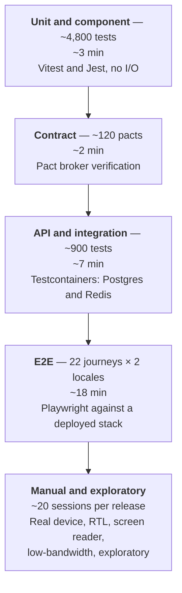
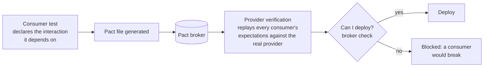

# 23 — Testing Strategy

> **Document:** NGO Intelligence Suite — SDD v2.0
> **Chapter:** 23 — Testing Strategy
> **Owner:** QA Lead, with the Chief Architect
> **Status:** Approved
> **Last Reviewed:** 2026-06-20
> **Review Cadence:** Per release
> **Related ADRs:** —

---

## 23.1 What the tests are protecting

A test suite should be designed around the consequences of specific failures, not around a coverage target. The consequences here are unusually concrete:

| Failure | Consequence | Test investment |
| --- | --- | --- |
| Cross-tenant data leak | One organisation's beneficiary or payroll data visible to another. Catastrophic, irreversible, and possibly life-threatening | A dedicated isolation suite, run on every commit, 100 per cent blocking ([§23.9](#239-tenant-isolation-testing)) |
| Payroll miscalculation | Staff underpaid, statutory returns wrong, legal exposure in two jurisdictions | 95 per cent coverage floor, worked-example fixtures verified against published tax schedules, property-based tests ([§23.4.2](#2342-payroll-the-highest-stakes-unit-tests)) |
| Field data loss during sync | Days of work by an officer who cannot repeat the visit. Beneficiaries missing from a distribution list | A dedicated offline harness simulating interruption, conflict and device loss ([§23.8](#238-offline-and-sync-testing)) |
| PII egress to the LLM provider | Personal data outside the boundary, permanently | A 400-fixture adversarial redaction corpus, 100 per cent blocking ([§23.10](#2310-ai-specific-testing)) |
| Authorisation defect | A field officer reading salaries; a donor viewer reading beneficiary identity | The full RBAC matrix generated into tests ([§23.6.3](#2363-authorisation-testing)) |
| Grant over-disbursement | A financial control failure visible to a donor in an audit | Business-rule tests on every invariant |
| Availability failure | Field officers unable to sync; a payroll deadline missed | Load, chaos and DR testing |

Coverage percentages appear in this chapter, but they are a floor and a smell detector, not the objective. A module at 95 per cent coverage with no test asserting the correct PAYE band boundary is worse than one at 70 per cent that does, because the number provides false comfort.

---

## 23.2 The pyramid

| Layer | Count | Runtime | Where it runs | Owner |
| --- | --- | --- | --- | --- |
| Unit and component | ~4,800 | < 3 min, parallel | Every commit, locally and in CI | The authoring engineer |
| Contract | ~120 | < 2 min | Every commit | Consumer and provider teams jointly |
| Integration and API | ~900 | < 7 min | Every commit | The authoring engineer |
| E2E | 22 journeys × 2 locales | < 18 min | Every commit against preview; full set against staging | QA Lead |
| Specialised suites | See below | Varies | Per schedule | Named owners |
| Manual | ~20 sessions | Hours | Per release | QA Lead and the team |

### 23.2.1 Specialised suites and their cadence

| Suite | Cadence | Blocking | Owner |
| --- | --- | --- | --- |
| Tenant isolation | Every commit | **Yes** | Security Lead |
| Redaction corpus | Every commit | **Yes** | Security Lead |
| Migration up/down/idempotency | Every commit touching migrations | **Yes** | Data Architect |
| Accessibility, automated | Every commit | **Yes** | Frontend Lead |
| Offline and sync | Every commit | Yes for the core path | Field squad |
| Load, smoke profile | Every merge to `main` | Yes | Platform Lead |
| Load, full profile | Weekly and pre-release | Yes pre-release | Platform Lead |
| DAST | Nightly against staging | High findings block | Security Lead |
| Chaos experiments | Weekly in staging | No, findings tracked | Platform Lead |
| Accessibility, manual | Per release | Yes | Frontend Lead |
| Low-end device | Per release | Yes | QA Lead |
| DR drill | Quarterly | Findings tracked | Platform Lead |
| Penetration test | Annually, and before a major launch | Critical and High block | Security Lead |
| Restore verification | Weekly, automated | Yes | Platform Lead |

---

## 23.3 Principles

| # | Principle | Consequence |
| --- | --- | --- |
| T-1 | **Test behaviour, not implementation** | A refactor with unchanged behaviour should not change a single test. Tests that assert on internal calls are rewritten |
| T-2 | **A test must be able to fail** | Every test is verified to fail when the behaviour is broken, by mutation testing on critical modules |
| T-3 | **No flaky test survives a week** | A test that fails intermittently is fixed or deleted within five working days. A quarantine list exists and is reviewed weekly, never allowed to grow |
| T-4 | **Real dependencies at the integration layer** | Testcontainers with real PostgreSQL and Redis. A mocked database cannot exercise an RLS policy, a constraint, or a lock |
| T-5 | **Never real personal data in a test** | Every fixture is synthetic. No production restore into any test environment, ever ([21 §21.2.1](21-deployment-and-infrastructure.md)) |
| T-6 | **Deterministic** | Time, randomness, UUIDs and network calls are injected. A test that depends on the wall clock is a future failure |
| T-7 | **A bug fix begins with a failing test** | The test proves the bug and prevents its return |
| T-8 | **Tests are read more than written** | Arrange–act–assert, named for the behaviour, no shared mutable setup between tests |
| T-9 | **Coverage floors are per module, not global** | A global average hides an untested payroll engine behind a well-tested utility library |

---

## 23.4 Unit testing

| Aspect | Approach |
| --- | --- |
| Runner | Vitest for the frontend and shared libraries; Jest for services |
| Scope | Pure functions, domain logic, calculations, validators, mappers, authorisation predicates, guards, reducers |
| Doubles | Repository and client interfaces are stubbed at the boundary; nothing internal is mocked |
| Speed | The full suite under 3 minutes on CI hardware, under 30 seconds for a watched subset locally |
| Determinism | Clock, ID generator and randomness injected |
| Mutation testing | Stryker on the critical modules listed below; mutation score ≥ 80 per cent required |

### 23.4.1 Coverage floors

| Module | Floor | Reason |
| --- | --- | --- |
| Payroll calculation | **95 per cent lines, 95 per cent branches** | Statutory correctness; money |
| Authorisation and permission evaluation | **95 per cent** | Security boundary |
| Encryption and key handling | **95 per cent** | Security boundary |
| Redaction pipeline | **95 per cent** | Privacy boundary |
| Vulnerability scoring | **95 per cent** | Determines who is prioritised for assistance |
| Grant financial rules — ceilings, burn rate, compliance score | 90 per cent | Money and donor reporting |
| Deduplication and conflict resolution | 90 per cent | Data integrity |
| Sync engine | 90 per cent | Field data integrity |
| Domain services generally | 85 per cent | — |
| API layer | 80 per cent | Thin; behaviour is covered at the integration layer |
| Frontend composables and stores | 80 per cent | — |
| Frontend `base/` components | 100 per cent of components, all states | Design system reliability |
| Generated code, config, migrations | Excluded | Nothing meaningful to assert |
| **Overall** | 80 per cent | A gate, not a goal |

### 23.4.2 Payroll: the highest-stakes unit tests

Payroll is tested three ways, because each catches a different class of error.

**Worked examples.** For each country, a table of inputs and expected outputs derived by hand from the published statutory schedule, with the legal reference recorded in the fixture. These are the tests that would catch a misread tax band.

| Case | South Sudan | Uganda |
| --- | --- | --- |
| Below the tax-free threshold | ✓ | ✓ |
| Exactly at each band boundary | ✓ each band | ✓ each band |
| One unit above and below each boundary | ✓ | ✓ |
| Highest band | ✓ | ✓ |
| Social contribution at the cap | NSIF ✓ | NSSF ✓ |
| Mid-period hire, pro-rated | ✓ | ✓ |
| Mid-period termination with final settlement | ✓ | ✓ |
| Mid-period salary change | ✓ | ✓ |
| Non-taxable allowance | ✓ | ✓ |
| Taxable benefit in kind | ✓ | ✓ |
| Unpaid leave deduction | ✓ | ✓ |
| Multi-currency: USD contract, local statutory obligation | ✓ | ✓ |
| Rounding at each step | ✓ | ✓ |
| A rate change effective mid-period | ✓ | ✓ |
| Reversal and re-run producing the identical result | ✓ | ✓ |

**Property-based tests.** Invariants that must hold for every input, checked against thousands of generated cases:

- Gross minus total deductions equals net, exactly, at `NUMERIC(15,2)` precision.
- Net pay is never negative.
- PAYE is monotonic non-decreasing in gross pay. A pay rise must never reduce take-home pay; a band-boundary error is the classic way this invariant breaks.
- Effective tax rate never exceeds the top marginal rate.
- Employee and employer contributions respect their caps.
- The sum of the payroll record lines equals the record total.
- Recomputing the same run with the same ruleset hash yields byte-identical output.

**Golden-file regression.** A stored full output for a 40-employee run per country. Any change to the computation produces a diff that a human must explicitly approve, which prevents an unintended change slipping through as a rounding difference.

---

## 23.5 Contract testing

Consumer-driven contracts with Pact, because in a fifteen-service system integration tests do not catch the case where a provider changes a response shape that a consumer relied on.

| Aspect | Approach |
| --- | --- |
| Consumer side | The frontend and each consuming service declare the interactions they rely on. Written from real usage, not from the whole API surface |
| Provider side | Verification runs in the provider's pipeline against every registered consumer pact |
| Deployment gate | `can-i-deploy` blocks a provider release that would break a deployed consumer version |
| Events | The event envelope and each event schema are contract-tested: producers verify they emit the declared shape, consumers verify they tolerate it ([11 §11.8](11-event-driven-architecture.md)) |
| Scope | Contracts cover shape, required fields and status codes. Business semantics are the integration layer's job |
| External providers | Not Pact. Recorded fixtures plus a nightly live sandbox check that alerts on an upstream contract change ([12](12-integration-architecture.md)) |

The event contract tests are the ones with the highest return. An event producer adding a required field is a silent break for every consumer, and it is invisible to HTTP-level testing.

---

## 23.6 Integration and API testing

### 23.6.1 Setup

Testcontainers brings up real PostgreSQL 15 and Redis 7 per test file group. The full production migration set is applied — never a hand-maintained test schema, because a divergence between the two is a defect the tests would then be unable to see.

| Aspect | Approach |
| --- | --- |
| Isolation | Each test runs in a transaction that is rolled back, except where a commit is under test |
| Seeding | A fixture builder producing valid domain objects with sensible defaults and explicit overrides |
| Tenants | Every test creates at least two tenants, so a missing tenant filter fails rather than passing by accident |
| Events | Real Redis Streams. A test asserting an event was published reads the stream |
| Outbox | Tests assert the outbox row is written in the same transaction as the state change, and that a rollback leaves no event ([11 §11.2](11-event-driven-architecture.md)) |
| Time | A controllable clock |
| External calls | WireMock, including timeout, 500, malformed-response and slow-response scenarios |

### 23.6.2 What integration tests must cover

| Category | Examples |
| --- | --- |
| RLS enforcement | Every tenant-owned table: a query with tenant A's context cannot see tenant B's row, even with an explicit `WHERE` clause naming B's ID |
| Constraints | Unique constraints, check constraints, foreign keys, and the exclusion constraints on leave overlap |
| Triggers | `updated_at` maintenance, audit trigger firing, version increment |
| Transactions | Rollback leaves no partial state and no orphaned outbox row |
| Concurrency | Two simultaneous disbursements against a grant near its ceiling; `SELECT FOR UPDATE` behaviour; optimistic concurrency producing 412 |
| Idempotency | The same `Idempotency-Key` replayed returns the stored response and creates nothing new ([10 §10.9](10-api-design-standards.md)) |
| Pagination | Cursor stability across insertion; no duplicate or skipped row |
| Event publication | The right event with the right payload, correlation ID and causation ID |
| Event consumption | Handler idempotency: the same event delivered five times has the effect of one |
| Retry and DLQ | A failing handler retries with backoff and lands in the dead-letter stream after five attempts |
| Error mapping | Every documented error code is reachable and returns the documented shape |
| Statement timeouts | A deliberately slow query is terminated rather than hanging |
| Connection pooling | A returned connection carries no tenant context ([09 §9.7.3](09-data-management-strategy.md)) |

### 23.6.3 Authorisation testing

The RBAC matrix of [15](15-rbac-and-authorization.md) is machine-readable, and the test suite is generated from it. For each of the 8 roles × every resource × every action, a test asserts the documented outcome — permitted, denied, or scoped. That is roughly 2,400 generated assertions.

This design has a property worth stating: **the matrix and the implementation cannot drift.** A row added to the documentation generates a test that fails until implemented; a permission granted in code without a matrix row fails the generated denial test. The alternative — a hand-written subset of authorisation tests — reliably decays.

Additionally tested by hand: scope restriction for field officers and donor viewers, field-level restriction on salary and PII, separation-of-duties enforcement on payroll and disbursement approval, break-glass access producing the required audit record, and role change taking effect on the next token refresh rather than being cached indefinitely.

---

## 23.7 End-to-end testing

Playwright, against a fully deployed stack. Twenty-two journeys, each run in English LTR and Arabic RTL.

| # | Journey | Roles exercised |
| --- | --- | --- |
| J1 | Login with MFA, session, idle timeout, logout | All |
| J2 | Create a grant, add requirements, upload the agreement | `programme_coordinator` |
| J3 | Record a disbursement; hit the ceiling and get the correct refusal | `finance_manager` |
| J4 | Record expenditure, view burn rate, view compliance score | `finance_manager` |
| J5 | Onboard an employee through to LMS auto-enrolment | `hr_manager` |
| J6 | Submit, approve and view a leave balance | `field_officer`, `hr_manager` |
| J7 | Prepare a payroll run, review, approve by a second person, generate payslips | `hr_manager`, `finance_manager` |
| J8 | Reverse a payroll run and re-run it | `finance_manager` |
| J9 | Attempt to approve one's own payroll run and be refused | `finance_manager` |
| J10 | Register a beneficiary, be shown a probable duplicate, resolve it | `field_officer`, `m_e_officer` |
| J11 | Build a dynamic form, publish it, capture a submission | `m_e_officer`, `field_officer` |
| J12 | Capture offline, reconnect, sync, resolve a conflict | `field_officer` |
| J13 | Record attendance at a distribution | `field_officer` |
| J14 | Enrol in a course, complete it, receive a certificate | Any |
| J15 | Generate a donor report and export to PDF and XLSX | `programme_coordinator` |
| J16 | Donor portal: view permitted grants and confirm nothing else is reachable | `donor_viewer` |
| J17 | Auditor: read across modules and export the audit trail | `auditor` |
| J18 | Tenant admin: invite a user, assign a role, deactivate a user | `org_admin` |
| J19 | AI narrative draft, citation review, edit and approve | `programme_coordinator` |
| J20 | Beneficiary erasure request from raise to certificate | `m_e_officer`, `org_admin` |
| J21 | Switch locale to Arabic and verify layout, then switch back | Any |
| J22 | Attempt cross-tenant access by URL manipulation and be refused | `org_admin` |

| Aspect | Approach |
| --- | --- |
| Selectors | `data-testid` only. Never a CSS class or text content, both of which change for reasons unrelated to behaviour, and text content changes with locale |
| Data | Each journey provisions its own tenant and data via the API, then tears down. No shared fixture state, no ordering dependency |
| Parallelism | Sharded across 4 workers |
| Artefacts | Trace, video and screenshot retained on failure |
| Retries | One retry in CI, and a retry that passes is reported as a flake rather than silently swallowed |
| Accessibility | An axe scan at each significant state within each journey |
| Visual | Screenshot comparison on the primary views, in both directions and both themes |

---

## 23.8 Offline and sync testing

The hardest thing in the platform to test and the most consequential to get wrong.

| Scenario | Method | Assertion |
| --- | --- | --- |
| Capture 50 submissions offline over 72 hours | Playwright with the network offline and a controlled clock | All 50 persist locally, encrypted; none lost |
| Reconnect and sync | Restore the network | All 50 arrive exactly once; server counts match |
| Interrupt mid-sync at every boundary | Kill the connection after each batch | Resume from the correct point; no duplicates, no gaps |
| Duplicate submission, same `client_uuid` | Submit twice | Idempotent; one record |
| Duplicate household, different `client_uuid` | Two officers register the same household | Both retained, flagged for review, neither silently merged |
| Field-level concurrent edit | Two devices edit different fields offline | Both changes present after merge |
| Same-field concurrent edit | Two devices edit the same field | Later `captured_at` wins; both recorded; flagged |
| Conflicting status | One marks deceased, one marks active | Most restrictive wins; flagged ([13 §13.5.2](13-offline-first-architecture.md)) |
| Submission against a superseded form version | Republish the form mid-capture | Accepted against the version it was captured under |
| Storage quota exhaustion | Fill IndexedDB | Graceful warning; capture blocked with a clear message rather than silent data loss |
| App update with a pending queue | Deploy a new version | Activation deferred until the queue drains |
| Session expiry while offline | Advance the clock past expiry | Local data preserved; sync resumes after re-authentication |
| Device lost, data unsynced | Simulate | The encryption key does not survive restart; the cache is unreadable |
| Slow 2G sync | Throttle to 50 kbps with 800 ms latency | Completes; progress is visible; no timeout-induced duplication |
| Clock skew on the device | Set the device clock 6 hours off | Server timestamps authoritative; `captured_at` preserved with the skew recorded |
| Remote wipe | Trigger from admin | The cache is unreadable on next open |

The clock-skew case is included because field devices genuinely have wrong clocks, and a conflict resolution policy keyed on `captured_at` has to behave sensibly when that value is unreliable.

---

## 23.9 Tenant isolation testing

The suite that must never be allowed to fail, skip or be marked pending. It runs on every commit and blocks the pipeline unconditionally.

| Test | Assertion |
| --- | --- |
| Every tenant-owned table has RLS enabled and forced | Enumerated from `information_schema`. A new table without RLS fails the build |
| Direct query with tenant A's context | Cannot return tenant B's row, even with `WHERE tenant_id = '<B>'` |
| Missing tenant context | Query returns zero rows rather than everything. The unset-variable failure mode is fail-closed |
| Every API endpoint, cross-tenant ID | 404, never 403 — a 403 confirms the resource exists ([10 §10.5](10-api-design-standards.md)) |
| Token from tenant A against tenant B's resource | Rejected |
| Redis keys | Every key is tenant-prefixed; a scan finds no unprefixed tenant-scoped key |
| Redis cache read across tenants | Impossible; keys include `tenant_id` |
| Payroll schema access | `svc_grant` and every other role has no grant on any `tenant_<slug>` schema |
| Object storage paths | Tenant-prefixed; a signed URL for tenant A cannot be adapted to reach tenant B |
| Events | Every event carries `tenant_id`; a consumer processing an event sets context from it and cannot read outside it |
| Search and reporting | Aggregate queries scoped; a report cannot span tenants |
| File upload and download | Path traversal in a filename cannot escape the tenant prefix |
| Bulk export | Contains only the requesting tenant's data, verified by row count and by sampled record ownership |
| Every service role | `NOBYPASSRLS`, verified against `pg_roles` |
| Connection reuse | A pooled connection returned to the pool has no residual tenant context |

The last one is the subtlest defect available in this architecture and the reason it has a dedicated test: a `SET` where a `SET LOCAL` was required leaks tenant context to whichever request receives that connection next, producing an intermittent cross-tenant read that would be nearly impossible to reproduce from a bug report.

---

## 23.10 AI-specific testing

Detail in [18 §18.11](18-ai-llm-architecture.md); the test-suite shape:

| Suite | Content | Gate |
| --- | --- | --- |
| Redaction corpus | 400 adversarial fixtures: every detector, every locale, spaced digits, homoglyphs, identifiers embedded in prose, names in free text | **Any leak fails the build** |
| Classification gate | Attempts to include a Restricted field in a context | All rejected |
| Injection corpus | 60 injection payloads embedded in simulated field-submission text | Zero compliance with injected instructions |
| Numeric grounding | Generated outputs checked against context values | Zero fabricated numbers |
| Citation presence | Every factual claim carries a citation marker | ≥ 98 per cent |
| Budget enforcement | Requests beyond the tenant budget | Rejected with `NGOIS-AI-0005`, workflows unaffected |
| Provider failure | Provider returns 500, times out, returns malformed content | Circuit breaker opens; the feature degrades; no core workflow affected |
| Cache isolation | The same prompt from two tenants | Separate cache entries; no cross-tenant response |
| Evaluation baseline | 60 fixed scenarios | No regression against the recorded baseline |

---

## 23.11 Performance and load testing

k6, against staging at production-shaped scale.

### 23.11.1 Scenarios

| ID | Scenario | Profile | Pass criteria |
| --- | --- | --- | --- |
| L1 | Steady state | 200 concurrent users, mixed workload, 30 min | p95 < 400 ms, p99 < 1 s, error rate < 0.1 per cent |
| L2 | Morning login peak | 0 → 400 users over 2 min, hold 10 min | p95 login < 800 ms, no 5xx, autoscaling stabilises within 3 min |
| L3 | Payroll run, 500 employees | Single run, measured | Completes < 5 min; no other endpoint's p95 degrades by more than 20 per cent |
| L4 | Sync storm | 150 devices sync simultaneously, 40 submissions each | All accepted; p95 per batch < 3 s; consumer lag recovers within 5 min |
| L5 | Report generation burst | 30 concurrent report requests | All complete < 30 s; request-serving latency unaffected — the point of the separate worker pool |
| L6 | Dashboard load | 300 users loading dashboards within 1 min | p95 < 1.5 s with cache; < 3 s cold |
| L7 | Bulk beneficiary import | 10,000 records | Completes < 10 min; deduplication runs; no timeout |
| L8 | Sustained soak | 100 users, 4 hours | No memory growth trend, no connection leak, no latency drift |
| L9 | Spike | 100 → 800 users in 30 s | Degrades gracefully: rate limits engage, no crash, recovery within 5 min |
| L10 | Database saturation | Drive connections to the pool ceiling | Requests queue and are shed with 503 plus `Retry-After`, rather than the database being overwhelmed |

### 23.11.2 Method

| Aspect | Approach |
| --- | --- |
| Data volume | Staging holds 25 tenants, 60,000 beneficiaries, 1,200 employees, 3 years of history ([21 §21.2.1](21-deployment-and-infrastructure.md)) |
| Think time | Realistic pacing, not maximum request rate. A load test without think time measures the wrong thing |
| Tenant distribution | Skewed, not uniform: one large tenant and a long tail, matching reality and exposing noisy-neighbour effects |
| Baseline | Results recorded per release; a regression beyond 10 per cent on any p95 blocks the release |
| Bottleneck attribution | Traces and database statistics captured during the run, so a failure identifies the cause rather than just the symptom |

---

## 23.12 Chaos engineering

Weekly in staging, with a documented hypothesis and blast radius. Nothing is run in production until the experiment has passed in staging twice.

| ID | Experiment | Hypothesis | Verified |
| --- | --- | --- | --- |
| CH-1 | Kill a random service pod | Requests continue; no user-visible error; the pod is replaced within 30 s | ✓ |
| CH-2 | Kill all replicas of a Tier 2 service | Dependent flows degrade as documented; Tier 1 unaffected | ✓ |
| CH-3 | Cloud SQL failover | Recovery within 60 s; in-flight transactions fail cleanly with a retryable error, never a partial commit | ✓ |
| CH-4 | Redis failover | Cache misses increase; event delivery resumes; no event lost from the stream | ✓ |
| CH-5 | 500 ms added database latency | Endpoints slow but do not time out; connection pool does not exhaust | ✓ |
| CH-6 | 5 per cent packet loss between namespaces | Retries absorb it; no error surfaces to users | ✓ |
| CH-7 | External provider returns 500 | Circuit breaker opens; the documented fallback engages; no request thread is blocked | ✓ |
| CH-8 | External provider hangs, no response | Timeout fires at the configured value; no thread pool exhaustion | ✓ |
| CH-9 | Fill a node's disk | Pods evicted and rescheduled; no data loss | ✓ |
| CH-10 | Memory pressure on a service | OOM kill and restart; the limit contains it to one pod | ✓ |
| CH-11 | Drain a whole zone | PDBs respected; capacity in the remaining two zones absorbs the load | ✓ |
| CH-12 | Poison message on a stream | Retries, then lands in the DLQ; the consumer continues processing subsequent events | ✓ |
| CH-13 | Clock skew between pods | Token validation tolerates the configured skew; audit ordering is preserved by sequence, not by timestamp | ✓ |
| CH-14 | Expire an internal certificate | Alert fires ahead of failure; the renewal path works | ✓ |
| CH-15 | Revoke a service's database credential | The service fails readiness rather than serving errors; traffic stops being routed to it | ✓ |

CH-12 is the experiment most likely to reveal a real defect. A consumer that halts on a message it cannot process stalls the entire stream, and that behaviour is invisible until a malformed event actually appears.

---

## 23.13 Security testing

| Type | Tool | Cadence | Gate |
| --- | --- | --- | --- |
| SAST | CodeQL, Semgrep with custom rules | Every commit | Zero High or Critical |
| Custom Semgrep rules | Raw SQL construction, `SET` instead of `SET LOCAL`, unprefixed Redis keys, `v-html`, missing tenant filter, secret-shaped literals | Every commit | Blocking |
| Dependency scanning | npm audit, Snyk | Every commit and daily | Per [22 §22.8.2](22-cicd-release-supply-chain.md) |
| Container scanning | Trivy, Grype | Every build and continuously in the registry | Zero Critical |
| IaC scanning | tfsec, checkov | Every infrastructure commit | Zero High |
| Secret scanning | gitleaks | Pre-commit and CI, plus full history | Zero |
| DAST | OWASP ZAP authenticated scan | Nightly against staging | High blocks |
| Authorisation fuzzing | Custom: every endpoint attempted with every role's token | Nightly | Any unexpected success blocks |
| IDOR sweep | Every resource ID substituted across tenants and users | Nightly | Any leak blocks |
| Penetration test | External firm | Annually and before a major launch | Critical and High remediated before release |
| Threat model review | Manual | Quarterly | [16](16-threat-model-stride.md) |

---

## 23.14 Accessibility testing

Covered in [19 §19.7.1](19-frontend-architecture.md). Restated as gates:

| Method | Scope | Gate |
| --- | --- | --- |
| axe in component tests | Every `base/` component, every state | Zero violations |
| axe in E2E | Every journey state | Zero violations |
| Contrast check on token pairs | All pairs | Zero failures |
| Keyboard-only walkthrough | 10 journeys | Per release, blocking |
| Screen reader walkthrough — NVDA, VoiceOver | 5 journeys | Per release, blocking |
| 200 per cent zoom and 320 px viewport | Primary views | Per release |
| RTL visual regression | Primary views in Arabic | Per release |
| External audit | Whole application | Annual |

---

## 23.15 Test data

| Rule | Detail |
| --- | --- |
| Synthetic only | No production data in any test or non-production environment, without exception ([21 §21.2.1](21-deployment-and-infrastructure.md)) |
| Generator | Maintained as product code, reviewed and tested. It produces realistic name distributions for the operating regions, plausible household structures, seasonal programme patterns, and deliberately messy edge cases |
| Determinism | Seeded, so a failure is reproducible |
| Volume profiles | `small` for CI, `medium` for preview, `large` for staging load testing |
| Edge cases built in | Duplicate-looking households, mid-period contract changes, superseded form versions, employees at exact tax band boundaries, grants at their disbursement ceiling, expired certificates, suspended tenants |
| Fixture builders | Typed builders with valid defaults; a test states only what matters to it |
| No fixture sharing between tests | Each test builds what it needs. Shared mutable fixtures cause ordering dependencies that surface as flakes |
| Personal-data-shaped values | Names and identifiers are generated from synthetic lists, never scraped or borrowed from a real source |

---

## 23.16 Manual and exploratory testing

Automation does not find what nobody thought to specify. Roughly twenty sessions per release, each time-boxed and charter-driven, with findings recorded whether or not they are defects.

| Session | Charter |
| --- | --- |
| Low-end device | The field capture journey on a 2 GB Android phone with nearly full storage |
| Real low bandwidth | The primary journeys over a genuinely poor connection, not a throttled simulation |
| Arabic RTL | A native Arabic reader working through the main journeys |
| Swahili | A native Swahili speaker reviewing terminology in context |
| Screen reader | A full journey using only a screen reader |
| First-time user | Someone unfamiliar attempting to complete a task with no guidance |
| Payroll adversarial | An HR practitioner attempting to break the payroll logic with realistic awkward cases |
| Data entry realism | A field officer entering data as they actually would, including mistakes and corrections |
| Report accuracy | A finance manager reconciling a generated report against the underlying records by hand |
| Permission probing | Attempting to reach what a role should not |

The "report accuracy" session is the one that most often finds something important. An automated test asserts a number matches a computed expectation; a finance manager checking a report against the ledger asks whether the number means what the label says it means.
