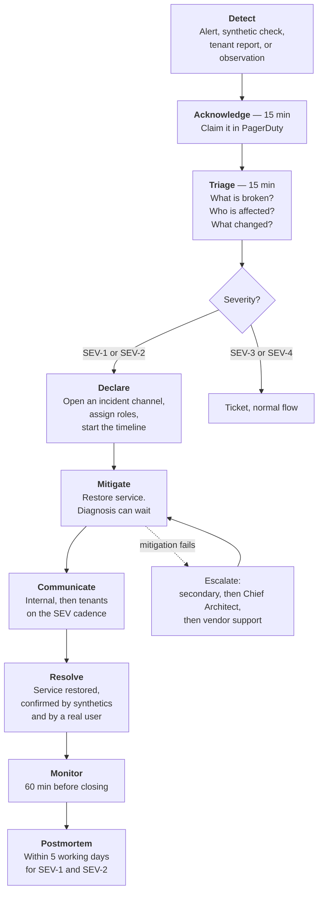

# 26 — Reliability, Incident Management and On-Call

> **Document:** NGO Intelligence Suite — SDD v2.0
> **Chapter:** 26 — Reliability, Incident Management and On-Call
> **Owner:** Platform Lead
> **Status:** Approved
> **Last Reviewed:** 2026-06-20
> **Review Cadence:** Quarterly, and after every P1
> **Related ADRs:** —

---

## 26.1 The honest starting point

Most incident-management chapters describe a follow-the-sun rotation of a dozen engineers. This platform is operated by a team of five with platform responsibilities, spread across two time zones, who also build features. Writing a process that assumes otherwise would produce a document that is ignored at 02:00, which is worse than having no document.

So the design accepts three constraints and works within them:

1. **There is one person on call, not a team.** Every runbook must be executable by one engineer without waking anyone else, and every alert must name that runbook.
2. **Overnight coverage is thin.** Only genuine P1 conditions page overnight. Everything else waits, which means the severity definitions must be right, because an over-classified alert burns the person who has to work the next day.
3. **Automation beats heroics.** The correct response to "this required manual intervention at 02:00" is to automate it, and that work is prioritised as reliability work under the error budget policy.

---

## 26.2 Severity

| Severity | Definition | Examples | Response | Page? |
| --- | --- | --- | --- | --- |
| **SEV-1** | Platform unusable for most users, data loss or corruption, confirmed security breach, or cross-tenant exposure | Total outage, database unavailable, cross-tenant data leak, ransomware, audit chain broken, confirmed PII egress | Immediate, all hands as needed | Yes, 24/7 |
| **SEV-2** | A major function unavailable or severely degraded for a substantial group | Payroll cannot run, field sync failing, a Tier 1 service down, authentication degraded, SLO fast burn | Within 30 min | Yes, working hours; ticket overnight unless a deadline is at risk |
| **SEV-3** | A function degraded with a workaround, or a minor group affected | Reports slow, notifications delayed, a Tier 2 service down, an integration failing | Next working day | No |
| **SEV-4** | Minor, cosmetic, or a single user affected | A UI defect, a wrong label, an isolated error | Normal backlog | No |

### 26.2.1 Escalation triggers regardless of initial severity

Some conditions escalate automatically, because the initial classification is often made with incomplete information.

| Condition | Becomes |
| --- | --- |
| Any suspicion of cross-tenant data access | **SEV-1**, immediately, before confirmation |
| Any suspicion of personal data exposure | **SEV-1** |
| Any confirmed data loss, however small | **SEV-1** |
| A payroll deadline within 48 hours and payroll is not working | **SEV-1** |
| A donor reporting deadline within 24 hours and reporting is not working | SEV-2 escalating to SEV-1 at 12 hours |
| A SEV-2 unresolved after 4 hours | SEV-1 |
| A SEV-3 affecting more than three tenants | SEV-2 |
| Field sync failing for more than 6 hours | SEV-1, because the 72-hour device budget starts consuming |

The "before confirmation" instruction on cross-tenant access is deliberate. The instinct is to investigate first and declare later; the correct order is inverted, because the containment actions available in the first ten minutes are far more effective than the ones available in the second hour.

---

## 26.3 On-call

| Aspect | Model |
| --- | --- |
| Rotation | Weekly, five engineers, Monday 09:00 EAT handover |
| Coverage | Primary 24/7. Secondary is the Platform Lead as escalation, not as a parallel rotation |
| Compensation | Time off in lieu for out-of-hours engagement, and it is taken, not accrued indefinitely |
| Expectation | Acknowledge a page within 15 minutes; begin work within 30 |
| **Not expected** | To fix everything alone. Escalating early is explicitly correct behaviour and is never treated as a failure |
| Tooling | PagerDuty, a laptop with break-glass capability, VPN, runbook access offline as a PDF |
| Handover | A written note covering open issues, recent changes, anything to watch, and any active silences with their expiry |
| Overnight | Only SEV-1 pages. A SEV-2 overnight creates a ticket and a morning notification, unless a deadline trigger applies |
| Shadowing | A new engineer shadows two full rotations before taking primary |
| Load target | **Under 2 pages per week.** Above that, the alerts are reviewed, not the engineer |

### 26.3.1 Break-glass access

The on-call engineer has no standing production access. During an incident, elevated access is requested through the break-glass procedure ([15 §15.6](15-rbac-and-authorization.md)): a stated reason, an automatic notification to the Security Lead and Platform Lead, a two-hour time-boxed grant, full session recording, and a mandatory review within 24 hours. Self-approval is permitted for a declared SEV-1 precisely because requiring a second person at 02:00 would mean the procedure is bypassed instead.

---

## 26.4 Incident response



### 26.4.1 Mitigate before diagnosing

The strongest instinct during an incident is to understand it. The correct action is usually to stop it. The mitigation options, in the order they should be considered:

| Order | Action | When | Time |
| --- | --- | --- | --- |
| 1 | **Roll back the last deployment** | Anything deployed in the last 2 hours. This resolves the majority of incidents | 2–5 min |
| 2 | **Flip a kill switch** | The failing subsystem has one ([20 §20.5.2](20-configuration-secrets-feature-flags.md)) | < 1 min |
| 3 | **Scale up** | Symptoms are saturation-shaped | 2–3 min |
| 4 | **Restart the affected pods** | A stuck or leaking process | 1–2 min |
| 5 | **Fail over the database** | The primary is impaired | 1–2 min, automatic in most cases |
| 6 | **Shed load** | Protecting the core under overwhelming demand: disable exports, reports, analytics recompute | 1 min |
| 7 | **Break-glass investigation** | Nothing above worked, or the cause is genuinely unknown | Varies |
| 8 | Fix forward | Only when rollback is impossible, for instance after a non-reversible data change | Varies |

Rolling back first, even without knowing whether the deployment caused the problem, is correct on expected value: it is fast, it is safe because every migration is backward-compatible ([22 §22.6](22-cicd-release-supply-chain.md)), and it eliminates the most probable cause.

### 26.4.2 Roles

At SEV-1, roles are named explicitly, even when the same person initially holds several.

| Role | Responsibility | Filled by |
| --- | --- | --- |
| **Incident Commander** | Owns the incident. Decides, delegates, and does **not** debug. Maintains the timeline | On-call initially; handed to the Platform Lead on a long SEV-1 |
| **Operations Lead** | Executes the technical work | On-call, or whoever knows the system best |
| **Communications Lead** | Internal and tenant updates, status page | Support Lead, or the Executive Director for a serious tenant-facing incident |
| **Scribe** | Records actions, timestamps, decisions and their reasoning as they happen | Anyone available |
| **Subject expert** | Pulled in as needed | Whoever owns the affected area |

The rule that the Incident Commander does not debug is the one most often broken and the most important. An engineer deep in a stack trace cannot simultaneously track who is doing what, decide whether to escalate, or notice that forty minutes have passed with no progress. On a small team the same person may start in both roles, but the moment a second person joins, the split happens.

### 26.4.3 The timeline

Maintained live in the incident channel, not reconstructed later. Every entry carries a timestamp and states what was observed, what was done, and what was expected. This record is what makes a postmortem factual rather than a set of recollections, and it is the reason a scribe is assigned even when it feels like overhead.

---

## 26.5 Communication

### 26.5.1 Cadence

| Severity | Internal | Tenants | Channel |
| --- | --- | --- | --- |
| SEV-1 | Every 30 min | Within 30 min of declaration, then every hour | Status page, email to tenant admins, and SMS for a prolonged outage |
| SEV-2 | Every hour | Within 2 h if user-visible | Status page, email |
| SEV-3 | At resolution | If they reported it | Direct response |
| SEV-4 | In the release notes | — | — |

### 26.5.2 What a tenant update says

Tenant organisations are not consumers of a commercial SaaS product; they are operating programmes against deadlines, and what they need is enough information to make their own decisions. Every update therefore states: what is not working in their terms rather than ours, who is affected, what they can still do, what the workaround is, when the next update comes, and — only when it is genuinely known — an estimate of restoration.

An unknown restoration time is stated as unknown. A guessed estimate that slips twice costs more trust than the outage itself.

```
Subject: [Investigating] Field data sync unavailable

What is happening
Field officers cannot sync submissions captured on their devices.
Data already captured is safe on the devices and will sync once
the service is restored.

Who is affected
All tenants using the field data module.

What still works
Web-based data entry, grants, HR, payroll and reporting are all
operating normally. Field officers can continue capturing data
offline as usual.

What we are doing
We have identified the cause as a failure in the sync processing
service and are restoring it now.

Next update
By 14:30 EAT, or sooner if the situation changes.
```

### 26.5.3 A note on the 72-hour clock

For a sync incident specifically, the tenant communication includes the offline budget position. Field devices retain data for 72 hours by design ([13 §13.8](13-offline-first-architecture.md)), and if an incident is likely to approach that window, tenants must be told early enough to instruct field teams — which may mean recording on paper as a fallback. Withholding that information to avoid alarming them would risk actual data loss.

---

## 26.6 Postmortems

Required for every SEV-1 and SEV-2, and for any SEV-3 with an interesting cause. Published internally within five working days. Blameless.

### 26.6.1 What blameless means in practice

It does not mean human error is never a factor. It means the question is never "who made the mistake" but "what allowed a single reasonable action to cause this outcome". If an engineer ran a migration that locked a table, the finding is not that the engineer was careless; it is that the pipeline permitted a lock-unsafe migration to reach production, and the action item is the gate that now blocks it ([22 §22.6](22-cicd-release-supply-chain.md)).

A postmortem naming an individual as a cause is rejected and rewritten. This is enforced, not aspirational, because a single blameful postmortem teaches the whole team to report less next time.

### 26.6.2 Structure

| Section | Content |
| --- | --- |
| Summary | Three sentences: what happened, who was affected, how long |
| Impact | Users, tenants, data, deadlines, financial and reputational effect, stated concretely |
| Timeline | Detection through resolution, with timestamps |
| Detection | How we found out. **If a tenant told us before our monitoring did, that is a finding in its own right** |
| Root cause | The chain of contributing factors, not a single cause. Five-whys or a causal diagram |
| What went well | Genuinely. Fast rollback, a runbook that worked, an alert that fired correctly |
| What went badly | Missing alerting, a wrong runbook, a slow escalation, a confusing dashboard |
| Where we got lucky | The most valuable section, and the one usually omitted. "The failure occurred at 03:00 when only two field teams were syncing" is a warning about the next occurrence |
| Action items | Each with an owner, a due date, and a priority |
| Lessons | What the team now knows |

### 26.6.3 Action items

| Rule | Detail |
| --- | --- |
| Every action has a named owner and a date | An unowned action is not an action |
| Tracked in the normal backlog | Not on a separate list that nobody reads |
| P1 actions — those preventing recurrence of a SEV-1 — are scheduled in the current sprint | And counted against the error budget policy |
| Reviewed monthly | Overdue items escalate to the Chief Architect |
| **Completion rate is a tracked metric** | Target above 90 per cent within the committed date. A team that writes actions and does not do them has an expensive ritual rather than a learning process |

### 26.6.4 Preferred action types

Not all remediations are equally durable. When choosing an action item, the order of preference is:

| Rank | Type | Why | Example |
| --- | --- | --- | --- |
| 1 | **Make the failure impossible** | Eliminates the class | A lint rule forbidding `SET` where `SET LOCAL` is required |
| 2 | **Make the failure automatically contained** | No human in the loop | Automated canary rollback on an SLO breach |
| 3 | **Make the failure detected sooner** | Shortens impact | A new alert on the specific symptom |
| 4 | **Make the response faster** | Shortens recovery | A runbook, or automation of a manual step |
| 5 | Documentation or training | Weakest, and degrades over time | A note in an onboarding guide |
| — | **"Be more careful"** | **Not an acceptable action item** | Rejected in review |

---

## 26.7 Reliability practices

| Practice | Detail |
| --- | --- |
| Error budget policy | Enforced, with the freeze thresholds in [24 §24.8.2](24-observability.md) |
| Weekly reliability review | 30 minutes: budget status, incidents, alert noise, overdue action items |
| Chaos experiments | Weekly in staging ([23 §23.12](23-testing-strategy.md)) |
| Runbook verification by execution | Quarterly. A runbook that has not been executed is a hypothesis |
| DR drill | Quarterly ([27 §27.9](27-disaster-recovery-and-bcp.md)) |
| Game days | Twice yearly. A simulated incident with a facilitator, run against staging, exercising the process rather than the technology |
| Dependency review | Quarterly. What single points of failure have appeared since last time |
| Capacity review | Monthly ([25 §25.8](25-performance-and-capacity.md)) |
| Toil audit | Quarterly. What manual operational work has accumulated, and what should be automated |
| Alert hygiene | Monthly. Every alert that fired: was it actionable, was the runbook right |

### 26.7.1 Toil budget

Manual operational work is capped at **20 per cent of the platform capability's time**. Above that, feature work is deprioritised in favour of automation. The cap exists because toil grows silently — each individual manual task is small and reasonable — until the team has no capacity left to improve anything, at which point reliability decays as a second-order effect.

---

## 26.8 Reliability metrics

| Metric | Target | Reviewed |
| --- | --- | --- |
| SEV-1 count | 0 per quarter | Monthly |
| SEV-2 count | ≤ 2 per quarter | Monthly |
| MTTD, detection | < 5 min for SEV-1 | Per incident |
| MTTA, acknowledgement | < 15 min | Per incident |
| MTTM, mitigation | < 30 min | Per incident |
| MTTR, full resolution | < 4 h for SEV-1 | Per incident |
| Incidents detected by monitoring rather than by a tenant | > 90 per cent | Monthly |
| Pages per on-call week | < 2 | Weekly |
| Postmortem completion within 5 days | 100 per cent | Monthly |
| Action item completion within the committed date | > 90 per cent | Monthly |
| Repeat incidents from the same cause | 0 | Quarterly |
| Toil proportion | < 20 per cent | Quarterly |
| Runbooks verified in the last 12 months | 100 per cent | Quarterly |

The metric that matters most is the proportion of incidents we detected ourselves. A tenant discovering an outage before our monitoring did is a signal that the observability design has a gap, and it is a far better indicator of operational maturity than MTTR.
