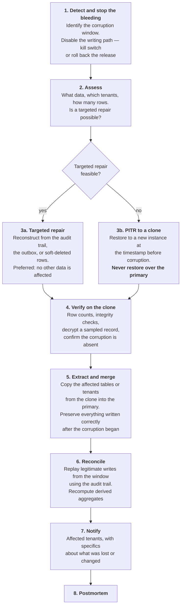
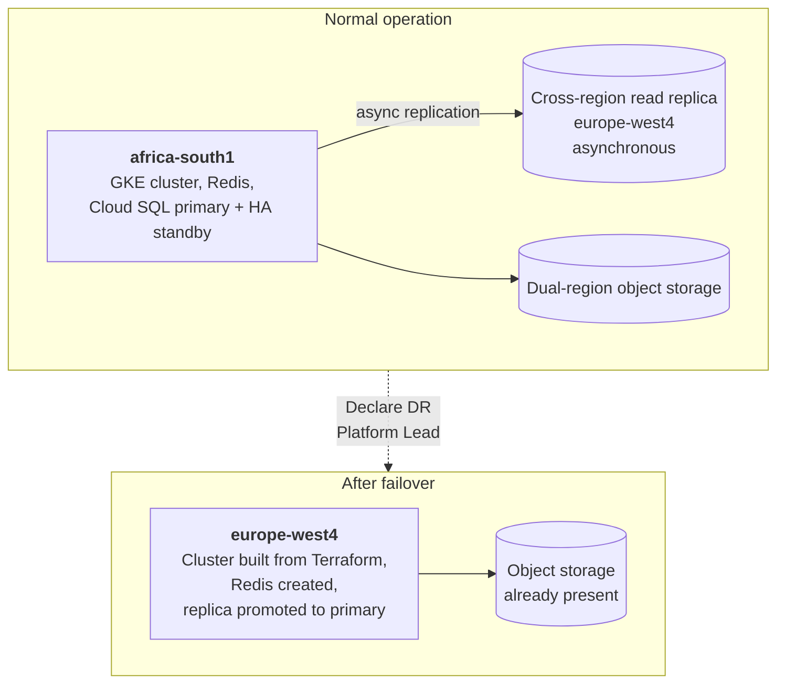

# 27 — Disaster Recovery and Business Continuity

> **Document:** NGO Intelligence Suite — SDD v2.0
> **Chapter:** 27 — Disaster Recovery and Business Continuity
> **Owner:** Platform Lead, with the Executive Director as business owner
> **Status:** Approved
> **Last Reviewed:** 2026-06-20
> **Review Cadence:** Semi-annually, and after every DR drill
> **Related ADRs:** [ADR-0016](adr/0016-single-region-with-warm-dr.md)

---

## 27.1 Scope and posture

Disaster recovery here covers loss of a zone, loss of a region, data corruption, ransomware, and the accidental destruction of infrastructure. Business continuity covers the organisational question that sits behind those: **what do field teams and finance staff do while the platform is unavailable?**

The second question matters more than it usually does. A humanitarian programme cannot pause because a system is down — a distribution scheduled for Tuesday happens on Tuesday. So the continuity plan is not "wait for restoration"; it is a defined degraded mode with a defined path back.

| Posture | Choice | Rationale |
| --- | --- | --- |
| Primary region | `africa-south1` | Residency and latency ([21 §21.1](21-deployment-and-infrastructure.md)) |
| DR region | `europe-west4` | Warm standby |
| Model | **Warm standby, not active-active** | Active-active across regions would require either multi-master writes or a global consensus store, both of which add substantial complexity and failure modes to buy an RTO improvement from 4 hours to minutes. At this scale and budget, the trade is not worth it ([ADR-0016](adr/0016-single-region-with-warm-dr.md)) |
| What runs warm | A cross-region PostgreSQL read replica, dual-region object storage, Terraform state, container images | Data is continuously replicated; compute is created on demand |
| What is built on demand | The GKE cluster, Redis, the service deployments | Roughly 90 minutes of the 4-hour RTO, and the reason the DR drill matters |

---

## 27.2 RPO and RTO by tier

| Tier | Data | RPO | RTO | Basis |
| --- | --- | --- | --- | --- |
| **T0** | Payroll records, financial transactions, audit trail | **0** (zero tolerance for committed-transaction loss) | 4 h | Synchronous HA replication in-region; a committed transaction is never lost to a zone failure |
| **T1** | Beneficiary records, field submissions, grants, employees | **5 min** | 4 h | PITR with continuous write-ahead log archiving |
| **T2** | Documents, payslip PDFs, field media | 15 min | 8 h | Dual-region object storage with versioning |
| **T3** | Generated reports, dashboard aggregates, cache | **Not backed up** | Recomputed | Derived data. Restoring it would be slower than regenerating it |
| **T4** | Telemetry: logs, metrics, traces | 1 h | 24 h | Operationally useful, not business-critical |

### 27.2.1 What zero RPO means and does not mean

Zero RPO for T0 applies to a **zone** failure, where synchronous replication guarantees the committed transaction exists in the standby before the commit is acknowledged. It does not apply to a full **region** loss: the cross-region replica is asynchronous, so a region-level disaster carries up to 5 minutes of exposure for all data including T0.

This distinction is stated explicitly because conflating the two is how organisations discover, during an actual regional incident, that their stated RPO did not mean what they thought. The honest position is: zero for the failure mode we expect, 5 minutes for the failure mode we hope never happens.

---

## 27.3 Backup strategy

| What | Method | Frequency | Retention | Location |
| --- | --- | --- | --- | --- |
| PostgreSQL | Cloud SQL automated backup | Daily, 02:00 SAST | 30 d | Multi-region |
| PostgreSQL | Continuous write-ahead log archiving for PITR | Continuous | 7 d | Multi-region |
| PostgreSQL | Logical `pg_dump` per tenant | Weekly | 90 d | `ngois-prod-backups`, retention-locked |
| PostgreSQL | Full logical dump | Monthly | 365 d | Retention-locked |
| Object storage | Dual-region replication plus object versioning | Continuous | 90 d for noncurrent versions | Dual-region |
| Redis | RDB snapshot | Hourly | 24 h | Regional. Streams are replayable from the outbox, so this is convenience, not necessity |
| Kubernetes manifests | Git, the source of truth | Every commit | Indefinite | GitHub plus a mirror |
| Terraform state | GCS versioned bucket | Every apply | Indefinite | Multi-region |
| Secrets | Secret Manager versioning | Every change | Indefinite | Multi-region |
| Encryption keys | Cloud KMS, versioned, **never exported** | — | Indefinite | Multi-region |
| Configuration snapshot | Automated export of tenant configuration | Daily | 90 d | Retention-locked bucket |

### 27.3.1 The key management problem

Beneficiary and employee PII is encrypted at the application layer with per-tenant keys held in Cloud KMS ([14 §14.4](14-security-architecture.md)). A database backup therefore contains ciphertext, which is exactly the intended property — a stolen backup is useless.

It also creates a dependency that must be managed deliberately: **a restore is only useful if the corresponding KMS keys are available.** The controls are that KMS keys are multi-regional and replicated independently of the database; key versions are never destroyed, only disabled, so no historical backup becomes unreadable; key deletion requires dual approval and a 30-day scheduled destruction window, which is reversible; and the quarterly restore drill explicitly verifies decryption of a sampled record rather than merely verifying that rows exist.

A restore that produces rows of unreadable ciphertext is not a successful restore, and that is a failure mode only an end-to-end drill catches.

### 27.3.2 Backup verification

An unverified backup is a belief, not a control.

| Verification | Frequency | Method | On failure |
| --- | --- | --- | --- |
| Backup completion | Daily, automated | Cloud SQL status check | P2 alert |
| **Restore to a scratch instance** | **Weekly, automated** | Restore the latest backup, run integrity checks, verify row counts against expectation, **decrypt a sampled PII record**, then destroy the instance | P2 alert, `BackupVerificationFailed` |
| PITR to an arbitrary point | Monthly | Restore to a timestamp 3 days back; verify a known record's state at that time | P2 alert |
| Object storage restore | Monthly | Restore a sampled set of objects from a noncurrent version | Ticket |
| Full DR drill | Quarterly | [§27.9](#279-dr-testing) | Findings tracked as reliability work |
| Tenant-level restore | Quarterly | Restore one tenant's data into an isolated schema | Ticket |

The weekly automated restore is the single highest-value item in this chapter. It converts "we have backups" into "we restored a backup seven days ago and it worked".

---

## 27.4 Failure scenarios

| # | Scenario | Likelihood | Detection | Response | RTO |
| --- | --- | --- | --- | --- | --- |
| F-1 | Single pod failure | Weekly | Readiness probe | Automatic reschedule | Seconds |
| F-2 | Node failure | Monthly | Node health | Automatic reschedule; PDBs preserve capacity | < 2 min |
| F-3 | Zone failure | Yearly | Multi-signal | Regional cluster and HA database absorb it; capacity in two remaining zones | < 5 min, partial degradation |
| F-4 | Cloud SQL primary failure | Yearly | Connection failures | Automatic HA failover to the standby | < 60 s |
| F-5 | Redis failure | Yearly | Connection failures | Automatic failover; cache rebuilds; streams resume | < 2 min |
| F-6 | **Region failure** | Rare | Multi-signal plus provider status | Manual DR invocation ([§27.6](#276-regional-failover)) | **4 h** |
| F-7 | **Logical data corruption** — a bad migration or a defective release writing wrong data | Possible | Data integrity checks, tenant report, anomaly alert | PITR to just before the corruption, or targeted repair | 2–6 h |
| F-8 | **Accidental mass deletion** | Possible | Audit trail, row count anomaly | Soft deletes make most cases reversible without a restore; otherwise PITR | 30 min–4 h |
| F-9 | **Ransomware or malicious destruction** | Possible | Anomalous activity, encryption of objects, integrity failure | [§27.7](#277-ransomware-and-malicious-destruction) | 4–12 h |
| F-10 | Infrastructure destroyed by error — a `terraform destroy` against the wrong workspace | Possible | Immediate | Rebuild from IaC; data restored from backup | 4–8 h |
| F-11 | Encryption key loss | Very rare | Decryption failures | Key versions are never destroyed; recover the version. If genuinely lost, the data is unrecoverable — which is why deletion requires dual approval and a 30-day window | Varies |
| F-12 | Provider account compromise | Rare | Anomalous IAM activity | Security incident response; revoke, rotate, rebuild in a clean project | 8–24 h |
| F-13 | Extended connectivity loss in a country of operation | **Likely** | Field reports | Business continuity, not DR ([§27.8](#278-business-continuity-for-field-operations)) | n/a |
| F-14 | Supabase Auth unavailable | Possible | Login failures | Existing sessions continue for up to 15 min; new logins fail. A local fallback verification path is a known gap tracked in [32](32-risk-register.md) | Provider-dependent |

F-13 is listed as likely because it is. A nationwide internet disruption in South Sudan or a prolonged regional outage is a normal operating condition rather than a disaster, and the platform's response to it is architectural rather than procedural.

---

## 27.5 Database recovery procedures

### 27.5.1 HA failover, F-4

Automatic and requires no human action. Cloud SQL promotes the standby in the second zone; connections fail for 30 to 60 seconds and applications reconnect through PgBouncer.

The application-side requirement is that in-flight transactions fail cleanly with a retryable error rather than partially committing — verified by chaos experiment CH-3 ([23 §23.12](23-testing-strategy.md)). Procedure and verification steps are in [RB-03](runbooks/rb-03-database-failover.md).

### 27.5.2 Point-in-time recovery, F-7 and F-8

Two rules in that flow are non-negotiable. **Never restore over the live primary**, because it destroys everything written since the restore point, including data written correctly. And **prefer targeted repair**, because a full PITR sacrifices good data written after the corruption began in order to remove bad data — a trade that is only correct when the corruption is too widespread to isolate.

The audit trail is what makes reconciliation possible. It records the before and after state of every mutation, so legitimate writes in the corruption window can be identified and replayed rather than lost ([14 §14.7](14-security-architecture.md)).

### 27.5.3 Tenant-level restore

A single tenant needing recovery — usually because of their own bulk error rather than a platform failure — does not justify a platform-wide restore.

The procedure restores a PITR clone, extracts only that tenant's rows using the `tenant_id` filter and the per-tenant payroll schema, stages them in an isolated schema on the primary, presents a diff for the tenant's administrator to review and approve, then merges the approved subset. Other tenants are entirely unaffected, and this capability is exercised quarterly.

---

## 27.6 Regional failover

Invoked only for a confirmed extended regional failure. The declaration decision belongs to the Platform Lead with the Executive Director informed, because the process is disruptive and partially irreversible in its data implications.

### 27.6.1 Sequence and timing

| Step | Action | Elapsed |
| --- | --- | --- |
| 1 | Confirm the regional failure against provider status; confirm it is not a networking issue on our side | 0–15 min |
| 2 | Declare DR. Open the incident, notify tenants that the platform is unavailable with a restoration estimate | 15–20 min |
| 3 | **Fence the primary region** to prevent a split brain if it partially recovers | 20–25 min |
| 4 | Apply Terraform for the DR region: cluster, node pools, Redis, networking | 25–70 min |
| 5 | Promote the cross-region replica to primary. **Record the replication lag at promotion — this is the actual data loss** | 70–80 min |
| 6 | Apply the pending schema version if the replica is behind | 80–85 min |
| 7 | Argo CD syncs all services to the new cluster | 85–110 min |
| 8 | Repoint secrets and configuration to the new endpoints | 110–120 min |
| 9 | Verify: health checks, synthetic journeys, **the tenant isolation canary**, decryption of a sampled PII record | 120–150 min |
| 10 | Update DNS through Cloudflare, 60-second TTL | 150–160 min |
| 11 | Verify from outside; confirm with a pilot tenant | 160–180 min |
| 12 | Notify tenants of restoration, **stating the data loss window explicitly** | 180–200 min |
| 13 | Recompute derived aggregates and dashboards | 200–240 min |
| **Total** | | **~4 h** |

Step 9 includes the isolation canary deliberately. A hurried infrastructure rebuild is precisely the circumstance in which an RLS setting or a database role grant could be misapplied, and discovering that after tenants are back online would turn a recovered outage into a data breach.

### 27.6.2 Failing back

Failback is planned, scheduled and never rushed: rebuild the primary region, establish reverse replication from `europe-west4`, verify it has caught up, then perform a planned maintenance-window cutover with a full verification pass. Failback is executed only after the original region has been stable for at least seven days.

---

## 27.7 Ransomware and malicious destruction

The scenario deserves its own section because the standard backup answer is insufficient: a sophisticated attacker deletes or encrypts the backups first.

### 27.7.1 Preventive controls

| Control | Effect |
| --- | --- |
| **Object retention lock on the backup bucket** | Backups **cannot be deleted or overwritten** before their retention expires, even by an identity with full project IAM. This is the control that makes recovery possible in the worst case |
| Backups in a separate project with separate IAM | Compromise of the production project does not grant backup access |
| Separate encryption key for backups | Compromise of a production key does not decrypt them |
| No standing human access to production | Break-glass only, time-boxed, recorded ([15 §15.6](15-rbac-and-authorization.md)) |
| MFA on every administrative identity | — |
| No internet egress from most services | A compromised service cannot exfiltrate or fetch a payload ([21 §21.5.1](21-deployment-and-infrastructure.md)) |
| Immutable, digest-pinned, signed images with admission control | An attacker cannot deploy their own image ([22 §22.8](22-cicd-release-supply-chain.md)) |
| Read-only root filesystems, non-root, no shell in the runtime image | Very little to work with after code execution |
| Audit hash chain | Tampering with the audit trail is detectable |
| Anomaly alerting on bulk operations and mass deletion | Early detection |

### 27.7.2 Response

| Step | Action | Target |
| --- | --- | --- |
| 1 | **Isolate.** Revoke all service account keys, suspend CI deployment, block external egress entirely | 15 min |
| 2 | **Preserve evidence.** Snapshot affected disks before changing anything. Do not reboot | 30 min |
| 3 | **Assess.** Determine the initial access point, the timeline, and — critically — the last known-good point in time | 2 h |
| 4 | **Verify backup integrity** in the separate project. This is the moment the retention lock justifies its existence | 1 h |
| 5 | **Rebuild clean.** A new GCP project from Terraform. **Never reuse the compromised project**, because assessing whether persistence was removed is harder than starting over | 4 h |
| 6 | **Restore** from the last known-good backup, decryption verified | 2 h |
| 7 | **Rotate everything.** Every credential, every key, every token. Every session invalidated | 2 h |
| 8 | **Assess and notify.** Whether data was exfiltrated as well as encrypted; breach notification per [17 §17.11](17-privacy-and-compliance.md) | Per the regulatory clock |
| 9 | **Ransom is not paid.** The decision is pre-made and recorded here so that it is not debated under pressure | — |
| 10 | Postmortem, external review, and a remediation programme | 5 d |

Pre-deciding the ransom question is deliberate. Under pressure, with a payroll deadline approaching and tenants waiting, the argument for paying becomes emotionally compelling. Recording the decision in advance, approved by the Executive Director, removes it from the incident.

---

## 27.8 Business continuity for field operations

The scenario that is most likely and least like a conventional disaster: the platform is fine, and the users cannot reach it.

### 27.8.1 Degradation ladder

| Duration offline | Field capability | Mechanism |
| --- | --- | --- |
| 0–72 h | **Full capability.** Registration, submissions, attendance, all captured locally | IndexedDB, encrypted, with the sync queue ([13](13-offline-first-architecture.md)) |
| 72 h – 7 d | **Degraded but functional.** Capture continues; the beneficiary cache is stale so duplicate detection weakens; new form versions are unavailable | Cache TTL extended by a supervisor with an explicit acknowledgement of the staleness risk |
| 7 d – 30 d | **Paper fallback.** Printed registration and distribution forms, pre-numbered against the tenant's identifier range to prevent collisions | Templates available offline in the app and pre-printed at field bases |
| > 30 d | **Programme decision.** The tenant decides whether to continue with paper or suspend data-dependent activities | Organisational, not technical |
| Return to connectivity | **Structured recovery.** Devices sync first, then paper is keyed in with a `captured_at` reflecting the actual capture date and a source marker | Bulk entry mode with duplicate review |

### 27.8.2 Why paper is in a software design document

Because pretending otherwise would be dishonest about the operating context. A distribution to two thousand people happens whether or not the platform is reachable, and a design that has no answer beyond 72 hours pushes the organisation into an unmanaged workaround — unnumbered forms, no deduplication, and a reconciliation nightmare six weeks later.

Designing the paper fallback deliberately means the pre-numbered forms carry the identifiers the system expects, the bulk entry path exists and is tested, and the resulting records are marked with their provenance so an auditor can see which data came from which route.

### 27.8.3 SMS fallback

For the narrow set of operations where a small amount of information must move without data connectivity: distribution confirmation codes, critical alerts to field staff, and a simple beneficiary verification query. Structured SMS through Africa's Talking, rate-limited, never carrying personal data in the message body — only reference identifiers ([12 §12.6](12-integration-architecture.md)).

---

## 27.9 DR testing

| Test | Frequency | Scope | Success criterion |
| --- | --- | --- | --- |
| Automated restore verification | Weekly | Restore, integrity check, decrypt a sample | Passes without intervention |
| PITR to an arbitrary point | Monthly | Restore to 3 days back | Known record in the expected state |
| Cloud SQL HA failover | Quarterly, in staging | Forced failover | Under 60 s; no data loss; no partial commits |
| **Full regional failover** | **Quarterly, in staging** | The complete §27.6 sequence | Under 4 h, executed from the runbook alone |
| Cluster rebuild from IaC | Annually | Destroy and rebuild the staging cluster | Under 90 min; no manual step outside the runbook |
| Tenant-level restore | Quarterly | One tenant into an isolated schema | Correct data, no cross-tenant contamination |
| Ransomware tabletop | Annually | Discussion-based, no execution | The team can articulate each step; gaps identified |
| Field continuity drill | Annually | One tenant operates on paper for a day and keys it in | Data reconciles correctly |
| Game day | Twice yearly | Simulated incident, facilitated | Process exercised, findings recorded |

### 27.9.1 How drills are judged

A drill is not a pass or fail exercise; it is an information-gathering exercise, and a drill that surfaces five gaps is more valuable than one that goes smoothly. Every drill records the actual elapsed time against the RTO, every step where the runbook was wrong or incomplete, every step requiring knowledge not written down, and every point where the executing engineer had to guess.

The runbook is corrected immediately afterward, while the memory is fresh. A drill whose findings are not written back into the runbook has taught one person something and the organisation nothing.

---

## 27.10 Roles and dependencies

| Role | DR responsibility |
| --- | --- |
| Platform Lead | Declares DR; owns execution; owns the drill calendar |
| Chief Architect | Technical decisions during recovery; approves any deviation from the runbook |
| Data Architect | Database recovery, data integrity verification, reconciliation |
| Security Lead | Any recovery involving compromise; key management; evidence preservation |
| Executive Director | Business decisions; tenant communication at SEV-1; the ransom position |
| DPO | Breach assessment and notification obligations |
| Support Lead | Tenant communication and workaround guidance |

### 27.10.1 Third-party dependency positions

| Dependency | If it fails | Our position |
| --- | --- | --- |
| GCP region | Regional failover, 4 h RTO | Owned and drilled |
| GCP globally | No recovery path within the current architecture | Accepted risk, recorded in [32](32-risk-register.md) |
| Supabase Auth | Existing sessions survive up to 15 min; new logins fail | **A known gap.** A local fallback verification path is a Phase 3 item |
| Cloudflare | Traffic can be pointed directly at the GCP load balancer, losing WAF and CDN | Documented, tested, 15-minute execution |
| Anthropic | AI features unavailable; nothing else affected | By design ([18 §18.1](18-ai-llm-architecture.md)) |
| SendGrid or Africa's Talking | Notifications queue; in-app notifications continue | Degraded, not broken |
| GitHub | Cannot deploy; the running platform is unaffected. Terraform state and images are in GCP | Acceptable; a repository mirror exists |
| Mobile money provider | Manual reconciliation | Documented workaround |

The Supabase dependency is the one honest weak point in the recovery posture, and it is recorded as such rather than glossed over. Authentication is the one subsystem where a third-party outage produces a total inability to use the platform, and the mitigation — a local verification fallback for existing credentials — is scheduled work rather than an existing capability.
