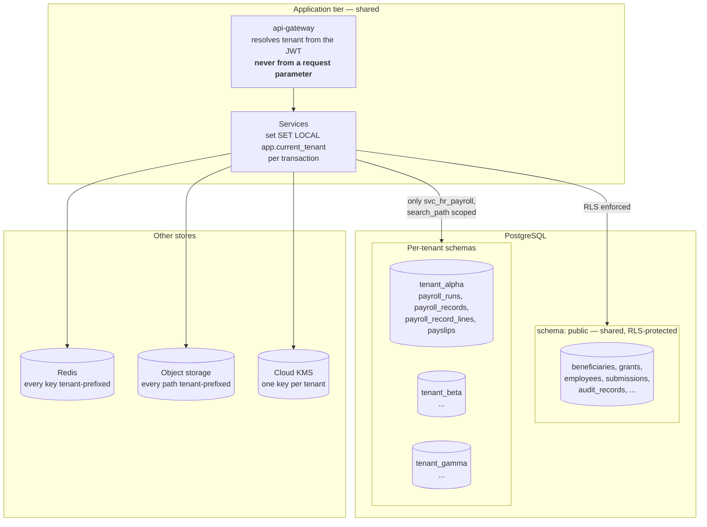
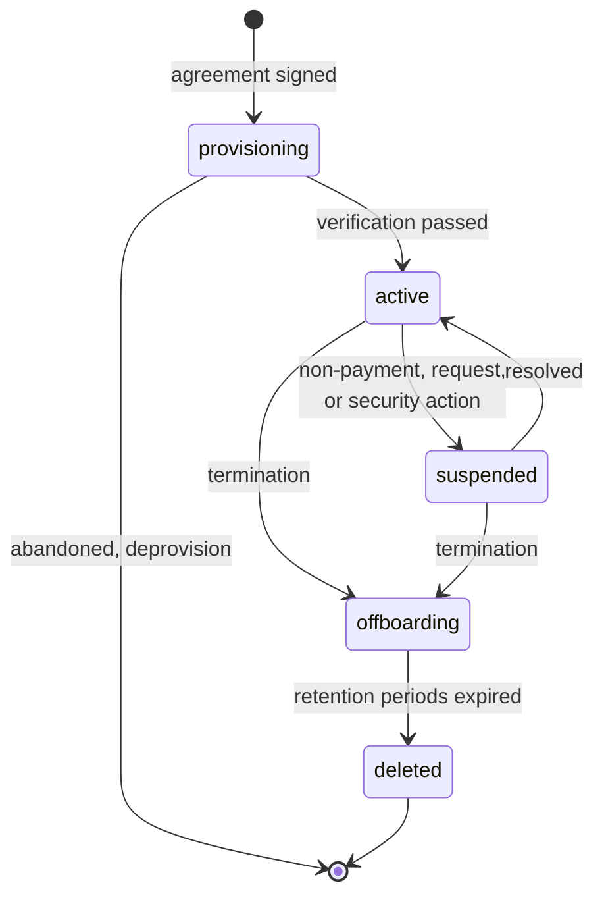

# 29 — Multi-Tenancy and Tenant Lifecycle

> **Document:** NGO Intelligence Suite — SDD v2.0
> **Chapter:** 29 — Multi-Tenancy and Tenant Lifecycle
> **Owner:** Chief Architect, with the Data Architect
> **Status:** Approved
> **Last Reviewed:** 2026-06-20
> **Review Cadence:** Semi-annually, and on any change to the isolation model
> **Related ADRs:** [ADR-0002](adr/0002-hybrid-multi-tenancy-with-rls.md), [ADR-0006](adr/0006-per-tenant-schema-for-payroll.md)

---

## 29.1 The stakes

Multi-tenancy is the highest-consequence design decision in this platform. Every other failure mode is recoverable: an outage ends, a wrong report is corrected, a lost submission is re-collected. **A cross-tenant data leak is none of those things.** One organisation seeing another's beneficiary list in a conflict setting can put named individuals in danger, and no remediation undoes it.

That asymmetry justifies design choices that would look excessive in a conventional SaaS product: two independent isolation mechanisms rather than one, a continuously-running isolation canary in production, a blocking test suite that can never be skipped, and an architectural refusal to ever accept a tenant identifier from a client.

---

## 29.2 The isolation model

A hybrid: shared schema with row-level security for most data, plus per-tenant schemas for payroll.



### 29.2.1 Why hybrid rather than one approach

| Option | Verdict |
| --- | --- |
| **Database per tenant** | Rejected. 120 databases at Year 3 means 120 migration targets, 120 backup verifications, 120 connection pools. Operationally unsustainable for a five-person platform capability, and the isolation benefit over correctly-implemented RLS is smaller than it appears |
| **Schema per tenant, everything** | Rejected. Same migration multiplication, plus cross-tenant platform queries become impossible without dynamic SQL, which is itself an injection surface |
| **Shared schema with RLS only** | Rejected for payroll. Adequate for most data, but salary data has the narrowest legitimate audience in the platform and the consequences of internal exposure are immediate and severe |
| **Hybrid, as adopted** | One migration path for the shared schema; a second structural barrier where the stakes are highest ([ADR-0002](adr/0002-hybrid-multi-tenancy-with-rls.md), [ADR-0006](adr/0006-per-tenant-schema-for-payroll.md)) |

### 29.2.2 The layers

Six independent mechanisms, so that a single defect does not produce exposure.

| # | Layer | Mechanism | Fails how |
| --- | --- | --- | --- |
| 1 | **Token** | `tenant_id` is a signed JWT claim. **No endpoint accepts a tenant identifier from the client** | Closed — a forged claim requires the signing key |
| 2 | **Request context** | The gateway resolves the tenant and injects `X-Tenant-ID` internally; services trust only the gateway-injected value | Closed |
| 3 | **Database RLS** | `tenant_isolation` policy on every tenant-owned table, `ENABLE` and `FORCE` | Closed — an unset session variable returns zero rows |
| 4 | **Database roles** | Every service role is `NOBYPASSRLS`; only `svc_hr_payroll` has any grant on a `tenant_<slug>` schema | Closed |
| 5 | **Cache and storage** | Every Redis key and object path is tenant-prefixed by a shared helper that takes the tenant from request context | Closed — no helper accepts a tenant parameter |
| 6 | **Encryption** | Per-tenant KMS keys. Ciphertext from tenant A is undecryptable with tenant B's key | Closed |

Layer 6 is the last line: even if every other layer failed and a query returned another tenant's rows, the personal data in them would be unreadable.

---

## 29.3 Row-level security in detail

### 29.3.1 The policy

```sql
ALTER TABLE beneficiaries ENABLE ROW LEVEL SECURITY;
ALTER TABLE beneficiaries FORCE ROW LEVEL SECURITY;

CREATE POLICY tenant_isolation ON beneficiaries
    USING      (tenant_id = current_setting('app.current_tenant', true)::uuid)
    WITH CHECK (tenant_id = current_setting('app.current_tenant', true)::uuid);
```

Three details carry weight:

**`FORCE ROW LEVEL SECURITY`** makes the policy apply even to the table owner. Without it, a migration or maintenance connection running as owner sees everything, which is exactly the connection most likely to be used carelessly.

**`current_setting(..., true)`** returns `NULL` when unset rather than raising. `tenant_id = NULL` is `NULL`, which is not true, so **an unset tenant context returns zero rows.** The failure mode is fail-closed, and that choice is deliberate: a query that silently returns nothing is a visible bug, whereas one that returns everything is a breach.

**`WITH CHECK`** prevents writing a row belonging to another tenant, which `USING` alone would permit.

### 29.3.2 Correction to v1.0

Version 1.0 §6.1 specified:

```sql
-- v1.0, incorrect
USING (tenant_id = auth.jwt() -> 'tenant_id')
```

This compares `uuid` to `jsonb` and does not type-check; with `->>` it would compare `uuid` to `text` and still fail without a cast. Beyond the type error, reading the tenant from the JWT inside the policy couples the database to a specific token shape and makes the policy untestable without a token. The v2.0 form using a session variable set from gateway-validated context is authoritative.

### 29.3.3 The `SET LOCAL` requirement — the most dangerous defect available

Connection pooling and RLS interact badly, and this is the single subtlest failure mode in the architecture.

| Statement | Scope | Consequence with a pooled connection |
| --- | --- | --- |
| `SET LOCAL app.current_tenant = ...` | The current transaction | **Correct.** Context is discarded at commit or rollback |
| `SET app.current_tenant = ...` | The session | **Catastrophic.** The value persists on the connection after it returns to the pool, and the next request to receive that connection inherits the previous tenant's context |

The resulting defect is intermittent, load-dependent, and nearly impossible to reproduce from a bug report. It would present as a user occasionally seeing another organisation's data with no discernible pattern.

Four controls, because one is not enough for a defect of this consequence:

| Control | Detail |
| --- | --- |
| A shared context helper | The only sanctioned way to set tenant context; it emits `SET LOCAL` and requires an active transaction |
| A Semgrep rule | Any `SET app.current_tenant` without `LOCAL` fails the build ([23 §23.13](23-testing-strategy.md)) |
| An integration test | Asserts that a connection returned to the pool has no residual context |
| A metric | `ngois_db_rls_context_missing_total`, which must be zero and pages at any value ([24 §24.7.3](24-observability.md)) |

### 29.3.4 Where RLS does not apply

| Table class | Isolation | Rationale |
| --- | --- | --- |
| Reference data — countries, sectors, OECD DAC codes, currencies | None; global read | Not tenant data |
| `tax_bands`, `statutory_contribution_rates` | None; global read | Statutory rates are jurisdictional, not tenant-specific. This is deliberate: a tenant cannot configure their own tax rates |
| `tenants` | Platform-only access | The tenant register itself |
| `feature_flags` | Platform-only write, tenant-scoped read | — |
| `outbox_events` | `tenant_id` present and filtered in application queries; RLS applies | The relay reads across tenants by design and runs as a dedicated role |
| Platform operational tables | Platform-only | — |

Every exemption is enumerated here and verified by the isolation suite, so that "this table does not need RLS" is a reviewed decision rather than an omission.

---

## 29.4 Per-tenant payroll schemas

### 29.4.1 Structure

```
public                      shared, RLS-protected
  employees, contracts, departments, positions,
  leave_*, tax_bands, statutory_contribution_rates

tenant_alpha                per-tenant
  payroll_runs, payroll_records, payroll_record_lines, payslip_artifacts
tenant_beta
  ... same tables ...
```

The split is at the boundary between employment records, which HR staff legitimately handle, and computed pay, which has a far narrower audience.

### 29.4.2 Access

`svc_hr_payroll` is the only role with any grant on any `tenant_<slug>` schema. It sets `search_path` per request from the validated tenant context:

```sql
SET LOCAL search_path = tenant_alpha, public;
```

A query that somehow escaped RLS still could not reach another tenant's payroll, because the schema is not in the search path and the role holds no grant that would allow a fully-qualified reference. The second barrier is structural, not policy-based.

### 29.4.3 The cost, stated honestly

| Cost | Mitigation |
| --- | --- |
| Migrations must be applied per schema | Automated; the migration runner iterates active tenants and reports per-schema results. Adds roughly 40 seconds per 25 tenants |
| A cross-tenant payroll query is impossible without dynamic SQL | Accepted. Platform-level payroll analytics is not a requirement, and if it becomes one it will be served from a separately-governed aggregate |
| Schema count grows with tenants | 120 schemas at Year 3 is well within PostgreSQL's comfort; catalogue bloat becomes a consideration in the thousands |
| Provisioning is more complex | Automated in the provisioning job ([RB-05](runbooks/rb-05-tenant-onboarding.md)) |

---

## 29.5 Noisy neighbours and quotas

A shared application tier means one tenant's behaviour can degrade another's experience. Quotas make that bounded rather than a matter of hope.

| Quota | Default | Enforced at | Behaviour at the limit |
| --- | --- | --- | --- |
| API requests per minute | 600 (standard tier) | Gateway, per tenant | 429 with `Retry-After` |
| API requests per minute, per user | 120 | Gateway | 429 |
| Concurrent report generations | 3 | Reporting service queue | Queued, with a visible position |
| Report generation minutes per day | 60 | Reporting service | Deferred to the next day, tenant notified |
| Bulk export rows per day | 250,000 | Export service | Rejected with an explanation |
| Object storage | 100 GB | File service | Upload rejected; tenant notified at 80 per cent |
| Named user seats | Per agreement | Auth service | Invitation blocked |
| Registered devices | 100 | Field data service | Registration blocked |
| Sync batch size | 200 submissions | Field data service | Client chunks automatically |
| Concurrent sync sessions per tenant | 30 | Field data service | Queued, not rejected — **never block a field officer** |
| Database statement timeout | 15 s (120 s reporting) | Database role | Query terminated |
| AI tokens per month | 2,000,000 | AI service | Feature returns a clear message; workflows continue manually |
| Notifications per day | 5,000 | Notification service | Throttled with a digest |
| Webhook deliveries per hour | 1,000 | Integration service | Queued |

### 29.5.1 Design choices in the quota table

Two rows deviate from the obvious and are deliberate.

**Sync sessions queue rather than reject.** A rejected sync means a field officer's data waits longer against the 72-hour budget. Queuing costs us latency; rejecting costs them data safety.

**AI budget exhaustion produces a clear message, never silent degradation.** A user who thinks the AI drafted something when it did not is worse off than one told it is unavailable.

### 29.5.2 Fair scheduling

Quotas bound the worst case; fair scheduling handles the normal case where one large tenant would otherwise dominate.

| Resource | Mechanism |
| --- | --- |
| Report queue | Round-robin across tenants, not FIFO. A tenant submitting twenty reports does not delay another tenant's first |
| Event consumers | Consumer groups process by stream, and a single tenant's burst is bounded by their API quota upstream |
| Sync acceptance | Per-tenant concurrency cap, so one tenant's convoy of devices cannot occupy every worker |
| Database | Statement timeouts per role; no per-tenant reservation, because PostgreSQL offers no clean mechanism and the timeouts have proved sufficient |
| Connection pool | Shared, with per-service caps. A per-tenant pool would fragment capacity badly at this scale |

### 29.5.3 Detection

A tenant degrading others is visible before it becomes an incident: per-tenant request rate and error rate on dashboard D-14, quota utilisation trends, and the `TenantQuotaExceeded` alert. A tenant consistently saturating their tier is a commercial conversation about their tier, not an engineering problem to absorb.

---

## 29.6 Per-tenant configuration

Covered in [20 §20.4](20-configuration-secrets-feature-flags.md). The tenancy-relevant constraints:

| Constraint | Reason |
| --- | --- |
| A tenant cannot configure below a platform security floor | They may raise the MFA requirement, never lower it |
| A tenant cannot set their own statutory rates | Tax bands are jurisdictional and centrally approved. Allowing tenant-specific rates would make statutory correctness unverifiable |
| A tenant cannot shorten a statutory retention period | Only lengthen, where their donor requires it |
| A tenant cannot disable audit logging | It is a compliance obligation, not a preference |
| A tenant cannot override the IATI exclusion policy | Publication is public and permanent; the exclusions are protection controls ([12 §12.4.3](12-integration-architecture.md)) |
| Enabling a Restricted personal data field requires DPO approval | [17 §17.6.1](17-privacy-and-compliance.md) |
| Every configuration change is audited with before and after values | — |

---

## 29.7 Tenant lifecycle



| State | Access | Data | Billing |
| --- | --- | --- | --- |
| `provisioning` | Platform only | Being created | No |
| `active` | Full | Live | Yes |
| `suspended` | **Read-only**, or none for a security suspension | Retained intact | Paused |
| `offboarding` | Read-only during the export window | Being exported, then personal data deleted | No |
| `deleted` | None | Only the register entry and statutorily-retained records | No |

### 29.7.1 Why suspension is read-only by default

A suspended tenant retains read access unless the suspension is a security action. The reason is practical: most suspensions are commercial, they are usually resolved within days, and a tenant locked out entirely cannot retrieve the grant report due tomorrow. Read-only pauses the relationship without creating an operational crisis for the programme.

A security suspension — suspected compromise, or a protection concern — removes access entirely, because the point is containment.

### 29.7.2 Provisioning and offboarding

Both are automated jobs with runbooks: [RB-05](runbooks/rb-05-tenant-onboarding.md) for provisioning, [RB-06](runbooks/rb-06-tenant-offboarding.md) for offboarding. Two properties matter architecturally.

**Provisioning is idempotent and orchestrated.** A failure partway is resolved by fixing the cause and re-running, never by completing the remaining steps by hand. Manual completion is how a tenant ends up without RLS on one table.

**Offboarding separates personal data deletion from record retention.** Personal data goes at day 30; de-identified programme and financial records persist for the donor audit period, which may be seven years. A 2024 reach figure must remain accurate in a 2029 audit even though nobody in it is still identifiable.

---

## 29.8 Tenant data export

| Property | Detail |
| --- | --- |
| Right | Every tenant may export all their data at any time, not only at offboarding |
| Format | JSON and CSV per entity, plus files in their original formats |
| Completeness | Every entity, including the audit trail |
| **Decryption** | Personal data is **decrypted** in the export. It is their data and it must be usable |
| Consequence | The export is therefore the most sensitive artefact the platform produces |
| Delivery | Signed URL, 7-day expiry, recipient must authenticate, download audited |
| Retention | The export object is hard-deleted at 7 days by bucket lifecycle |
| Rate limit | One full export per tenant per 24 hours |
| Isolation verification | The export job's tenant scoping is covered by the isolation test suite; an export containing another tenant's row is a SEV-1 |

The isolation test on exports is worth calling out. An export is the one operation that deliberately reads a large volume of one tenant's data and writes it somewhere less protected, which makes it the highest-value place for a scoping defect to exist.

---

## 29.9 Verifying isolation continuously

Design claims about isolation are worth exactly as much as the tests that check them.

| Mechanism | Cadence | Blocking |
| --- | --- | --- |
| **Tenant isolation test suite** — 15 categories ([23 §23.9](23-testing-strategy.md)) | Every commit | **Yes, unconditionally** |
| RLS enumeration: every tenant-owned table has RLS enabled and forced | Every commit, and post-migration | **Yes** |
| Role check: no `svc_*` role has `rolbypassrls` | Every commit | **Yes** |
| Pooled-connection residual context test | Every commit | **Yes** |
| **Production isolation canary** | Every 15 minutes | Failure is a **P1** |
| Post-restore isolation check | Every restore and failover | Blocks the cutover |
| Post-provisioning isolation check | Every new tenant | Blocks activation |
| Authorisation fuzzing across tenants | Nightly | High findings block |
| IDOR sweep across tenants | Nightly | Any leak blocks |
| Penetration test with tenant isolation in scope | Annually | Critical and High block |

### 29.9.1 The production canary

Two purpose-built tenants exist in production holding only synthetic data. A job runs every 15 minutes attempting cross-tenant access between them across every layer: direct API reads, ID substitution, token reuse, cache reads, file paths, and export scoping.

It is the only mechanism that verifies isolation **against the actual running system with the actual production configuration**, rather than against a test environment that may differ in a way nobody noticed. Every other check tells you the code is right; the canary tells you production is right.

---

## 29.10 Known residual risks

Stated rather than implied, because a chapter that claims perfect isolation is not credible.

| Risk | Assessment | Position |
| --- | --- | --- |
| A `SET` versus `SET LOCAL` defect reaching production | Low, four independent controls | The most dangerous defect available; controls are proportionate |
| A new table shipped without RLS | Very low, CI-blocked | The gate cannot be skipped |
| An unprefixed Redis key | Low, shared helper plus lint | A key-construction review is part of any caching change |
| A reporting query missing a tenant filter | Low–medium. Aggregate queries are the most likely location | Query review for new large-table queries; the nightly IDOR sweep covers endpoints |
| A platform operator viewing tenant data | Medium. `super_admin` exists and can be misused | No standing access; break-glass with recorded justification and session recording; access to PII is purpose-logged and audited ([15 §15.6](15-rbac-and-authorization.md)) |
| Compromise of the JWT signing key | Low | Would permit tenant impersonation. KMS-held, rotated, never exported. Detection via audit anomaly |
| A logic defect in the export scoping | Low | Isolation suite plus row-ownership sampling on every export |
| Shared infrastructure side channels — timing, cache occupancy | Very low, accepted | Not defended against. Out of proportion to the threat model at this scale |

The operator risk is the honest weak point. Technical controls cannot fully prevent someone with legitimate emergency access from looking at data they should not; what they can do is make it recorded, reviewable, and detectable — which is what the break-glass design provides.
