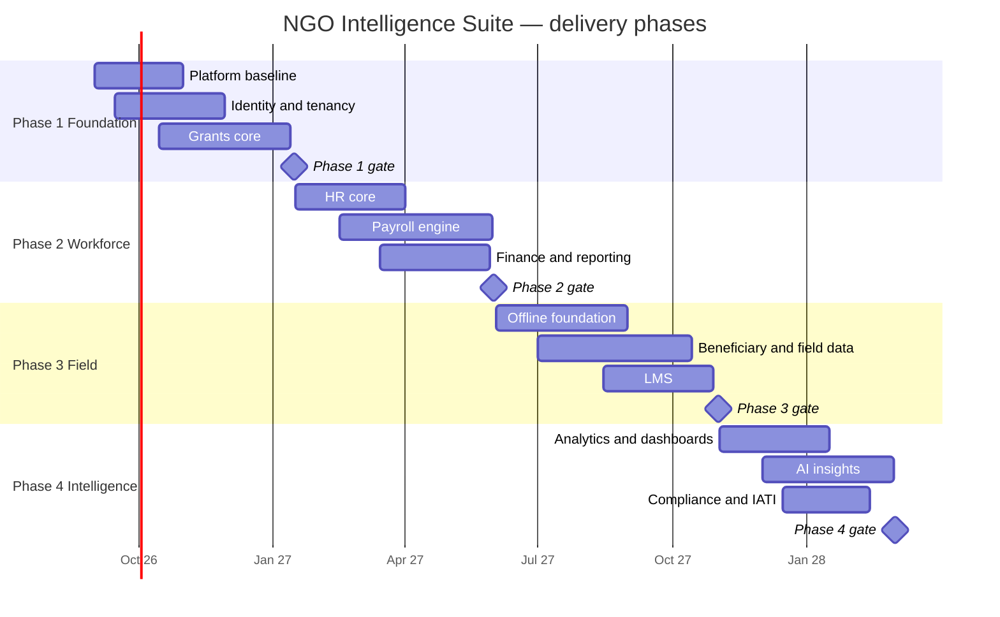
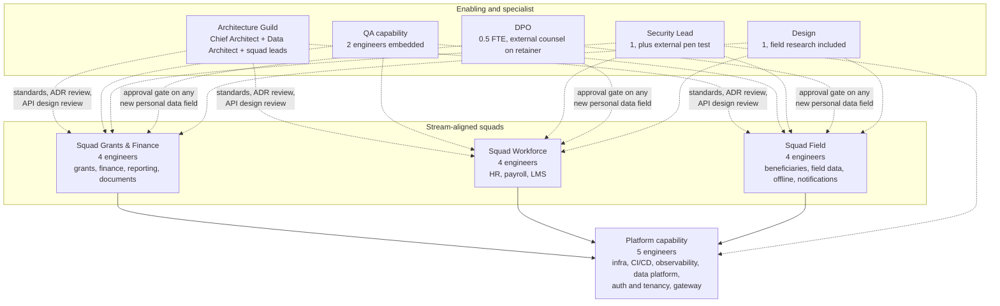
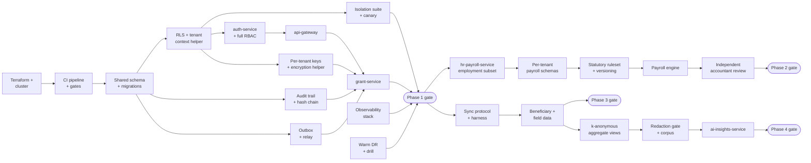

# 31 — Implementation Roadmap

> **Document:** NGO Intelligence Suite — SDD v2.0
> **Chapter:** 31 — Implementation Roadmap
> **Owner:** Executive Director, with the Chief Architect
> **Status:** Approved
> **Last Reviewed:** 2026-06-20
> **Review Cadence:** Monthly against actuals; re-baselined at each phase boundary
> **Related ADRs:** —

---

## 31.1 What changed from v1.0

Version 1.0 set out four phases over twelve months and sequenced them by module: authentication and grants first, then HR and payroll, then field operations and LMS, then AI and analytics. The module sequence survives. What v1.0 omitted is everything this document has added since — security hardening, observability, disaster recovery, the isolation test suite, the AI governance controls, the runbooks.

Those are not a phase. They are cross-cutting workstreams that must be built alongside the modules, because retrofitting them is either impossible or ruinously expensive. Row-level security cannot be added to forty tables after they hold production data. An audit trail cannot be backfilled. Tenant isolation tests written after launch tell you what is already leaking.

The revised roadmap therefore has two axes: **module phases** delivering user-visible capability, and **platform workstreams** delivering the properties the platform is judged on. The second axis consumes roughly 35 per cent of engineering capacity throughout, which is the single most important number in this chapter and the one most likely to be negotiated away under delivery pressure.

### 31.1.1 Consequences of the revision

| v1.0 assumption | v2.0 position |
| --- | --- |
| 12 months to full platform | **16 months.** The four extra months are the platform workstreams made explicit rather than discovered late |
| Security hardening in Phase 4 | Continuous from week 1. Isolation, RLS, audit and encryption are Phase 1 gates |
| Observability when needed | Before the first tenant. A production system you cannot see is not operable |
| DR "post-launch" | Warm standby before the first paying tenant; drilled before the second |
| AI in Phase 4 | Unchanged in sequence, but the governance controls are designed in Phase 1 so the data model supports them |
| One undifferentiated team | Three squads plus a platform capability ([§31.6](#316-team-topology)) |

The honest framing for the board: v1.0's twelve months was the cost of the features. Sixteen is the cost of the features plus the properties that let an NGO put beneficiary data in it.

---

## 31.2 Phase overview

| Phase | Window | Duration | Outcome | First tenants |
| --- | --- | --- | --- | --- |
| **1 — Foundation** | Sep 2026 – Jan 2027 | 4.5 months | A secure, observable, multi-tenant platform with grant management | 2 design partners, real data |
| **2 — Workforce** | Jan – Jun 2027 | 4.5 months | HR, payroll, finance, reporting | 8 tenants |
| **3 — Field** | Jun – Nov 2027 | 5 months | Offline field operations, beneficiaries, LMS | 20 tenants |
| **4 — Intelligence** | Nov 2027 – Mar 2028 | 4 months | Analytics, AI, IATI, compliance automation | 35 tenants |

---

## 31.3 Phase 1 — Foundation

**Thesis:** everything that is expensive or impossible to retrofit is built now, and one revenue-relevant module proves it works.

Grants is chosen as the first module because it exercises multi-tenancy, RBAC, approval workflows, money arithmetic, the audit trail, events and reporting — nearly every cross-cutting concern — without the statutory correctness burden of payroll or the offline complexity of field data.

### 31.3.1 Scope

| Workstream | Deliverables |
| --- | --- |
| **Platform baseline** | Terraform for all environments; GKE cluster; Cloud SQL with HA and PITR; Redis; Argo CD; CI pipeline with all Phase 1 gates; container signing and SBOM; Prometheus, Grafana, Loki, OpenTelemetry; the first six dashboards; the first twelve alerts |
| **Identity and tenancy** | `auth-service`, `tenant-service`; the full RBAC model with all 8 roles and the complete permission catalogue; RLS on every table with `FORCE`; per-tenant KMS keys and the encryption helper; the tenant context helper and its four safety controls; provisioning and deprovisioning jobs; the isolation test suite; the production canary |
| **Data foundation** | Complete shared schema; the migration framework with expand-contract discipline and lock-safety checks; the audit trail with hash chaining; the outbox pattern and relay; PgBouncer; retention sweep framework |
| **Grants** | `grant-service` including the finance and disbursement subset, and `file-service`; award and disbursement lifecycle; maker-checker on disbursements; budget ceilings; document storage with tenant-prefixed paths; the first reports |
| **Frontend baseline** | Vue 3 shell; design system tokens and core components; i18n with English and Arabic including RTL; routing and guards; accessibility baseline; PWA shell; bundle budget enforcement |
| **Operations baseline** | RB-03, RB-05, RB-08, RB-09, RB-11, RB-13, RB-14; on-call rotation established; incident process; the first backup restore drill; warm DR region built and drilled once |

### 31.3.2 Explicitly deferred

Payroll, offline sync, beneficiary data, LMS, AI, IATI, mobile money, SMS, tenant-configurable OIDC, canary deployment (Phase 1 uses rolling with a manual gate).

### 31.3.3 Gate — none of these are negotiable

| # | Criterion | Evidence |
| --- | --- | --- |
| 1 | Tenant isolation suite passes, all 15 categories | CI run |
| 2 | Production canary green for 14 consecutive days | Telemetry |
| 3 | Every tenant-owned table has RLS enabled and forced | Automated enumeration |
| 4 | No service role has `rolbypassrls` | Automated check |
| 5 | Complete RBAC matrix verified by generated tests | CI run |
| 6 | Maker-checker enforced on disbursements at the database level | Test plus schema review |
| 7 | Audit hash chain verifies over 30 days of production data | Verification job |
| 8 | PII encryption operating with per-tenant keys; a decryption sample succeeds | Restore drill |
| 9 | Backup restore drill passed, including the erasure replay | Drill record |
| 10 | Regional failover drill completed to a documented RTO | Drill record |
| 11 | Every alert resolves to an existing runbook | Automated check |
| 12 | Penetration test: no Critical or High outstanding | External report |
| 13 | WCAG 2.1 AA on all shipped journeys | axe plus manual |
| 14 | Every journey completes in Arabic RTL | Manual |
| 15 | Load test L1 and L2 pass at the latency budget | k6 report |
| 16 | Rollback demonstrated in production within 5 minutes | Drill record |
| 17 | Both design-partner tenants activated through RB-05 with isolation verified | Runbook record |
| 18 | Coverage at or above target, with 95 per cent on authorisation and encryption | CI report |

Eighteen gates for a first release is deliberately heavy. The alternative is carrying that debt through three more phases while tenant count grows, and every one of these items is harder to add at 20 tenants than at 2.

---

## 31.4 Phase 2 — Workforce

**Thesis:** payroll is the highest-risk module in the platform, and it gets a phase largely to itself.

The risk is not technical difficulty. It is that payroll must be **statutorily correct and provably so**. A grant report that is slightly wrong is embarrassing. A PAYE calculation that is wrong is a legal exposure for the tenant, and a payroll that is late costs staff their rent.

### 31.4.1 Scope

| Workstream | Deliverables |
| --- | --- |
| **HR core** | `hr-payroll-service` employment subset; employees, contracts, departments, positions; leave management and accruals; onboarding workflow; document linkage |
| **Payroll** | Per-tenant payroll schemas and the provisioning extension; the calculation engine; South Sudan PAYE and NSIF; Uganda PAYE and NSSF; the versioned ruleset with hash-pinned runs; maker-checker with database-enforced separation of duties; payslip generation; the reproducibility guarantee; the worked-example fixture corpus |
| **Finance** | Multi-currency with FX rate sourcing and staleness handling; budget versus actual; the chart of accounts; expense workflows |
| **Reporting** | `reporting-service`; report queue with round-robin fairness; the standard report set; CSV, XLSX and PDF export; the export path with tenant-scoping verification |
| **Platform** | Canary deployment with Argo Rollouts and automated analysis; per-tenant quotas and fair scheduling; the remaining Phase 2 dashboards and alerts; RB-01, RB-02, RB-04, RB-06, RB-07, RB-10 |
| **Compliance** | Erasure workflow end to end including the erasure log and restore replay; data subject access; retention sweeps in production; the DPIA completed and DPO-approved |

### 31.4.2 Gate

| # | Criterion |
| --- | --- |
| 1 | 100 per cent agreement with the payroll fixture corpus for both jurisdictions, including every edge case: mid-month joiners, terminations, negative net, currency mixing, band boundaries |
| 2 | A run recomputed against the same ruleset hash is byte-identical |
| 3 | Separation of duties cannot be circumvented, verified by attempting it |
| 4 | Payroll for 500 employees completes within 5 minutes with no other endpoint's p95 degrading over 20 per cent |
| 5 | A payroll run interrupted mid-computation leaves no partial state |
| 6 | Statutory ruleset changes are auditable, dated and cannot alter a historical run |
| 7 | An erasure request completes fully, verified with no residue, and survives a restore |
| 8 | Payroll schema isolation verified: `svc_*` roles other than `svc_hr_payroll` cannot reach any `tenant_*` schema |
| 9 | FX staleness produces a visible warning, never a silent stale calculation |
| 10 | Canary deployment aborts automatically on an injected regression |
| 11 | Quotas enforced; a load-generating tenant does not degrade another, verified under load |
| 12 | All eight tenants onboarded through RB-05 with no manual intervention |
| 13 | An independent review of the payroll calculations by a qualified accountant per jurisdiction |

Criterion 13 is not an engineering gate and cannot be satisfied by testing. Correct arithmetic against a misread statute is still wrong, and nobody on the engineering team is qualified to certify a tax schedule.

---

## 31.5 Phase 3 and Phase 4

### 31.5.1 Phase 3 — Field

**Thesis:** offline-first is a different engineering discipline, and the beneficiary data it captures is the most sensitive in the platform.

| Workstream | Deliverables |
| --- | --- |
| **Offline foundation** | IndexedDB schema with local encryption; the sync protocol with resumability and idempotency; per-entity conflict policy; the offline test harness; device registration and remote wipe; the 72-hour budget verified |
| **Beneficiary and field data** | `beneficiary-service`, `field-data-service`; registration with the minimised field set; the vulnerability scoring algorithm with explainability; deduplication with human review; dynamic form definitions with version binding; submission review workflow |
| **LMS** | `lms-service`; courses, enrolment, progress, assessment, certification; the HR-to-LMS enrolment automation |
| **Communications** | `notification-service`; SendGrid and Africa's Talking; SMS fallback paths |
| **Platform** | Chaos experiment catalogue executed; sync-specific dashboards and alerts; RB-15, RB-16; the k-anonymity controls; the protection review of every beneficiary-facing field |

**Gate highlights:** zero submission loss across the full offline scenario matrix including clock skew, storage exhaustion and mid-batch interruption; a 2G sync of 40 submissions within 90 seconds; device-at-rest yields no readable data; deduplication never merges automatically; vulnerability scores are explainable to the person scored; the paper fallback tested end to end; a DPIA update approved for beneficiary processing.

### 31.5.2 Phase 4 — Intelligence

**Thesis:** AI is added last and constrained hardest, because it is the only component whose failure mode is confident invention.

| Workstream | Deliverables |
| --- | --- |
| **Analytics** | Aggregate views with k-anonymity enforcement; dashboards; trend analysis; the compliance scoring model |
| **AI insights** | `ai-insights-service`; the redaction gate and its 400-fixture corpus; the classification gate; output guardrails; human-in-the-loop approval; token budgets and cost controls; the evaluation harness; prompt version management |
| **Compliance automation** | IATI v2.03 publication with the exclusion policy; donor report templates; the compliance dashboard |
| **Platform** | Predictive pre-scaling for calendar peaks; cost attribution per tenant; the FinOps review cycle |

**Gate highlights:** the redaction corpus passes with zero leaks; the injection corpus produces zero instruction compliance; no AI output can reach a donor-facing or financial record without a recorded human approval; no model output writes to any decision field about a person; a tenant can disable AI entirely with no workflow loss; IATI output validates and the exclusion policy is verified against a deliberately-seeded PII fixture; token budget exhaustion degrades visibly.

---

## 31.6 Team topology

### 31.6.1 The shape

Three stream-aligned squads consuming a platform capability, plus specialist functions that are partly external.

The platform capability is a **platform team, not an operations team**: it provides self-service infrastructure, pipelines and observability that squads consume without raising tickets. If squads have to ask the platform team to deploy, the topology has failed.

### 31.6.2 Why these boundaries

Squad boundaries follow the bounded contexts in [07](07-domain-model-and-erd.md), which means a squad owns its services, its schema and its events end to end. The two boundaries that required a decision:

**Payroll sits with Workforce, not Finance.** Payroll's hardest problem is employment and statutory rules, which is HR domain knowledge. Its financial output is a handoff.

**Offline sits with Field, not Platform.** Offline correctness is inseparable from the semantics of what is being captured. A platform team owning a generic sync engine would build something that cannot make the entity-specific conflict decisions the domain requires.

### 31.6.3 Staffing over time

| Role | P1 | P2 | P3 | P4 | Steady state |
| --- | --- | --- | --- | --- | --- |
| Platform engineers | 5 | 5 | 5 | 4 | 4 |
| Squad Grants & Finance | 3 | 4 | 3 | 3 | 3 |
| Squad Workforce | 1 | 5 | 3 | 3 | 3 |
| Squad Field | 1 | 2 | 6 | 3 | 3 |
| QA | 1 | 2 | 2 | 2 | 2 |
| Security | 1 | 1 | 1 | 1 | 1 |
| Design | 1 | 1 | 1 | 1 | 1 |
| DPO | 0.5 | 0.5 | 0.5 | 0.5 | 0.5 |
| Tech writer | — | 0.5 | 0.5 | 0.5 | 0.5 |
| Support | — | 1 | 2 | 2 | 3 |
| **Total FTE** | **13.5** | **22** | **24** | **20** | **21** |

Squads flex to match the phase in focus, but never below three engineers, because a two-person squad cannot sustain code review, on-call participation and leave cover simultaneously.

### 31.6.4 The uncomfortable constraint

Five platform engineers is the source of most of the operational compromises in this document: business-hours-plus-escalation on-call rather than 24/7, warm standby rather than active-active, no service mesh, quarterly rather than continuous DR drills.

That is stated plainly in [26 §26.1](26-reliability-and-incident-management.md) and it is an honest constraint, not a temporary one. Growing the team is the mitigation for several risks in [32](32-risk-register.md), and the architecture is deliberately chosen to be operable by a team this size rather than assuming one that does not exist.

---

## 31.7 Critical path and dependencies

### 31.7.1 The load-bearing dependencies

| Dependency | Why it is on the critical path |
| --- | --- |
| RLS and the tenant context helper before **any** domain table is used | Retrofitting isolation onto populated tables is a data migration under load with a breach risk during the window |
| Audit trail before the first mutation | It cannot be backfilled. A record without an audit entry is permanently unaccountable |
| Outbox before the first event | Adding transactional guarantees later means auditing every existing publish site |
| Per-tenant keys before the first personal data write | Re-encrypting existing PII under new keys is possible but a significant and risky migration |
| Independent accountant review before payroll ships | Not parallelisable and not substitutable by testing |
| k-anonymous aggregate views before the AI service | The AI service must have nothing else to read. Building it against raw tables and adding the constraint later inverts the safety model |
| Redaction corpus before the first provider call | The corpus is the control. Without it, the control is an assertion |

### 31.7.2 External dependencies with lead times

| Item | Lead time | Consequence of delay |
| --- | --- | --- |
| GCP `africa-south1` quota increases | 2–4 weeks | Blocks environment build; request in week 1 |
| Penetration test vendor booking | 6–8 weeks | Blocks the Phase 1 gate; book at Phase 1 start |
| Accountant engagement, both jurisdictions | 4 weeks | Blocks the Phase 2 gate |
| Mobile money sandbox and production credentials | 8–12 weeks, historically longer | Blocks disbursement via mobile money; start in Phase 1 |
| IATI registry publisher account | 4 weeks | Blocks publication only |
| Anthropic production quota | 2 weeks | Phase 4 only |
| Design-partner data processing agreements | 4–6 weeks | **Blocks real data in Phase 1.** Start immediately |

Mobile money credentialing is the historically worst offender and is started in Phase 1 despite not being needed until Phase 2.

---

## 31.8 Definition of done and release readiness

### 31.8.1 Definition of done — a story

A story is not done when it works. It is done when all of the following are true:

| # | Condition |
| --- | --- |
| 1 | Acceptance criteria met and demonstrated |
| 2 | Unit tests at the module's coverage floor; integration tests for the API surface |
| 3 | Tenant scoping tested where the story touches tenant data |
| 4 | Authorisation tested for every role that should and should not have access |
| 5 | Audit entries emitted for every mutation |
| 6 | Error paths handled with actionable messages and error codes |
| 7 | Observability: metrics, structured logs, trace spans |
| 8 | Accessibility checked if the story touches UI |
| 9 | Arabic RTL checked if the story touches UI |
| 10 | Query budget respected; no N+1 introduced |
| 11 | Any new personal data field carries a recorded purpose and DPO approval |
| 12 | Documentation updated, including this SDD where behaviour changed |
| 13 | Reviewed and approved by someone other than the author |
| 14 | Feature-flagged if it changes existing behaviour, with a removal date |
| 15 | Deployed to staging and verified there |

### 31.8.2 Release readiness

Per [22 §22.9](22-cicd-release-supply-chain.md), plus at a phase boundary: the phase gate criteria evidenced, all runbooks for the phase written and executed at least once, the on-call rotation briefed on what is new, tenants notified of user-visible changes, and support given a script for the new capability.

---

## 31.9 Schedule risk

| Risk | Likelihood | Effect | Response |
| --- | --- | --- | --- |
| Payroll statutory complexity exceeds the estimate | **High** | Phase 2 slips 4–8 weeks | Buffer included; accountant engaged early; ship one jurisdiction first if forced |
| Design-partner data agreements delayed | Medium | Phase 1 gate slips | Proceed with synthetic data; the gate needs real tenants but the build does not |
| Offline conflict semantics prove harder in the field than in the harness | Medium | Phase 3 slips 4 weeks | Field pilot with one tenant before general release |
| Penetration test finds a structural issue | Medium | 2–6 weeks | Continuous security work throughout Phase 1 makes this less likely; a structural finding is exactly what the gate exists to catch |
| Hiring lags the staffing plan | **High** | Every phase slips | Sequence hiring ahead of need; the platform capability is hired first |
| Platform workstreams squeezed under delivery pressure | **High** | Debt compounds; the gates fail later | **The 35 per cent allocation is protected at the board level.** This is the risk most likely to materialise and least likely to be visible when it does |
| Mobile money credentialing delayed beyond 12 weeks | Medium | Mobile disbursement slips | Bank transfer path is not dependent on it |
| Scope growth from design partners | High | Any phase | A change control process; new scope displaces, it does not add |

The last row in bold is the one to watch. Every gate in this chapter is skippable in the moment and expensive in hindsight, and the pressure to skip them will be highest exactly when a tenant is waiting.
