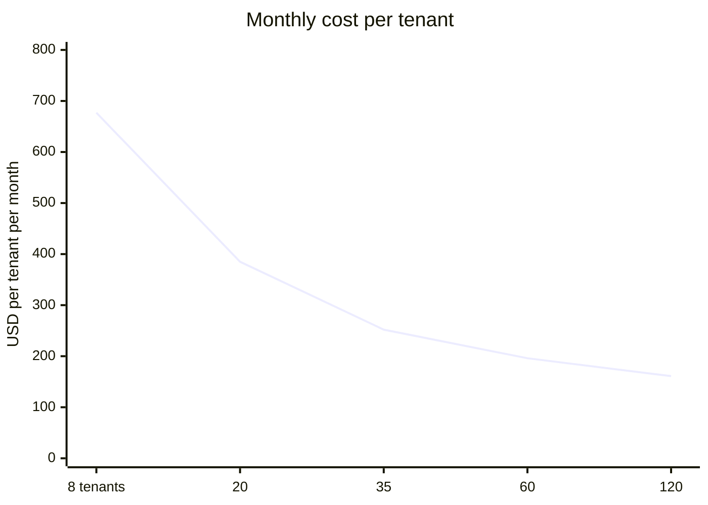

# 33 — Cost Model and FinOps

> **Document:** NGO Intelligence Suite — SDD v2.0
> **Chapter:** 33 — Cost Model and FinOps
> **Owner:** Executive Director, with the Platform Lead
> **Status:** Approved
> **Last Reviewed:** 2026-06-20
> **Review Cadence:** Monthly against actuals; re-baselined quarterly
> **Related ADRs:** —

---

## 33.1 Why cost is an architectural concern here

The tenants are NGOs. Their software budget competes directly with programme delivery, and every dollar of platform cost is a dollar not spent on a beneficiary. That framing changes the objective: the goal is not to minimise cost, it is to keep cost per tenant low enough that a mid-sized NGO can justify the spend, while refusing to trade away the controls that protect the people in the data.

Some things are therefore not optimisation candidates, and saying so up front prevents a recurring argument:

| Not optimisable | Reason |
| --- | --- |
| Cloud SQL high availability | The RTO commitment depends on it |
| Cross-region replica | The DR commitment depends on it |
| Retention-locked backups in a separate project | The ransomware control depends on it |
| Per-tenant KMS keys | The last isolation barrier |
| Audit log retention | A compliance obligation |
| The production isolation canary | The only continuous verification that isolation holds in production |
| Penetration testing | Non-negotiable |

Everything else is fair game, and [§33.6](#336-optimisation-levers) is specific about where the money actually is.

All figures are USD per month, list price, `africa-south1` and `europe-west4` where applicable, as of mid-2026. Committed use discounts are applied where noted. These are planning estimates with an accuracy of roughly ±20 per cent.

---

## 33.2 Production infrastructure

### 33.2.1 At Phase 2 completion — 8 tenants, ~250 users

| Component | Specification | Monthly |
| --- | --- | --- |
| GKE control plane | Standard, regional | 73 |
| Application node pool | 3 × e2-standard-4, 1-year CUD | 285 |
| Cloud SQL primary | db-custom-4-16384, regional HA, 200 GB SSD | 690 |
| Cloud SQL cross-region replica | db-custom-2-8192, 200 GB | 265 |
| Memorystore Redis | Standard HA, 5 GB | 195 |
| Cloud Storage | 400 GB standard + 200 GB nearline backups | 22 |
| Cloud Load Balancing + Cloud Armor | 1 rule set, ~2 TB egress | 145 |
| Cloud KMS | ~12 keys, ~2 M operations | 18 |
| Secret Manager | ~60 secrets, moderate access | 8 |
| Artifact Registry | ~50 GB | 5 |
| Cloud Logging (retained beyond free tier) | ~80 GB | 40 |
| Observability compute (Prometheus, Grafana, Loki, Tempo in-cluster) | Included in the node pool | — |
| Observability storage | 300 GB | 25 |
| Cloud NAT | 1 gateway | 45 |
| Backup storage — separate project, locked | 300 GB nearline + archive | 18 |
| **Production subtotal** | | **≈ 1,834** |

### 33.2.2 At Phase 4 completion — 35 tenants, ~1,200 users

| Component | Specification | Monthly |
| --- | --- | --- |
| GKE control plane | Standard, regional | 73 |
| Application node pool | 5 × e2-standard-4, CUD | 475 |
| Workload node pool — payroll, reports | 2 × e2-highmem-4, CUD, autoscaling to 4 | 340 |
| Cloud SQL primary | db-custom-8-32768, regional HA, 600 GB SSD | 1,420 |
| Cloud SQL cross-region replica | db-custom-4-16384, 600 GB | 545 |
| Memorystore Redis | Standard HA, 10 GB | 380 |
| Cloud Storage | 2.5 TB standard + 1.2 TB nearline | 95 |
| Load balancing, Cloud Armor, egress | ~8 TB egress | 420 |
| Cloud KMS | ~45 keys | 45 |
| Secret Manager | ~90 secrets | 14 |
| Artifact Registry | 120 GB | 12 |
| Cloud Logging | ~300 GB | 150 |
| Observability storage | 1.2 TB | 95 |
| Cloud NAT | 1 gateway, higher throughput | 70 |
| Backup storage — locked | 1.5 TB | 75 |
| **Production subtotal** | | **≈ 4,209** |

### 33.2.3 Non-production

| Environment | Composition | Monthly |
| --- | --- | --- |
| **Staging** | 2 × e2-standard-4 nodes; db-custom-2-8192 no HA; 2 GB Redis; **synthetic data only** | 620 |
| **Preview environments** | Shared namespace on the staging cluster; schema-per-PR; ~8 concurrent | 90 |
| **CI** | GitHub Actions, ~3,500 minutes plus Testcontainers runners | 220 |
| **DR region standby** | The replica is counted in production; standby cluster is **not pre-provisioned** — it is Terraform-applied at failover | 0 |
| **Non-production subtotal** | | **≈ 930** |

The DR region carrying no standing cluster cost is a deliberate trade: it adds roughly 25 minutes to the RTO in exchange for saving about 400 per month, and the 4-hour RTO absorbs it comfortably ([27 §27.6](27-disaster-recovery-and-bcp.md)).

---

## 33.3 Third-party services

| Service | Purpose | Basis | Phase 2 | Phase 4 |
| --- | --- | --- | --- | --- |
| Anthropic Claude API | AI drafting and anomaly narratives | Per token — see [§33.5](#335-llm-token-economics) | 0 | 340 |
| SendGrid | Transactional email | Volume tier | 20 | 90 |
| Africa's Talking | SMS | Per message, ~0.02 | 45 | 220 |
| Sentry | Error tracking | Team plan, event volume | 30 | 80 |
| PagerDuty | On-call and escalation | Per responder | 45 | 65 |
| Snyk | Dependency and container scanning | Per developer | 90 | 160 |
| GitHub Team | Repository, Actions, Advanced Security subset | Per seat | 60 | 105 |
| Grafana Cloud (synthetic monitoring only) | External probes from multiple regions | Probe volume | 50 | 50 |
| Domain, DNS, misc | | | 15 | 15 |
| Penetration test | Annual, amortised | ~18,000/yr | 1,500 | 1,500 |
| Legal and DPO retainer | Data protection counsel | Retainer | 800 | 800 |
| **Third-party subtotal** | | | **≈ 2,655** | **≈ 3,425** |

Two line items dominate and neither is infrastructure. The penetration test and the legal retainer together are roughly 2,300 per month, more than half the Phase 2 total. They are also both in the non-optimisable list.

---

## 33.4 Total cost and cost per tenant

| | Phase 2 (8 tenants) | Phase 4 (35 tenants) | Year 3 projection (120 tenants) |
| --- | --- | --- | --- |
| Production infrastructure | 1,834 | 4,209 | 11,800 |
| Non-production | 930 | 1,180 | 1,600 |
| Third-party | 2,655 | 3,425 | 5,900 |
| **Total monthly** | **5,419** | **8,814** | **19,300** |
| **Per tenant** | **677** | **252** | **161** |

### 33.4.1 The shape of the curve

Cost per tenant falls by a factor of four between 8 and 120 tenants, and the reason is that a large fraction of the total is fixed: the control plane, the HA database floor, the DR replica, the observability stack, the penetration test, the legal retainer. Those costs exist for the first tenant and barely change for the hundredth.

The practical consequence for pricing is that **the platform is uneconomic below roughly 15 tenants** and comfortable above 30. That is a commercial fact worth stating in an engineering document, because it constrains what the architecture is allowed to cost.

### 33.4.2 Cost per tenant is not uniform

The averages above hide wide variation. Modelled marginal cost of an additional tenant, by profile:

| Profile | Characteristics | Marginal monthly cost |
| --- | --- | --- |
| Small | 15 users, no field operations, 1 GB storage | ~35 |
| Medium | 60 users, 20 field devices, 15 GB, monthly payroll of 80 | ~110 |
| Large | 250 users, 90 devices, 120 GB, payroll of 500, heavy reporting, AI enabled | ~420 |
| **Outlier risk** | Heavy export use, large attachments, AI at the budget ceiling | ~900 |

The dominant marginal drivers, in order: **object storage and egress** (attachments, especially photographs), **database storage and IOPS**, **AI tokens**, and **SMS**. Compute is not a leading driver at this scale, which is why per-tenant cost attribution focuses on storage, egress, tokens and messages rather than CPU.

---

## 33.5 LLM token economics

Modelled per tenant per month at Phase 4, using Claude pricing bands as of mid-2026 and the platform's actual context construction.

| Use case | Calls/month | Input tokens | Output tokens | Cost |
| --- | --- | --- | --- | --- |
| Grant narrative drafting | 12 | 8,000 | 2,500 | 0.95 |
| Report summary drafting | 25 | 6,000 | 1,200 | 1.15 |
| Anomaly explanation | 40 | 3,000 | 600 | 0.80 |
| Compliance risk narrative | 8 | 5,000 | 1,500 | 0.35 |
| Regeneration and revision, ~30 per cent overhead | — | — | — | 0.98 |
| **Per tenant, typical** | **85** | | | **≈ 4.20** |
| **Per tenant, at the 2 M token cap** | | | | **≈ 22** |

At 35 tenants with roughly 40 per cent enabling AI, the expected monthly spend is around 340. At the cap across every tenant it would be around 770. The cap is what makes the line item predictable, and predictability matters more than the absolute figure.

### 33.5.1 Controls that bound the cost

| Control | Effect |
| --- | --- |
| **Per-tenant monthly token cap** (2 M default) | Hard ceiling; exhaustion returns a clear message, never silent degradation |
| **Response cache keyed on prompt hash** | Eliminates duplicate cost on regeneration with unchanged inputs; measured ~18 per cent hit rate |
| **Aggregate-only context** | Context is assembled from small k-anonymous aggregates, not record dumps. This is a privacy control that happens to cap input tokens |
| Context token budget per prompt | Truncation with a stated boundary rather than an unbounded context |
| Model tiering | The cheaper model for anomaly explanation; the capable model only for donor-facing drafting |
| Per-request cost logged | Every call records its token counts, enabling per-tenant attribution |
| Alert at 80 per cent of budget | Tenant and platform both notified |

The aggregate-only context rule is worth highlighting as the clearest case in this document where a privacy control and a cost control are the same decision. Because `ai-insights-service` can only read small aggregate views, the input token count is bounded by construction rather than by discipline.

---

## 33.6 Optimisation levers

Ordered by annual saving, with the trade stated honestly.

| # | Lever | Annual saving | Trade-off | Verdict |
| --- | --- | --- | --- | --- |
| 1 | 3-year committed use discounts on steady-state compute once the shape is known | ~3,400 | Commitment risk if the architecture changes materially | **Adopt at Phase 3**, not before |
| 2 | Log volume discipline: sample successful requests at 10 per cent, keep all errors | ~1,800 | Reduced forensic depth on successful requests | **Adopt.** Errors and audit are unsampled |
| 3 | Object lifecycle policies: standard → nearline at 60 days → archive at 1 year | ~1,600 | Slower retrieval of old attachments | **Adopt** |
| 4 | Image compression client-side before upload | ~1,200 in storage and egress | Slightly lower image fidelity | **Adopt.** Also improves 2G upload time, which matters more |
| 5 | Spot nodes for CI runners and preview environments | ~900 | Occasional interruption | **Adopt for non-production only.** Never for production workloads |
| 6 | Scale staging to zero outside working hours | ~700 | Not available for out-of-hours verification | **Adopt with an on-demand wake** |
| 7 | Right-size Redis after observing real working-set size | ~600 | Requires production data to decide | **Defer to Phase 3** |
| 8 | Tighten resource requests to observed p95 plus headroom | ~1,100 | Less burst absorption | **Adopt with care.** Requests below real usage cause eviction, which is a false economy |
| 9 | Drop the cross-region replica | ~6,500 | **RPO becomes the backup interval; RTO becomes many hours** | **Reject.** This is the largest available saving and the least acceptable |
| 10 | Single-zone Cloud SQL rather than regional HA | ~5,800 | Zone failure becomes a multi-hour outage with data loss risk | **Reject** |
| 11 | Self-manage PostgreSQL on GKE | ~7,000 | Backup verification, PITR, failover and patching become the team's problem, at five platform engineers | **Reject.** The managed premium buys operational capacity we do not have |
| 12 | Reduce audit retention | ~400 | Compliance non-conformance | **Reject** |

The three rejected large levers total roughly 19,000 a year, which is a material sum for an organisation of this size. They are rejected because each converts a bounded cost into an unbounded risk, and because lever 11 in particular would consume more engineering salary than it saves in infrastructure.

The adopted levers total roughly 11,300 annually, or about 15 per cent of Phase 4 run rate, with no reduction in any commitment made elsewhere in this document.

---

## 33.7 Cost attribution and showback

Every cost-bearing resource carries labels: `tenant_id` where attributable, `environment`, `service`, `phase`, `cost_centre`.

| Cost | Attribution method |
| --- | --- |
| Object storage and egress | Directly measured per tenant prefix |
| Database storage | Per-tenant row and index sizing, sampled weekly |
| AI tokens | Directly measured per request |
| SMS and email | Directly measured per message |
| Compute | Allocated by measured request share |
| Fixed platform cost | Allocated evenly per tenant, and **reported as fixed** so the variable component is visible |

Reporting the fixed allocation separately matters: a tenant told they cost 250 a month reasonably asks why, and the answer that 190 of it is the shared cost of high availability, disaster recovery and security testing is both true and useful.

A monthly showback report goes to the Executive Director with per-tenant cost, trend, outliers, and any tenant whose cost exceeds their tier assumption. It is showback rather than chargeback: the numbers inform pricing conversations, they are not billed line by line.

---

## 33.8 Budget controls and the FinOps cycle

| Control | Threshold | Action |
| --- | --- | --- |
| Project budget alert | 80 per cent of monthly budget | Platform Lead notified; review before month end |
| Project budget alert | 100 per cent | Executive Director notified; spend review |
| Per-tenant cost anomaly | Above 2× the profile assumption | Investigation; usually storage or export volume |
| AI token budget | 80 per cent of a tenant's monthly cap | Tenant and platform notified |
| Egress anomaly | Above 2× the 7-day baseline | Investigated as a **potential exfiltration signal first**, a cost signal second |
| Untagged resource | Any | Weekly report; created outside Terraform, therefore also a drift signal |
| Idle resource | Any resource with no traffic for 14 days | Flagged for removal |

The egress anomaly ordering is deliberate. An unexplained spike in outbound data is a security event that happens to appear on the cost dashboard, and treating it as a billing curiosity first would be a serious mistake ([RB-14](runbooks/rb-14-security-incident.md)).

### 33.8.1 The monthly review

A 45-minute standing meeting: actual against forecast, variance explained, per-tenant outliers, optimisation lever progress, and any architectural decision with a cost consequence coming up. Attended by the Executive Director, Platform Lead and Chief Architect.

Quarterly, the model is re-baselined against actuals and the projection extended. The Year 3 figure in [§33.4](#334-total-cost-and-cost-per-tenant) is a projection built on assumptions about tenant mix that will be wrong in some direction, and reviewing it quarterly is how that gets corrected before it becomes a budgeting problem.

### 33.8.2 Cost in design review

Any proposal that adds a recurring cost above 200 a month, or that changes the cost-per-tenant curve, states the cost in its ADR alongside its technical consequences. Cost is a consequence like any other, and an architecture decision record that omits it is incomplete ([35 §35.5](35-engineering-standards.md)).
