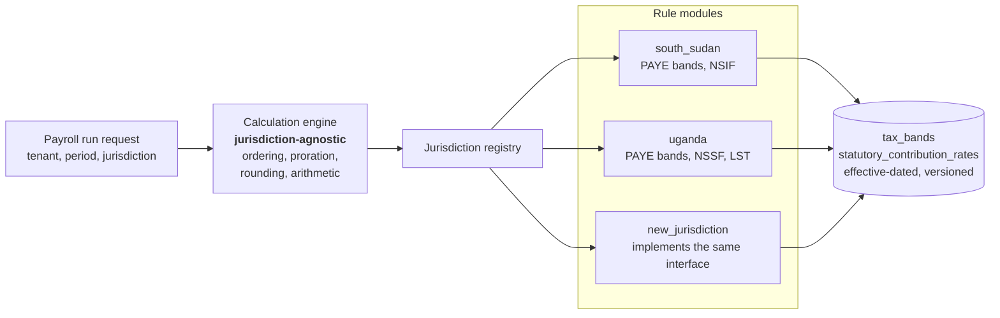

# 34 — Future Extensibility

> **Document:** NGO Intelligence Suite — SDD v2.0
> **Chapter:** 34 — Future Extensibility
> **Owner:** Chief Architect
> **Status:** Approved
> **Last Reviewed:** 2026-06-20
> **Review Cadence:** Semi-annually
> **Related ADRs:** [ADR-0019](adr/0019-narrow-extension-points.md)

---

## 34.1 The position on extensibility

Extensibility is a cost paid now for a benefit that may never arrive. Every extension point is an interface to maintain, a compatibility promise to keep, and a place a defect can hide. A platform built to accommodate everything accommodates nothing well.

So the rule here is narrow: **build the extension point when a second concrete case exists, not when a second case is imaginable.**

Three exceptions, where the extension point is built in advance because retrofitting it would require restructuring rather than addition:

| Extension point | Why in advance |
| --- | --- |
| **Payroll jurisdiction rules** | Two jurisdictions at launch already prove the abstraction. A third must be configuration, not a code fork |
| **Event subscription** | The outbox and stream topology exist. A webhook fan-out is a consumer, and designing for it now costs almost nothing |
| **Form and questionnaire definitions** | Dynamic definitions are a Phase 3 requirement, not a future one |

Everything else in this chapter is a designed *seam* — a place where the architecture will not obstruct a future change — rather than a built capability.

---

## 34.2 Extension points that exist

### 34.2.1 Payroll jurisdictions

A new country's payroll is added as data plus a rule module, never by modifying the engine.

The engine owns everything jurisdiction-independent: calculation ordering, proration for partial periods, rounding, currency handling, and the reproducibility guarantee. A rule module declares its statutory components, their bases, their order, and their sources.

**What onboarding a jurisdiction requires**

| Step | Effort | Note |
| --- | --- | --- |
| Statutory research and documented source references | 2–3 weeks | The dominant cost, and it is not engineering |
| Rule module implementation | 3–5 days | If the statute fits the existing component model |
| Effective-dated rate data | 1 day | Configuration |
| Worked-example fixture corpus, including every edge case | 1 week | Zero-tolerance gate |
| **Independent accountant verification** | 2–4 weeks elapsed | **Non-negotiable and not parallelisable** |
| Payslip template and localisation | 3 days | |

Roughly 6–8 weeks elapsed, of which under two weeks is engineering. The honest constraint on adding a country is access to a qualified accountant, not developer capacity.

**Where the abstraction will break.** A jurisdiction whose statute needs something the component model does not express — a household-composition-dependent allowance, a cumulative year-to-date basis with retrospective true-up, or an employer contribution that changes the employee's taxable base circularly. When that happens the correct response is to extend the component model deliberately, not to special-case the engine. A jurisdiction-specific `if` in the engine is the first step toward an engine nobody can verify.

### 34.2.2 Outbound webhooks

Tenants integrating with their own systems is the most frequently requested capability, and the event architecture already produces exactly what a webhook needs.

| Property | Design |
| --- | --- |
| Model | A consumer group on the existing streams, per tenant subscription. No change to any producer |
| Subscription | Tenant-configured: event types, endpoint, secret. `org_admin` only, audited |
| Payload | **The event envelope with the personal data fields removed.** IDs and metadata, never PII |
| Signature | HMAC-SHA256 over the body with a per-subscription secret, in `X-NGOIS-Signature`, with a timestamp to prevent replay |
| Delivery | At-least-once. Consumers must be idempotent on `event_id`, and the documentation says so prominently |
| Retry | 5 attempts, exponential backoff to 1 hour, then the subscription is suspended and the tenant notified |
| Egress control | Destinations are validated: HTTPS only, public addresses only, **no private or link-local ranges** — an SSRF control, not a convenience check |
| Quota | 1,000 deliveries per hour per tenant |
| Visibility | Delivery history with status and response codes, visible to the tenant |

The payload rule is the load-bearing decision. A webhook is data leaving our egress controls to an endpoint we do not operate, whose security posture we cannot assess. Sending IDs and requiring the tenant to fetch details through the authenticated API keeps every access governed, audited and revocable. It is less convenient and it is the right trade.

### 34.2.3 Dynamic form definitions

Already a Phase 3 requirement. The extensibility-relevant properties:

Definitions are versioned and a submission binds permanently to the version it was captured against, so republishing a form can never invalidate collected data. Field types are drawn from a closed catalogue rather than being arbitrary, because an open field type would mean unvalidatable data and unbounded storage. Any field marked as containing personal data inherits the full encryption, classification and retention treatment automatically — a tenant cannot create an unprotected PII field by defining a form.

---

## 34.3 Designed seams

Not built, but the architecture does not obstruct them.

| Seam | How it is kept open | What would be required |
| --- | --- | --- |
| **A new domain module** | Bounded contexts with owned schemas, events over shared tables, a service template with observability and isolation pre-wired | A new service; no change to existing ones |
| **Additional identity providers** | Standard OIDC only; no provider-specific logic in the auth flow | Configuration |
| **Additional payment providers** | Anti-corruption layer per provider behind a common disbursement port | An adapter |
| **Additional notification channels** | Channel abstraction in `notification-service` | An adapter |
| **A second LLM provider** | Provider client behind an interface; prompts are versioned templates; nothing depends on a provider-specific feature ([ADR-0010](adr/0010-llm-provider-and-boundaries.md)) | An adapter and a re-run of the evaluation harness |
| **A different cloud** | Cloud coupling confined to Terraform and three managed services; no cloud SDK in domain code | Substantial but bounded: IaC, managed service equivalents, KMS integration |
| **Read replicas for reporting** | Reporting already reads through a separate role with its own timeout | Connection routing configuration |
| **Sharding by tenant** | Every table carries `tenant_id`; no cross-tenant join in any domain query ([25 §25.7.1](25-performance-and-capacity.md)) | Significant, but the data model does not prevent it |
| **An additional region for residency** | Region is a deployment parameter; nothing assumes a single region | A second deployment, plus a decision about the tenant register |

The sharding seam deserves emphasis because it is the one that would be genuinely impossible to retrofit. Every domain query is tenant-scoped and no query joins across tenants; that discipline exists for isolation, and it happens to leave the sharding door open. Had the schema allowed cross-tenant joins for convenience, both properties would be lost.

---

## 34.4 Roadmap horizon beyond Phase 4

Candidates, with the position on each. "Probable" means a specific case already exists; "possible" means it has been requested without a concrete case; "unlikely" means the analysis has been done and the answer is no.

| Candidate | Position | Reasoning |
| --- | --- | --- |
| **Outbound webhooks** | **Probable, first post-Phase-4 item** | Multiple design partners have their own finance systems. Low cost, existing architecture |
| **Additional payroll jurisdictions** (Kenya, Ethiopia, Somalia) | **Probable** | Follows tenant demand. The abstraction exists; the constraint is accountants |
| **Read replica for reporting** | **Probable, demand-driven** | The first thing to do when reporting load becomes a problem, ahead of any sharding conversation |
| **A public read API for programme data** | Possible | Donor transparency interest. Would require careful k-anonymity work; the IATI publication path already covers much of the need |
| **Deeper offline for HR** | Possible | Requested, but those users have connectivity. The complexity is real and the benefit thin |
| **Native mobile applications** | **Unlikely** | The PWA meets the field requirement. A native app would add two build targets, two store review processes and a device-update problem on the connectivity these teams have. Revisit only if a specific hardware capability — biometric capture, offline mapping at scale — becomes a requirement |
| **A data warehouse** | Possible at ~200 tenants | Aggregate views serve current needs. A warehouse becomes justified when cross-tenant benchmarking is wanted, which is a **governance question before a technical one**: benchmarking implies comparing organisations, and that requires consent we do not currently have |
| **An integration marketplace** | Unlikely in the horizon | Requires a plugin execution model, which means running third-party code near beneficiary data. The security work is disproportionate to any plausible demand at this scale |
| **Beneficiary self-service portal** | **Deliberately out of scope, needs a protection review before any technical work** | Giving beneficiaries access to their own record is ethically attractive and operationally fraught: identity verification without documents, device sharing, coercion by household members, and the risk that a portal reveals a person's registration to someone who should not know. This is a protection design problem, not a feature |
| **AI decision support about individuals** | **Prohibited, not deferred** | [18 §18.1](18-ai-llm-architecture.md), rule AI-3. Not a roadmap item at any horizon |
| **White-label or reseller deployment** | Possible | Architecturally straightforward; a commercial decision |
| **Cross-tenant consortium reporting** | Possible | Several tenants in a consortium want a combined view. Requires an explicit multi-tenant sharing model with per-tenant consent, and would be the first deliberate crack in the isolation model — so it needs a full threat model, not a feature ticket |

The last row is the one to watch. It is a reasonable request that, implemented carelessly, would undo the platform's central guarantee. Any consortium feature must be built as an explicit, consented, audited aggregate export rather than as a relaxation of RLS.

---

## 34.5 Rules for extending the platform

Anyone adding capability follows these. They are not style preferences; each one exists because violating it would break a commitment made elsewhere in this document.

| # | Rule |
| --- | --- |
| 1 | **A new table is tenant-owned and RLS-protected unless it appears on the exemption list in [29 §29.3.4](29-multi-tenancy-and-tenant-lifecycle.md)**, and adding to that list is a reviewed decision |
| 2 | A new personal data field requires a recorded purpose and DPO approval before the migration is written |
| 3 | A new service satisfies the observability onboarding checklist before it reaches production |
| 4 | A new service declares its criticality tier and its degradation behaviour |
| 5 | A new event follows the envelope and naming conventions, and is added to the catalogue |
| 6 | A new external integration goes behind an anti-corruption layer with a circuit breaker and a documented degradation |
| 7 | A new egress destination requires an explicit allow-list entry and a security review |
| 8 | A new endpoint is added to the authorisation matrix and to the generated authorisation tests |
| 9 | A new capability that touches beneficiary data has a protection review, not just a security review |
| 10 | An extension point is built when a second concrete case exists, not before |
| 11 | Any decision that is expensive to reverse gets an ADR |
| 12 | A change that adds recurring cost above 200 a month states that cost in its ADR |

Rule 9 is the one most likely to be skipped, because a security review feels like it covers the ground. It does not: a feature can be perfectly secure and still expose someone. The question a protection review asks is not "can an attacker get this data" but "what happens to a person if this data is correct, accessible to the people we intended, and used exactly as designed."
